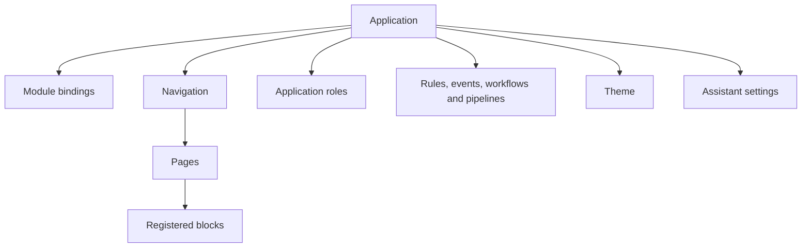
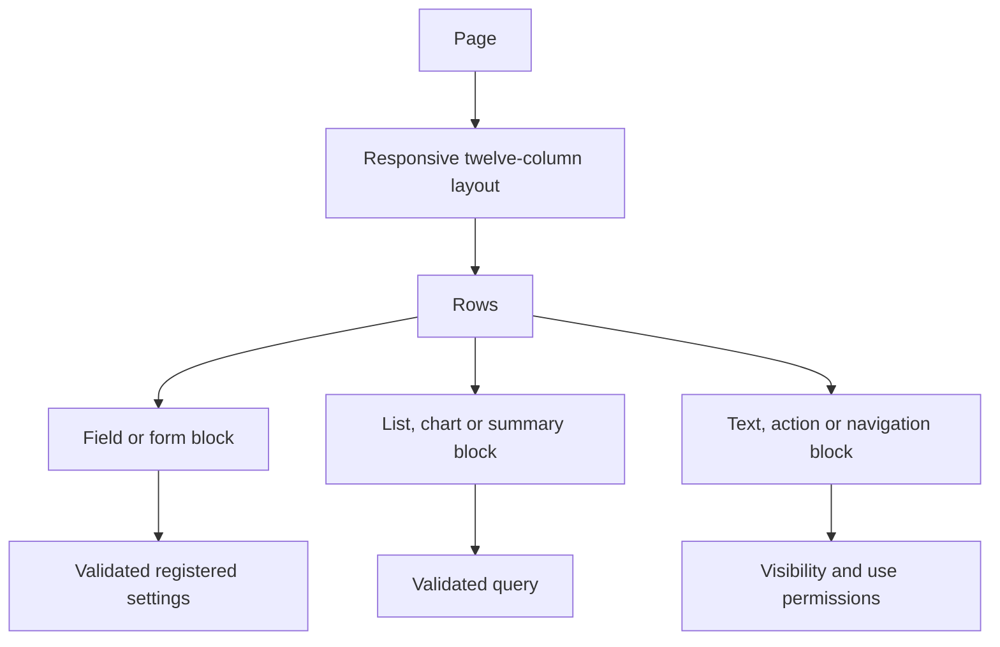

# 7. Applications, navigation, pages and themes

[Previous: Records and their lifecycle](06-records-and-lifecycle.md) · [Specification index](README.md) · Next: [Forms, actions, rules and events](08-forms-actions-rules-and-events.md)

## Application composition

An **application** is a published experience for a defined group of people in one organisation. It selects [modules](05-modules-fields-and-relationships.md) and adds navigation, pages, forms, roles, behaviour, and a theme.

All these application components are published together under the [application root definition](03-composition-and-publication.md#definition-ownership). A page or workflow can have its own stable identifier and editing history without acquiring an independent live version.

## Application definition

An application records:

- Permanent key, display name, description, icon, and organisation-visible ownership.
- The modules and version ranges it requires.
- Module bindings and application-contained record types.
- Navigation tree and pages.
- Application roles and assignments.
- Actions, rules, events, workflows, and pipelines.
- Theme and allowed organisation-level theme adjustments.
- Assistant policy.
- Public addresses and programmable interfaces.
- Default landing page and empty, denied, not-found, and error experiences.

## Navigation

Navigation is an ordered tree of headings, page links, and approved external links. Every item has a stable identifier and a visibility condition based on [application permissions](04-access-and-permissions.md).

- Hidden navigation never replaces server access checks.
- A heading with no visible children is omitted.
- An external link is visibly identified and must use an approved secure address.
- Phone navigation uses the same information architecture in a compact form; it is not a separate definition.

## Page types

The application supports six page types:

| Page type | Purpose |
|---|---|
| List | Read and arrange records from one record type. |
| Detail | Show one record and approved related information. |
| Dashboard | Compose blocks that may use several approved sources. |
| Form | Create or change one record through one commit action. |
| Guided form | Collect one submission through two to twenty short steps. |
| Public | Show approved public content or submit one narrowly defined public form. |

A list can use table, board, calendar, or summary arrangement. Board movement calls a named action and rechecks its permission. Calendar placement uses date or date-time fields and follows [Decision D05](appendices/decisions.md#d05-calendar-duration).

The ordinary list, detail, search-result, report, dashboard-block, and action components can display a [shared record](10-queries-reports-search.md#shared-record-reads). They show its source organisation and only capabilities returned by the shared-record gateway. A shared dashboard block names one source organisation and grant; it cannot combine source-owned and recipient-owned values into one result. Create forms, offline pages, and recipient-owned bulk work do not accept live shared records in the first release.

## Page composition

- Pages use a twelve-column grid at wide widths and reflow into a deliberate phone order.
- A block declares its desktop span, phone order, settings, data source, visibility rule, and use permission.
- Block types come from a closed platform registry shipped with a platform release. Organisations cannot upload executable blocks.
- Block settings are validated against the registered setting contract at publication and runtime.
- A page can replace the standard list, detail, or create-form experience for one record type.
- At most four blocks on one page may receive live updates; other blocks refresh deliberately or when their page is reopened.

A block registration has a permanent identifier, name, icon, one palette group, zero to forty setting declarations, optional child-block allowance, phone behaviour, resizable-height flag, live-update flag, and public-page flag. The seven palette groups are data, figures, record, input, actions, layout, and content.

The closed setting-control list is: text, long text, formatted text, number, switch, choice, theme colour, platform icon, stored image, data reading, record-type picker, record picker, field picker, relationship picker, action picker, page picker, and process-pipeline picker. A picker stores a real definition reference; it never accepts free text in place of an existing reference.

## Forms and guided forms

- A form commits through one named [action](08-forms-actions-rules-and-events.md).
- A guided form has two to twenty reachable steps, exactly one summary step, and one final commit action.
- A guided-form draft is private to the person, form, subject, application, and organisation.
- Drafts do not create business records, appear in queries, or announce events.
- An untouched draft is removed after thirty days unless [privacy and retention](14-activity-privacy-and-retention.md) sets a shorter organisation policy.
- The final submission is validated and written as one save operation where its action changes one transaction boundary. Work that cannot fit that boundary starts a [workflow](09-workflows-and-pipelines.md).

## Public pages

Public pages use a deliberately smaller block list and may submit only one public action. They may display only fields approved under [public access](04-access-and-permissions.md#public-access). They always include rate limits, abuse protection, accessible validation, and a response that does not leak private record existence.

## Themes

A theme is a separately published root definition containing approved design values rather than arbitrary style code.

It covers:

- Brand colours with tested contrast pairs.
- Text families, size scale, weight scale, and spacing scale.
- Corners, borders, focus appearance, and elevation choices.
- Logo and approved image assets.
- Light and dark appearances where supported.
- Default density and phone behaviour.

An organisation may bind an approved theme to an application and change only the values the theme exposes. Themes cannot hide focus, lower required contrast, insert scripts, fetch remote code, or override field and permission meaning.

## Accessibility and responsive behaviour

Every page and block follows [quality and acceptance](20-quality-and-acceptance.md). In particular:

- All actions are keyboard reachable and visibly focused.
- Meaning never depends on colour alone.
- Text and controls reflow without horizontal page scrolling at supported phone widths.
- Form controls have programmatic labels, help, errors, and summaries.
- Live changes are announced without repeatedly interrupting assistive technology.

## Acceptance examples

- Editing a page changes the application draft but not the live application.
- A page that refers to an unavailable field, action, role, block, or unsafe public value cannot publish.
- Moving a board card without the named action permission is refused by the server.
- A fixture page has a defined desktop layout and phone order.
- A hidden page remains inaccessible through a copied address.
