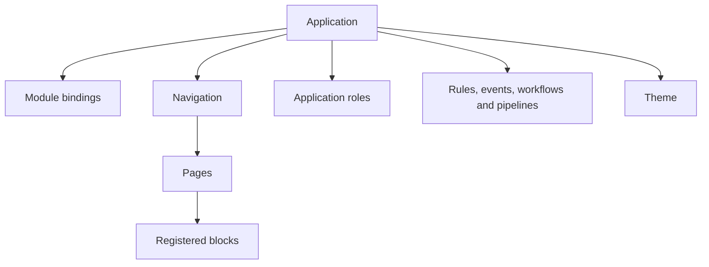
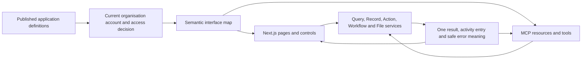
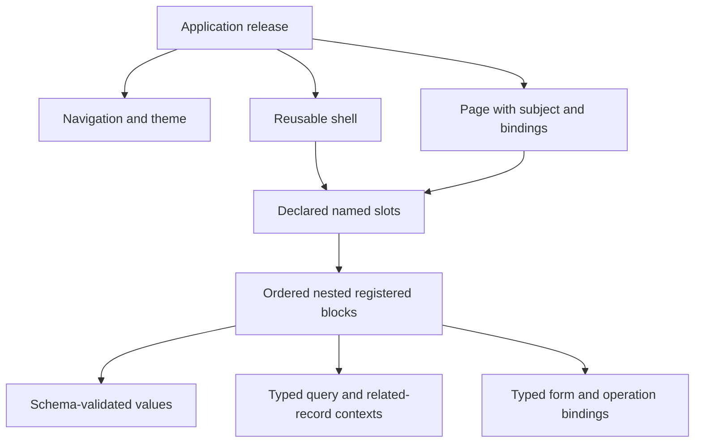

# 7. Applications, navigation, pages and themes

[Previous: Records and their lifecycle](06-records-and-lifecycle.md) · [Specification index](README.md) · Next: [Forms, actions, rules and events](08-forms-actions-rules-and-events.md)

## Application composition

An **application** is a published experience for a defined group of people in one organisation. It selects [modules](05-modules-fields-and-relationships.md) and adds navigation, pages, forms, roles, behaviour, and a theme.

All these application components are published together under the [application definition](03-composition-and-publication.md#definition-ownership-and-versions). A page or workflow can have its own stable identifier and editing history without acquiring an independent live version.

## Page-builder implementation handoff

The architecture review and approved HR example establish the intended generic builder scope. Before copying Fluid UI source in [#65](https://github.com/Abzum-NZ/Abzum-Vortex/issues/65), the delivery owner records the file-by-file **adapt, rewrite or discard** map and reviews the intended interface with Vijay. Check licences, supported dependencies, accessibility, package ownership and the semantic-operation boundary before importing code. This checkpoint applies to UI integration, not the independent [#258](https://github.com/Abzum-NZ/Abzum-Vortex/issues/258), [#249](https://github.com/Abzum-NZ/Abzum-Vortex/issues/249) and [#250](https://github.com/Abzum-NZ/Abzum-Vortex/issues/250) contract work. The detailed rules live in [Page builder contracts](appendices/page-builder-contracts.md#editing-preview-publication-and-activation); prototype persistence, sample data and parallel engines remain excluded.

## Application definition

An application records:

- Permanent key, display name, description, icon, and organisation-visible ownership.
- The modules and version ranges it requires.
- Module bindings and application-contained record types.
- Navigation tree, reusable shells with named content slots, and pages.
- Application roles and assignments.
- Actions, rules, events, workflows, and pipelines.
- Theme and allowed organisation-level theme adjustments.
- Public addresses and programmable interfaces.
- Default landing page and empty, denied, not-found, and error experiences.

## Navigation

Navigation is an ordered tree of headings, page links, and approved external links. Every item has a stable identifier and a visibility condition based on [application permissions](04-access-and-permissions.md).

- Hidden navigation never replaces server access checks.
- A heading with no visible children is omitted.
- An external link is visibly identified and must use an approved secure address.
- Phone navigation uses the same information architecture in a compact form; it is not a separate definition.

## Semantic interface map

Every published application produces one permission-filtered description of what the current person can see and do. The web interface renders it, and the governed [MCP surface](12-connections-and-interfaces.md#governed-mcp-access) exposes the same meaning to an authorised external client. This description is derived from the published application, page, form, query, action and access contracts; builders do not maintain a second agent-specific definition.

The map covers every meaningful interface capability:

- Application and organisation context, navigation entries, pages, record context, sections and blocks that the person may discover.
- Current page state, allowed queries, filters, sorting, paging and refresh operations.
- Forms and guided-form steps, field types, labels, help, validation, allowed choices, current draft revision and commit action.
- Visible and currently available actions, their declared inputs, confirmation requirement, duplicate-protection rule and safe outcomes.
- File selection, upload, preview and download capabilities; builder, publication, access, connection and administration capabilities when the same person can use them in the interface.
- Stable semantic identifiers for tabs, dialogs, drawers and other view controls that a connected client may open, close or select without reading CSS selectors or screen coordinates.

Discoverability and invocability are separate. A page, field, choice or control the person may not discover is absent. A control the person may see but cannot currently invoke remains in the semantic resource with `availability: unavailable` and a safe fixed explanation, but it is absent from invocable MCP tool choices. The client-facing entry never exposes an internal permission key, role name or private value. A direct invocation is still refused by the central access decision. Layout coordinates, colours, animation frames and decorative content are not business capabilities and are not copied into the semantic map.

A page or platform screen cannot ship a meaningful operation that exists only as handwritten click behaviour. Navigation, form changes, action invocation and administration all bind to stable platform operations. This is what lets keyboard access, the web interface and MCP use one behaviour instead of three loosely matched implementations.

## Addresses and routing

The first-release application route is `/{organisation_short_name}/{application_key}/{page_key}`. Organisation short names are permanent within their environment and cannot use a platform-reserved first segment. The initial reserved segments are `signin`, `auth`, `health`, and `api`; adding a platform route and reserving its first segment are one change.

An organisation-branded address may change presentation but never proves membership or grants access. The platform accepts an address only after its exact ownership and routing target have been verified, and an unknown address fails closed. Organisation subdomains and wildcard-domain routing are not part of the first release.

## Core UI continuity and motion

The [Next.js application](https://nextjs.org/docs/app/getting-started/linking-and-navigating) must feel continuous during ordinary use. Opening another page, changing a section, submitting an action, or refreshing data must not blank or reload the whole application shell. The smallest complete part affected by the change updates in place, together with any totals or related components that would otherwise become inconsistent.

- Internal navigation uses client-side transitions. The application shell, primary navigation, and unaffected page regions remain mounted and usable while the destination loads.
- Every route and independently loaded data region has an immediate, meaningful loading state. [Next.js loading boundaries](https://nextjs.org/docs/app/api-reference/file-conventions/loading) are placed close enough to the data they protect that one slow block does not replace the whole page with a loader.
- Route code and likely destinations are prefetched where appropriate. Code and data that are not needed for the current view load on demand without freezing the visible interface.
- Page transitions, block insertion, loading-to-content changes, refreshed values, list changes, and success or failure feedback use short, restrained motion that explains what changed. There are no looping decorative animations or delays added merely to make motion visible.
- A save or refresh keeps unaffected content stable. The changed component shows pending state, prevents unsafe duplicate submission, then transitions to the confirmed result or a recoverable error without losing unrelated form, selection, focus, or scroll state.
- An access removal, deletion, or security refusal is never delayed for animation. Shared data is removed as soon as the next access check refuses it, and the affected component changes to a plain access-ended state.
- Motion respects the person's reduced-motion setting. With reduced motion enabled, the same state changes remain clear without movement, flashing, or time-dependent understanding.
- A full document reload is reserved for the initial visit, an approved external destination, sign-out, a platform update that cannot safely continue in the current client, or recovery from an unrecoverable client failure. Unsaved work receives the applicable protection before any such reload.

The platform supplies common transition and loading patterns so applications do not invent inconsistent motion. Application builders may select from approved patterns but cannot provide executable animation code or override accessibility safeguards.

### Animation implementation standard

[Motion for React](https://motion.dev/docs/react-layout-animations), installed as `motion` and imported from `motion/react`, is the approved animation library for Next.js page-region transitions, component entry and exit, reordered lists, expanding sections, dialogs, drawers, and other layout changes that need coordinated motion. It works at the React component boundary and can wrap or extend the same components used by [shadcn/ui](https://ui.shadcn.com/).

The implementation follows these boundaries:

- Ordinary colour, opacity, focus, hover, and pressed feedback uses CSS transitions supplied by the design system. Motion is not added where CSS already communicates the change clearly.
- Coordinated entry, exit, reordering, and layout changes use Motion's presence and layout features. They animate the actual affected components, not a screenshot of the whole page.
- Shared Motion features load through [LazyMotion](https://motion.dev/docs/react-reduce-bundle-size) so animation support does not unnecessarily increase the initial application download.
- Durations, easing, distance, and spring behaviour come from the small platform motion-token set below. Feature code does not invent one-off timing values.
- The platform uses Motion's [reduced-motion support](https://motion.dev/docs/react-use-reduced-motion) together with the browser preference. Spatial movement is removed or replaced with a simple non-moving state change where appropriate.
- Exit animation never keeps protected data readable after access is removed and never delays a save, refusal, navigation, or other business operation.

The first release has six semantic tokens and no customer-adjustable motion modes or extension system:

| Token | Purpose | Initial calibration band |
|---|---|---|
| `feedback` | Pressed feedback and tiny state confirmation, normally using CSS | 80–120 ms |
| `enter_exit` | Tooltip, menu, popover, and small component entry or exit | 140–180 ms |
| `refresh` | Loading-to-content, local data refresh, and row-value change | 200–250 ms |
| `panel` | Dialog, drawer, expanding section, and larger local panel | 280–350 ms |
| `page` | The changing page region while the application shell remains stable | 300–450 ms |
| `layout_spring` | Reordering, resizing, dragging, and board-card movement | One responsive platform spring, calibrated with the real UI |

These bands guide the platform design system; they are not values stored in application definitions. The first complete desktop and phone UI fixes one platform value, easing curve, distance, and spring configuration for each token. Those central values are then versioned with the design system. Platform components select the suitable semantic token; application definitions, modules and blocks cannot select a library or supply arbitrary Motion parameters.

Motion is interruptible and state-driven. A newer navigation, user action, server result, or access decision cancels or replaces obsolete visual work. A late response for an earlier selection cannot flash old content, move focus backward, or overwrite the current screen. The current authorised application state always wins; animation only explains the transition to that state.

Phone calibration uses shorter movement and may use the faster end of a token's band. Low-performance-device testing must show that motion neither blocks interaction nor produces sustained dropped frames. Reduced-motion mode removes spatial movement and preserves immediate, understandable state changes.

The experimental [Next.js View Transition integration](https://nextjs.org/docs/app/api-reference/config/next-config-js/viewTransition) is not a production dependency. It may be reconsidered after Next.js marks it production-ready and the platform has proved interruption, accessibility, browser support, and component-scoped behaviour. This avoids building a core experience on a feature that Next.js currently advises against using in production.

## Page types

The application supports six page types:

| Page type | Purpose |
|---|---|
| List | Read and arrange records from one record type. |
| Detail | Show one record and approved related information. |
| Dashboard | Compose blocks that may use several approved sources. |
| Form | Create or change one record through one commit action. |
| Guided form | Collect one submission through two to twenty short steps. |
| Public | Show approved public content or submit one narrowly defined public form. |

A list can use table, board, calendar, or summary arrangement. Board movement calls a named action and rechecks its permission. Each calendar page explicitly selects start/end fields or a start field plus a whole-number duration field and unit; it never guesses missing duration meaning.

Page states are normal, loading, empty, not found, validation, refused, access ended, conflict, failure, and recovery. Access ended is distinct from an ordinary empty result: previously shared values disappear immediately and the affected component explains that its source grant no longer permits the view.

The ordinary list, detail, search-result, report, dashboard-block, and action components can display a [shared record](10-queries-reports-search.md#shared-record-reads). They show its source organisation and only capabilities returned by the shared-record gateway. A shared dashboard block names one source organisation and grant; it cannot combine source-owned and recipient-owned values into one result. Create forms, offline pages, and recipient-owned bulk work do not accept live shared records in the first release.

## Page composition

Pages compose registered blocks through reusable application-contained shells and declared named slots. The complete normative structure, setting schemas, responsive inheritance, related-record contexts, form/operation bindings and Fluid adapter are specified in [Page builder contracts](appendices/page-builder-contracts.md). [#249](https://github.com/Abzum-NZ/Abzum-Vortex/issues/249) and [#250](https://github.com/Abzum-NZ/Abzum-Vortex/issues/250) deliver the missing code contracts before the canvas.

All page types use the same block composition model. Layouts may use a twelve-column grid, stack, row or shell. Height follows content unless a registered block permits bounded resizing. Desktop/tablet/phone overrides inherit explicitly; one validated ordering structure determines each slot's reading order.

A registration supplies typed properties, allowed child slots, sizing/responsive capabilities, access semantics, public-surface restrictions and a registered renderer. Literal values must satisfy the property schema. Typed pickers resolve stable references; text and number controls remain available for appropriate literal settings. Safe grouped/list values and rich text are supported without arbitrary executable JSON, CSS, JSX or scripts.

A record page keeps one primary subject and a matching main form commit action. Related panels may deliberately use other record types through declared, separately authorised relationships/queries. Validate each field and action against its explicit binding context, not a blanket same-record-type rule. Public-page and shared-source restrictions remain unchanged.

Reuse application navigation and theme by reference. Pages and shells publish only with the application. Live updates coalesce bounded subscriptions and refresh affected components; there is no arbitrary four-live-block publication rule.

An application role lists exact permission keys or uses the single value `*` as its whole permission list. `*` means every non-administrative permission declared by that application revision. It cannot be combined with exact keys, does not include a bound module's permissions, and never includes an administrative permission.

## Forms and guided forms

- A form commits through one typed operation binding: a named [application action](08-forms-actions-rules-and-events.md), or a closed protected platform operation in an authorised administration application. [Binding contracts](appendices/page-builder-contracts.md#forms-actions-and-semantic-controls) define inputs, validation, confirmation and outcomes.
- A guided form has two to twenty reachable steps, exactly one summary step, and one final commit action.
- A guided-form draft is private to the person, form, subject, application, and organisation.
- The browser and an authorised MCP client may update the same draft only through its current revision. A stale update is refused instead of overwriting newer person or agent input.
- Drafts do not create business records, appear in queries, or announce events.
- An untouched draft is removed after thirty days unless [privacy and retention](14-activity-privacy-and-retention.md) sets a shorter organisation policy.
- The final submission is validated and written as one save operation where its action changes one transaction boundary. Work that cannot fit that boundary starts a [workflow](09-workflows-and-pipelines.md).

## Public pages

Public pages use a deliberately smaller block list and may submit only one public action. They may display only fields approved under [public access](04-access-and-permissions.md#public-access). The allowlist covers every field used by a query projection, filter, group, aggregate, or sort, every visibility condition and block setting, and every field changed or created by the public action. A public query and public action must target the page record type; the action must be explicitly shareable, and its subject, permission, and effects must remain within the public surface. Administrative permissions are never valid for a public page, block, or action. Public pages always include rate limits, abuse protection, accessible validation, and a response that does not leak private record existence.

## Themes

A theme is either design values contained in an application version or a platform theme selected from the platform release catalogue. It is never a separate customer-managed publication.

It covers:

- Brand colours with tested contrast pairs.
- Text families, size scale, weight scale, and spacing scale.
- Corners, borders, focus appearance, and elevation choices.
- Logo and approved image assets.
- Light and dark appearances where supported.
- Default density and phone behaviour.

An organisation may choose a platform theme or edit the theme settings exposed by its application draft. The resulting values publish with the application. Themes cannot hide focus, lower required contrast, insert scripts, fetch remote code, or override field and permission meaning.

## Accessibility and responsive behaviour

Every page and block follows [quality and acceptance](20-quality-and-acceptance.md). In particular:

- All actions are keyboard reachable and visibly focused.
- Meaning never depends on colour alone.
- Text and controls reflow without horizontal page scrolling at supported phone widths.
- Form controls have programmatic labels, help, errors, and summaries.
- Live changes are announced without repeatedly interrupting assistive technology.
- Loading, completion, access-ended, and failure states are announced at the affected component rather than as an unrelated page-wide interruption.

## Acceptance examples

- Editing a page changes the application draft but not the live application.
- A page that refers to an unavailable field, action, role, block, or unsafe public value cannot publish.
- Moving a board card without the named action permission is refused by the server.
- A fixture page has a defined desktop layout and phone order.
- A hidden page remains inaccessible through a copied address.
- An authorised MCP client sees the same discoverable navigation, form fields, choices and actions as the semantic web interface; view-refused content is absent from both, and a discoverable-unavailable control is non-invocable on both.
- A form completed through MCP and the same form completed through the web interface produce the same validation, save, activity and error outcome.
- Internal navigation preserves the application shell and shows immediate destination feedback without a full document reload.
- Refreshing one list updates that list and its dependent totals without replacing unrelated blocks or losing their state.
- Every page and independently loaded block demonstrates loading-to-content, success, recoverable failure, and reduced-motion behaviour where applicable.
- Rapidly navigating from one record to another and opening another component cannot allow a late response or unfinished animation from the first record to reappear or replace the current state.
