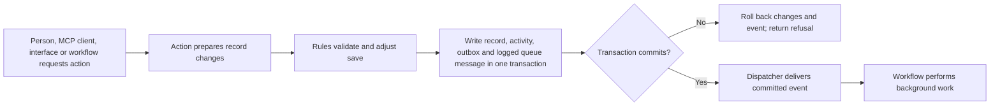
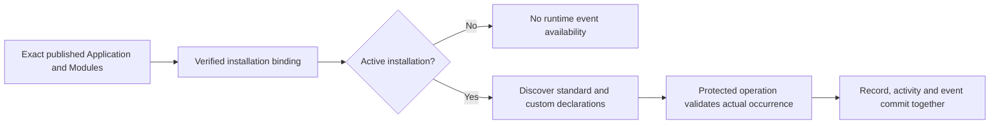
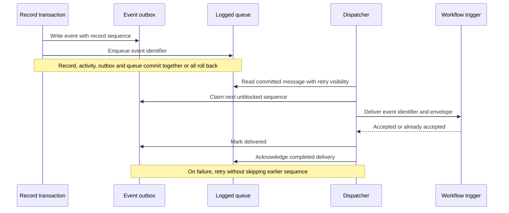

# 8. Forms, actions, rules and events

[Previous: Applications, navigation, pages and themes](07-applications-pages-and-themes.md) · [Specification index](README.md) · Next: [Workflows and process pipelines](09-workflows-and-pipelines.md)

## Behaviour levels

The platform separates work that must finish during a [record save](06-records-and-lifecycle.md) from work that can continue afterward.

An **action** is a named operation that participates in a save. A **rule** is a typed flow of immediate logic evaluated in its declared context. An **event** is a committed statement that something happened. A [workflow](09-workflows-and-pipelines.md) performs durable work after the save. The [Frontend Rule Designer](appendices/frontend-rule-designer.md) is the one shared rule/action authoring surface, reusing the Conditions Designer and Page Designer forms.

A user-facing action always enters an application-owned Frontend Flow; the named **action** contract below is its lower-level protected business operation, not a competing click handler. A popup-only or navigation-only flow finishes without a business submission. A one-node Save form flow is sufficient for an ordinary submit button. The [flow-first binding rules](appendices/frontend-rule-designer.md#pages-compose-flows-define-actions) separate page composition from behaviour without replacing the owning services.

An interactive flow may collect forms, query data and execute several changing nodes in its configured order. Each protected operation commits independently; cancellation or later failure does not undo earlier commits. The collect-first pattern remains available: collect all required answers before one supported atomic operation when no business changes should occur until every form passes. Each operation revalidates its required path, inputs, current authority and revisions. No database transaction spans human or network waits. See [execution and custom forms](appendices/frontend-rule-designer.md#custom-forms-and-all-or-nothing-submission).

## Actions

An action belongs to a module when it expresses reusable business meaning, or to an application when it exists only for that application. It records:

- Permanent identifier, label, subject record type, and required permission.
- Inputs with names, labels, types, required flags, and validation that is valid for that type. Plain text accepts length and pattern constraints; formatted text accepts a closed block allowlist and maximum length; numbers accept numeric bounds; dates and date-times accept their own bounds; a record reference names one or more allowed record types; an organisation-account reference selects an account in the current organisation; a Boolean accepts none of those unrelated settings.
- A precondition.
- One to ten ordered effects.
- The events it may announce.
- A sharing setting of `refused` by default or `allowed`. Only an action explicitly published as shareable may be named by a cross-organisation grant.

Allowed immediate action effects are:

1. Set a field from a literal, action input, subject field, subject record, current actor, or current time.
2. Create a record using an explicit field-to-value map.
3. Copy an explicit non-empty list of the subject's published relationships to a record supplied through a declared link input.
4. Soft-delete the subject record.
5. Announce a declared business event when the save commits.

Every field, record type, relationship, input and event named by an effect must resolve during publication. A copy effect never means “all relationships”; the authored definition lists the relationship keys and publication resolves them to permanent relationship identifiers.

An action cannot wait, call an external system, send email, send notifications, invoke a model, or read arbitrary records. Those operations belong to a [workflow](09-workflows-and-pipelines.md). A shared action runs wholly in the source organisation and cannot create or link recipient-owned records.

## Rules

A rule flow has a trigger, optional condition, priority, declared typed inputs and flow variables, and an ordered graph of registered nodes. Rules for the same trigger run in a stable published order. The current single-effect implementation is a legacy contract, not the limit of the approved designer; [versioned compatibility](appendices/frontend-rule-designer.md#contracts-and-compatibility-delivery) must preserve existing published releases.

The immediate save-rule effects remain:

- Refuse the save with a field-level message.
- Set a field value.
- Require a field.
- Show or hide a field in the current form.
- Warn without refusing.
- Request background work after a successful commit.

The complete [frontend node catalogue](appendices/frontend-rule-designer.md#initial-frontend-node-catalogue-and-extensibility) additionally provides branching, flow variables, input forms, action preparation and semantic interface controls. Context validation separates pure feedback, interactive collection and authoritative submission; Show form is never a node inside a database transaction. New node kinds are versioned platform registrations, not customer-uploaded code.

Server validation is authoritative. Client-side rule evaluation may provide immediate feedback, but the server re-evaluates the rule against current data before saving.

The client evaluator is pure: it may show the same predicted field changes, warnings, refusals, and background-work request as the server, but it never writes a record, event, workflow-start intent, or external effect. Only an authoritative protected operation node or save-rule path may accept the request after checking the current organisation, active application installation, permission, exact published action or rule, subject revision, and typed inputs.

Rules must declare their read fields and write fields. Publication refuses cycles, conflicting writes without a declared order, and a rule that reads information unavailable to its execution context.

## Conditions

Conditions use a closed, typed vocabulary such as equals, not equals, comparison, between, empty, not empty, contains, changed, and is one of. Operators are allowed only for compatible field types.

Conditions may refer to:

- A field on the subject record.
- Its previous value during a change.
- A declared action input.
- A value carried by an event.
- A setting on the same page block when controlling builder presentation.

Relationship traversal is limited and validated. Conditions cannot execute code or network calls.

The early [record-visibility foundation #36](../build-plan/issue-36-ownership-and-visibility.md) supplies the shared typed Boolean evaluator using the existing condition contract. It validates the complete tree and declared inputs before evaluating truth: invalid or missing input cannot become an allowance through negation or a short-circuited branch. Values are compared without implicit type conversion, and pure evaluation and PostgreSQL restrictions use the same tested meaning. The [condition builder #57](https://github.com/Abzum-NZ/Abzum-Vortex/issues/57) later adds authoring and general-rule extensions to that same implementation; the operators listed conceptually above are not a claim that all extensions already ship.

Module V2 adds the [exact-value Rule semantics](../build-plan/issue-44-record-field-values.md#rule-consumer-handoff)
needed by its field definitions. Select them from the trusted owning Module
contract, not from how an incoming value looks or the containing Application's
version. Keep the same condition tree and error meanings; decimal and money
parameters are explicit types, while historical `number` parameters retain their
meaning. The existing V1 evaluator remains available for historical Definition
evidence. Runtime, publication tests and database-backed predicates must agree
before the new value format is activated for records. This work does not require
the visual Conditions Designer or a second rule engine.

Application-owned rules, actions, queries, pipeline gates and record-bound
workflow conditions use the value format of the exact Module owning the fields
they consume. Literal assignments use the target field's format; field-to-field
and input mappings must have compatible declared formats. A containing
Application's format version cannot turn an exact decimal into a floating-point
number, reinterpret money currency, or turn ordinary text into a number. Compile
and validate these consumers with the same owning helpers described in the
[field-value plan](../build-plan/issue-44-record-field-values.md#rule-consumer-handoff).

A workflow input bound to a record field retains its declared allowed record
types. The field's possible targets must fit within that declaration; downstream
nodes use the declaration when checking their own accepted targets. Historical
canonical inputs that omitted this metadata use the owning field's targets.
These type declarations never grant access to the referenced records.

The [Rule package](../../runtime/rule/package.json) is a shared, contracts-only package below Definition and Access in the enforced dependency graph. Both reuse its pure evaluator; the existing Definition entry delegates to it. This does not introduce another service, expression language, database connection or browser-side authority. Actual database parity remains an explicit acceptance requirement of [record visibility](../build-plan/issue-36-ownership-and-visibility.md), not something established by pure tests alone.

## Events

Every record type provides seven standard events:

- Created.
- Changed, with changed field names.
- Deleted, with record identifier and record type.
- Linked.
- Unlinked.
- Reassigned.
- State changed, with field and previous/new values.

A module may declare additional business events. An event carries identifiers and the minimum non-personal values required to choose later work. It never carries a complete record or a field classified as personal or sensitive. A workflow re-reads permitted current data when needed.

The same rule applies to standard events: a state-change fact can identify the
record and changed field, but its previous/new values are omitted when classified
as personal or sensitive. This does not prevent the record change or suppress
the safe lifecycle fact. Application-owned custom events use the same declaration
and carried-value rules as Module-owned events.

### Installed event availability

An event declaration describes what may happen; an event occurrence records that
it happened. Publication creates only the declaration. Installing and activating
an exact Application release makes its standard and custom events, and those of
its exact bound Module releases, available in that installation. Detachment stops
new use there without deleting definitions needed by other installations or
historical occurrences.

The immutable published definitions and actual installation bindings are the
authority for discovery and declaration validation. Registration is not a second
editable copy of those definitions or an `eventsRegistered` success flag. A retry
reuses the same scoped declaration identities; an explicit installation upgrade
changes the exact release it resolves, not the meaning of an older installation's
events. No event is queued merely by publication, registration or discovery.

The [system-field/action/event plan](../build-plan/issue-50-system-fields-actions-events.md)
separates this installation handoff from actual occurrence delivery and preserves
the existing service dependency direction.

## Event envelope

Every event envelope includes:

- Unique event identifier.
- Organisation, application, module, record type, and record identifiers where applicable.
- Event name and published definition versions.
- Occurrence time, initiating person or system actor, correlation identifier, and causation identifier.
- Per-record sequence number.
- Declared carried values.

The unique occurrence identifier is separate from the reusable custom event
declaration identifier. Resolve a custom event by its exact owning Application
or Module release and permanent declaration reference, retaining its published
namespaced key. Resolve a standard event by its fixed kind and owning record
type/release. Never infer either identity from a display label. Introduce the
explicit versioned runtime envelope before delivery; preserve historical envelope
contracts rather than silently changing their meaning.

Event keys are resolved within their owning Application or Module; an identical
key in another owner is not the same declaration. Validate carried values with
the same field meanings used by Record, not a separate event-specific validator.
A state change can set a previously absent value or clear a present one. Its
before/after representation must preserve that absence distinction; classified
values remain omitted while the safe record and field identifiers are retained.

## Starting durable work

A synchronous action or rule may request a published [workflow](09-workflows-and-pipelines.md), but it never calls Kestra while the record transaction is open. If the operation saves a record, the record changes, declared event, and exact durable workflow-start intent or event are written in the same transaction. A refusal, stale revision, validation failure, or rollback writes none of them. After commit, the dispatcher hands the recorded fact to the private workflow adapter with duplicate protection.

An authorised button that uses the published button/action trigger but makes no record change still opens a short Vortex transaction and persists its exact start intent before returning success. A browser preview or direct call to Kestra cannot substitute for that transaction. The current first-release trigger contract is action- and subject-record-bound. A future record-free start requires a separately declared protected Workflow operation plus explicit versioned descriptor, trigger, input, and execution-reference contracts; until those exist, it is unavailable rather than represented by a fabricated action, placeholder record, or arbitrary payload.

A Kestra outage after commit leaves the event or start intent pending for retry. Vortex reports the record save as committed and the background start as pending; it never turns a committed save into a false failure. Conversely, a rejected or rolled-back save can never produce a workflow run.

## Delivery guarantees

- The record change, activity, event outbox row and logged queue message are written in the same database transaction. Dispatch starts only after commit; it is not responsible for filling a gap between a committed record and its event.
- Event preparation and event persistence are distinct. The required Event participant prepares exact occurrence facts; the protected Record database save invokes the private Event append helper unconditionally. Request/runtime roles cannot call that helper directly or fabricate a save-success claim. See the [reviewed save/event boundary](../build-plan/module-record-provisioning.md#event-append-authority).
- Reuse the existing Rule and Record engines for business evaluation; do not introduce a second PostgreSQL rules/calculation engine for this handoff. Database-authoritative access, scope, revision, constraints and atomic persistence remain enforced by the owning protected writer.
- Delivery is at least once; each consumer scopes duplicate protection to its own identity and the event identifier. Workflow acceptance additionally includes the exact installation revision, workflow, and trigger, so one event can start different workflows without suppressing either one.
- Events for the same record are handed to consumers in sequence order.
- A later event cannot cause an earlier undelivered event to be discarded. The dispatcher waits, retries, or moves the blocked sequence to an operator-visible failure state.
- A permanently failed event remains available for authorised retry and investigation.
- The transaction uses a durable logged [Supabase Queue](https://supabase.com/docs/guides/queues/quickstart), not an unlogged queue. A database webhook wakes the platform dispatcher for normal low-latency delivery, and a scheduled [Kestra](https://kestra.io/docs/workflow-components/triggers) recovery flow calls the protected dispatcher endpoint to reclaim missed or stalled work. Kestra never reads the database directly.

## Acceptance examples

- A refused save does not emit an event or start background work.
- Client preview produces no durable intent or side effect; authoritative execution rechecks current permission, installation, definition, subject, and typed inputs.
- A committed save and its workflow-start fact are atomic, while an authorised no-change button persists its start intent in a separate Vortex transaction before post-commit dispatch.
- A Kestra outage leaves committed background work pending without losing it or reporting the committed save as failed.
- Re-delivering an event does not create a second workflow run for the same trigger.
- A later change cannot overtake an earlier failed event for the same record.
- A rule that drops an unsafe condition cannot publish; it must express a safe condition or refuse the operation.
- Actions called from pages, MCP, programmable interfaces, and workflows follow the same validation and permission path. MCP does not provide a second action executor.

## Page binding boundary

[Typed page/form/operation bindings](appendices/page-builder-contracts.md#forms-actions-and-semantic-controls) map each surfaced action to an application-owned flow and typed context. The flow's operation node invokes the protected named action/save, or a closed protected platform operation for an authorised administration form. No component silently saves, and no frontend binding permits arbitrary RPC or bypasses current access, validation, revisions or duplicate protection. Mandatory business rules must also hold for every permitted direct service/interface invocation; hiding or replacing a button never changes them.

## Configured effects and execution identity

Component load, refresh and other declared events can invoke read/write node sequences. The pure preview evaluator still has no effects; the orchestrator invokes protected services for effectful nodes. Each node uses its verified [execution identity](appendices/frontend-rule-designer.md#node-execution-identity), with separate initiator and effective actor. Operation atomicity and outbox guarantees apply per committed step, not to all previously completed steps in the flow. A committed background-start intent is not undone because a later form is cancelled.
