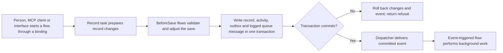
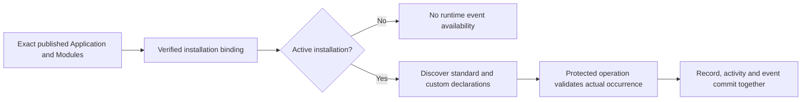
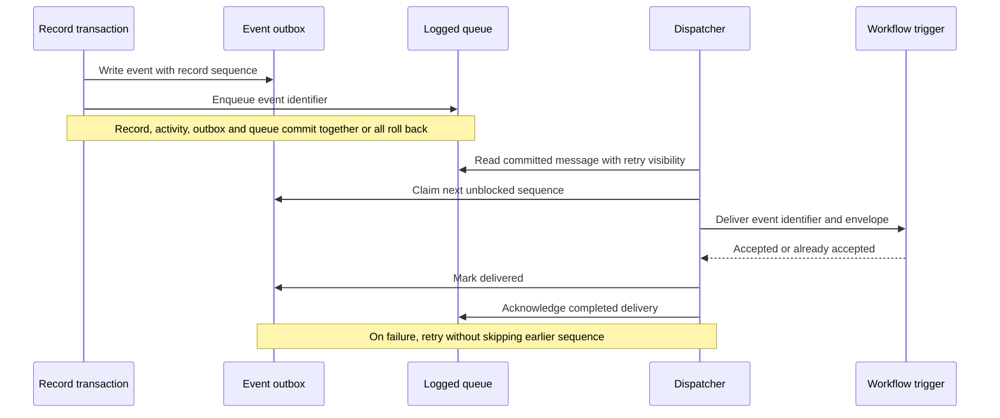

# 8. Forms, actions, rules and events

[Previous: Applications, navigation, pages and themes](07-applications-pages-and-themes.md) · [Specification index](README.md) · Next: [Workflows and process pipelines](09-workflows-and-pipelines.md)

## Behaviour levels

The platform separates work that must finish during a [record save](06-records-and-lifecycle.md) from work that can continue afterward.

Every behaviour is a **flow** in the one [flow language](appendices/frontend-rule-designer.md#one-flow-language). An **action** is a flow a person or agent starts through a binding; a **named action** is a `transaction` flow whose record changes compile into one protected apply-record-changes call. A **rule** is a flow with a `BeforeSave` trigger that runs inside the save. An **event** is a committed statement that something happened. Work after a change is a flow with an `Event` trigger, and durable work runs on [Kestra](09-workflows-and-pipelines.md). The [Frontend Rule Designer](appendices/frontend-rule-designer.md) is the one authoring surface for all of them, reusing the Conditions Designer and Page Designer forms.

A user-facing action always enters a flow through its binding: the exact flow id plus a typed input map. A popup-only or navigation-only flow finishes without a business submission. The default Save of a form is a generated one-task flow, `record.save`. The [flow-first binding rules](appendices/frontend-rule-designer.md#pages-compose-flows-define-actions) separate page composition from behaviour without replacing the owning services.

An interactive flow may collect forms, query data and execute several changing tasks in its configured order. Any flow that contains a protected task is driven by the server from its first task. Each protected task commits independently; cancellation or later failure does not undo earlier commits. The collect-first pattern remains available: collect all required answers before one record task when no business changes should occur until every form passes. Each protected task revalidates its required path, inputs, current authority and revisions. No database transaction spans human or network waits. See [execution and custom forms](appendices/frontend-rule-designer.md#custom-forms-and-all-or-nothing-submission).

## Actions

A **named action** is a published `transaction` flow in the one [flow language](appendices/frontend-rule-designer.md#one-flow-language), started through its binding or by a Run flow task in another flow. It belongs to a module when it expresses reusable business meaning, or to an application when it exists only for that application. It declares the same fields as every [flow](appendices/frontend-rule-designer.md#flow-shape); it runs as the actor that starts it (a person, their agent, or the calling flow's run-as), and its invocation permission is checked before it starts.

Its inputs use names, labels, types, required flags, and validation valid for that type from the one value-type catalogue. Plain text accepts length and pattern constraints; formatted text accepts a closed block allowlist and maximum length; numbers accept numeric bounds; dates and date-times accept their own bounds; a record reference names one or more allowed record types; an organisation-account reference selects an account in the current organisation; a Boolean accepts none of those unrelated settings. A named action also records a precondition, the events it may announce, and a sharing setting of `refused` by default or `allowed`; only an action explicitly published as shareable may be named by a cross-organisation grant.

A named action's ordered task list may contain only transaction-safe tasks: pure tasks (If, Switch, Set variables, Calculate, Require field, Refuse, Warn, Stop), reads under the actor's authority, and record tasks. Its record tasks compile into **one** apply-record-changes call, so they succeed or fail together:

1. `record.setFields` on the subject — each value from a literal, action input, subject field, subject record, `{{ execution.actor }}`, or a formula.
2. `record.create` — using an explicit field-to-value map.
3. `record.link` — an explicit non-empty list of the subject's published relationship keys, to a record supplied through a declared input.
4. `record.delete` — the subject record.
5. Announce event — a declared business event written when the call commits.

Apply record changes enforces, for every call, the access decision for each touched record, field permissions, pipeline transitions and gates, action-only fields, revision checks, `BeforeSave` flows and computed values. A pipeline stage field changes only through its named transition action. Every field, record type, relationship, input and event named by a task must resolve during publication. A link task never means "all relationships"; the authored task lists the relationship keys and publication resolves them to permanent relationship identifiers.

A named action cannot wait, call an external system, send email, send notifications, invoke a model, run unbounded reads or start background work; follow-up work is a flow with an `Event` trigger, and work that waits is a durable flow. A shared action runs wholly in the source organisation and cannot create or link recipient-owned records.

## Rules

A **rule** is a flow with a `BeforeSave` trigger and the `transaction` execution kind. It declares the same fields as every [flow](appendices/frontend-rule-designer.md#flow-shape). Examples: a required value, an allowed status change, "a resolved case needs a resolution time". Rules on the same record type run in a stable published order.

A rule's ordered task list may contain only transaction-safe tasks:

- If, Switch, Set variables and Calculate.
- Set field on the record being saved.
- Require field.
- Warn without refusing.
- Refuse with a field-level message, or Stop.
- Query records under the saver's authority.

The server runs every applicable rule inside apply record changes for every writer: web, agent, interface, import and Kestra. Its refusals, requirements and warnings are authoritative, and no binding, button or raw call can evade it. A rule cannot show or hide fields, wait for a person, switch identity, start background work or commit independently. Presentation belongs to the interactive flow bound to the form, and work after the change belongs to a flow with an `Event` trigger.

The browser runs the same rule definition while a person edits, to show predicted field changes, requirements, warnings and refusals at once. The browser evaluator is pure: it never writes a record, event, background-start intent or external effect, and its results are never trusted. The server re-evaluates the rule against current data before saving.

Flows must declare their read fields and write fields. Publication refuses cycles, conflicting writes without a declared order, a task placed outside its declared run locations, and a flow that reads information unavailable to its execution kind.

### One flow language mapping

Every current element is authored as part of the one flow shape. The table maps each existing representation to its replacement:

| Current element | Replacement in the one flow language |
| --- | --- |
| Rule-graph `before_save` profile and Start node | A flow with a `BeforeSave` trigger and `transaction` execution; the Start node's inputs and variables become the flow's `inputs` and `variables`. |
| Rule-graph Condition node with `true`/`false` ports | An **If** control task with its two declared branches. |
| Rule-graph Set variable node | A **Set variables** task writing a declared `vars` value. |
| Rule-graph Set field node | A **Set field** task on the record being saved. |
| Rule-graph Require field node | A **Require field** task. |
| Rule-graph Warn node | A **Warn** task. |
| Rule-graph Refuse node | A **Refuse** task, which ends the flow with a refused outcome. |
| Rule-graph Finish node | The end of the task list, or a **Stop** task, with the flow's typed outputs. |
| Rule-graph `next`/`true`/`false` ports and edges | The ordered task list with **If** branches; no edge list. |
| Rule-graph operands (literal, input, variable, current field, previous field) | A typed literal in the formula tree, `{{ inputs.x }}`, `{{ vars.x }}`, `{{ trigger.record.field }}` and `{{ trigger.previous.field }}`. |
| Rule-graph condition tree | The typed condition tree of the one formula. |
| Current-user flow and its component binding | A binding (exact flow id plus typed input map) to an `interactive` flow; the component event is a binding, not a trigger. |
| Current-user flow Start node | The flow declaration: `inputs`, `variables` and `runAs`. |
| Current-user flow Query node | A **Query records** task. |
| Current-user flow Action node, `record_save` target | A **`record.save`** task. |
| Current-user flow Action node, `application_action` target | A **Run flow** task calling the named action's `transaction` flow. |
| Current-user flow Action node, `protected_operation` target | The registered protected-operation task, run by the one protected-operation executor. |
| Current-user flow Action node, `form_continuation` target | A **Show form** browser task, resumed by its continuation. |
| Current-user flow Action node, `durable_workflow_start` target | A **Run background flow** task. |
| Current-user flow Transform node | A **Transform** task. |
| Current-user flow Return node | The flow's typed `outputs`; a **Stop** task for an early outcome. |
| Current-user flow edges and their outcomes | The ordered task list; a task's refused, conflict or invalid outcome goes to the `errors` handler, or, with `allowRefusal: true`, to an **If** or **Switch** on `{{ outputs.task.outcome }}`. |
| Current-user flow node run-as | The flow's `runAs` (the initiating person); a task never overrides it. |
| Workflow Start node and trigger | The flow declaration. An event trigger becomes an `Event` trigger, a schedule a `Schedule` trigger and a connection message an `IncomingMessage` trigger; a button, menu, record gesture, agent tool or interface start becomes a **binding** to a frontend flow, and a parent-flow start becomes a **Run flow** or **Run background flow** task. |
| Workflow run-as (`initiating_person`, `system_with_source_authority`) | The flow's `runAs`: the initiating person when started through Run background flow from an interactive flow, otherwise a declared specified account or System. |
| Workflow `condition` node | An **If** control task. |
| Workflow `decision_table` node | A **Switch** control task. |
| Workflow `bounded_loop` node | A bounded **For each** control task. |
| Workflow `delay` and `wait_until` nodes | A durable **Wait until** control task. |
| Workflow `start_workflow` node | A **Run flow** control task. |
| Workflow `stop` node | A **Stop** control task. |
| Workflow `create_record` node | A **`record.create`** task. |
| Workflow `change_record` node | A **`record.setFields`** task. |
| Workflow `soft_delete_record` node | A **`record.delete`** task. |
| Workflow `duplicate_record` node | A **Query records** task followed by **`record.create`** with an explicit field-to-value map. |
| Workflow `run_action` node | A **Run flow** task calling the named action's `transaction` flow. |
| Workflow `add_relationship` and `copy_relationships` nodes | A **`record.link`** task with explicit relationship keys. |
| Workflow `request_form` node | A durable **Wait for a person** control task. |
| Workflow `query_records` node | A **Query records** task. |
| Workflow `set_values` node | A **Set variables** task. |
| Workflow `format_value` node | A **Calculate** task using the one formula. |
| Workflow `generate_export` node | A **Generate export** task. |
| Workflow `attach_file` and `move_file` nodes | **Attach file** and **Move file** tasks. |
| Workflow `call_connection` and `acknowledge_message` nodes | **Call connection** and **Acknowledge message** tasks. |
| Workflow edges and their outcomes | The ordered task list; edges become declared order and named branches. |
| Named-action effects (`set_field`, `create_record`, `copy_relationships`, `soft_delete_subject`, `announce_event`) | **`record.setFields`**, **`record.create`**, **`record.link`**, **`record.delete`** and **Announce event** tasks in the named action's `transaction` flow, compiled into one apply-record-changes call. |
| Legacy single-effect application rules | Removed ([#987](https://github.com/Abzum-NZ/Abzum-Vortex/issues/987)); any remaining behaviour is a `BeforeSave` flow. |
| Pipeline stage transition | A named transition action: a `transaction` flow whose invocation permission and typed gate guard the stage change. |
| Pipeline stage entry and exit actions | Tasks in the transition action's flow. |
| Pipeline stage entry and exit workflows | Flows with an `Event` trigger on the record's State changed event. |
| Pipeline time target and escalation | A read-time computed field for the deadline, and a durable flow with a `Schedule` trigger for the escalation. |

## Conditions

Conditions use a closed, typed vocabulary such as equals, not equals, comparison, between, empty, not empty, contains, changed, and is one of. Operators are allowed only for compatible field types.

Conditions may refer to:

- A field on the subject record.
- Its previous value during a change.
- A declared action input.
- A value carried by an event.
- A setting on the same page block when controlling builder presentation.

Relationship traversal is limited and validated. Conditions cannot execute code or network calls.

The early [record-visibility foundation #36](../build-plan/issue-36-ownership-and-visibility.md) supplies the shared typed Boolean evaluator using the existing condition contract. It validates the complete tree and declared inputs before evaluating truth: invalid or missing input cannot become an allowance through negation or a short-circuited branch. Values are compared without implicit type conversion, and pure evaluation and PostgreSQL restrictions use the same tested meaning. The [condition builder #57](https://github.com/Abzum-NZ/Abzum-Vortex/issues/57) later adds authoring and general-rule extensions to that same implementation; the operators listed conceptually above are not a claim that all extensions already ship.

The current Module contract supplies the [exact-value Rule semantics](../build-plan/issue-44-record-field-values.md)
needed by its field definitions. Select them from the trusted owning Module
contract, not from how an incoming value looks or the containing Application's
version. Keep the same condition tree and error meanings. Decimal and money
parameters are explicit exact-value types; an explicitly declared `number`
parameter uses its finite-double meaning. Runtime, publication validation and
database-backed predicates apply the same declared operand semantics. No obsolete
evaluator or representation conversion is retained, and the visual Conditions
Designer is not required to execute these semantics.

Application-owned rules, actions, queries, pipeline gates and record-bound
workflow conditions use the value format of the exact Module owning the fields
they consume. Literal assignments use the target field's format; field-to-field
and input mappings must have compatible declared formats. A containing
Application's format version cannot turn an exact decimal into a floating-point
number, reinterpret money currency, or turn ordinary text into a number. Compile
and validate these consumers with the same owning helpers described in the
[field-value plan](../build-plan/issue-44-record-field-values.md).

A workflow input bound to a record field retains its declared allowed record
types. The field's possible targets must fit within that declaration; downstream
tasks use the declaration when checking their own accepted targets. Historical
canonical inputs that omitted this metadata use the owning field's targets.
These type declarations never grant access to the referenced records.

The [Rule package](../../runtime/rule/package.json) is a shared, contracts-only package below Definition and Access in the enforced dependency graph. Both reuse its pure evaluator; the existing Definition entry delegates to it. This does not introduce another service, expression language, database connection or browser-side authority. Actual database parity remains an explicit acceptance requirement of [record visibility](../build-plan/issue-36-ownership-and-visibility.md), not something established by pure tests alone.

## Events

Every record type provides seven standard events:

- Created.
- Changed, with changed field names.
- Deleted, with record identifier and record type.
- Linked.
- Unlinked.
- Reassigned.
- State changed, with field and previous/new values.

A module may declare additional business events. An event carries identifiers and the minimum non-personal values required to choose later work. It never carries a complete record or a field classified as personal or sensitive. A workflow re-reads permitted current data when needed.

The same rule applies to standard events: a state-change fact can identify the
record and changed field, but its previous/new values are omitted when classified
as personal or sensitive. This does not prevent the record change or suppress
the safe lifecycle fact. Application-owned custom events use the same declaration
and carried-value rules as Module-owned events.

### Installed event availability

An event declaration describes what may happen; an event occurrence records that
it happened. Publication creates only the declaration. Installing and activating
an exact Application release makes its standard and custom events, and those of
its exact bound Module releases, available in that installation. Detachment stops
new use there without deleting definitions needed by other installations or
historical occurrences.

The immutable published definitions and actual installation bindings are the
authority for discovery and declaration validation. Registration is not a second
editable copy of those definitions or an `eventsRegistered` success flag. A retry
reuses the same scoped declaration identities; an explicit installation upgrade
changes the exact release it resolves, not the meaning of an older installation's
events. No event is queued merely by publication, registration or discovery.

The [system-field/action/event plan](../build-plan/issue-50-system-fields-actions-events.md)
separates this installation handoff from actual occurrence delivery and preserves
the existing service dependency direction.

## Event envelope

Every event envelope includes:

- Unique event identifier.
- Organisation, application, module, record type, and record identifiers where applicable.
- Event name and published definition versions.
- Occurrence time, initiating person or system actor, correlation identifier, and causation identifier.
- Per-record sequence number.
- Declared carried values.

The unique occurrence identifier is separate from the reusable custom event
declaration identifier. Resolve a custom event by its exact owning Application
or Module release and permanent declaration reference, retaining its published
namespaced key. Resolve a standard event by its fixed kind and owning record
type/release. Never infer either identity from a display label. Introduce the
explicit versioned runtime envelope before delivery; preserve historical envelope
contracts rather than silently changing their meaning.

Event keys are resolved within their owning Application or Module; an identical
key in another owner is not the same declaration. Validate carried values with
the same field meanings used by Record, not a separate event-specific validator.
A state change can set a previously absent value or clear a present one. Its
before/after representation must preserve that absence distinction; classified
values remain omitted while the safe record and field identifiers are retained.

## Starting durable work

Every user-facing action starts a frontend flow through its binding, and a frontend flow requests durable [work](09-workflows-and-pipelines.md) only through a Run background flow task with declared typed inputs; a committed record change reaches durable work only through an `Event`-triggered flow; neither calls Kestra while a record transaction is open. The start is committed whether or not a record is involved. If the operation saves a record, the record changes, declared event, and exact durable workflow-start intent or event are written in the same transaction. A refusal, stale revision, validation failure, or rollback writes none of them. After commit, the dispatcher hands the recorded fact to the private workflow adapter with duplicate protection.

An authorised button, menu command, record gesture, agent tool call or interface operation that makes no record change still opens a short Vortex transaction and persists its exact start intent before returning success; a binding never calls Kestra directly. A browser preview or direct call to Kestra cannot substitute for that transaction. No form, interface operation or agent tool binds a lower-level operation directly, and a record-free start is never represented by a fabricated action, placeholder record, or arbitrary payload.

A Kestra outage after commit leaves the event or start intent pending for retry. Vortex reports the record save as committed and the background start as pending; it never turns a committed save into a false failure. Conversely, a rejected or rolled-back save can never produce a workflow run.

## Delivery guarantees

The first [transactional append implementation](https://github.com/Abzum-NZ/Abzum-Vortex/issues/400)
in [#400](https://github.com/Abzum-NZ/Abzum-Vortex/issues/400) installs a private immutable
outbox and one Basic logged queue. The fixed append helper is available only to the
non-login role owning protected Record adapters, never directly to runtime or
browser callers. Current verified context supplies actor and correlation; the
database supplies occurrence time. Previous record-editor metadata must not be
mistaken for the actor of a new event. The minimal queue message carries V2
`occurrenceId`, not record contents or a reusable event-declaration identifier.

The helper coordinates with the existing Module lifecycle lock before it rereads
the exact active installation, binding and release. Activation, detach or
replacement therefore cannot leave a waiting append using stale installation
evidence. That lifecycle lock is shared by appends; the actual generated Record
row remains the ordering lock, so different records in the same Application and
Module can proceed independently. A missing row or a row contained by another
Application is refused without an outbox row, queue message or partial batch.

Sequence follows actual record identity. An organisation-shared record has one
sequence across consuming Applications; application-contained records retain
their Application scope. The locked row and indexed outbox maximum provide the
sequence, without a second counter or timestamp ordering mechanism. The private
append prerequisite alone is not the complete protected save or dispatcher.
Ordered delivery, claiming, retries, consumer receipts and recovery remain
[event delivery #60](https://github.com/Abzum-NZ/Abzum-Vortex/issues/60).

- The record change, activity, event outbox row and logged queue message are written in the same database transaction. Dispatch starts only after commit; it is not responsible for filling a gap between a committed record and its event.
- Event preparation and event persistence are distinct. The required Event participant prepares exact occurrence facts; the protected Record database save invokes the private Event append helper unconditionally. Request/runtime roles cannot call that helper directly or fabricate a save-success claim. See the [reviewed save/event boundary](../build-plan/module-record-provisioning.md#event-ownership).
- Reuse the existing Rule and Record engines for business evaluation; do not introduce a second PostgreSQL rules/calculation engine for this handoff. Database-authoritative access, scope, revision, constraints and atomic persistence remain enforced by the owning protected writer.
- Delivery is at least once; each consumer scopes duplicate protection to its own identity and the event identifier. Workflow acceptance additionally includes the exact installation revision, workflow, and trigger, so one event can start different workflows without suppressing either one.
- Events for the same record are handed to consumers in sequence order.
- A later event cannot cause an earlier undelivered event to be discarded. The dispatcher waits, retries, or moves the blocked sequence to an operator-visible failure state.
- A permanently failed event remains available for authorised retry and investigation.
- The transaction uses a durable logged [Supabase Queue](https://supabase.com/docs/guides/queues/quickstart), not an unlogged queue. A database webhook wakes the platform dispatcher for normal low-latency delivery, and a scheduled [Kestra](https://kestra.io/docs/workflow-components/triggers) recovery flow calls the protected dispatcher endpoint to reclaim missed or stalled work. Kestra never reads the database directly.

## Acceptance examples

- A refused save does not emit an event or start background work.
- Client preview produces no durable intent or side effect; authoritative execution rechecks current permission, installation, definition, subject, and typed inputs.
- A committed save and its workflow-start fact are atomic, while an authorised no-change button persists its start intent in a separate Vortex transaction before post-commit dispatch.
- A Kestra outage leaves committed background work pending without losing it or reporting the committed save as failed.
- Re-delivering an event does not create a second workflow run for the same trigger.
- A later change cannot overtake an earlier failed event for the same record.
- A rule that drops an unsafe condition cannot publish; it must express a safe condition or refuse the operation.
- Actions called from pages, MCP, programmable interfaces and workflows all start a flow through a binding and follow the same validation and permission path. No form, interface or tool binds a lower-level operation directly, and MCP does not provide a second action executor.

## Page binding boundary

[Typed page, form and flow bindings](appendices/page-builder-contracts.md#forms-actions-and-semantic-controls) map each surfaced action to a flow binding: the exact flow id plus a typed input map. A record, Run flow or protected-operation task inside that flow invokes apply record changes, a named action, or a closed protected platform operation for an authorised administration form. A form, interface operation or agent tool binds the flow entry point (a one-task flow by default) and never the operation directly. No component silently saves, and no frontend binding permits arbitrary RPC or bypasses current access, validation, revisions or duplicate protection. Mandatory business rules must also hold for every permitted direct service/interface invocation; hiding or replacing a button never changes them.

## Configured effects and execution identity

Component load, refresh and other declared events can invoke read/write task sequences. The pure preview evaluator still has no effects; the orchestrator invokes protected services for effectful tasks. Each protected task uses the flow's verified [run-as identity](appendices/frontend-rule-designer.md#run-as), with separate initiator and effective actor, and Access is rechecked before every protected task. Operation atomicity and outbox guarantees apply per committed task, not to all previously completed tasks in the flow. A committed background-start intent is not undone because a later form is cancelled.
