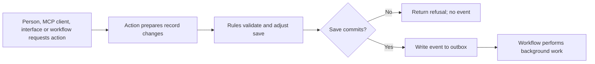
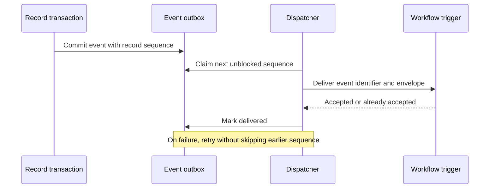

# 8. Forms, actions, rules and events

[Previous: Applications, navigation, pages and themes](07-applications-pages-and-themes.md) · [Specification index](README.md) · Next: [Workflows and process pipelines](09-workflows-and-pipelines.md)

## Behaviour levels

The platform separates work that must finish during a [record save](06-records-and-lifecycle.md) from work that can continue afterward.

An **action** is a named operation that participates in a save. A **rule** is immediate logic within the save. An **event** is a committed statement that something happened. A [workflow](09-workflows-and-pipelines.md) performs work after the save.

## Actions

An action belongs to a module when it expresses reusable business meaning, or to an application when it exists only for that application. It records:

- Permanent identifier, label, subject record type, and required permission.
- Inputs with names, labels, types, required flags, and validation that is valid for that type. Plain text accepts length and pattern constraints; formatted text accepts a closed block allowlist and maximum length; numbers accept numeric bounds; dates and date-times accept their own bounds; a record reference names one or more allowed record types; an organisation-account reference selects an account in the current organisation; a Boolean accepts none of those unrelated settings.
- A precondition.
- One to ten ordered effects.
- The events it may announce.
- A sharing setting of `refused` by default or `allowed`. Only an action explicitly published as shareable may be named by a cross-organisation grant.

Allowed immediate action effects are:

1. Set a field from a literal, action input, subject field, subject record, current actor, or current time.
2. Create a record using an explicit field-to-value map.
3. Copy an explicit non-empty list of the subject's published relationships to a record supplied through a declared link input.
4. Soft-delete the subject record.
5. Announce a declared business event when the save commits.

Every field, record type, relationship, input and event named by an effect must resolve during publication. A copy effect never means “all relationships”; the authored definition lists the relationship keys and publication resolves them to permanent relationship identifiers.

An action cannot wait, call an external system, send email, send notifications, invoke a model, or read arbitrary records. Those operations belong to a [workflow](09-workflows-and-pipelines.md). A shared action runs wholly in the source organisation and cannot create or link recipient-owned records.

## Rules

A rule has a trigger, condition, priority, and one effect. Rules for the same trigger run in a stable published order.

Allowed effects are:

- Refuse the save with a field-level message.
- Set a field value.
- Require a field.
- Show or hide a field in the current form.
- Warn without refusing.
- Request background work after a successful commit.

Server validation is authoritative. Client-side rule evaluation may provide immediate feedback, but the server re-evaluates the rule against current data before saving.

The client evaluator is pure: it may show the same predicted field changes, warnings, refusals, and background-work request as the server, but it never writes a record, event, workflow-start intent, or external effect. Only the authoritative Vortex action or save path may accept the request after checking the current organisation, active application installation, permission, exact published action or rule, subject revision, and typed inputs.

Rules must declare their read fields and write fields. Publication refuses cycles, conflicting writes without a declared order, and a rule that reads information unavailable to its execution context.

## Conditions

Conditions use a closed, typed vocabulary such as equals, not equals, comparison, between, empty, not empty, contains, changed, and is one of. Operators are allowed only for compatible field types.

Conditions may refer to:

- A field on the subject record.
- Its previous value during a change.
- A declared action input.
- A value carried by an event.
- A setting on the same page block when controlling builder presentation.

Relationship traversal is limited and validated. Conditions cannot execute code or network calls.

## Events

Every record type provides seven standard events:

- Created.
- Changed, with changed field names.
- Deleted, with record identifier and record type.
- Linked.
- Unlinked.
- Reassigned.
- State changed, with field and previous/new values.

A module may declare additional business events. An event carries identifiers and the minimum non-personal values required to choose later work. It never carries a complete record or a field classified as personal or sensitive. A workflow re-reads permitted current data when needed.

## Event envelope

Every event envelope includes:

- Unique event identifier.
- Organisation, application, module, record type, and record identifiers where applicable.
- Event name and published definition versions.
- Occurrence time, initiating person or system actor, correlation identifier, and causation identifier.
- Per-record sequence number.
- Declared carried values.

## Starting durable work

A synchronous action or rule may request a published [workflow](09-workflows-and-pipelines.md), but it never calls Kestra while the record transaction is open. If the operation saves a record, the record changes, declared event, and exact durable workflow-start intent or event are written in the same transaction. A refusal, stale revision, validation failure, or rollback writes none of them. After commit, the dispatcher hands the recorded fact to the private workflow adapter with duplicate protection.

An authorised button that uses the published button/action trigger but makes no record change still opens a short Vortex transaction and persists its exact start intent before returning success. A browser preview or direct call to Kestra cannot substitute for that transaction. The current first-release trigger contract is action- and subject-record-bound. A future record-free start requires a separately declared protected Workflow operation plus explicit versioned descriptor, trigger, input, and execution-reference contracts; until those exist, it is unavailable rather than represented by a fabricated action, placeholder record, or arbitrary payload.

A Kestra outage after commit leaves the event or start intent pending for retry. Vortex reports the record save as committed and the background start as pending; it never turns a committed save into a false failure. Conversely, a rejected or rolled-back save can never produce a workflow run.

## Delivery guarantees

- An event is written in the same database transaction as the record change.
- Delivery is at least once; each consumer scopes duplicate protection to its own identity and the event identifier. Workflow acceptance additionally includes the exact installation revision, workflow, and trigger, so one event can start different workflows without suppressing either one.
- Events for the same record are handed to consumers in sequence order.
- A later event cannot cause an earlier undelivered event to be discarded. The dispatcher waits, retries, or moves the blocked sequence to an operator-visible failure state.
- A permanently failed event remains available for authorised retry and investigation.
- The committed outbox writes to a durable [Supabase Queue](https://supabase.com/docs/guides/queues). A database webhook wakes the platform dispatcher for normal low-latency delivery, and a scheduled [Kestra](https://kestra.io/docs/workflow-components/triggers) recovery flow calls the protected dispatcher endpoint to reclaim missed or stalled work. Kestra never reads the database directly.

## Acceptance examples

- A refused save does not emit an event or start background work.
- Client preview produces no durable intent or side effect; authoritative execution rechecks current permission, installation, definition, subject, and typed inputs.
- A committed save and its workflow-start fact are atomic, while an authorised no-change button persists its start intent in a separate Vortex transaction before post-commit dispatch.
- A Kestra outage leaves committed background work pending without losing it or reporting the committed save as failed.
- Re-delivering an event does not create a second workflow run for the same trigger.
- A later change cannot overtake an earlier failed event for the same record.
- A rule that drops an unsafe condition cannot publish; it must express a safe condition or refuse the operation.
- Actions called from pages, MCP, programmable interfaces, and workflows follow the same validation and permission path. MCP does not provide a second action executor.

## Page binding boundary

[Typed page/form/operation bindings](appendices/page-builder-contracts.md#forms-actions-and-semantic-controls) map controls to these actions and their inputs. Authorised administration forms may instead invoke a closed protected platform operation owned by its service. Neither path permits arbitrary RPC or bypasses current access, validation, revisions or duplicate protection.
