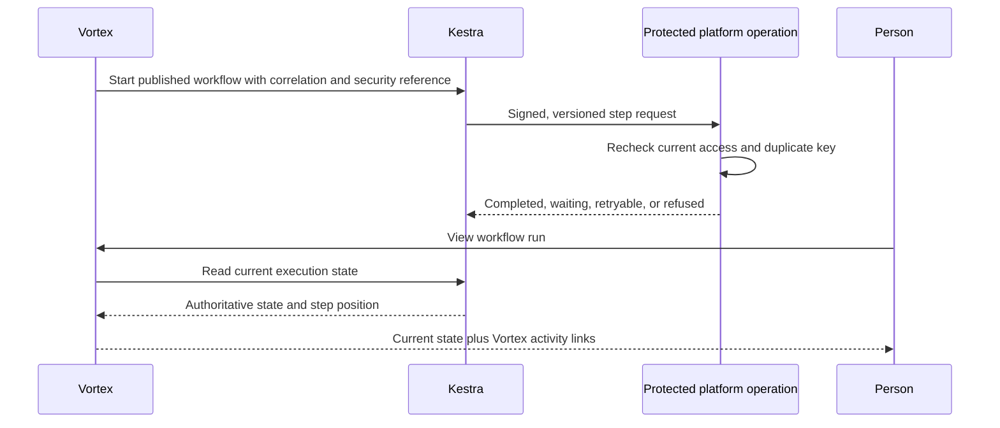
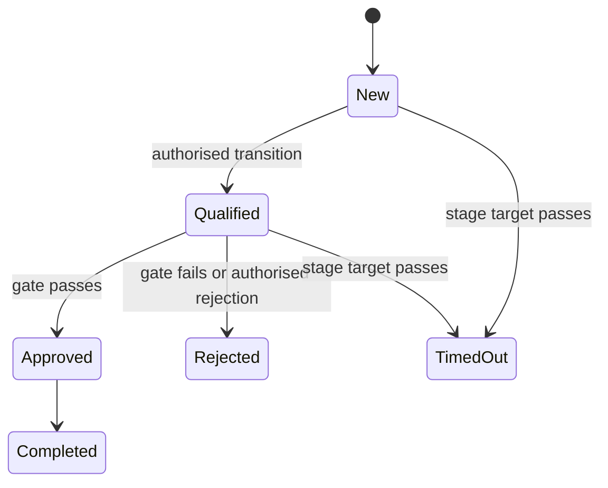

# 9. Workflows and process pipelines

[Previous: Forms, actions, rules and events](08-forms-actions-rules-and-events.md) · [Specification index](README.md) · Next: [Queries, reports, search and live updates](10-queries-reports-search.md)

## Purpose and authority

A **workflow** performs durable background work that may branch, wait, retry, contact another system, ask a person, or continue for months. A **process pipeline** describes the business stages through which a record moves.

[Kestra](https://kestra.io/docs) is authoritative for whether a workflow run or step is queued, running, waiting, completed, cancelled, or failed. Vortex asks Kestra for the current state whenever a person views a run. Vortex may keep a clearly labelled last-known snapshot for correlation, search, activity, and outage diagnosis, but never presents that snapshot as current when Kestra is unavailable.

Vortex remains authoritative for identities, tenant and organisation context, permissions, definitions, records, files, human-input references, connections, and every application side effect. Kestra receives no organisation database credential and cannot grant access or write organisation tables directly.

One operated Kestra instance is shared by Development, Testing, and Production. Application-execution flows use environment-scoped namespaces; target-specific flow identities, webhook keys, Doppler configurations, credentials and approval gates prevent them from silently changing authority. Reviewed delivery flows may remain in the shared `vortex.operations` namespace with fixed flow and target-environment authority. Its Production gate may read only the credential-free Testing receipt required by the [delivery rules](18-delivery-and-testing.md#supabase-development-and-verification); the receipt supplies evidence, not a credential or approval. This is not a claim of separate process isolation, and no separate instance or newly provisioned Development credential is required. Named operators may restart or redeploy the shared service as needed. A future version or state-database upgrade remains separately governed by [issue #198](https://github.com/Abzum-NZ/Abzum-Vortex/issues/198). Operating the shared service never bypasses the separate Production database-delivery approval in the [branch flow](18-delivery-and-testing.md#branch-flow).

## Ownership and versioning

Workflows are contained in an [application version](03-composition-and-publication.md#definition-ownership-and-versions). Publishing an application produces the immutable workflow definition and generated Kestra flow used by new runs. A run remains pinned to the application and workflow version from which it started unless an authorised, tested migration moves it.

The public Vortex execution reference stores the Vortex run identifier, workflow and application versions, tenant and organisation references, trigger, start actor, duplicate-protection key, human-input links, safe activity links, and a non-authoritative last-known state snapshot. The workflow adapter privately maps that run to Kestra's execution identifier and namespace; provider-specific fields are not part of the core application contract. Kestra stores the executable state, current step, retries, waits, and final execution outcome.

## Triggers

A workflow may start from a committed [event](08-forms-actions-rules-and-events.md), its own published schedule contract, a verified incoming [connection](12-connections-and-interfaces.md) message, an authorised button, a versioned interface operation, or another workflow. An authored event trigger names both the event and its record type explicitly; publication proves that the event exists, belongs to that record type, and carries every declared record-field input the workflow reads. A scheduled trigger owns a closed recurrence value: cadence (`hourly`, `daily`, `weekly`, or `monthly`), positive interval, time zone, minute, and only the hour, weekday, or month-day values required by that cadence. It does not refer to an unverified schedule name. Each input has a unique key and declared value type. Other trigger kinds may declare only typed payload inputs supplied by their exact owning contract; publication matches every payload key, type and allowed record target and refuses missing, extra or invented inputs. A connection message uses its named workflow-trigger mapping and input shape. An interface trigger must be the operation whose target is that same workflow. Schedules and parent-workflow calls accept no separate payload in the first release, and interface-triggered workflows use the interface's currently empty workflow input shape. No trigger may pretend to read an event field, and no record type is guessed from a key. Every trigger declares its input list, nullable condition, and duplicate-protection rule. The first release requires duplicate protection for every durable trigger. A condition may reference only fields on the actual event or button subject record. Declared event fields are read through the trigger-field value source; declared non-event payload values are read through the trigger-input value source by their local key.

## Safe workflow node catalogue

The initial catalogue draws on the attached legacy workflow inventory while replacing product-specific and unsafe nodes with small, governed operations:

| Group | Supported nodes |
|---|---|
| Flow | Start, condition, multi-way decision table, bounded loop, delay or wait-until, start child workflow, stop with reason |
| Records | Create record, change approved fields, run a named action, soft-delete record, duplicate record, add or copy approved relationships |
| Human input | Request values through a published form and wait for an authorised response |
| Data | Run a published query, set typed values, apply a registered formatter or regular expression, generate a bounded export |
| Files | Attach or move an approved file |
| Connections | Call a named connection operation and acknowledge only the exact verified incoming message that triggered the current workflow |

These 24 nodes are the complete first-release catalogue. Each node has a typed input and output contract, named permission, timeout, retry rule, duplicate-protection rule, activity meaning, and redaction policy. Comments, tags, tasks, calendar entries, notifications, messages, documents and business approvals are records or named application actions. Delivery to an external service uses the generic connection-call node.

Values passed between nodes are explicit. A value is a literal, a declared trigger field or trigger input, a named output of a named earlier node, the current record, the current actor, or the current time. The closed node catalogue declares each fixed output key. A form-request node declares every response output by unique key and type as part of its published response contract; downstream nodes may use only those declared typed outputs. A connection-call node supplies an explicit field-to-value input map that must satisfy the selected operation's named input shape. Publication resolves readable node and field keys to permanent identifiers, rejects trigger values outside the trigger contract, rejects missing or incompatible outputs, and rejects a reference to a node that cannot precede the consumer. A plain JSON object is a literal and is never interpreted as a hidden node reference.

Output types cover text and formatted text, numbers and money, Boolean, dates, choices, JSON, record or record-list references, organisation-account references, child-run references, relationship or relationship-list references, and file references. Record-producing nodes also declare how their target is derived: the node's configured record type, its query, or its input record. Publication propagates that target through create/change/duplicate, bounded-loop/query, set-values, trigger inputs and form-response outputs. Assigning a value to a link field checks the link's exact allowed record targets as well as the general record-reference type. Attach-file and move-file accept only a file reference and only an attachment field on the selected record. A consumer that accepts only named record types refuses an otherwise correctly typed reference whose target falls outside that list. The validation suite exercises every fixed producer/output pair, dynamic form-response contract, link target, file input, and external-trigger payload contract.

`wait_until` reads one date-time field from the workflow's current record. Event and button workflows use their subject record, and a child workflow inherits that record through its exact parent chain. A schedule, interface, or incoming-message workflow has no current record unless a future explicit node contract supplies one, so it cannot use `wait_until`. A date-time field from a different bound record is also refused.

In the first release, a child-workflow node inherits the current trigger and execution context and accepts no separate caller-authored input map. The child declares a workflow trigger naming its exact parent, and publication proves that the named parent contains a child-workflow node targeting that child. The inherited current-record type is traced through that parent trigger chain and checked wherever the child consumes the current record. An event-triggered or differently parented workflow cannot be used as the child. Adding independently typed child inputs requires a versioned contract change rather than an implicit payload convention.

Authored definitions may omit repetitive execution policy. The versioned source contract then supplies the documented conservative defaults before publication: a five-minute timeout, three exponential retry attempts from one to thirty seconds, the node type as its activity key, and no payload in activity. Nodes that create or change records, relationships, files, external calls, child runs, or human-input requests default to required duplicate protection; read, wait, branch, format and stop nodes default to not applicable. Canonical published nodes always contain the resolved policy explicitly, and publication refuses a policy that is unsafe for the node type.

The initial catalogue excludes arbitrary SQL, JavaScript, shell commands, database credentials, unrestricted expressions, arbitrary network addresses, unrestricted file-system operations, and vendor-specific direct table manipulation. New node kinds require a platform release, security review, contracts, tests, and documentation; builders cannot upload executable code.

## Limits and safeguards

- A workflow contains at most 100 nodes across a nesting depth of five.
- A loop handles at most 1,000 records in one run and uses stable pagination.
- One wait lasts at most 90 days; a longer process renews the wait or uses a schedule.
- Every external side effect has a stable duplicate-protection key.
- Retries use bounded delay and a step-specific maximum attempt count.
- Cancelling stops future work but does not pretend that completed external effects were undone.
- Compensation is a separate, explicit path.
- Access is checked when the run starts and again immediately before every protected read or side effect. Removing access therefore affects the next step request.
- A recipient workflow cannot select, persist, export, or send live records shared from another organisation. A grant-approved action executes synchronously at the source.

## Protected operation contract

Each Kestra request carries the execution, node, attempt, tenant, organisation, application and workflow versions, named operation, typed input, issue and expiry times, and duplicate-protection key in a signed envelope. Vortex verifies the caller, current account or system authority, access version, definition version, and operation before acting.

Vortex records an application side effect and its duplicate key before acknowledging it. Repeating the same request returns the existing result without applying the side effect again. The response is completed, already completed, waiting, retryable failure, or permanent refusal. Kestra uses that response to advance its authoritative execution state.

## Asking a person

The generic form-request node pauses for one published form response with assignee rules, due time and timeout path. Only an authorised responder can submit it. Kestra waits for the protected completion signal and remains authoritative for the overall run state.

An application that needs a task list or approval queue defines ordinary task, request and decision record types and the pages that display them. Those records can trigger or complete the generic human-input step, but they cannot grant permissions or activate cross-organisation sharing. Grant activation uses the protected [grant-consent boundary](04-access-and-permissions.md#protected-grant-consent).

The [IAM application](appendices/iam-application.md) uses this same human-input mechanism for role requests and approval history. Its workflow may apply an approved role change only through a verified published protected-operation binding and current Access checks. A mutable request status is never authority; changing a proposal invalidates earlier approval, and losing approver authority before application refuses the grant. IAM introduces no special workflow node or separate approval engine.

## Process pipelines

A pipeline belongs to an application and one record type. Each stage has a stable key, user-facing label, and explicit entry/exit action and workflow lists. Each transition names source and target stages, optional permission and action, and an optional typed gate. A time target names its stage, date-time field, and escalation event. Publication resolves every reference and refuses duplicate or missing stages.

The record's current stage is Vortex business data. Stage movement is a named [action](08-forms-actions-rules-and-events.md) checked inside the record transaction. Immediate entry and exit effects occur in that transaction; durable work starts only after commit. Kestra is authoritative for any workflow launched by the transition or time target.

## Failure and display behaviour

- If Kestra is unavailable, Vortex shows “workflow status temporarily unavailable,” the last successful refresh time, and any safe local activity. It does not infer completion.
- A permanent refusal stops that path with a stable reason; it never broadens permissions to finish the run.
- Operators can correlate one Kestra execution with Vortex activity and side effects without treating the duplicate local snapshot as authority.
- Reconciliation reports missing executions, mismatched identifiers, and callbacks with no matching published definition; it does not silently rewrite business data.

## Acceptance examples

- Repeated delivery performs a Vortex transactional change once through its effect receipt. External calls use provider idempotency when supported; an uncertain non-idempotent outcome requires reconciliation before another attempt.
- Removing a role before the next node runs causes that protected operation to be refused.
- A workflow cannot call an unapproved connection, arbitrary address, SQL statement, or uploaded script.
- A run started under one application version remains explainable after a newer version is published.
- Vortex displays Kestra's current completed, waiting, cancelled, or failed state and labels status unavailable during a Kestra outage.
- Moving a pipeline stage without its transition permission or gate is refused even if a workflow tries to request it.

## External outcome uncertainty

A local duplicate key cannot prove that an external provider did not act before a timeout. Use provider-supported idempotency keys where available. Otherwise record an unknown outcome and reconcile or obtain an explicit authorised resolution before retrying a possibly completed side effect. Never promise exactly-once third-party execution from a local receipt alone. [Connection execution #100](https://github.com/Abzum-NZ/Abzum-Vortex/issues/100) tests both cases.
