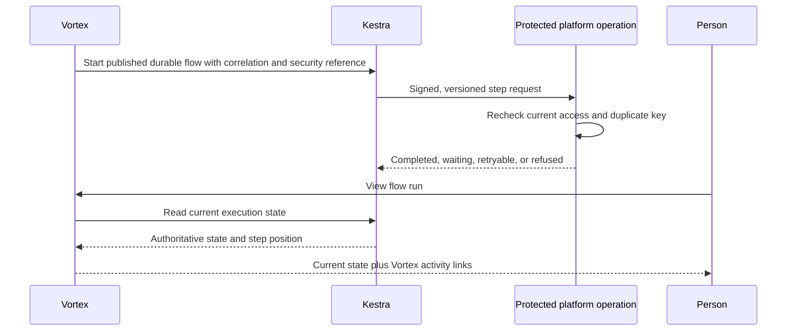
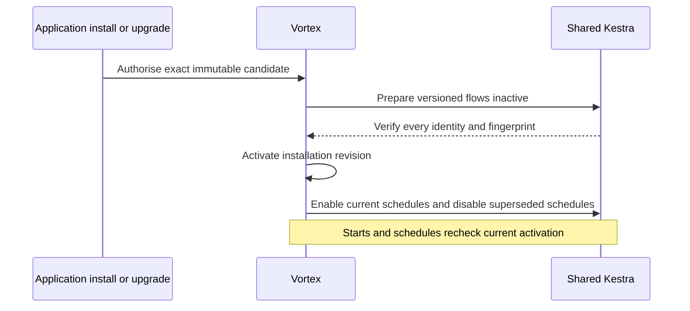
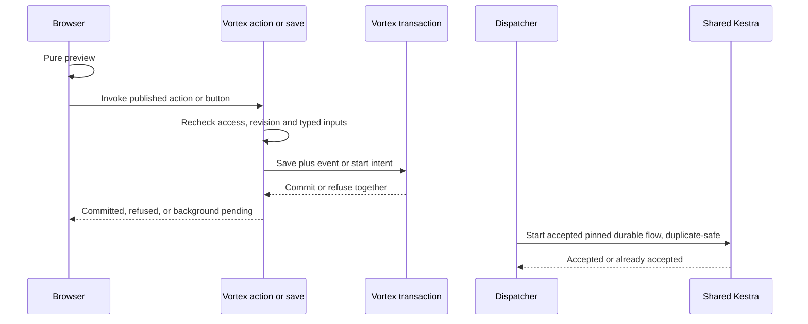
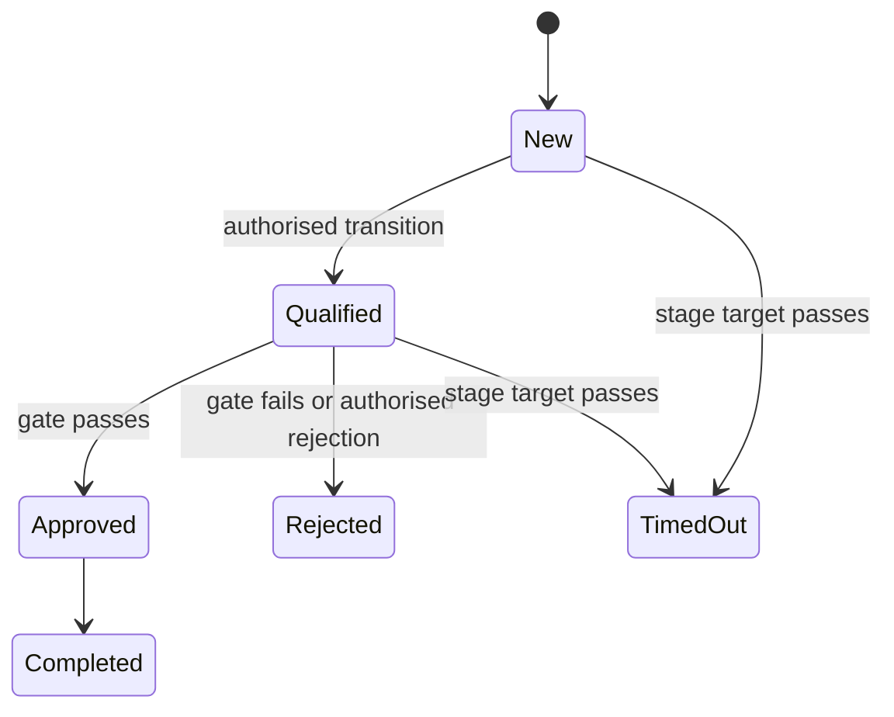

# 9. Workflows and process pipelines

> Product flow-engine specification. It does not authorize agents to operate Kestra, deploy, run hosted checks or require delivery receipts. The [current fleet policy](../build-plan/agent-coordination.md) governs development completion; historical operational statements below are not fleet instructions.

[Previous: Forms, actions, rules and events](08-forms-actions-rules-and-events.md) · [Specification index](README.md) · Next: [Queries, reports, search and live updates](10-queries-reports-search.md)

## Purpose and authority

A **workflow** is a **flow** whose execution kind is `durable` ([Decision 1](../build-plan/architecture-decisions-2026-09-25.md#decision-1--one-flow-definition-one-vortex-flow-engine-kestra-for-durable-work)); there is no separate workflow language, engine or catalogue. It runs on [Kestra](https://kestra.io/docs) and may wait, retry, contact another system, ask a person, or continue for months. A **process pipeline** describes the business stages through which a record moves; its transitions and entry and exit effects are tasks inside flows. Every flow uses the one [flow language](appendices/frontend-rule-designer.md#one-flow-language), the one task registry and the one validator.

[Kestra](https://kestra.io/docs) is authoritative for whether a durable flow run or task is queued, running, waiting, completed, cancelled, or failed. Vortex asks Kestra for the current state whenever a person views a run. Vortex may keep a clearly labelled last-known snapshot for correlation, search, activity, and outage diagnosis, but never presents that snapshot as current when Kestra is unavailable.

Vortex remains authoritative for identities, tenant and organisation context, permissions, definitions, records, files, human-input references, connections, and every application side effect. Kestra receives no organisation database credential and cannot grant access or write organisation tables directly.

One operated Kestra instance is shared by Development, Testing, and Production. Application-execution flows use environment-scoped namespaces; target-specific flow identities, webhook keys, Doppler configurations, credentials and operational approvals prevent them from silently changing authority. Reviewed delivery flows may remain in the shared `vortex.operations` namespace with fixed flow and target-environment authority. Cross-environment delivery receipts contain no credentials and confer no execution authority. This is not a claim of separate process isolation, and no separate instance or newly provisioned Development credential is required. Service operations and Production delivery remain subject to their separately authorised operational controls; completing development work grants neither authority nor an exemption from those controls. See [environment boundaries](18-delivery-and-testing.md#environments). A future version or state-database upgrade remains separately governed by [issue #198](https://github.com/Abzum-NZ/Abzum-Vortex/issues/198). The version upgrade does not block core durable flows unless a concrete compatibility, support, security or operational need arises, or it is scheduled as infrastructure maintenance.

## Ownership and versioning

Durable flows are contained in an [application version](03-composition-and-publication.md#definition-ownership-and-versions). Publishing an application produces the immutable flow definition and deterministic input from which its Kestra flow can be generated. Publication is inert: it neither registers a flow nor changes a live installation. An explicit application install or upgrade registers and activates the exact published application and flow versions used by new runs. A run remains pinned to the application and flow version from which it started unless an authorised, tested migration moves it.

### Installation registration and activation

One private Workflow Kestra adapter deploys every installed application's durable flows into the shared Kestra instance without redeploying the engine. The adapter accepts only an immutable candidate prepared from the exact published application release and its resolved dependencies. It never accepts browser-supplied YAML, namespaces, flow identifiers, credentials, or claims that registration succeeded.

The generated namespace and flow identity are scoped by permanent environment, organisation, installation, application, and flow identifiers plus exact revisions. Labels and mutable keys are diagnostic only and never select or authorise a flow. A schedule is registered disabled or otherwise unable to start application work while its candidate is being prepared.

Preparation registers every durable flow version and verifies its exact generated fingerprint before Vortex activates the installation revision. The activation is one Vortex transaction after external preparation; Vortex never claims that its database and Kestra share a transaction. An interactive start request and every scheduled wake-up must therefore verify that the exact installation revision is still current and active before Vortex durably accepts a new start. Once accepted, that intent is pinned to the exact application and flow revision like an in-flight run: a normal upgrade neither retargets nor drops it. Post-commit dispatch rechecks current permission and withdrawal state and verifies that the accepted exact revision remains retained; it does not require that revision to remain the installation's current pointer. A prepared but unactivated flow cannot pass initial acceptance.

Registration is duplicate-safe. Repeating the same installation, flow version, and fingerprint converges on the same prepared flow; the same identity with different content is refused. A failed first registration leaves the installation not ready. A failed upgrade leaves the existing active revision unchanged. Only after every new flow is verified does Vortex switch the active revision, so partial external registration cannot create a partly upgraded live application.

After activation, an idempotent reconciliation enables the current revision's prepared schedules and disables superseded schedules. Failed or interrupted synchronisation remains visible and retryable; it cannot leave an enabled old schedule authorised to start new work, because Vortex still checks the active revision. Vortex distinguishes an active installation from pending schedule synchronisation and does not claim that a schedule is running until its enablement is verified.

Older flow versions and their private mappings remain available for accepted starts and runs already in flight. Explicit rollback activates a previously verified exact application revision through the same checks; it does not mutate history. Uninstalling or withdrawing the installation first blocks new acceptance in Vortex, including scheduled starts. An accepted start that has not begun execution is explicitly refused or cancelled with a retained status rather than discarded; an already running execution follows the published cancellation policy. Execution, mapping, intent, and activity history remain available to explain each outcome. Later external deactivation and retention cleanup are reconciled operations, not the authority for whether a new start may be accepted.

The public Vortex execution reference stores the Vortex run identifier, flow and application versions, tenant and organisation references, trigger, start actor, duplicate-protection key, human-input links, safe activity links, and a non-authoritative last-known state snapshot. The Workflow Kestra adapter privately maps that run to Kestra's execution identifier and namespace; provider-specific fields are not part of the core application contract. Kestra stores the executable state, current step, retries, waits, and final execution outcome.

## Triggers

A flow's `triggers[]` holds only its automatic starts. There are exactly four, and they use the same trigger contract in every execution kind:

| Trigger | Starts | Execution kind |
| --- | --- | --- |
| `BeforeSave` | Inside the save transaction of a named record type, before commit, for every writer | `transaction` |
| `Event` | After a committed record change: one of the seven standard [events](08-forms-actions-rules-and-events.md#events) or a declared business event | `background`; work that waits is handed to a durable flow through a Run background flow task |
| `Schedule` | At a closed recurrence value owned by the flow | `durable` |
| `IncomingMessage` | On a verified incoming [connection](12-connections-and-interfaces.md) message | `background`, or `durable` when the work waits |

Every other start is a **binding**, not a trigger: a component placement, navigation item, form commit, interface operation, agent tool or parent flow holds the exact flow id plus a typed input map. Pages never hold flow logic of their own.

A **frontend flow** is a flow a person or agent starts through a binding (`interactive`, or `transaction` for a named action); a **backend flow** is a flow started automatically (`background` or `durable`). There is one start path ([#979](https://github.com/Abzum-NZ/Abzum-Vortex/issues/979)):

1. Every button, menu command, record gesture, agent tool call and interface operation starts a frontend flow through its binding. A form, interface action or agent tool binds a flow entry point — a generated one-task flow by default — and never binds a lower-level operation directly.
2. A frontend flow starts a backend flow only through a **Run background flow** task with declared typed inputs, whether or not a record is involved, and the exact start intent is committed before dispatch. A `transaction` flow runs inside a record save and cannot contain a `Run background flow` task.
3. Backend flows are otherwise started only by a committed record `Event`, a `Schedule` or a verified `IncomingMessage`, and may call one another only with typed inputs and outputs through a **Run flow** or **Run background flow** task.

A flow a person or agent starts is an **action**; a lower-level protected change such as apply record changes is an **operation**, not an action.

Each trigger declares its typed inputs, a nullable entry condition and its duplicate-protection rule. Publication matches every declared input to its exact owning contract and refuses missing, extra or invented inputs. An `Event` trigger names both the event and its record type; publication proves that the event exists, belongs to that record type, and carries every declared record-field input the flow reads. A `Schedule` trigger owns a closed recurrence value: cadence (`hourly`, `daily`, `weekly`, or `monthly`), positive interval, time zone, minute, and only the hour, weekday, or month-day values required by that cadence; it never names an unverified external schedule. An `IncomingMessage` trigger uses its connection's named trigger mapping and input shape. A condition may reference only fields on the actual event or binding subject record. Any compiled trigger index is derived from the published flows, never a second independently editable list.

The [Frontend Rule Designer](appendices/frontend-rule-designer.md) authors triggers, bindings and tasks in the same designer for every execution kind. A planned Show form task may collect private draft answers between configured protected operations; [#68](https://github.com/Abzum-NZ/Abzum-Vortex/issues/68) and [#250](https://github.com/Abzum-NZ/Abzum-Vortex/issues/250) own that private draft and binding runtime. A durable flow instead uses the durable **Wait for a person** task (see [Asking a person](#asking-a-person)), which parks a Kestra execution after work has been accepted. Both reuse the Page Designer form renderer. Neither keeps a database transaction open while awaiting a person. Each protected task in an interactive flow uses one short owning-service transaction, so earlier committed tasks remain committed when a later task fails.

Flow inputs map explicitly to declared trigger inputs through the versioned binding extension in [#250](https://github.com/Abzum-NZ/Abzum-Vortex/issues/250), completed by [#76](https://github.com/Abzum-NZ/Abzum-Vortex/issues/76), [#77](https://github.com/Abzum-NZ/Abzum-Vortex/issues/77) and [#78](https://github.com/Abzum-NZ/Abzum-Vortex/issues/78). This is a validated snapshot, never a shared mutable environment or a wholesale browser-variable payload. No unrelated interface or child-flow payload is silently widened.

### Interactive and save hand-off

A browser may use the shared pure evaluator for immediate flow feedback, but preview has no authority and creates no flow run. On execution, Vortex reloads the current active installation and the exact published trigger or binding, checks the caller's current permission and subject revision, validates only the declared typed inputs, and persists the durable start fact before acknowledging it. The browser cannot name an arbitrary flow, submit Kestra YAML, or hold flow-engine credentials.

For a record save, its changes and durable event or flow-start intent commit together. A rejected or rolled-back save never starts a flow. An authorised binding that changes no record still persists its start intent in its own Vortex transaction; dispatch occurs only after that commit. Supporting a record-free start is part of the one start path specified in [#979](https://github.com/Abzum-NZ/Abzum-Vortex/issues/979), with the declared trigger and typed inputs of the starting flow.

Post-commit dispatch scopes the hand-off duplicate key to the source event or start-intent identity together with the exact accepted installation revision, flow, and trigger. One event may legitimately start multiple different flows; each has its own duplicate-safe acceptance. Repeating that same acceptance returns the existing Vortex run mapping instead of creating another Kestra execution. Dispatch validates the retained accepted revision and rechecks current permission and withdrawal without following a newer installation pointer; a normal upgrade therefore cannot retarget or strand committed work. Withdrawal explicitly refuses or cancels an accepted start that has not begun and retains that outcome. If Kestra is unavailable, the committed intent remains pending and recoverable; the application does not report a committed record save as failed or discard the request.

## Task types in the shared registry

A durable flow uses the same task types as every other flow. There is no second frontend, background or workflow catalogue: every task type is registered once in the one task registry ([`flow-task-registry.ts`](../../contracts/src/flow-task-registry.ts), [#983](https://github.com/Abzum-NZ/Abzum-Vortex/issues/983)) with its version, its typed properties, outputs and outcomes, its default policy, how it compiles for Kestra, and:

- its run locations: **browser**; **server**, a protected operation in its own short transaction; **transaction**, only inside the owning record save; **durable**, on Kestra;
- its effect class: **pure**, **read**, **change**, **background start** or **interface**.

Publication refuses a flow that puts a task where it cannot run. Work moves between execution kinds only through an explicit **Run flow** task, which invokes another flow with its own declared execution kind, or a **Run background flow** task, which commits a start intent for a durable flow; a transaction flow may Run flow only another transaction flow. The registry, control tasks and full task table are specified in the [Frontend Rule Designer](appendices/frontend-rule-designer.md#task-catalogue-and-extensibility); the [mapping in 08](08-forms-actions-rules-and-events.md#one-flow-language-mapping) maps every replaced node, effect and target kind to exactly one task type or to a structural part of the flow.

Control tasks give the ordered task list its structure:

- **If**, **Switch**, **For each**, **Sequential**, **Run flow** and **Stop** run in any execution kind.
- **Parallel**, **Wait until** and **Wait for a person** are durable-only.

The registered task types cover the governed operations:

| Task group | Registered task types | Run locations | Effect class |
| --- | --- | --- | --- |
| Record | Save record, Create record, Link records, Delete record, Restore record and Apply record changes | Server and durable | Change |
| Record | Set fields | Server, durable and transaction (the record being saved only) | Change |
| Query | Query records | Server, durable and transaction (under the saver's authority) | Read |
| Data | Calculate, Set values, Set variable and Format value | Browser, server, transaction and durable | Pure |
| Save rules | Require field, Warn and Refuse save | Browser (feedback only) and transaction | Pure |
| Interface | Show message, Show form, Confirm, Navigate, Refresh, Open or close panel and Set filter | Browser | Interface |
| Background start | Run background flow | Server and durable | Background start |
| Events | Announce event | Server, durable and transaction (the record being saved only) | Change |
| Connections and files | Acknowledge message and Export to file | Server and durable | Change |
| Connections | Call connection | Durable | Change |
| Protected operation | Call protected operation, whose operation descriptor declares its own effect | Server and durable | Change, as declared by the called operation |

Every record task calls one protected operation, **apply record changes**: `record.save`, `record.create`, `record.setFields`, `record.link`, `record.delete`, `record.restore` and `record.changes`. One call is one transaction that enforces the access decision for each touched record, field permissions, pipeline transitions and gates, action-only fields, revision checks, `BeforeSave` flows, and read-time and stored computed values. A flow cannot split or bypass this operation: record changes that must succeed or fail together are one `record.changes` task.

Values passed between tasks are explicit. A value is a literal, a declared trigger value, a named output of a named earlier task, the current record, the current actor, or the current time. Publication resolves readable task and field keys to permanent identifiers, rejects values outside the trigger contract, rejects missing or incompatible outputs, and rejects a reference to a task that cannot precede the consumer. A plain JSON object is a literal and is never interpreted as a hidden task reference.

Output types cover text and formatted text, numbers and money, Boolean, dates, choices, JSON, record or record-list references, organisation-account references, child-run references, relationship or relationship-list references, and file references. Record-producing tasks also declare how their target is derived: the task's configured record type, its query, or its input record. Publication propagates that target through create, change, duplicate, bounded-loop and query tasks, set-values tasks, trigger inputs and form-response outputs. Assigning a value to a link field checks the link's exact allowed record targets as well as the general record-reference type. File tasks accept only a file reference and only an attachment field on the selected record.

**Wait until** resumes at one declared time or date-time value: a field of the triggering record, a typed flow input or a typed output of an earlier task. A flow with no such declared value cannot use **Wait until**; no record is guessed.

A **Run flow** task invokes another flow, which keeps its own declared execution kind, with a typed input map and typed outputs; a **Run background flow** task commits the start of a durable flow with a typed input map. The parent's task is the binding: it names the exact child flow, and publication checks its input map against the child's declared inputs, refuses cycles between flows and enforces the Run flow depth limit. A child never inherits undeclared context, and no payload is widened by convention.

Authored definitions may omit repetitive execution policy. The versioned source contract then supplies the documented conservative defaults before publication: a five-minute timeout, three exponential retry attempts from one to thirty seconds, the task type as its activity key, and no payload in activity. Tasks that create or change records, relationships, files, external calls, child runs or human-input requests default to required duplicate protection; read, wait, branch, format and stop tasks default to not applicable. Canonical published tasks always contain the resolved policy explicitly, and publication refuses a policy that is unsafe for the task type.

The registry excludes arbitrary SQL, JavaScript, shell commands, database credentials, unrestricted expressions, arbitrary network addresses, unrestricted file-system operations, and vendor-specific direct table manipulation. New task types require a platform release, security review, contracts, tests, and documentation; builders cannot upload executable code.

## Limits and safeguards

- A durable flow holds at most 100 tasks including nested tasks, nested no deeper than five levels.
- One interactive or background run has at most 100 **For each** items, at most 25 protected operations, at most 10 seconds of server time and a **Run flow** depth of at most 3.
- A durable flow's **For each** task handles at most 1,000 items in one run and uses stable pagination.
- One durable wait lasts at most 90 days; a longer process renews the wait or uses a **Schedule** trigger.
- Every external side effect has a stable duplicate-protection key.
- Retries use bounded delay and a task-specific maximum attempt count.
- Cancelling stops future work but does not pretend that completed external effects were undone.
- Compensation is a separate, explicit path.
- Access is checked when the flow starts and again immediately before every protected read or side effect. Removing access therefore affects the next protected task request.
- A recipient flow cannot select, persist, export, or send live records shared from another organisation. A grant-approved action executes synchronously at the source.

## Protected operation contract

Each Kestra request carries the execution, task, attempt, tenant, organisation, application and flow versions, named operation, typed input, issue and expiry times, and duplicate-protection key in a signed envelope. Vortex verifies the caller, current account or system authority, access version, definition version, and operation before acting.

Vortex records an application side effect and its duplicate key before acknowledging it. Repeating the same request returns the existing result without applying the side effect again. The response is completed, already completed, waiting, retryable failure, or permanent refusal. Kestra uses that response to advance its authoritative execution state.

## Asking a person

The durable **Wait for a person** task pauses for one published form response with assignee rules, due time and timeout path. Only an authorised responder can submit it. Kestra waits for the protected completion signal and remains authoritative for the overall run state.

An application that needs a task list or approval queue defines ordinary task, request and decision record types and the pages that display them. Those records can trigger or complete the generic human-input step, but they cannot grant permissions or activate cross-organisation sharing. Grant activation uses the protected [grant-consent boundary](04-access-and-permissions.md#protected-grant-consent).

The [IAM application](appendices/iam-application.md) uses this same human-input mechanism for role requests and approval history. Its durable flow may apply an approved role change only through a verified published protected-operation binding and current Access checks. A mutable request status is never authority; changing a proposal invalidates earlier approval, and losing approver authority before application refuses the grant. IAM introduces no special flow task or separate approval engine.

## Process pipelines

A pipeline belongs to an application and one record type. Each stage has a stable key, a user-facing label, and explicit entry and exit action and flow lists. Each transition names source and target stages, an optional permission and action, and an optional typed gate. A time target names its stage, date-time field, and escalation event. Publication resolves every reference and refuses duplicate or missing stages.

The record's current stage is Vortex business data. Stage movement is a named [action](08-forms-actions-rules-and-events.md) checked inside the record transaction. Immediate entry and exit effects occur in that transaction; durable work starts only after commit. Kestra is authoritative for any durable flow started by the transition or time target.

## Failure and display behaviour

- If Kestra is unavailable, Vortex shows “flow status temporarily unavailable,” the last successful refresh time, and any safe local activity. It does not infer completion.
- A permanent refusal stops that path with a stable reason; it never broadens permissions to finish the run.
- Operators can correlate one Kestra execution with Vortex activity and side effects without treating the duplicate local snapshot as authority.
- Reconciliation reports missing executions, mismatched identifiers, and callbacks with no matching published definition; it does not silently rewrite business data.

## Acceptance examples

- Publishing an application registers no Kestra flow. Installation prepares and verifies its complete exact durable flow set without an engine redeploy before Vortex activates the installation.
- Repeating registration converges on the same flows; a failed first install is not ready, and a failed upgrade leaves the current installation unchanged.
- A start accepted before a normal upgrade remains pinned to its accepted revision. Withdrawal blocks new acceptance and records an explicit refusal or cancellation for accepted work that has not begun, without erasing intent or execution history.
- Preview, refusal, or rollback starts nothing; a committed save or no-change authorised binding retains one duplicate-safe start even while Kestra is unavailable.
- Repeated delivery performs a Vortex transactional change once through its effect receipt. External calls use provider idempotency when supported; an uncertain non-idempotent outcome requires reconciliation before another attempt.
- Removing a role before the next task runs causes that protected operation to be refused.
- A flow cannot call an unapproved connection, arbitrary address, SQL statement, or uploaded script.
- A run started under one application version remains explainable after a newer version is published.
- Vortex displays Kestra's current completed, waiting, cancelled, or failed state and labels status unavailable during a Kestra outage.
- Moving a pipeline stage without its transition permission or gate is refused even if a flow tries to request it.

## External outcome uncertainty

A local duplicate key cannot prove that an external provider did not act before a timeout. Use provider-supported idempotency keys where available. Otherwise record an unknown outcome and reconcile or obtain an explicit authorised resolution before retrying a possibly completed side effect. Never promise exactly-once third-party execution from a local receipt alone. [Connection execution #100](https://github.com/Abzum-NZ/Abzum-Vortex/issues/100) tests both cases.
