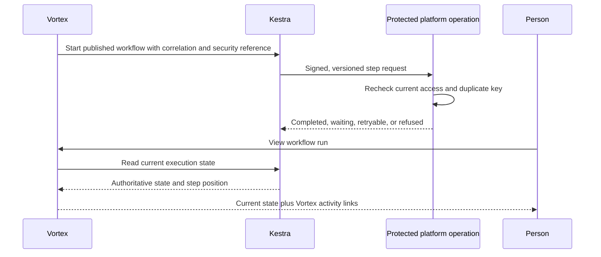
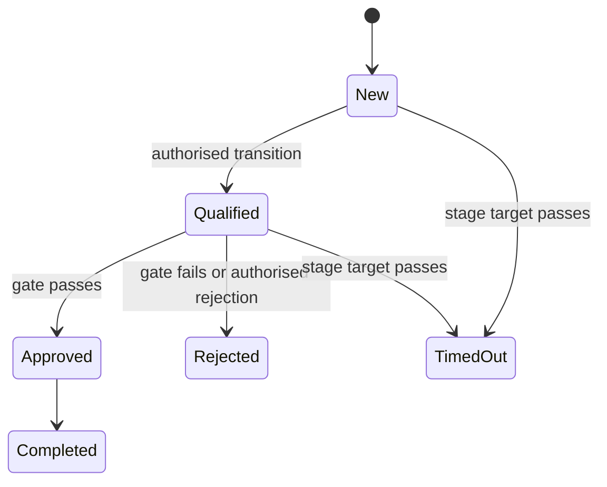

# 9. Workflows and process pipelines

[Previous: Forms, actions, rules and events](08-forms-actions-rules-and-events.md) · [Specification index](README.md) · Next: [Queries, reports, search and live updates](10-queries-reports-search.md)

## Purpose and authority

A **workflow** performs durable background work that may branch, wait, retry, contact another system, ask a person, or continue for months. A **process pipeline** describes the business stages through which a record moves.

[Kestra](https://kestra.io/docs) is authoritative for whether a workflow run or step is queued, running, waiting, completed, cancelled, or failed. Vortex asks Kestra for the current state whenever a person views a run. Vortex may keep a clearly labelled last-known snapshot for correlation, search, activity, and outage diagnosis, but never presents that snapshot as current when Kestra is unavailable.

Vortex remains authoritative for identities, tenant and organisation context, permissions, definitions, records, files, human-task records, connections, and every business side effect. Kestra receives no organisation database credential and cannot grant access or write organisation tables directly.

## Ownership and versioning

Workflows are contained in an [application version](03-composition-and-publication.md#definition-ownership-and-versions). Publishing an application produces the immutable workflow definition and generated Kestra flow used by new runs. A run remains pinned to the application and workflow version from which it started unless an authorised, tested migration moves it.

Vortex stores the Kestra execution identifier, workflow and application versions, tenant and organisation references, trigger, start actor, duplicate-protection key, human-task links, safe activity links, and a non-authoritative last-known state snapshot. Kestra stores the executable state, current step, retries, waits, and final execution outcome.

## Triggers

A workflow may start from a committed [event](08-forms-actions-rules-and-events.md), published schedule, verified incoming [connection](12-connections-and-interfaces.md) message, authorised button, versioned interface operation, or another workflow. Every trigger declares typed inputs, a condition, duplicate-protection rule, and the person or system authority whose permissions apply.

## Safe workflow node catalogue

The initial catalogue draws on the attached legacy workflow inventory while replacing product-specific and unsafe nodes with small, governed operations:

| Group | Supported nodes |
|---|---|
| Flow | Start, condition, multi-way decision table, bounded loop, delay or wait-until, start child workflow, stop with reason |
| Records | Create record, change approved fields, run named action, soft-delete record, duplicate record, convert through a named mapping, add or copy approved relationships, add comment, change tags |
| People | Request values through a form, request approval, create task or calendar event, send in-app notification, send email through an approved connection |
| Data | Run a published query, set typed values, apply a registered formatter or regular expression, generate a bounded export |
| Files and documents | Attach or move an approved file, generate a document from a registered template, request a source-owned export |
| Connections | Call a named connection operation, send to an approved calendar or communication service, receive and acknowledge a verified message |

Each node has a typed input and output contract, named permission, timeout, retry rule, duplicate-protection rule, activity meaning, and redaction policy. Product-specific behaviour such as reversing an invoice is implemented as a named application action, not a privileged workflow node.

The initial catalogue excludes arbitrary SQL, JavaScript, shell commands, database credentials, unrestricted expressions, arbitrary network addresses, unrestricted file-system operations, and vendor-specific direct table manipulation. New node kinds require a platform release, security review, contracts, tests, and documentation; builders cannot upload executable code.

## Limits and safeguards

- A workflow contains at most 100 nodes across a nesting depth of five.
- A loop handles at most 1,000 records in one run and uses stable pagination.
- One wait lasts at most 90 days; a longer process renews the wait or uses a schedule.
- Every external side effect has a stable duplicate-protection key.
- Retries use bounded delay and a step-specific maximum attempt count.
- Cancelling stops future work but does not pretend that completed external effects were undone.
- Compensation is a separate, explicit path.
- Access is checked when the run starts and again immediately before every protected read or side effect. Removing access therefore affects the next step request.
- A recipient workflow cannot select, persist, export, or send live records shared from another organisation. A grant-approved action executes synchronously at the source.

## Protected operation contract

Each Kestra request carries the execution, node, attempt, tenant, organisation, application and workflow versions, named operation, typed input, issue and expiry times, and duplicate-protection key in a signed envelope. Vortex verifies the caller, current account or system authority, access version, definition version, and operation before acting.

Vortex records a business side effect and its duplicate key before acknowledging it. Repeating the same request returns the existing result without applying the side effect again. The response is completed, already completed, waiting, retryable failure, or permanent refusal. Kestra uses that response to advance its authoritative execution state.

## Asking a person

An ask or approval node creates one Vortex task with assignee rules, form, due time, and timeout path. Only an authorised assignee can complete it. Kestra waits for the protected completion signal and remains authoritative for the overall run state.

An ordinary workflow approval cannot grant permissions or activate cross-organisation sharing. The platform-owned `vortex.approvals` capability may use the same task experience, but the owning service verifies immutable decisions over the exact payload before performing the protected action.

## Process pipelines

A pipeline belongs to an application and one record type. It defines ordered stages, named transitions, transition permissions, gates, entry and exit work, optional time targets, and escalation events.

The record's current stage is Vortex business data. Stage movement is a named [action](08-forms-actions-rules-and-events.md) checked inside the record transaction. Immediate entry and exit effects occur in that transaction; durable work starts only after commit. Kestra is authoritative for any workflow launched by the transition or time target.

## Failure and display behaviour

- If Kestra is unavailable, Vortex shows “workflow status temporarily unavailable,” the last successful refresh time, and any safe local activity. It does not infer completion.
- A permanent refusal stops that path with a stable reason; it never broadens permissions to finish the run.
- Operators can correlate one Kestra execution with Vortex activity and side effects without treating the duplicate local snapshot as authority.
- Reconciliation reports missing executions, mismatched identifiers, and callbacks with no matching published definition; it does not silently rewrite business data.

## Acceptance examples

- Repeated delivery of a node request performs a record change or external side effect once.
- Removing a role before the next node runs causes that protected operation to be refused.
- A workflow cannot call an unapproved connection, arbitrary address, SQL statement, or uploaded script.
- A run started under one application version remains explainable after a newer version is published.
- Vortex displays Kestra's current completed, waiting, cancelled, or failed state and labels status unavailable during a Kestra outage.
- Moving a pipeline stage without its transition permission or gate is refused even if a workflow tries to request it.
