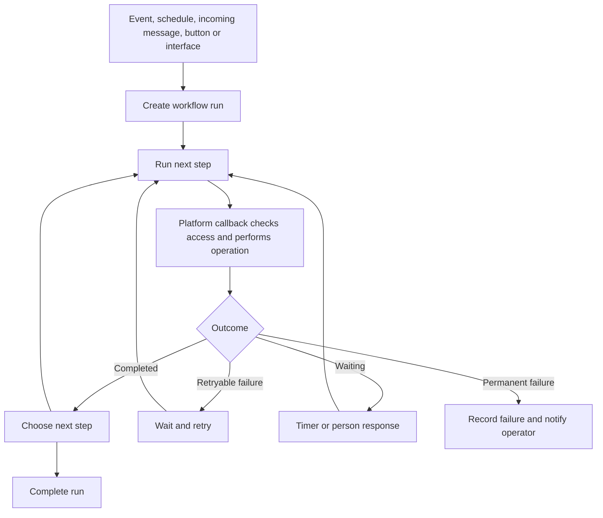
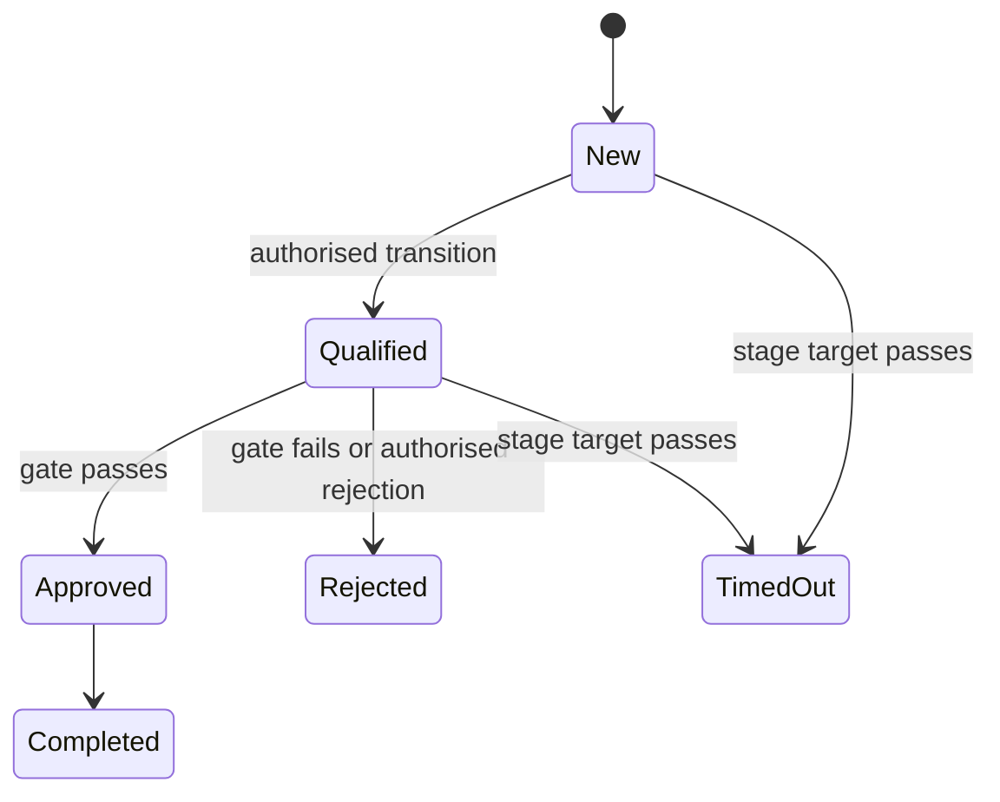

# 9. Workflows and process pipelines

[Previous: Forms, actions, rules and events](08-forms-actions-rules-and-events.md) · [Specification index](README.md) · Next: [Queries, reports, search and live updates](10-queries-reports-search.md)

## Workflow purpose

A **workflow** performs background work that may wait, retry, contact another system, ask a person, or continue for months. A **process pipeline** describes the business stages through which a record moves.

## Workflow ownership and execution

Workflows are contained by an [application definition](03-composition-and-publication.md#definition-ownership). [Kestra](https://kestra.io/docs) executes the durable step plan, while [Abzum Vortex](https://github.com/Abzum-NZ/Abzum-Vortex) remains the authority for organisation data, permissions, definitions, step results, and business activity.

[Kestra](https://kestra.io/docs) does not receive organisation database credentials. Every step calls a private, versioned platform operation. The platform verifies the callback, organisation, workflow run, step, attempt, definition version, permission grant, and duplicate-protection key before doing work.

The final state-authority choice is recorded in [Decision D12](appendices/decisions.md#d12-workflow-state-authority).

## Workflow triggers

A workflow may start from:

- A committed [event](08-forms-actions-rules-and-events.md).
- A published schedule.
- A verified incoming message from a [connection](12-connections-and-interfaces.md).
- A person pressing an authorised button.
- A versioned operation on an [interface](12-connections-and-interfaces.md).
- Another workflow.

Each trigger declares its inputs, condition, duplicate-protection rule, and the identity whose permissions apply.

## Workflow steps

The base step kinds are:

1. Create a record.
2. Change a record.
3. Run an action.
4. Wait until a duration or date.
5. Ask a person through a form or approval.
6. Send a notification.
7. Send email through an organisation connection.
8. Call a named connection operation.
9. Choose one of two branches.
10. Repeat steps for a bounded query of records.
11. Start another workflow without waiting for it.
12. Stop with a recorded reason.
13. Request a model-assisted result under [assistant policy](13-assistant.md).

The thirteenth step resolves the earlier build-plan/specification mismatch. Its inclusion and safety choices remain [Decision D13](appendices/decisions.md#d13-model-assisted-workflow-step).

## Limits and safeguards

- A workflow contains at most 100 steps across a nesting depth of five.
- A repeating step handles at most 1,000 records in one run and uses pagination.
- One wait lasts at most 90 days; a longer process continues through a renewed wait or schedule.
- Every external side effect has a stable duplicate-protection key.
- Retries use bounded exponential delay and a maximum attempt count declared by step type.
- Cancelling a run stops future steps but does not pretend completed external effects were undone.
- A compensation path is explicit where the business needs one.
- A workflow is pinned to the published application version from which the run began unless an authorised migration moves it.
- Run history is retained for six months by default, subject to [privacy and retention](14-activity-privacy-and-retention.md).

## Callback contract

Each callback includes the run, step, attempt, organisation, definition version, operation, inputs, issued time, expiry, and duplicate-protection key. It is authenticated with a short-lived signed credential. Responses distinguish completed, already completed, retryable failure, permanent refusal, and waiting.

The platform records the accepted step outcome before acknowledging it. Repeating an identical callback returns the stored outcome without repeating the side effect.

## Asking a person

An ask step creates one task with assignee rules, form, due time, and timeout path. Only an authorised assignee can complete it. Reassignment, completion, expiry, and cancellation appear in [activity history](14-activity-privacy-and-retention.md).

An ordinary builder-created approval step cannot grant permissions or activate a cross-organisation sharing grant. The platform-owned `vortex.approvals` capability may use the same task experience, but the owning service verifies the immutable approval decisions and exact payload before performing a protected action under the [approval contract](appendices/data-contracts.md#approval-request-contract).

Builder-created workflows cannot select, store, change, export, or send live shared records in the first release. An action explicitly allowed by a sharing grant runs synchronously in the source organisation; any source-owned event or later workflow also remains in that source organisation. This prevents a recipient workflow from becoming an undeclared copy or re-sharing path.

## Process pipelines

A pipeline belongs to an application and one record type. It defines ordered stages, allowed transitions, stage-entry and stage-exit work, optional time targets, and escalation events.

- Stage movement is a named [action](08-forms-actions-rules-and-events.md), including movement from a board page.
- A gate is checked inside the save and can refuse the transition.
- Entry and exit actions occur within the transition save when immediate; workflows start only after commit.
- A stage-time target announces an event once for that stage entry. An escalation workflow subscribes to it.
- The page displays current stage and allowed transitions, but the server remains authoritative.

## Acceptance examples

- Repeated delivery of a workflow callback performs an external side effect once.
- A workflow cannot use a connection the application or organisation has not granted.
- A run started under one published application version remains explainable after a newer version is published.
- Moving a pipeline stage without its transition permission or gate is refused.
- Platform and [Kestra](https://kestra.io/docs) histories can be reconciled by run, step, and attempt identifiers.
