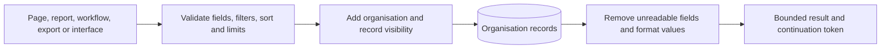
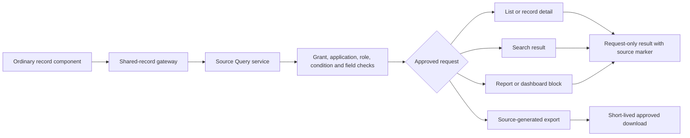
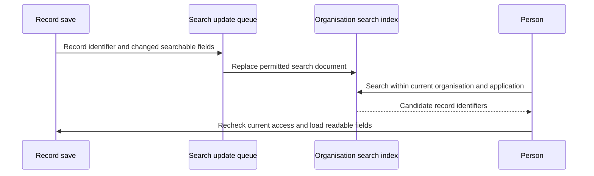
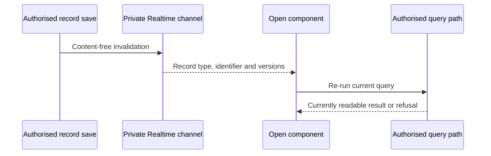

# 10. Queries, reports, search and live updates

[Previous: Workflows and process pipelines](09-workflows-and-pipelines.md) · [Specification index](README.md) · Next: [Files and attachments](11-files-and-attachments.md)

## One read path

Lists, dashboards, reports, workflow selections, exports, programmable interfaces, and search all use validated read contracts and [access](04-access-and-permissions.md). None may bypass record visibility or field permissions.

## Query contract

A query names:

- One record type.
- Fields to return.
- A typed filter tree.
- Optional grouping and totals.
- A stable ordered sort.
- A bounded page size and continuation token.
- At most two declared relationship hops.
- The application and published definition version where relevant.

Every selected, filtered, grouped, totalled, or sorted field must permit that operation in its [field definition](05-modules-fields-and-relationships.md). An invalid or unsafe filter refuses the entire query. The platform never removes an invalid condition and runs a broader query.

## Pagination and limits

- Results use stable continuation tokens rather than unbounded offsets for large datasets.
- A stable unique tie-breaker is appended to every sort.
- Page-size limits depend on the calling surface and are listed in the [data contracts](appendices/data-contracts.md#query-limits).
- Counts and totals use the same access scope and filters as the rows.
- Exports and workflow loops page through the same query contract rather than requesting an unlimited result.

## Saved views

A saved view records the query, visible columns, arrangement, grouping, sort, and display choices. A personal view is visible only to its owner. A shared view belongs to an application and requires a permission to publish or change.

The term **saved view** replaces the outdated terms “prepared list,” “prepared query,” and “prepared view.”

## Arrangements and reports

- A table presents rows and columns.
- A board groups records by a filterable choice field with no more than twelve options.
- A calendar uses the page's explicit start/end or start-plus-duration mapping from [modules and fields](05-modules-fields-and-relationships.md#field-types).
- A summary groups and totals compatible fields.
- A dashboard composes several bounded query blocks.

Every chart or report states its measure, grouping, filter, time zone, and treatment of missing values. A money total is refused unless the filtered group contains at most one currency; no implicit conversion or split result is produced.

## Shared-record reads

A shared-record query uses the same validated query contract whether the source is local or in another cluster. It names the source cluster, source organisation, grant, recipient application, and requested surface. Every returned row retains its source identities and displays a plain source-organisation marker. A query cannot join, group, or total source-owned records with recipient-owned records as though they had one owner, and one query cannot join records from several source clusters.

For a cross-cluster read, the complete filter, sort, field projection, page size, and continuation token are sent once to the source through the [federation query contract](appendices/data-contracts.md#federated-query-and-action). The source validates and executes the query, applies the grant and database row restrictions, and returns only the approved fields. The recipient never fetches a broad remote set and filters it locally, and it never makes one remote call per returned record.

The recipient uses the ordinary list, record-detail, search-result, report, and export components for shared records, so supported work behaves consistently with recipient-owned records. The component obtains an operation-capability description with the result and shows only the fields and actions permitted by the complete grant. Source ownership, temporary unavailability, and any measured remote delay remain visible rather than being disguised as local ownership.

Application search may include a **Shared** result group. The search coordinator asks only the bounded set of active grants known from non-content grant mirrors, runs each search at its source, and merges only the returned approved projections for the current response. Shared content is never written into the recipient search index. An unavailable source produces an unavailable source group; it does not make the whole local search fail or return stale results.

A saved report or dashboard block may use one source organisation, record type, and grant. Its definition may be stored by the recipient because it contains identifiers, fields, filters, grouping, and presentation settings rather than source record values. Rows, counts, groups, and totals are calculated by the source on each run and are not materialised in recipient storage. A report cannot mix source-owned and recipient-owned values or combine several source organisations into one total.

Approved export uses the same source-executed query and field projection. It is described in [record export](16-copying-sharing-import-export.md#record-export). Workflows, connection messages, bulk changes, cross-source relationships, and offline use of live shared records remain outside the first release.

Shared queries bypass the cross-request business-data cache under [runtime and caching](17-runtime-storage-and-caching.md#grant-cache-invalidation). Pagination, counts, and fields are calculated in the source cluster using one independently sufficient active grant; a query cannot combine scope from one grant with fields or actions from another. A source or network outage fails closed and shows that the source organisation is temporarily unavailable; the recipient does not display an older persisted result.

## Search

Search keeps a separate organisation-scoped index built only from fields marked searchable.

- Sensitive fields are never copied into the search index.
- Personal fields are indexed only if explicitly marked searchable and permitted by the organisation privacy policy.
- Results are scoped by organisation, application discoverability, record visibility, and field access.
- A recipient organisation's index never receives another organisation's shared record content. Shared search is executed by the source and merged only into the current response.
- Candidate results are rechecked against current access before display.
- Access removal affects the next search request because results are access-checked at read time. Ordinary record creates and changes appear in search within 10 seconds under normal operation. A delayed index shows a freshness warning and triggers recovery; it never bypasses the current access check.
- Search priority `first`, `normal`, and `last` affects ranking without overriding access.

## Live updates

Live updates use [private Supabase Realtime Broadcast channels](https://supabase.com/docs/guides/realtime/authorization) to tell an open page that relevant data may have changed. They carry organisation, application, record type, record identifier, change kind, data version, and sequence—not private field values. Channel access is protected by row rules on `realtime.messages` and is recalculated when the connection or identity token changes.

The client treats every message as an invalidation only: it re-runs a permitted query or reloads the permitted record through the ordinary server path. Subscription channels are organisation-scoped and narrowly split by application and surface so a connection does not subscribe to an organisation-wide firehose. A shared-record screen may receive a content-free invalidation tied to an active grant, then re-run its authorised source query. A live message never carries source record values, acts as evidence of access, or makes an unreadable record visible.

Business-record changes use Broadcast rather than exposing direct table-change subscriptions to browsers. This keeps payloads deliberate and permits the same content-free message for derived changes, source-owned shared records, and access-version changes. Complicated business access remains in the normal server and database read path rather than in the channel policy.

## Acceptance examples

- An unfilterable address field causes a clear query refusal; the condition is not dropped.
- Search cannot return a record that a direct read would refuse.
- Count, chart, export, and list results agree for the same access scope and filter.
- Pagination neither duplicates nor skips records when several records share the visible sort value.
- Removing access prevents live updates and makes subsequent refreshes refuse the record.
- A captured live message contains no field value and cannot be used to fetch data after access is removed.
- Shared records can use ordinary list, detail, search-result, report, dashboard-block, and approved-export components while retaining a visible source marker and source-authoritative checks.
- Shared search, report, and dashboard results leave no recipient search document, materialised report result, or cross-request business-data cache entry.
- Shared records do not enter workflow selections, connection messages, bulk changes, cross-source relationships, or offline storage in the first release.
- Same-cluster and cross-cluster shared lists return the same fields and refusal meanings for the same grant; only measured latency and source-availability states may differ.

## Page context and derived-value safety

Use [explicit typed binding contexts](appendices/page-builder-contracts.md#data-context-and-related-records) for the page subject, related panels and row items. A valid employee-to-department example does not require every query on the page to target Employees. This is ordinary related-record querying, not permission to join different shared sources.

Evaluate access before grouping, aggregation, counts and pagination. A cached or stored derived result must not expose inputs the reader cannot access. Caller-filtered totals are computed for that caller, not stored as one universal business value. Invalid predicates refuse the affected query rather than being silently dropped.
