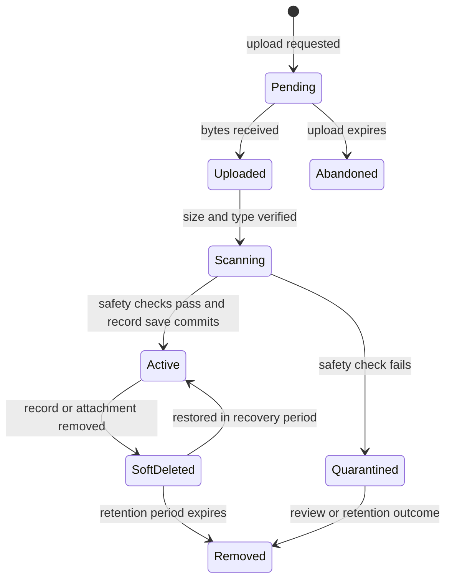

# 11. Files and attachments

[Previous: Queries, reports, search and live updates](10-queries-reports-search.md) · [Specification index](README.md) · Next: [Connections and programmable interfaces](12-connections-and-interfaces.md)

## File lifecycle

A **file** is organisation-owned stored content with metadata and access rules. An **attachment field** links a [record](06-records-and-lifecycle.md) to one or more files.

## Canonical attachment settings

The field contract uses these names only:

- `allowed_kinds`: one or more broad file groups such as image, document, spreadsheet, presentation, audio, video, archive, text, or other.
- `allowed_extensions`: an optional narrower list of filename extensions.
- `max_file_size_mb`: maximum size for one file.
- `multiple`: whether the field accepts more than one file.
- `max_files`: required when `multiple` is true.

If both kind and extension restrictions exist, a file must satisfy both. The naming and option policy remain [Decision D06](appendices/decisions.md#d06-attachment-type-policy) until approved.

Attachment fields are not directly filterable, sortable, or searchable. File name and approved extracted text may be searched through the separate file-search policy if added to [search](10-queries-reports-search.md), but that does not make the attachment field a scalar query value.

## Upload sequence

1. The server checks create/update permission for the target record and field.
2. The server creates a short-lived pending-file record and a restricted upload instruction.
3. The client uploads directly to organisation-scoped storage.
4. The platform verifies actual size, detected content type, extension, checksum, and safety result. Browser-supplied metadata is not trusted.
5. The record save attaches the active file by identifier.
6. Unattached pending uploads expire and are removed.

## Download and preview

- Every download rechecks organisation, record, field, and file access.
- Private storage addresses are short lived and cannot be reused as permanent public links.
- The response uses a safe content type and download disposition where browser display could execute content.
- Preview generation is isolated from the application process and never executes macros, scripts, or active document content.
- Public pages use separately published public-file variants; a private attachment address is never exposed.

## Storage and isolation

- Storage keys begin with the organisation identifier and use unguessable file identifiers.
- The original file name is metadata, not part of an executable storage path.
- Checksums support duplicate detection and integrity checks but do not grant cross-organisation access or shared storage identity.
- File metadata, previews, extracted text, and deletion jobs carry the same organisation identifier as the original.
- Storage policies and application checks both enforce organisation separation.

## Deletion, retention and legal hold

A file follows the lifecycle of the record attachment that owns it unless it has another active owner. Soft deletion preserves the file through the recovery period. Permanent removal follows [privacy and retention](14-activity-privacy-and-retention.md). A legal hold prevents removal but not access restrictions.

## Limits and usage

Uploads enforce per-file, per-field, per-request, and organisation storage limits before accepting bytes where possible. Accepted bytes, retained bytes, preview work, and failed uploads contribute to usage according to [plans, billing and usage](15-plans-billing-and-usage.md).

## Acceptance examples

- Renaming an executable file to an allowed extension does not bypass detected-type checks.
- A person with record access but without attachment-field read access cannot list or download its files.
- A signed download address from one organisation cannot retrieve a file from another.
- An abandoned upload is removed without creating record activity.
- Restoring a record restores only files still inside their recovery period and not rejected by safety policy.
