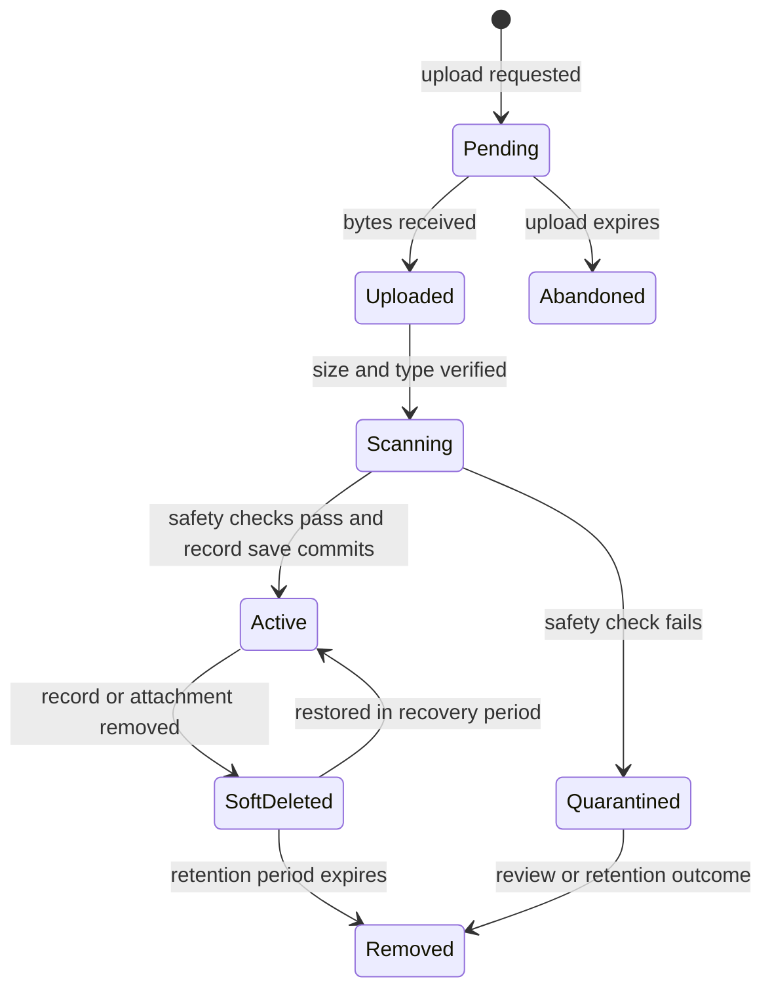

# 11. Files and attachments

[Previous: Queries, reports, search and live updates](10-queries-reports-search.md) · [Specification index](README.md) · Next: [Connections, programmable interfaces and MCP](12-connections-and-interfaces.md)

## File lifecycle

A **file** is organisation-owned stored content with metadata and access rules. An **attachment field** links a [record](06-records-and-lifecycle.md) to one or more files.

## Canonical attachment settings

The field contract uses these names only:

- `allowed_kinds`: one or more broad file groups such as image, document, spreadsheet, presentation, audio, video, archive, text, or other.
- `allowed_extensions`: an optional narrower list of filename extensions.
- `max_file_size_mb`: maximum size for one file.
- `multiple`: whether the field accepts more than one file.
- `max_files`: required when `multiple` is true.

Builders choose broad allowed kinds and may add an extension allowlist. When both are present, the detected content kind and extension must satisfy both. A filename or browser-supplied type never overrides detected content, and an unknown or mismatched type is refused or quarantined for review.

Attachment fields are not directly filterable, sortable, or searchable. File name and approved extracted text may be searched through the separate file-search policy if added to [search](10-queries-reports-search.md), but that does not make the attachment field a scalar query value.

## Upload sequence

1. The server checks create/update permission for the target record and field.
2. The server creates a short-lived pending-file record and the exact-object upload credential defined in [the Storage credential bridge](#storage-credential-bridge).
3. The client uploads directly to organisation-scoped [Supabase Storage](https://supabase.com/docs/guides/storage). Large or interruption-prone files use its resumable upload path rather than restarting the complete transfer.
4. The platform verifies actual size, detected content type, extension, checksum and safety result, then rechecks current authority before activation. A still-valid upload token does not authorise attachment after access revocation. Browser-supplied metadata is not trusted.
5. The record save attaches the active file by identifier.
6. Unattached pending uploads expire and are removed.

A Frontend Flow file node calls this same File-service boundary for its Access-resolved effective actor. Specified-user or system execution authority never bypasses record, field, file, storage, safety, retention or entitlement checks, and no service-role credential acts as a file grant. File references or metadata returned to a different initiating viewer are projected through that viewer's current authority before display or later use.

## Download and preview

- Every download rechecks organisation, record, field, and file access.
- Private downloads/previews use an authenticated File-service route that rechecks current authority on every new request, including range requests. Upstream Storage addresses remain server-side; do not redirect clients to reusable bearer signed URLs.
- The response uses a safe content type and download disposition where browser display could execute content.
- Preview generation is isolated from the application process and never executes macros, scripts, or active document content.
- Public pages use separately published public-file variants; a private attachment address is never exposed.

## Storage and isolation

- Storage keys begin with the organisation identifier and use unguessable file identifiers.
- Business files live only in private buckets. Public buckets are limited to deliberately published public assets.
- The original file name is metadata, not part of an executable storage path.
- Checksums support duplicate detection and integrity checks but do not grant cross-organisation access or shared storage identity.
- File metadata, previews, extracted text, and deletion jobs carry the same organisation identifier as the original.
- [Storage row policies](https://supabase.com/docs/guides/storage/security/access-control) on `storage.objects` and application checks both enforce organisation separation.
- Public assets may use content acceleration. Private/shared responses use private/no-store handling and the authenticated gateway, without persistent recipient copies. [Supabase signed URLs](https://supabase.com/docs/guides/storage/serving/downloads) remain usable until expiry and cannot by themselves enforce Vortex grant/account revocation on each request.

### Storage credential bridge

The selected bridge is a destination-project JWT signed with an imported asymmetric Supabase signing key, supplied through the client's `accessToken` option (or the equivalent Storage HTTP bearer header). Supabase documents [externally minted JWTs](https://supabase.com/docs/guides/auth/jwts#using-custom-or-third-party-jwts), [imported signing keys](https://supabase.com/docs/guides/auth/signing-keys), and [Storage JWT-backed row policies](https://supabase.com/docs/guides/storage/security/access-control). This is a required design for [#92](https://github.com/Abzum-NZ/Abzum-Vortex/issues/92), not a claim of implemented or hosted-verified behaviour.

The source File service first runs the ordinary Access-resolved operation. It then mints a token valid for at most 60 seconds, with `role=authenticated`, the destination project's issuer, a File-specific token kind, destination project, source organisation, exact bucket/object path, allowed Storage operation, expiry, and correlation identifier. Actor attribution identifies the verified human/account or registered system actor; it does not turn a system actor into a human Supabase user. Only trusted server code supplies these claims. User-editable metadata, request parameters, an Identity Authority JWT from another project, and the PostgreSQL transaction context cannot substitute for this credential.

Storage policies on `storage.objects` inspect the signed claims through `auth.jwt()` and enforce the exact destination, organisation path, bucket, object and operation, including both old and new scope for changes. They deny missing/malformed scope, ordinary Auth tokens and unintended list, copy, move, overwrite or signed-download operations. Use Storage's operation helpers where SQL privileges alone conflate listing and reading. These policies provide independent object/operation isolation; the File service owns the full live record/field/grant decision. No grant or schema access to private Vortex service/context tables is added for `authenticated`.

Read, preview, removal and other server operations keep this credential and all upstream addresses server-side. Each new external request, including ranges, rechecks current Access before minting its own credential. A browser receives only an upload credential for INSERT at its admitted pending-object path, with no read/list/update/delete/upsert authority. Resumable uploads renew through File admission and a fresh Access check; a still-valid credential may finish depositing pending bytes after revocation, but activation always rechecks current authority and refuses them. Replacement uploads use a new pending object and an authorised record save, never unrestricted overwrite.

The signing key stays in the destination environment's server secret store, separate from federation and Identity Authority keys, and rotates with the documented provider overlap/revocation procedure. It is a trusted minting credential, not a sandbox against compromised server code; no `service_role`/secret API key enters ordinary file execution. Local, federated and scoped system operations use this same source-side bridge after their own Access resolution. Hosted proof must demonstrate provider acceptance, claim preservation, resumable renewal, exact-operation refusal and key rotation before #92 closes; a simulated policy check or broad key does not satisfy that proof.

## Attachments on shared records

A record-sharing grant does not automatically grant file access. The grant must name the attachment field as readable, and every list, preview, and download rechecks the source record, grant, field, recipient organisation account, and recipient application. Bytes remain in the source organisation's storage; the recipient receives only a short-lived, request-bound download instruction. Across clusters, the source File service streams authorised bytes through the signed [federation request](17-runtime-storage-and-caching.md#cross-cluster-request) or an authenticated source gateway that verifies the same current recipient authority on every new request. A normal Supabase signed URL is not an account-bound Vortex grant. The recipient cluster does not retain the file or preview.

Uploading an attachment from another organisation requires a separately allowed attachment action. The source File service admits the upload and issues a short-lived source-storage instruction; after safety checks, the source Record service attaches it in the source record save. The new file is owned by the source organisation, follows its limits and retention policy, and records both the acting global identity and recipient organisation account. A recipient cannot browse the source organisation's file store, reuse a download instruction or obtain attachment activation under another account, retain the bytes in recipient-cluster storage, or attach one source organisation's file to its own record.

## Deletion, retention and legal hold

A file follows the lifecycle of the record attachment that owns it unless it has another active owner. Soft deletion preserves the file through the recovery period. Permanent removal follows [privacy and retention](14-activity-privacy-and-retention.md). A legal hold prevents removal but not access restrictions.

## Limits and usage

Uploads enforce per-file, per-field, per-request, and organisation storage limits before accepting bytes where possible. Accepted bytes, retained bytes, preview work, and failed uploads produce generic [metering events](15-entitlements-and-metering.md#metering-events).

## Acceptance examples

- Renaming an executable file to an allowed extension does not bypass detected-type checks.
- A person with record access but without attachment-field read access cannot list or download its files.
- A copied private download route fails for another account and after revocation, including preview and range requests. Already delivered or intentionally exported bytes cannot be recalled.
- An abandoned upload is removed without creating record activity.
- Restoring a record restores only files still inside their recovery period and not rejected by safety policy.
- Sharing a record without naming its attachment field exposes neither file metadata nor file content.
- A shared-file download remains source-owned, short lived, and checked against the grant on every request.
- After cross-cluster grant revocation, downloads, new upload admission/renewal and attachment activation refuse. A previously admitted bearer upload credential may deposit pending bytes until expiry, but grants no attachment authority to another account or cluster.
- Destination Storage refuses wrong-organisation/object/operation claims, a foreign-project identity token and an ordinary local Auth token without File scope; the valid local, federated and system paths use no broad server key.
- A pending upload credential cannot list, read, overwrite or remove files; renewal and activation refuse revoked authority. A captured private download route cannot obtain a fresh server credential after revocation.
