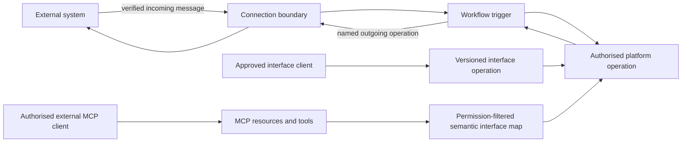
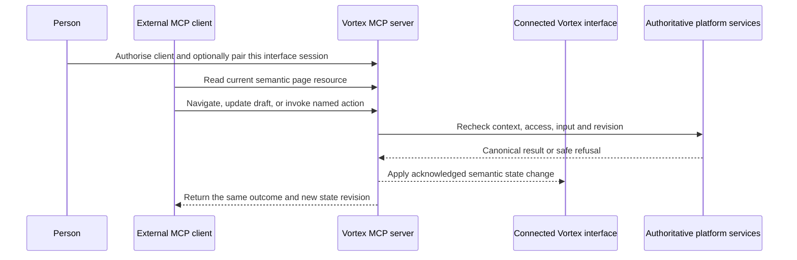
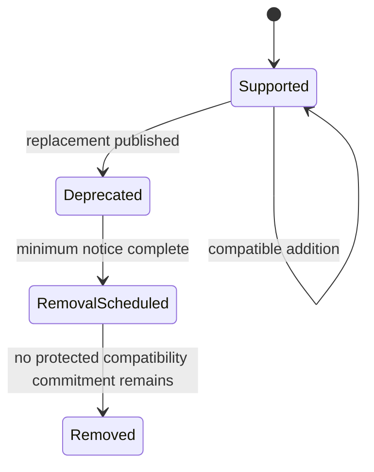

# 12. Connections, programmable interfaces and MCP

[Previous: Files and attachments](11-files-and-attachments.md) · [Specification index](README.md) · Next: [Activity history, privacy and retention](14-activity-privacy-and-retention.md)

## Three integration surfaces

A **connection** lets an organisation call or receive messages from another system. A customer **programmable interface** gives an approved caller a versioned way to use operations that an application deliberately publishes. The platform's governed **Model Context Protocol (MCP)** surface lets an external client act for a signed-in person through the same capabilities that person can use in the Vortex interface.

The programmable interface and MCP serve different purposes. An organisation chooses which stable operations to publish as an integration API. MCP is a platform interaction channel: after the person authorises a client, it mirrors that person's current interface capabilities without requiring each application builder to publish a second API.

## Connection types and connection instances

A platform-catalogue **connection type** defines:

- Human-readable purpose and provider.
- Authentication method and secret fields.
- A reusable catalogue of named input and output shapes. Each shape contains uniquely named, typed fields and may be empty for a no-content operation.
- Named outgoing operations with address templates, method, resolved input/output shape keys, timeout, retry policy, and allowed response size.
- Named incoming message types with signature verification, replay window, resolved input shape, and workflow trigger mapping.
- Allowed destination hosts and redirect policy.
- Health-check and revocation behaviour.

An organisation-owned **connection instance** selects a connection type and stores its encrypted credentials, granted applications, status, last successful check, and authorised administrator. Secrets never appear in definitions, exports, activity content, workflow inputs, logs, or browser responses.

An application connection binding records the permanent connection-type identifier, an accepted version requirement, the exact resolved catalogue version, and the operation keys the application requires. Publication requires the exact compiled connection artifact from the caller's immutable resolution snapshot, checks that the declared requirement accepts the resolved version, and compares the snapshot and compiled operation catalogues in both directions before resolving every required operation against both. Missing, foreign-snapshot, altered, or partial connection artifacts are refused. This makes the application reproducible without embedding a connection instance or secret in its definition.

## Authorisation lifecycle

Password-like keys and [OAuth 2.0](https://oauth.net/2/) grants are created through a server-side flow. The platform records grant time, granted scopes, expiry, refresh state, and revocation. Refresh is locked so parallel work does not race or reuse a rotated token. Revocation immediately prevents new calls and marks waiting workflow steps for a policy-controlled failure path.

## Outgoing call safety

- A workflow can call only a named operation from a granted connection instance.
- The workflow supplies an explicit input map; every required shape field is present and no undeclared field is accepted.
- The destination host comes from the platform-catalogue allowlist, not from record output.
- Addresses are revalidated after redirects and name resolution to prevent access to loopback, link-local, private infrastructure, metadata services, and unapproved ports.
- Requests have bounded time, size, redirects, attempts, and response parsing.
- The connection retry and workflow retry share one total attempt budget so they do not multiply unexpectedly.
- Logs redact credentials, signed addresses, sensitive headers, and configured sensitive response fields.

## Incoming message safety

- The boundary verifies signature, timestamp, content type, size, and source policy before parsing business content.
- A provider message identifier or deterministic checksum prevents duplicate workflow starts for the selected retention period.
- Verification failure returns a neutral response and does not reveal organisation configuration.
- Incoming content is untrusted input and cannot select an arbitrary workflow, connection, destination, or permission.

## Programmable interfaces

An application-contained **interface** contains named operations and publishes with its application. Each operation declares:

- Stable operation identifier and description.
- One explicit HTTP method and application-relative path; publication refuses duplicate paths and methods incompatible with the target operation.
- Input and output shapes whose fields declare type, required status, and how each value binds to the selected target. A custom-action operation declares exactly one required subject plus every required action input it accepts; it cannot expose an action result because actions do not yet declare results. A query operation has no request shape and exposes at least one field selected by that query, with optional standard page information. A workflow operation has no request shape and returns exactly its run identifier. The first release does not invent query parameters or workflow inputs.
- Authentication method and required permission.
- Rate and size limits.
- Whether it is organisation-private, partner-facing, or public.
- The declared custom action, query, or interface-triggered workflow it calls. Standard record actions cannot be exposed until their own explicit input and output contract exists; publication never derives an external write contract from a record form. A permission key alone is not an executable target.
- Duplicate-protection requirements for writes.
- Error codes that do not expose private implementation details.

Every operation has a permission, including organisation-private and public operations. Publication resolves that permission and refuses a shape binding intended for a different target kind, an unknown action input or query output field, or an incompatible value type. The transport layer therefore never guesses how an external field maps into platform work. Adding query parameters or declared workflow inputs/outputs later requires an explicit owning-contract change first.

Interfaces use the same [actions](08-forms-actions-rules-and-events.md), [queries](10-queries-reports-search.md), [access](04-access-and-permissions.md), and [activity history](14-activity-privacy-and-retention.md) as the web application.

## Governed MCP access

Vortex provides one remote MCP server for the platform. The first release follows the current [MCP revision `2026-07-28`](https://modelcontextprotocol.io/specification/2026-07-28) and uses [Streamable HTTP](https://modelcontextprotocol.io/specification/2026-07-28/basic/transports/streamable-http). Every request carries its protocol revision, client information and client capabilities in the required `_meta` fields. Streamable HTTP separately carries `MCP-Protocol-Version`, `Mcp-Method`, an applicable `Mcp-Name`, and any declared `Mcp-Param-*` headers; the server validates the required headers against the request body and returns `HeaderMismatch` when they are missing or disagree. The endpoint accepts MCP messages only by HTTP `POST` with the required JSON or server-sent-event content negotiation, rejects an invalid `Origin`, does not provide `GET` for the modern transport, and keeps requests stateless. The mandatory `server/discover` operation reports the server's identity, supported revision and capabilities. An unsupported revision receives `UnsupportedProtocolVersionError`; the first release does not implement the connection-scoped initialization behaviour of `2025-11-25` or earlier. A later supported revision or backward-compatibility mode is added only through explicit compatibility tests.

The MCP server exposes a small stable set of generic resources and tools rather than generating a separate tool name for every button:

| MCP surface | What it provides |
|---|---|
| Context resources | The authorised tenant, organisation account, application, application version and optional connected interface session. |
| Navigation resources | The discoverable applications, navigation tree, pages and safe route targets for the current context. |
| Page resources | The current permission-filtered [semantic interface map](07-applications-pages-and-themes.md#semantic-interface-map), record context, readable blocks, queries, view controls and refresh state. |
| Form resources | Form or guided-form schema, current draft revision, allowed choices, validation state, commit action and confirmation rule. Secret inputs are write-only and are never returned. |
| Operation resources | The actions, file operations, builder operations and administration operations currently available through the interface, with input shapes, permission meaning, confirmation requirement and safe outcomes. |
| Context and navigation tools | Select an authorised organisation/application context; open a permitted page or record; change a declared tab, dialog, drawer, filter, sort, page or other view state; and refresh a named region. |
| Form tools | Start or resume a draft, set one or more allowed values, request validation, move between guided steps, and submit the declared commit action. |
| Operation tools | Invoke a currently available action, file operation, builder change, publication step or administration operation using the same input contract as the web interface. |

Resources are paginated when needed and announce changes when a role, grant, application version or current view changes. The server returns stable semantic identifiers and typed values; it never requires an agent to parse HTML, inspect CSS, guess a label, execute browser script, or click a screen coordinate.

### Identity, consent and access

- A remote MCP client uses the MCP [OAuth authorization flow](https://modelcontextprotocol.io/specification/2026-07-28/basic/authorization). The person signs in through the Vortex identity authority, chooses the organisations/applications and requested capabilities, and can revoke the grant.
- The access token is audience-bound to the Vortex MCP server, short-lived and never placed in an address. The MCP server validates it on every request and does not pass it to another service. Internal calls receive a narrow Vortex caller context instead.
- The caller is the person's current organisation account, not a new “AI identity.” Requested client scope can only narrow that account's current permissions. Switching organisation or application requires an explicit authorised context change.
- Permission, role, grant, account or session revocation changes the next resource read or tool call. Cached tool lists and resources cannot preserve withdrawn data or actions.
- A changing operation uses the same duplicate protection, expected record or draft revision, validation, activity history, limits and safe refusal as the web interface.
- If the interface requires confirmation, reauthentication or a human-only external authorization step, MCP returns the same pending requirement. The client may use supported [elicitation](https://modelcontextprotocol.io/specification/2026-07-28/client/elicitation); credentials and other secrets use a Vortex-hosted URL flow and never pass through the MCP client.
- Vortex does not request MCP sampling, host a model, supply model credentials, or decide what an external client does next. This preserves the [no embedded AI](01-purpose-and-scope.md#product-boundaries) boundary.

[Supabase Auth's OAuth 2.1 server](https://supabase.com/docs/guides/auth/oauth-server) is the authorization server; Vortex does not build a second identity or token service. It provides OAuth and OpenID discovery, authorization code flow with PKCE using `S256`, refresh-token rotation, deliberate client registration and asymmetric token validation. The Vortex consent page under `apps/web` shows the client, requested access and affected organisation accounts before approval.

The first release uses administrator [pre-registration](https://supabase.com/docs/guides/auth/oauth-server/mcp-authentication) of approved MCP clients. Dynamic client registration is disabled because the current MCP revision retains it only for backward compatibility, and the selected Supabase service does not yet document Client ID Metadata Documents. Client registration does not grant data access. Standard identity scopes control identity claims only. The separate live Vortex MCP authorisation grant binds the token's identity and `client_id` to approved organisation-account, application and capability scopes, and every tool call still uses the central access decision. A custom access-token hook may set the exact MCP resource audience, but it cannot place roles, application permissions or grant contents in the token. The MCP server itself remains a Vercel route.

### Live interface control

An authorised person may optionally connect one active web-interface session to one authorised MCP client context. Without that explicit pairing, MCP operations still work headlessly but cannot move or edit an open browser view. The pairing is Vortex application state, not a connection-scoped MCP protocol session; each MCP request remains self-contained.

- Pairing is visible in the web interface, expires, and can be ended immediately by the person. An MCP client never receives a browser cookie, DOM handle or unrestricted browser-control channel.
- Navigation and local view controls use the stable identifiers in the semantic interface map. Form filling updates the same private, revisioned draft used by the browser. Invoking an action calls the action service and then updates the interface from the canonical result; it does not synthesize a pointer click.
- Each command names the expected interface-state revision. A stale command is refused so a delayed agent action cannot move the person backward, replace newer form input or act on a record that is no longer current.
- Purely visual details such as animation progress, pixel position and hover decoration are not mirrored. The connected interface still applies its ordinary accessible loading, focus, motion and error behaviour.

### Parity rule

Every meaningful capability offered by a Vortex-owned web interface—including customer applications, Studio, tenant administration and organisation administration—must be represented by the semantic interface map and usable through the governed MCP surface. A release test inventories both surfaces and fails on a missing operation, mismatched input, different access result, different validation, different side effect or different activity meaning.

The reverse is also controlled: the MCP parity surface does not expose a hidden platform or business operation that the same person could not reach through an authorised Vortex interface. Customer-published interfaces and protected system operations remain separate because they serve non-interactive integration and operational purposes.

## Internal cluster federation interface

The [Vortex Federation API](17-runtime-storage-and-caching.md#vortex-federation-between-clusters) is a protected platform-to-platform interface, not a customer connection or public programmable interface. Only an active cluster registered in the [cluster directory](17-runtime-storage-and-caching.md#cluster-identity-and-discovery) can call it. Customers cannot configure its address, credentials, retry policy, or operation catalogue.

It reuses the published query, action, grant, file, error, and activity contracts rather than inventing remote versions of business behaviour. The Interface service owns transport, signatures, replay checks, request limits, and version negotiation; the Identity service proves the person; the recipient Access service proves its local account and roles; and the source Access, Query, Record, and File services remain authoritative for the requested work.

This internal federation interface is the only interface that carries live shared-record requests between organisations in the first release. Customer programmable interfaces, outgoing connections, and incoming connection operations cannot expose, store, or act on a recipient's live shared records. Approved export remains the explicit transfer path.

## Interface versions

- An interface version has a permanent public identifier and is served by a specific published application version.
- Compatible changes may add optional input or output fields without changing existing meaning.
- Removing, renaming, requiring, narrowing, or changing meaning creates a new major version.
- Applications and external clients record the version range they accept.
- A deprecated version remains served for at least ninety days unless an active security incident requires an earlier, recorded exception.
- Dependency data identifies every Vortex definition still using a version before removal.

## Public forms and operations

Public access uses explicitly published operations, approved fields from [public access](04-access-and-permissions.md#public-access), abuse controls, and neutral responses. A public operation and its target action must use non-administrative permissions. The action must be explicitly shareable, its subject must resolve, and every subject field read by its condition or values and every field it changes or creates must be approved for public display on the correct record type. Public relationship copying is refused in the first release because the public-surface contract has no relationship allowlist. Public callers never receive a general organisation token or an interface-discovery catalogue.

## Acceptance examples

- A record value cannot redirect a connection call to a private network address.
- A connection definition with a missing shape, duplicate shape field, or undeclared workflow input is refused before publication.
- Replaying a valid incoming message does not start duplicate work.
- Revoking a connection prevents later workflow attempts from using cached credentials.
- An interface write repeated with the same duplicate-protection key returns the original outcome.
- Removing an interface version is refused while an active application requires it, unless a reviewed security exception is recorded.
- A customer-created interface or connection cannot call an internal federation operation or claim to be another Vortex cluster.
