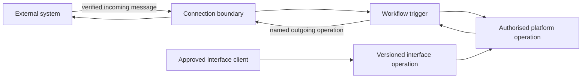
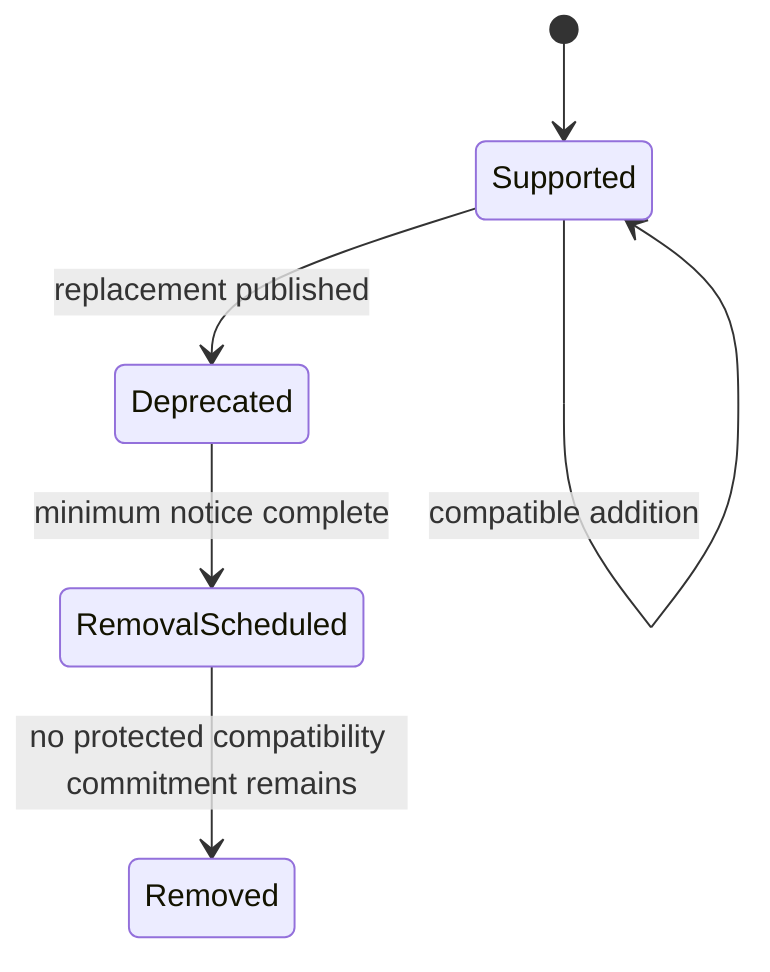

# 12. Connections and programmable interfaces

[Previous: Files and attachments](11-files-and-attachments.md) · [Specification index](README.md) · Next: [Activity history, privacy and retention](14-activity-privacy-and-retention.md)

## Two integration surfaces

A **connection** lets an organisation call or receive messages from another system. A **programmable interface** gives an approved caller a versioned way to use named Vortex operations.

## Connection types and connection instances

A platform-catalogue **connection type** defines:

- Human-readable purpose and provider.
- Authentication method and secret fields.
- A reusable catalogue of named input and output shapes. Each shape contains uniquely named, typed fields and may be empty for a no-content operation.
- Named outgoing operations with address templates, method, resolved input/output shape keys, timeout, retry policy, and allowed response size.
- Named incoming message types with signature verification, replay window, resolved input shape, and workflow trigger mapping.
- Allowed destination hosts and redirect policy.
- Health-check and revocation behaviour.

An organisation-owned **connection instance** selects a connection type and stores its encrypted credentials, granted applications, status, last successful check, and authorised administrator. Secrets never appear in definitions, exports, activity content, workflow inputs, logs, or browser responses.

An application connection binding records the permanent connection-type identifier, an accepted version requirement, the exact resolved catalogue version, and the operation keys the application requires. Publication requires the exact compiled connection artifact from the caller's immutable resolution snapshot, checks that the declared requirement accepts the resolved version, and compares the snapshot and compiled operation catalogues in both directions before resolving every required operation against both. Missing, foreign-snapshot, altered, or partial connection artifacts are refused. This makes the application reproducible without embedding a connection instance or secret in its definition.

## Authorisation lifecycle

Password-like keys and [OAuth 2.0](https://oauth.net/2/) grants are created through a server-side flow. The platform records grant time, granted scopes, expiry, refresh state, and revocation. Refresh is locked so parallel work does not race or reuse a rotated token. Revocation immediately prevents new calls and marks waiting workflow steps for a policy-controlled failure path.

## Outgoing call safety

- A workflow can call only a named operation from a granted connection instance.
- The workflow supplies an explicit input map; every required shape field is present and no undeclared field is accepted.
- The destination host comes from the platform-catalogue allowlist, not from record output.
- Addresses are revalidated after redirects and name resolution to prevent access to loopback, link-local, private infrastructure, metadata services, and unapproved ports.
- Requests have bounded time, size, redirects, attempts, and response parsing.
- The connection retry and workflow retry share one total attempt budget so they do not multiply unexpectedly.
- Logs redact credentials, signed addresses, sensitive headers, and configured sensitive response fields.

## Incoming message safety

- The boundary verifies signature, timestamp, content type, size, and source policy before parsing business content.
- A provider message identifier or deterministic checksum prevents duplicate workflow starts for the selected retention period.
- Verification failure returns a neutral response and does not reveal organisation configuration.
- Incoming content is untrusted input and cannot select an arbitrary workflow, connection, destination, or permission.

## Programmable interfaces

An application-contained **interface** contains named operations and publishes with its application. Each operation declares:

- Stable operation identifier and description.
- One explicit HTTP method and application-relative path; publication refuses duplicate paths and methods incompatible with the target operation.
- Input and output shapes whose fields declare type, required status, and how each value binds to the selected target. A custom-action operation declares exactly one required subject plus every required action input it accepts; it cannot expose an action result because actions do not yet declare results. A query operation has no request shape and exposes at least one field selected by that query, with optional standard page information. A workflow operation has no request shape and returns exactly its run identifier. The first release does not invent query parameters or workflow inputs.
- Authentication method and required permission.
- Rate and size limits.
- Whether it is organisation-private, partner-facing, or public.
- The declared custom action, query, or interface-triggered workflow it calls. Standard record actions cannot be exposed until their own explicit input and output contract exists; publication never derives an external write contract from a record form. A permission key alone is not an executable target.
- Duplicate-protection requirements for writes.
- Error codes that do not expose private implementation details.

Every operation has a permission, including organisation-private and public operations. Publication resolves that permission and refuses a shape binding intended for a different target kind, an unknown action input or query output field, or an incompatible value type. The transport layer therefore never guesses how an external field maps into platform work. Adding query parameters or declared workflow inputs/outputs later requires an explicit owning-contract change first.

Interfaces use the same [actions](08-forms-actions-rules-and-events.md), [queries](10-queries-reports-search.md), [access](04-access-and-permissions.md), and [activity history](14-activity-privacy-and-retention.md) as the web application.

## Internal cluster federation interface

The [Vortex Federation API](17-runtime-storage-and-caching.md#vortex-federation-between-clusters) is a protected platform-to-platform interface, not a customer connection or public programmable interface. Only an active cluster registered in the [cluster directory](17-runtime-storage-and-caching.md#cluster-identity-and-discovery) can call it. Customers cannot configure its address, credentials, retry policy, or operation catalogue.

It reuses the published query, action, grant, file, error, and activity contracts rather than inventing remote versions of business behaviour. The Interface service owns transport, signatures, replay checks, request limits, and version negotiation; the Identity service proves the person; the recipient Access service proves its local account and roles; and the source Access, Query, Record, and File services remain authoritative for the requested work.

This internal federation interface is the only interface that carries live shared-record requests between organisations in the first release. Customer programmable interfaces, outgoing connections, and incoming connection operations cannot expose, store, or act on a recipient's live shared records. Approved export remains the explicit transfer path.

## Interface versions

- An interface version has a permanent public identifier and is served by a specific published application version.
- Compatible changes may add optional input or output fields without changing existing meaning.
- Removing, renaming, requiring, narrowing, or changing meaning creates a new major version.
- Applications and external clients record the version range they accept.
- A deprecated version remains served for at least ninety days unless an active security incident requires an earlier, recorded exception.
- Dependency data identifies every Vortex definition still using a version before removal.

## Public forms and operations

Public access uses explicitly published operations, approved fields from [public access](04-access-and-permissions.md#public-access), abuse controls, and neutral responses. A public operation and its target action must use non-administrative permissions. The action must be explicitly shareable, its subject must resolve, and every subject field read by its condition or values and every field it changes or creates must be approved for public display on the correct record type. Public relationship copying is refused in the first release because the public-surface contract has no relationship allowlist. Public callers never receive a general organisation token or an interface-discovery catalogue.

## Acceptance examples

- A record value cannot redirect a connection call to a private network address.
- A connection definition with a missing shape, duplicate shape field, or undeclared workflow input is refused before publication.
- Replaying a valid incoming message does not start duplicate work.
- Revoking a connection prevents later workflow attempts from using cached credentials.
- An interface write repeated with the same duplicate-protection key returns the original outcome.
- Removing an interface version is refused while an active application requires it, unless a reviewed security exception is recorded.
- A customer-created interface or connection cannot call an internal federation operation or claim to be another Vortex cluster.
