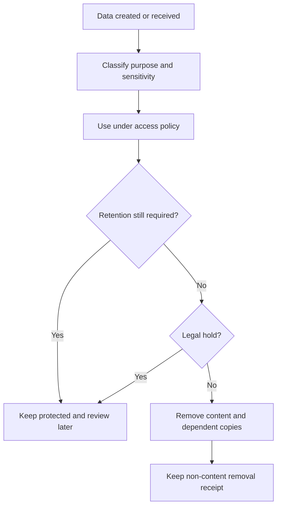

# 14. Activity history, privacy and retention

[Previous: Assistant and model-assisted work](13-assistant.md) · [Specification index](README.md) · Next: [Plans, billing and usage limits](15-plans-billing-and-usage.md)

## Data inventory

Every category of organisation or person data has an owner, purpose, location, access policy, default retention period, deletion method, export method, and legal-hold behaviour.

The inventory covers global identities, organisation accounts, definitions, records, relationships, files and previews, search documents, saved views, guided-form drafts, activity, events, workflow inputs and history, connection messages, assistant conversations, notifications, usage, billing, exports, backups, caches, logs, and support records.

## Activity history

Activity entries explain material business and administrative changes. They include organisation, time, actor, action, subject identifiers, correlation identifier, source surface, outcome, and safe changed-field names.

Activity does not store passwords, connection secrets, full sensitive values, private file addresses, model-provider credentials, or complete before-and-after record copies. Where a business audit requires a value history, that history has an explicit field policy and access permission.

Activity is append-only through ordinary product operations. Corrections create a later entry. Privileged retention work may remove protected content while preserving a non-content receipt.

## Personal-data classification

Every [field](05-modules-fields-and-relationships.md) is classified as:

- `none`: not intended to identify or describe a person.
- `personal`: identifies or describes a person.
- `sensitive`: higher-risk personal or confidential information requiring explicit access.

The classification controls search, assistant context, exports, activity detail, masking in diagnostics, and erasure discovery. Public display is a separate explicit decision under [access and permissions](04-access-and-permissions.md#public-access).

## Retention policies

An organisation can choose approved retention periods within plan and legal bounds. A policy names the data category, selection condition, active retention period, recovery period, removal schedule, and exception process.

- Shortening a period shows an impact preview and requires confirmation.
- Retention jobs are resumable, duplicate-safe, bounded, and auditable.
- Removal covers primary data and active derived copies such as search, previews, caches, and pending exports.
- Backups expire through their own protected schedule; ordinary deletion does not rewrite immutable historical backups.
- Restoring a backup must reapply removal records created after that backup before the restored system is opened for ordinary use.

## Personal-data requests

The platform supports discovery, export, correction through ordinary permissions, restriction where required, and erasure. A request records requester, verified identity, organisations in scope, search criteria, findings, approvals, work performed, exceptions, and completion receipt.

The scope of account-level versus organisation-level erasure is [Decision D15](appendices/decisions.md#d15-personal-data-erasure-scope). The workflow must cover:

- Global identity and organisation accounts.
- Record fields and linked records.
- Files, previews, search entries, and caches.
- Events and workflow payloads.
- Assistant conversations.
- Activity values where removal is legally permitted.
- Exports awaiting download.
- Connected systems where the organisation has configured a deletion operation.
- Ownership reassignment for records that must remain.

## Legal holds

A legal hold is an organisation-owned record with scope, reason, authorised creator, start time, review date, and release approval. It prevents permanent removal of matching data but does not make that data more visible. Creating, changing, or releasing a hold requires a dedicated permission and recent sign-in confirmation.

## Shared-record accountability

Creating, approving, refusing, activating, using, changing, expiring, or revoking a cross-organisation grant is material activity. The source history records the source and recipient clusters, source and recipient organisations, acting global identity, acting organisation account, grant, approved scope, action, outcome, and correlation identifier. One federated query produces one safe request-level activity entry rather than one entry for every returned row. The recipient history records its local request, remote outcome, and correlation identifier without copying source record values.

The source organisation remains responsible for record retention, legal hold, correction, and erasure. A recipient cannot extend retention or prevent source deletion merely because it can read the record. When an erasure, field removal, or legal restriction changes what may be shared, the next list, detail, search, report, dashboard, or export request applies the new result. The recipient holds no search document, materialised report result, or shared-record cache to remove.

A grant never authorises the recipient to include shared personal data in an assistant conversation, workflow payload, connection message, recipient search index, or recipient-owned bulk operation. Shared search and reports run at the source and return only fields permitted by the grant. Export is a separate approval that defaults to refused.

Authorised record values may pass through the recipient service and browser for the requested display, search, report, or action, but persistent recipient-cluster business-data storage is forbidden in the first release. The source sharing policy checks the recipient cluster and region before grant activation. Logs, traces, request mirrors, retry records, saved shared-report definitions, and signed receipts contain identifiers and fingerprints only, not shared field values.

An approved export is a deliberate transfer outside live sharing. The source owns the temporary export job and short-lived file, while the recipient cluster retains neither. Once the recipient downloads the file, Vortex cannot recall or remotely erase that copy when the grant is revoked or source data later changes. Both approval screens state this consequence, both histories record the transfer, and the recipient accepts responsibility for permitted storage, onward disclosure, retention, and deletion. A source that requires revocable access leaves export refused.

## Isolation and administration

Privacy administrators act within one organisation unless a separate platform-operator process is invoked. Support access is time limited, purpose bound, approved, and recorded. Privacy export packages are encrypted, short lived, access checked at every download, and never delivered through an ordinary public file link.

## Acceptance examples

- A sensitive field does not appear in search, ordinary activity detail, logs, or assistant context by default.
- Shortening retention reports the number and categories of items due for removal before confirmation.
- Restoring an older backup does not resurrect data with a later permanent-removal receipt.
- A legal hold stops deletion without granting the hold administrator read access to the held records.
- An erasure request reports every category searched and any lawful exception rather than claiming success after deleting only the main record.
- Revoking a grant removes future access without erasing the immutable record that approval and authorised use occurred.
- A recipient organisation cannot use a shared record to place a legal hold on the source organisation's data.
- Shared search and reports leave no recipient index or materialised result; the next request reflects source correction, restriction, or erasure.
- A downloaded approved export is recorded as an intentional transfer and is not presented as revocable live access.
