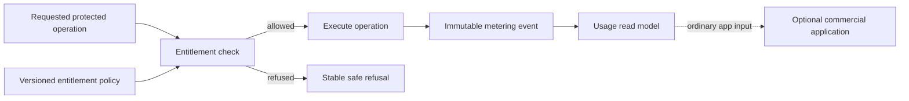
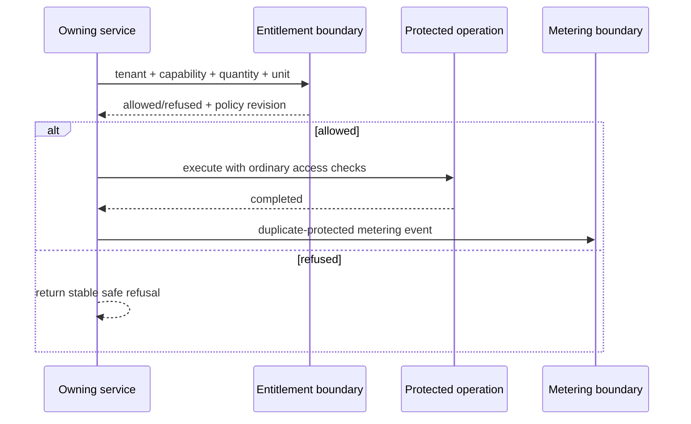

# 15. Entitlements and metering

[Previous: Activity, privacy and retention](14-activity-privacy-and-retention.md) · [Specification index](README.md) · Next: [Copying, sharing, import and export](16-copying-sharing-import-export.md)

## Purpose and boundary

Vortex may need to allow or refuse a platform capability and measure resource consumption. It does not need to understand pricing, subscriptions, invoices, payment providers or how an entitlement was obtained. Those are ordinary applications under the [core contract boundary](appendices/core-contract-boundary.md).

An **entitlement** answers whether a tenant may use a named platform capability and, where relevant, how much may be used. A **metering event** records an accepted quantity attributed to a tenant and optionally to the organisation that caused it. Neither concept carries money or commercial status.

## Entitlement decision

The requesting service supplies the tenant, optional organisation attribution, namespaced capability key, requested quantity, unit and correlation identifier. The entitlement owner returns one versioned decision:

- `allowed`, with the accepted quantity and optional remaining quantity; or
- `refused`, with a stable safe reason code.

The decision contains the policy revision used. A service never infers entitlement from a commercial record, payment-provider message or banner. Security and record access are separate checks: an entitlement can refuse an operation but can never grant data access.

## Metering events

Each accepted event has a stable identifier, tenant, optional organisation, capability key, positive quantity, unit, occurrence time, optional source event, duplicate-protection key, correlation identifier and acceptance time. Replaying the same duplicate-protection key does not count consumption twice.

Metering is generic evidence. It may support capacity planning, fair-use controls or an ordinary commercial application, but the core ledger never marks consumption as chargeable and never creates an invoice.

Corrections are explicit later events or protected reconciliation operations; history is not edited in place. The exact reservation strategy for scarce concurrent resources is delivered with the entitlement service and must preserve the same allow/refuse boundary.

## Administration and presentation

Entitlement policy administration is a protected platform operation with activity evidence. Its user interface is a locked administration application built from ordinary [application primitives](07-applications-pages-and-themes.md), not a special hardcoded screen.

A reusable banner block may show application-provided notices. Emergency service or security status shown before applications load is derived from the narrow [operational status](19-operations-backup-and-recovery.md) boundary and a safe message catalogue; it is not a persistent announcement business domain.

## Explicit exclusions

- Pricing, products, plans, subscriptions, trials, invoices, refunds and payment methods.
- Provider-specific customer, product, price, invoice or subscription identifiers.
- Payment-failure grace periods or cancellation retention.
- Active-person charging rules.
- Tenant, organisation or application announcement records.

These exclusions do not prevent Abzum or a customer from building those capabilities as ordinary Vortex applications.

## Delivery order

The headless [entitlement decision and reservation service #118](https://github.com/Abzum-NZ/Abzum-Vortex/issues/118) is needed before the first limited consuming operation. It can follow Access without waiting for page or workflow engines. Initial operational limits come from explicit versioned deployment policy, never a silent unlimited fallback. Phase 12 completes metering/reconciliation and ordinary administration integration.
