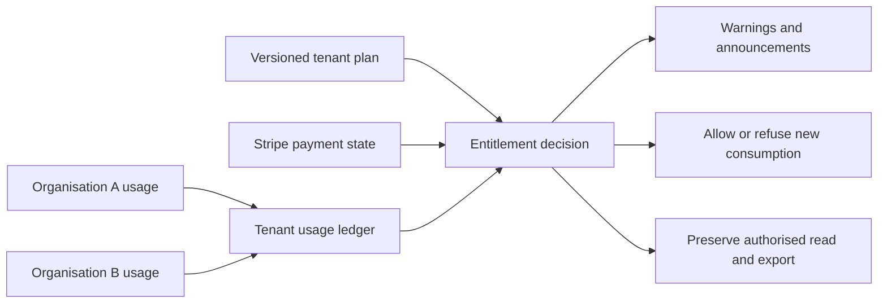
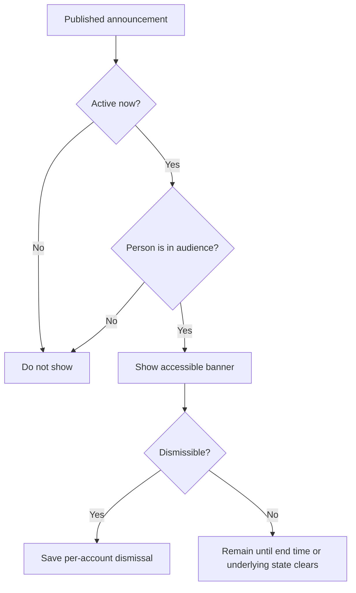

# 15. Plans, billing, usage and announcements

[Previous: Activity history, privacy and retention](14-activity-privacy-and-retention.md) · [Specification index](README.md) · Next: [Copying, sharing, import and export](16-copying-sharing-import-export.md)

## Ownership

The commercial plan, subscription, payment state, billing contacts, and invoices belong to the [tenant](02-people-organisations-and-sign-in.md#tenant-and-organisation-hierarchy). Each organisation records the usage it causes; the tenant ledger rolls those entries up without losing organisation attribution.

[Stripe](https://docs.stripe.com/) is authoritative for payment collection and subscription payment status. Vortex is authoritative for tenants, selected plan versions, derived entitlements, usage, and product access decisions. Payment-card details remain in Stripe-hosted interfaces.

## Plan definition

A published plan version names price and currency, billing interval, included entitlements, measured categories, limits, overage rules where offered, trial and cancellation retention, warning thresholds, and grace-period length. A subscription pins a plan version until an explicit plan change. Editing a plan never rewrites earlier invoices or usage.

Measured categories may include active human seats, records, file bytes, workflow runs, connection operations, interface calls, exports, and other clearly named platform consumption. Limits and charging rules use the same units.

## Seats

Every active human organisation account counts as a seat in its tenant, including an active external human account. An invited, suspended, closed, or service account does not count. If one identity has active accounts in two organisations, those are two seats because each is a separately governed account. Changing this rule requires a new plan version and an impact preview.

## Usage ledger

Every usage entry records tenant, organisation, category, quantity, unit, time window, source event, duplicate-protection key, and correlation identifier. Corrections append reversing and replacement entries; they never edit accepted history. Current totals are reproducible from immutable entries and reconciled to source systems.

Shared-record work creates linked source and recipient entries. Recipient requests and seats count to the recipient organisation and tenant. Source queries, reports, actions, temporary exports, file work, and network delivery count to the source organisation and tenant. One operation is not counted twice in the same category.

## Billing state and enforcement

Supported tenant states include trial, active, past due, grace period, cancelled at period end, cancelled, and administratively suspended. Signed provider events are stored once by provider identifier and reconciled against the current Stripe subscription when they arrive out of order.

For ordinary plan, payment, or usage limits:

1. Vortex shows warnings before enforcement where measurement permits.
2. A past-due or exceeded tenant enters the grace period defined by its plan version.
3. At the end of grace, new consumption is refused: no additional seats, records, bytes, workflow runs, or external calls that increase the exceeded category.
4. Existing authorised read and export access remains available so the customer can resolve or retrieve its data.
5. Vortex never silently deletes data or upgrades the plan. A downgrade shows an impact preview and resolution period.

A separately recorded security or legal suspension may restrict more broadly. Billing state never grants access, and a limit refusal uses a stable reason that identifies the affected tenant and category without exposing another organisation's private details.

## Announcement banners

The platform provides a generic announcement banner for operational, security, policy, billing, and product notices. An announcement has an audience scope (`platform`, `tenant`, `organisation`, or `application`), type (`information`, `warning`, or `critical`), plain-language message, optional approved link, start and end times, and dismissibility.

- Platform operators publish platform notices; tenant administrators publish tenant notices; authorised organisation or application administrators publish narrower notices.
- A banner is communication, not access enforcement. The underlying billing, security, or operational rule is checked independently.
- Mandatory billing or security notices may be non-dismissible until their condition clears.
- Messages contain no record values, secrets, or private information about another organisation and meet the same accessibility requirements as application pages.
- Publication, change, withdrawal, display scope, and dismissal are auditable.

## Administrative safety

Billing administration requires a tenant permission and recent sign-in confirmation. Tenant administration does not grant organisation record access. Plan, entitlement, invoice-link, refund, suspension, and announcement changes appear in [activity history](14-activity-privacy-and-retention.md).

## Acceptance examples

- Replayed or out-of-order Stripe events produce one correct tenant state.
- Usage from two child organisations rolls up to one tenant while retaining separate organisation totals.
- A past-due tenant receives a warning and plan-defined grace period; after grace, new consumption stops while authorised read and export continue.
- Invited, suspended, and service accounts do not count as seats; active human accounts do.
- A tenant-wide critical notice appears in all its organisations without revealing any organisation's business data.
- One federated request produces linked source and recipient usage without duplicate category charging.
