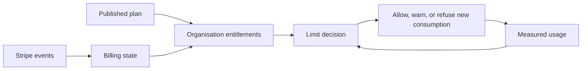

# 15. Plans, billing and usage limits

[Previous: Activity history, privacy and retention](14-activity-privacy-and-retention.md) · [Specification index](README.md) · Next: [Copying, sharing, import and export](16-copying-sharing-import-export.md)

## Separation of concerns

A **plan** defines included capabilities and limits. **Usage** records measured consumption. **Billing** records the commercial relationship with [Stripe](https://docs.stripe.com/).

## Plan definition

A published plan names:

- Included platform capabilities.
- Included active organisation accounts and applications.
- Record, file-storage, workflow, connection, interface, assistant, and export limits.
- Usage period and overage policy.
- Support and retention options.
- Price identifiers managed in [Stripe](https://docs.stripe.com/), without embedding prices in application code.

Historical subscriptions remain explainable against the plan version accepted at the time.

## Usage measurement

Usage events have a unique identifier, organisation, category, quantity, unit, occurrence time, source, and correction link. Aggregation is repeatable and duplicate-safe.

Usage used for enforcement is available quickly enough to prevent unbounded excess, while invoicing totals are reconciled before billing. Corrections create offsetting records rather than rewriting history.

## Billing state

[Stripe](https://docs.stripe.com/) is authoritative for payment collection and subscription payment status. Vortex is authoritative for the organisation, selected plan, entitlements derived from the subscription, and product access decisions.

Incoming billing events are signature checked, stored by provider event identifier, and safe to process repeatedly. Events received out of order are reconciled against the provider's current subscription state before entitlements change.

The supported organisation states include trial, active, past due, grace period, cancelled at period end, cancelled, and administratively suspended. Exact grace and enforcement behaviour is [Decision D16](appendices/decisions.md#d16-billing-and-limit-enforcement).

## Limit behaviour

Limits distinguish existing access from new consumption:

- Reaching a limit normally refuses creating additional organisation accounts, records, bytes, runs, or calls while preserving authorised read and export access.
- A security or legal suspension may restrict more broadly through a separately recorded decision.
- Downgrading produces an impact preview and a resolution period; it does not silently delete data.
- Overage billing occurs only when the accepted plan explicitly allows it.
- Usage warnings are sent before a hard limit where measurement permits.

## Seats and organisation accounts

The plan must define whether invited, active, suspended, service, and external organisation accounts count as seats. A change in counting rules creates a new plan version. The unresolved business choices appear in [Decision D16](appendices/decisions.md#d16-billing-and-limit-enforcement).

## Shared-record usage

Shared-record work records separate source and recipient usage events tied by one correlation identifier. Recipient seats and gateway requests count to the recipient organisation. Source queries, searches, reports, actions, temporary export or file storage, and any network delivery count to the source organisation. The rule is the same for local and remote routes, and the same operation is not counted twice in one usage category.

If either organisation has reached a hard limit for the required work, the request refuses with a stable outcome that states whether the source or recipient limit prevented it. Billing state never turns a refused grant into an allowed one, causes a persistent recipient copy, or reveals a source record's existence.

## Administrative safety

- Billing administration requires a dedicated permission and recent sign-in confirmation.
- Payment-card details are handled by [Stripe-hosted interfaces](https://docs.stripe.com/payments/checkout) and are not stored by Vortex.
- Billing events, plan changes, entitlement changes, invoice links, refunds, and suspensions appear in [activity history](14-activity-privacy-and-retention.md).
- A billing failure cannot accidentally grant a higher plan.

## Acceptance examples

- Replaying a [Stripe](https://docs.stripe.com/) event does not duplicate a usage correction or entitlement change.
- An out-of-order cancellation event cannot override a later active subscription without reconciliation.
- Downgrading below current storage does not delete files; it prevents additional storage according to the chosen policy.
- An organisation can export its data during a normal billing grace period.
- Plan and usage decisions are explainable from versioned inputs.
- One federated request produces linked source and recipient usage entries without double-counting one category.
