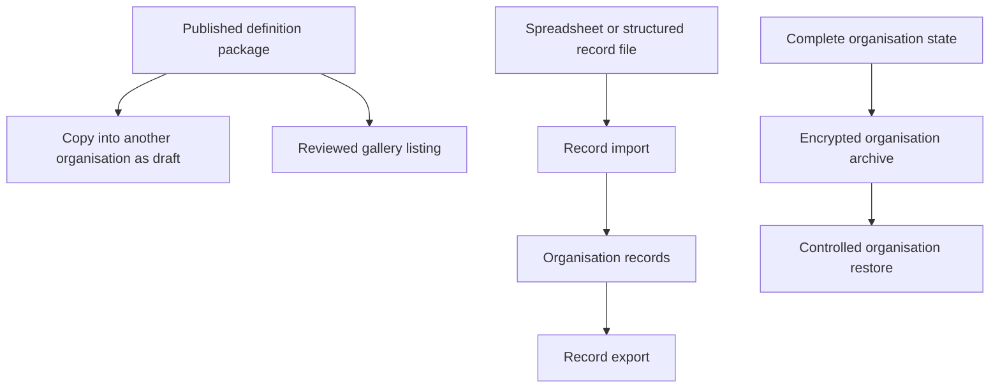

# 16. Copying, sharing, import and export

[Previous: Plans, billing and usage limits](15-plans-billing-and-usage.md) · [Specification index](README.md) · Next: [Runtime services, storage and caching](17-runtime-storage-and-caching.md)

## Four distinct operations

The platform separates definition copying, gallery distribution, record import/export, and complete organisation backup transfer. They have different safety and completeness requirements.

## Definition packages

A package contains published [root definitions](03-composition-and-publication.md#definition-ownership), a manifest, dependency ranges, stable identifiers, source version, publisher, content fingerprint, required capabilities, and installation notes.

A package never contains organisation records, memberships, secrets, access tokens, private files, billing identifiers, assistant conversations, activity history, or live connection instances.

## Copying between organisations

Copying creates drafts with new organisation ownership. Before creation, the platform shows:

- Included roots and components.
- Existing dependencies that can be reused.
- Missing modules, themes, connection types, interfaces, roles, blocks, or capabilities.
- Identifier collisions and proposed remapping.
- Connection instances, secrets, public addresses, organisation-specific recipients, and file references that will be cleared.

The copy does not publish automatically. Missing dependencies must be installed, mapped, replaced, or explicitly removed before validation. The default policy and handling of missing optional features is [Decision D19](appendices/decisions.md#d19-cross-organisation-copy-policy).

## Gallery

A gallery listing references a reviewed package version and displays publisher, purpose, required capabilities, requested permissions, dependencies, release notes, and support status. Installation uses the same preview and validation as direct copying.

Removing a gallery listing does not remove installed definitions. A security withdrawal can prevent new installs and warn affected organisation owners without silently changing their live applications.

## Record import

Record import accepts a documented tabular or structured record format. It includes:

1. Upload and safety checks through [files and attachments](11-files-and-attachments.md).
2. Record-type and field mapping.
3. Type, choice, relationship, required, uniqueness, and access validation.
4. A dry-run report with row-level errors and expected creates/changes.
5. A confirmed bounded background run.
6. A result file and activity summary.

The caller chooses a declared duplicate policy: create only, update by permanent identifier, or update by an approved unique field. The platform never guesses a match from a display name.

## Record export

Export uses one [query](10-queries-reports-search.md), current [access](04-access-and-permissions.md), selected fields, declared format, row limit, and expiry. Large exports run in the background and create a short-lived private [file](11-files-and-attachments.md). Sensitive-field export requires explicit permission and is recorded.

## Complete organisation archive and restore

A complete organisation archive is not a spreadsheet import. It contains versioned definitions, records, relationships, file manifests and encrypted bytes, roles and assignments, retained workflow state, required activity, retention receipts, and a signed manifest. Secrets are excluded or separately re-authorised.

Restore is an operator-controlled disaster-recovery or migration process with compatibility checks, identifier mapping, integrity verification, privacy-removal replay, and a full [organisation separation test](20-quality-and-acceptance.md#organisation-separation-suite) before opening access.

## Acceptance examples

- Copying an application never copies a usable connection secret or private file address.
- An unresolved required dependency prevents publication of the copied draft.
- Import dry-run and confirmed execution use the same mapping and validation rules.
- Record export cannot include a field the caller cannot read.
- A complete archive can restore a test organisation without pretending that spreadsheet record import restores definitions, roles, files, or history.
