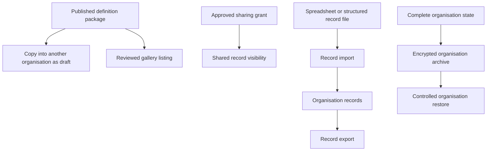
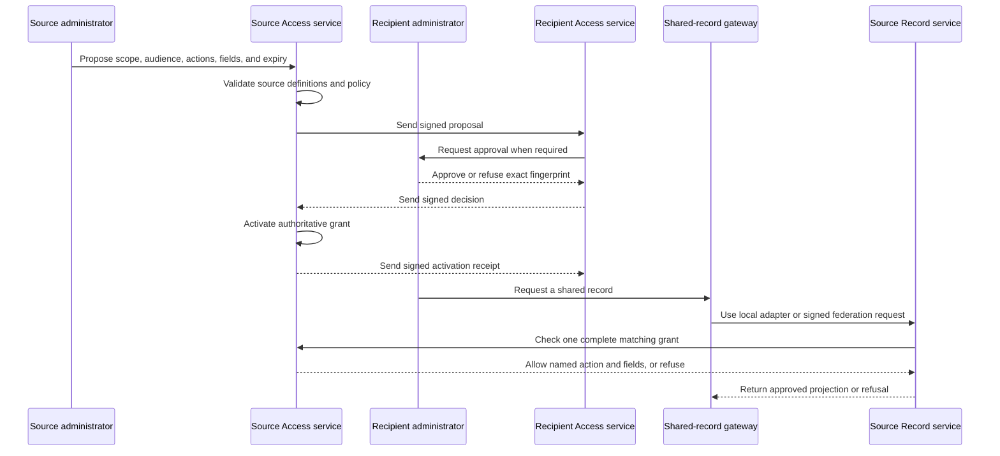

# 16. Copying, sharing, import and export

[Previous: Plans, billing and usage limits](15-plans-billing-and-usage.md) · [Specification index](README.md) · Next: [Runtime services, storage and caching](17-runtime-storage-and-caching.md)

## Five distinct operations

The platform separates definition copying, gallery distribution, record sharing, record import/export, and complete organisation backup transfer. They have different safety and completeness requirements.

## Definition packages

A package contains published [root definitions](03-composition-and-publication.md#definition-ownership), a manifest, dependency ranges, stable identifiers, source version, publisher, content fingerprint, required capabilities, and installation notes.

A package never contains organisation records, organisation accounts, secrets, access tokens, private files, billing identifiers, assistant conversations, activity history, or live connection instances.

## Copying between organisations

Copying creates drafts with new organisation ownership. Before creation, the platform shows:

- Included roots and components.
- Existing dependencies that can be reused.
- Missing modules, themes, connection types, interfaces, roles, blocks, or capabilities.
- Identifier collisions and proposed remapping.
- Connection instances, secrets, public addresses, organisation-specific recipients, and file references that will be cleared.

The copy does not publish automatically. Missing dependencies must be installed, mapped, replaced, or explicitly removed before validation. The default policy and handling of missing optional features is [Decision D19](appendices/decisions.md#d19-cross-organisation-copy-policy).

## Gallery

A gallery listing references a reviewed package version and displays publisher, purpose, required capabilities, requested permissions, dependencies, release notes, and support status. Installation uses the same preview and validation as direct copying.

Removing a gallery listing does not remove installed definitions. A security withdrawal can prevent new installs and warn affected organisation owners without silently changing their live applications.

## Record sharing

Record sharing makes records owned by one organisation or application available to an approved recipient without copying or transferring ownership. It is distinct from definition copying, gallery distribution, record import/export, and whole-organisation restore.

Approved [D31](appendices/decisions.md#d31-cross-organisation-sharing-release-scope) gives the user one sharing experience whether the recipient is in the source cluster or another Vortex cluster. The product never asks the user to choose a transport. The shared-record gateway resolves the organisations and selects either the local adapter or the signed [Vortex Federation API](17-runtime-storage-and-caching.md#vortex-federation-between-clusters).

The source cluster remains authoritative in both cases. Under approved [D30](appendices/decisions.md#d30-data-residency-for-shared-records), a cross-cluster response may travel through the recipient service and browser for display or an approved action, but no persistent business-record copy is stored in the recipient cluster.

### App-definition sharing versus record sharing

| Concern | App-definition sharing | Record sharing |
|---|---|---|
| What is shared | Published application package (pages, workflows, schemas, themes) | Live organisation-owned records |
| Ownership | Target organisation installs and owns their instance of the definition | Source organisation retains ownership of records |
| Data isolation | Target's records are private; source cannot see them | Target sees source's records through a grant; no data is copied |
| Mechanism | [Definition packages](#definition-packages) and [gallery](#gallery) | [Access grants](04-access-and-permissions.md#shared-record-access) enforced by the Access and Record services and database row restrictions |
| Updates | Source publishes new versions; target chooses when to update | Changes to shared records are visible immediately |

The Organisation Portal presents “Install a definition” and “Share records” as separate actions. Neither action silently offers or enables the other.

### Creating a grant

A proposed grant names one source organisation, one recipient organisation or application, one scope, its audience, allowed actions, readable and changeable fields, export choice, approved recipient region, start, and optional expiry. It also names the source record-contract lineage and the recipient application's proven compatibility mapping. Under approved [D35](appendices/decisions.md#d35-finding-a-recipient-organisation), the source enters the recipient's copyable organisation sharing code or follows its signed invitation link, then confirms the returned approved name and region; discovering it grants no access. The proposal cannot become active until all required approvals are recorded. The approval choice is [D26](appendices/decisions.md#d26-cross-organisation-sharing-approval), and the recipient audience is [D32](appendices/decisions.md#d32-recipient-audience).

The platform-owned `vortex.approvals` capability supplies the Organisation Portal screens and protected approval path. The Access service remains authoritative for activation. Approval decisions are immutable; later revocation is a separate recorded action.

For a same-cluster grant, the source and recipient protected records can be changed in one database transaction. For a cross-cluster grant, activation uses signed, duplicate-safe messages rather than pretending two databases share a transaction:

1. The source creates and signs an immutable proposal fingerprint.
2. The recipient verifies the source cluster, application binding, roles, destination policy, and required approval; it returns a signed acceptance or refusal for that exact fingerprint.
3. The source verifies the response and activates the authoritative grant.
4. The source returns a signed activation receipt, and the recipient marks its non-content grant mirror active.
5. Either side can ask the source for the current status and safely repair a missed message through [reconciliation](17-runtime-storage-and-caching.md#grant-activation-and-reconciliation).

The recipient mirror contains routing, audience, status, identifiers, fingerprints, compatibility mapping reference, and receipts only. It never contains source record values. Revocation and expiry are authoritative at the source, so a delayed mirror update cannot keep access alive. A move to a different recipient region suspends the source grant until that destination is included in a newly approved payload.

### Scope and saved sharing conditions

A grant chooses exactly one scope kind: a module, a record type, a published saved sharing condition, or one record. It does not populate several optional scope fields and ask the runtime to guess which takes precedence.

A saved sharing condition belongs to the source definition, uses a narrow validated condition vocabulary, and is tested at publication. A grant may supply only declared parameters. Free-form conditions are never stored on a grant. The final condition policy is [D27](appendices/decisions.md#d27-filter-grant-condition-complexity).

When a source record changes, the database evaluates whether it still matches the published condition. No background copy is maintained. Query and cache restrictions are defined in [queries, reports, search and live updates](10-queries-reports-search.md#shared-record-reads).

### Actions, fields, export, and re-sharing

Cross-organisation grants use allowlists: anything not named is refused. Sensitive fields are unavailable in the first release. Export is separately allowed or refused and defaults to refused. These choices remain [D33](appendices/decisions.md#d33-shared-actions-fields-and-export).

A recipient cannot grant the source record to a third organisation. The original source must create a new direct grant, subject to [D28](appendices/decisions.md#d28-cross-organisation-sharing-chains).

## Record import

Record import accepts a documented tabular or structured record format. It includes:

1. Upload and safety checks through [files and attachments](11-files-and-attachments.md).
2. Record-type and field mapping.
3. Type, choice, relationship, required, uniqueness, and access validation.
4. A dry-run report with row-level errors and expected creates/changes.
5. A confirmed bounded background run.
6. A result file and activity summary.

The caller chooses a declared duplicate policy: create only, update by permanent identifier, or update by an approved unique field. The platform never guesses a match from a display name.

## Record export

Export uses one [query](10-queries-reports-search.md), current [access](04-access-and-permissions.md), selected fields, declared format, row limit, and expiry. Large exports run in the background and create a short-lived private [file](11-files-and-attachments.md). Sensitive-field export requires explicit permission and is recorded.

## Complete organisation archive and restore

A complete organisation archive is not a spreadsheet import. It contains versioned definitions, records, relationships, file manifests and encrypted bytes, roles and assignments, retained workflow state, required activity, retention receipts, and a signed manifest. Secrets are excluded or separately re-authorised.

Restore is an operator-controlled disaster-recovery or migration process with compatibility checks, identifier mapping, integrity verification, privacy-removal replay, and a full [organisation separation test](20-quality-and-acceptance.md#organisation-separation-suite) before opening access.

## Acceptance examples

- Copying an application never copies a usable connection secret or private file address.
- An unresolved required dependency prevents publication of the copied draft.
- Sharing records with another organisation does not create copies in the target's storage.
- A saved-condition grant automatically includes new records that match the condition and excludes records that no longer match.
- Revoking a sharing grant does not affect the source organisation's records.
- The same approved grant produces the same visible fields and allowed actions across local and remote routes.
- Losing a cross-cluster activation receipt is recoverable by reconciliation and never produces two grants or a partial record copy.
- A source-cluster or network outage displays a temporary-unavailability state and never falls back to an older recipient-stored record.
- Changing an approval display record directly cannot activate a grant.
- A recipient cannot re-share a source record to a third organisation.
- Import dry-run and confirmed execution use the same mapping and validation rules.
- Record export cannot include a field the caller cannot read.
- A complete archive can restore a test organisation without pretending that spreadsheet record import restores definitions, roles, files, or history.
