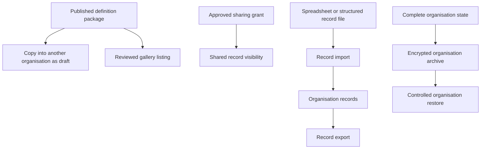
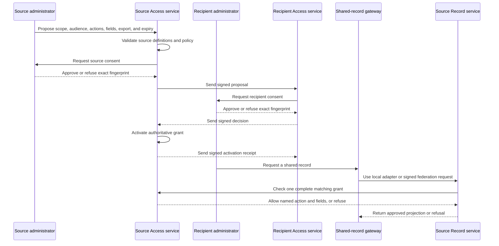

# 16. Copying, sharing, import and export

[Previous: Entitlements and metering](15-entitlements-and-metering.md) · [Specification index](README.md) · Next: [Runtime services, storage and caching](17-runtime-storage-and-caching.md)

## Five distinct operations

The platform separates definition copying, gallery distribution, record sharing, record import/export, and complete organisation backup transfer. They have different safety and completeness requirements.

## Definition packages

A package contains published [modules or applications](03-composition-and-publication.md#definition-ownership-and-versions), a manifest, dependency ranges, stable identifiers, source version, publisher, content fingerprint, required capabilities, and installation notes.

A package never contains organisation records, organisation accounts, secrets, access tokens, private files, commercial-system identifiers, activity history, or live connection instances.

## Copying between organisations

Copying creates drafts with new organisation ownership. Before creation, the platform shows:

- Included roots and components.
- Existing dependencies that can be reused.
- Missing modules, themes, connection types, interfaces, roles, blocks, or capabilities.
- Identifier collisions and proposed remapping.
- Connection instances, secrets, public addresses, organisation-specific recipients, and file references that will be cleared.

The copy is always an incomplete draft and never publishes automatically. Every missing dependency must be installed, mapped to a compatible local dependency, or explicitly removed with its affected components. Validation and publication remain blocked until the dependency report is empty.

## Gallery

A gallery listing references a reviewed package version and displays publisher, purpose, required capabilities, requested permissions, dependencies, release notes, and support status. Installation uses the same preview and validation as direct copying.

Removing a gallery listing does not remove installed definitions. A security withdrawal can prevent new installs and warn affected organisation owners without silently changing their live applications.

## Record sharing

Record sharing makes records owned by one organisation or application available to an approved recipient without copying or transferring ownership. It is distinct from definition copying, gallery distribution, record import/export, and whole-organisation restore.

The user has one sharing experience whether the recipient is in the source cluster or another Vortex cluster. The product never asks the user to choose a transport. The shared-record gateway resolves the organisations and selects either the local adapter or the signed [Vortex Federation API](17-runtime-storage-and-caching.md#vortex-federation-between-clusters).

The source cluster remains authoritative in both cases. A cross-cluster response may travel through the recipient service and browser for display, search, reporting, or an approved action, but no persistent business-record copy, search document, or report result is stored in the recipient cluster.

### App-definition sharing versus record sharing

| Concern | App-definition sharing | Record sharing |
|---|---|---|
| What is shared | Published application package (pages, workflows, schemas, themes) | Live organisation-owned records |
| Ownership | Target organisation installs and owns their instance of the definition | Source organisation retains ownership of records |
| Data isolation | Target's records are private; source cannot see them | Target sees source's records through a grant; no data is copied |
| Mechanism | [Definition packages](#definition-packages) and [gallery](#gallery) | [Access grants](04-access-and-permissions.md#shared-record-access) enforced by the Access and Record services and database row restrictions |
| Updates | Source publishes new versions; target chooses when to update | Changes to shared records are visible immediately |

The Organisation Administration application presents “Install a definition” and “Share records” as separate actions. Neither action silently offers or enables the other.

### Creating a grant

A proposed cross-organisation grant names one source organisation, one recipient organisation, one recipient application, one or more recipient application roles, one scope, allowed actions, readable and changeable fields, export choice, approved recipient region, start, and required expiry. It also names the source record-contract lineage and the recipient application's proven compatibility mapping. The source enters the recipient's copyable organisation sharing code or follows its signed invitation link, then confirms the returned approved name and region; discovering it grants no access.

Every grant requires an authorised source administrator to approve the exact records, condition parameters, actions, fields, export choice, region, start, and expiry, and an authorised recipient administrator to accept the exact application, roles, responsibility, region, start, and expiry. Both decisions cover one complete proposal fingerprint. Changing any fingerprinted value makes the earlier decisions unusable and returns the proposal to approval.

An ordinary administration application may present the proposal and collect authorised responses, but the Access service alone records protected [grant-consent evidence](04-access-and-permissions.md#protected-grant-consent) and activates the grant. Consent decisions are immutable; later revocation is a separate recorded action.

For a same-cluster grant, the source and recipient protected records can be changed in one database transaction. For a cross-cluster grant, activation uses signed, duplicate-safe messages rather than pretending two databases share a transaction:

1. The source creates and signs an immutable proposal fingerprint.
2. The source records its authorised approval, then the recipient verifies the source cluster, application binding, roles, destination policy, and proposal; it returns a signed acceptance or refusal for that exact fingerprint.
3. The source verifies the response and activates the authoritative grant.
4. The source returns a signed activation receipt, and the recipient marks its non-content grant mirror active.
5. Either side can ask the source for the current status and safely repair a missed message through [reconciliation](17-runtime-storage-and-caching.md#grant-activation-and-reconciliation).

The recipient mirror contains routing, audience, status, identifiers, fingerprints, compatibility mapping reference, and receipts only. It never contains source record values. Revocation and expiry are authoritative at the source, so a delayed mirror update cannot keep access alive. A move to a different recipient region suspends the source grant until that destination is included in a newly approved payload.

### Scope and saved sharing conditions

A grant chooses exactly one scope kind: a module, a record type, a published saved sharing condition, or one record. It does not populate several optional scope fields and ask the runtime to guess which takes precedence.

A saved sharing condition belongs to a published source definition, uses a narrow validated condition vocabulary, and is tested at publication. A grant pins the condition's permanent identifier, published revision, contract fingerprint, and declared parameter values. Free-form and inline grant conditions are never stored or executed. Publishing a changed condition does not alter an active grant; using the new revision requires a changed proposal and fresh approval by both organisations.

When a source record changes, the database evaluates whether it still matches the published condition. No background copy is maintained. Query and cache restrictions are defined in [queries, reports, search and live updates](10-queries-reports-search.md#shared-record-reads).

### Actions, fields, export, and re-sharing

Cross-organisation grants use explicit action, readable-field, and changeable-field allowlists: anything not named is refused. Changeable fields are a subset of readable fields, and only actions published as shareable by the source definition may be selected. Sensitive fields are unavailable in the first release. Export is separately allowed or refused, defaults to refused, and is part of both organisations' approval fingerprint. Broad `collaborative` or `full_edit` levels are not grant data.

A recipient cannot grant the source record, its reference, a shared query, or a live result to a third organisation. A new live recipient requires a new direct grant from the original source. Vortex refuses a grant whose proposed source does not own the record and prevents shared records from entering public pages, interfaces, connections, workflows, or recipient-owned bulk work.

An approved export is intentionally different from live re-sharing: it creates a downloaded copy outside Vortex control. The approval screen must state that revoking the grant cannot recall a file already downloaded and that the recipient becomes responsible for its permitted use, storage, onward disclosure, and deletion. If that transfer is unacceptable, export must remain refused.

## Record import

Record import accepts a documented tabular or structured record format. It includes:

1. Upload and safety checks through [files and attachments](11-files-and-attachments.md).
2. Record-type and field mapping.
3. Type, choice, relationship, required, uniqueness, and access validation.
4. A dry-run report with row-level errors and expected creates/changes.
5. A confirmed bounded background run.
6. A result file and activity summary.

The caller chooses a declared duplicate policy: create only, update by permanent identifier, or update by an approved unique field. The platform never guesses a match from a display name.

Importing values previously downloaded through an approved shared export creates new recipient-owned records; it does not preserve live access, source ownership, or the source grant. Vortex cannot reliably recognise or control every transformed external file. The source therefore permits this possibility only by approving export, and the recipient accepts responsibility before download. With export refused, the platform provides no record-copy path from a live grant.

## Record export

Export uses one [query](10-queries-reports-search.md), current [access](04-access-and-permissions.md), selected fields, declared format, row limit, and expiry. Large exports run in the background and create a short-lived private [file](11-files-and-attachments.md). Sensitive-field export requires explicit permission and is recorded.

For shared records, the complete query runs at the source against one active grant. Export must be approved by that grant, contains only its readable non-sensitive fields, and rechecks the saved sharing condition throughout bounded generation. The source owns the temporary export job and file; the recipient cluster stores neither. The recipient downloads the result through a short-lived checked instruction. Source and recipient activity entries share one correlation identifier and record the grant, query fingerprint, field identifiers, row count, expiry, and outcome without recording exported values.

## Complete organisation archive and restore

A complete organisation archive is not a spreadsheet import. It contains versioned definitions, records, relationships, file manifests and encrypted bytes, roles and assignments, retained workflow state, required activity, retention receipts, and a signed manifest. Secrets are excluded or separately re-authorised.

Restore is an operator-controlled disaster-recovery or migration process with compatibility checks, identifier mapping, integrity verification, privacy-removal replay, and a full [organisation separation test](20-quality-and-acceptance.md#organisation-separation-suite) before opening access.

## Acceptance examples

- Copying an application never copies a usable connection secret or private file address.
- An unresolved required dependency prevents publication of the copied draft.
- Sharing records with another organisation does not create copies in the target's storage.
- A saved-condition grant automatically includes new records that match the condition and excludes records that no longer match.
- Revoking a sharing grant does not affect the source organisation's records.
- The same approved grant produces the same visible fields and allowed actions across local and remote routes.
- Losing a cross-cluster activation receipt is recoverable by reconciliation and never produces two grants or a partial record copy.
- A source-cluster or network outage displays a temporary-unavailability state and never falls back to an older recipient-stored record.
- Changing an approval display record directly cannot activate a grant.
- A recipient cannot re-share a source record to a third organisation.
- A proposal cannot activate until authorised administrators in both organisations approve the same fingerprint.
- A saved-condition revision or parameter change requires a new proposal and both consent decisions; it never widens an active grant silently.
- Shared search and reports execute at the source and leave no recipient index or materialised result.
- A shared export is refused by default, contains only approved fields when enabled, and warns that a completed download cannot be recalled by revocation.
- Import dry-run and confirmed execution use the same mapping and validation rules.
- Record export cannot include a field the caller cannot read.
- A complete archive can restore a test organisation without pretending that spreadsheet record import restores definitions, roles, files, or history.
