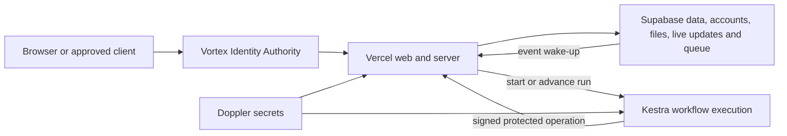
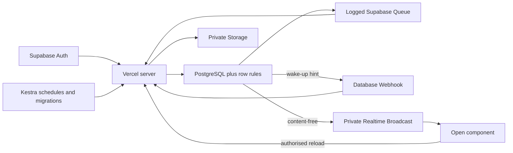
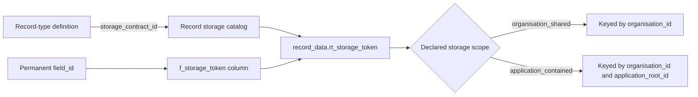
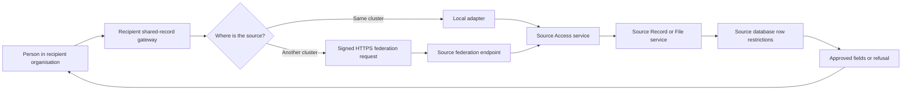
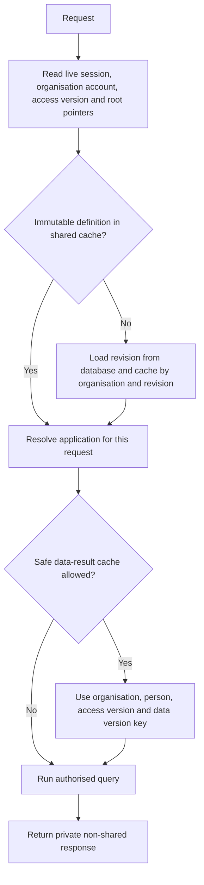

# 17. Runtime services, storage and caching

[Previous: Copying, sharing, import and export](16-copying-sharing-import-export.md) · [Specification index](README.md) · Next: [Delivery environments, database changes and testing](18-delivery-and-testing.md)

## Hosting boundaries

The platform uses three operated services:

- [Vercel](https://vercel.com/docs) runs the [Next.js](https://nextjs.org/docs) web application, server routes, and shared runtime cache.
- [Supabase](https://supabase.com/docs) provides [PostgreSQL](https://www.postgresql.org/docs/) data storage, identity-authority support, file storage, live updates, and a durable [message queue](https://supabase.com/docs/guides/queues).
- [Kestra](https://kestra.io/docs) executes durable workflows, schedules, migrations, access-test orchestration, backups, and operational jobs.

[Doppler](https://docs.doppler.com/docs) distributes environment secrets. It is a secret-management control, not an application data store.

## Supabase capability policy

Vortex uses Supabase as an integrated platform, but each capability has one narrow job. This avoids building replacements for managed database features while keeping deployments, secrets, and business scheduling under their already approved owners.

| Supabase capability | Vortex use | Boundary |
|---|---|---|
| [Auth](https://supabase.com/docs/guides/auth) and [asymmetric signing keys](https://supabase.com/docs/guides/auth/signing-keys) | Environment-wide identity authority and locally verifiable short-lived identity tokens | Organisation roles, teams, application access and grants remain live Vortex data, not token claims. |
| PostgreSQL and [row-level security](https://supabase.com/docs/guides/database/postgres/row-level-security) | Authoritative data, transactions, constraints and organisation separation | Internal service schemas are not exposed through the Data API. Request roles do not own tables or bypass row rules. |
| [Queues](https://supabase.com/docs/guides/queues) | Logged, durable event delivery after a committed save | Queue client functions are server-only and the `pgmq_public` interface is not exposed to browsers. |
| [Database Webhooks](https://supabase.com/docs/guides/database/webhooks) | Asynchronous low-latency wake-up after durable work exists | A webhook is a hint, not delivery proof; the queue and scheduled Kestra recovery remain authoritative. |
| [Realtime Broadcast](https://supabase.com/docs/guides/realtime/authorization) | Private, content-free invalidation for open components | Clients reload through the authorised query path; business values are never broadcast. |
| [Storage](https://supabase.com/docs/guides/storage) | Private objects, resumable uploads and short-lived signed transfers | Business files are never public; Storage row policies and File-service checks both apply. |
| [CLI, database tests and linting](https://supabase.com/docs/guides/local-development/cli/testing-and-linting) | Reproducible local database, migration checks, pgTAP tests and database lint | The shared Testing project remains the authoritative platform and separation test. Kestra alone migrates Testing and Production. |
| [Managed backups](https://supabase.com/docs/guides/platform/backups) and database advisers | Provider recovery layer and reviewed security/performance findings | Independent encrypted backups, restore drills and reviewed migrations remain required. Adviser suggestions never change production automatically. |

Supabase Cron is not a second workflow system: Kestra owns business schedules, retention, recovery, and operational jobs. Edge Functions are not a second server boundary: Vercel owns web and interface routes. Supabase Vault is not a second secret authority: Doppler owns secrets. Read replicas are added only after measured read demand, recovery needs, cost, and routing behaviour justify them. Direct browser access to business tables, direct cross-cluster database connections, logical replication for sharing, and service-role-key use are refused.

## Platform services inside the codebase

The codebase is divided into sixteen named services. These are package and ownership boundaries, not sixteen separately deployed servers.

| Service | Owns |
|---|---|
| Definition | Module and application drafts, validation, immutable published revisions, dependency graph, restore |
| Identity | Tenants, tenant-administrator assignments, organisation hierarchy, global identities, organisation accounts, invitations, sessions, sign-in |
| Access | Permissions, roles, assignments, sharing grants, access versions, allow/refuse decision, protected grant activation |
| Module | Module installation, dependencies, generated storage changes |
| Record | Record validation, storage, calculations, totals, concurrency, data versions |
| Query | Tables, boards, calendars, summaries and saved views |
| Rule | Typed conditions and immediate rule effects |
| Event | Transactional event outbox, queue dispatch, retries and failed sequences |
| Workflow | Execution references, schedules, generic human-input waits and the [Kestra](https://kestra.io/docs) boundary; Kestra owns execution status |
| App | Application assembly, module bindings, navigation, options and application roles |
| Page | Block registration, page resolution, form drafts, page states and rendering contract |
| Theme | Application-contained and platform-catalogue theme values, inheritance and legibility validation |
| Search | Search-document maintenance, ranking and access recheck |
| File | Upload admission, metadata, lifecycle, storage allowance and download grants |
| Connection | Connection types, secret grants, outgoing calls, incoming messages and health |
| Interface | Versioned operation catalogue, public interface boundary, cluster directory and federation transport |

Each service owns its tables and public contract. Another service calls that contract rather than reading the owner's tables. Dependency direction and build order are defined in the [revised build plan](../build-plan/README.md).

## Database and storage rules

- Every organisation-owned row carries its organisation identifier and is indexed with that identifier first where the access path requires it.
- Database row restrictions protect every organisation-owned table for select, insert, update, and delete.
- Only application-record tables explicitly marked shareable evaluate active [access grants](04-access-and-permissions.md#shared-record-access). Identity, secrets, connections, activity, grant-consent decisions, access-control rows, entitlement policy, and other protected platform tables never become visible through a record grant.
- Request database roles do not own tables and cannot bypass the row restrictions.
- The table-owner role is limited to migration and controlled verification work.
- Every database transaction establishes global identity or system actor, tenant, organisation account, organisation, application, and correlation context before reading organisation data. Tenant-administrator context alone never satisfies an organisation record policy.
- Organisation file paths begin with the organisation identifier and are protected by storage policy and server checks.
- Each service's schema is accessible only through that service's database functions or server contract.

### Record-table allocation

The Record service maintains a protected storage catalog. One `storage_contract_id` maps to one physical business-record table in a cluster. Application bindings and organisation installations reuse that mapping; they do not create tables.

- The table is allocated for a record-type storage lineage, not for each organisation or application. A shared definition package therefore requires one table migration per cluster rather than one migration for every installation.
- A table has fixed system columns from the [record storage contract](appendices/data-contracts.md#record-storage-contract) and one typed business column for each field in the active compatible lineage. Optional fields added by a compatible release are nullable for records still governed by an earlier revision.
- Physical names use immutable, collision-checked storage tokens recorded in the catalog. Human names and builder keys may appear in database comments and operational tools but never determine table or column identity.
- An independently created or structurally forked record type receives a new storage-contract identity and table. A package install may preserve a source storage identity only when the signed package lineage and fingerprint validate.
- Organisation-shared rows use `organisation_id` as their data boundary. Application-contained rows additionally require `application_root_id`. Unique constraints and lookup indexes include the complete applicable scope before a business value.
- A relationship always repeats and enforces `organisation_id`. Two application-contained endpoints must also have the same `application_root_id`. An application-contained record may link to an organisation-shared record in the same organisation. A sharing grant never creates a stored cross-organisation or cross-application relationship.
- Database migrations resolve tables and fields through the catalog. Runtime requests provide stable definition identifiers and never accept a physical table or column name from a browser, definition author, workflow, interface caller, or federation peer.

Creating a separate schema or table set for every organisation or application is refused because it would multiply migrations, indexes, row restrictions, backups, and operational checks without improving isolation. Organisation separation is enforced by row restrictions and the complete scope keys, while structurally different definitions remain physically separate through their storage-contract identities.

## Vortex federation between clusters

All Vortex clusters use the same published data contracts, but clusters may run different compatible releases during deployment and remain separate security, availability, and data-residency boundaries. Cross-cluster sharing therefore uses a versioned Vortex service contract, not a direct database connection.

The **shared-record gateway** is one product-facing contract with two adapters:

- The local adapter calls the source Access, Record, Query, and File services inside the current cluster and relies on the source database row restrictions.
- The remote adapter sends the same bounded request to the source cluster's protected federation endpoint. The source runs the access decision and database query; the recipient does not receive database credentials, raw SQL access, or a broad unfiltered result.

The route is an implementation detail. Grant identifiers, query shapes, actions, field allowlists, result envelopes, errors, activity, and user-visible states are the same. A cross-cluster route may have higher latency or a source-unavailable state, but it does not have different sharing permissions.

### Cluster identity and discovery

Every cluster has a permanent `cluster_id` and a signed manifest registered in the Vortex cluster directory. The protected directory stores operational metadata: approved federation address, environment, service region, status, supported federation protocol versions, supported shared-contract versions, current and next public signing keys, and the organisation identifiers currently routed to that cluster. It stores no organisation profile, account, role, record, file, or shared field value.

Clusters cache a verified directory entry for a bounded time and fail closed when they cannot establish a currently approved route. Private signing keys remain in [Doppler](https://docs.doppler.com/docs), and rotation overlaps old and new public keys for a documented verification window.

The shared [Vortex Identity Authority](02-people-organisations-and-sign-in.md#identity-across-clusters) issues asymmetric identity tokens whose public keys are available for local verification. Each cluster stores and authorises its own organisation accounts; a global identity token alone never proves organisation membership or a recipient role.

### Cross-cluster request

The recipient cluster first verifies the person's current identity, local organisation account, application access, roles, and access version. It then creates a short-lived recipient assertion containing only the identifiers and security context required by the [federation contract](appendices/data-contracts.md#federation-contracts). The source federation endpoint verifies it and establishes source-database request context containing the recipient cluster, organisation, account, application, roles, grant, and correlation identifier. The source's [PostgreSQL row-security policies](https://www.postgresql.org/docs/current/ddl-rowsecurity.html) remain the final database boundary.

The remote request uses HTTPS and an asymmetric [HTTP Message Signature](https://www.rfc-editor.org/rfc/rfc9421.html). The signature covers the request method, target address and path, destination authority, issue and expiry times, one-use nonce, federation version, correlation identifier, and [Content-Digest](https://www.rfc-editor.org/rfc/rfc9530.html). The source verifies the registered recipient-cluster key, intended audience, digest, clock window, nonce, compatible versions, and grant before calling a business service. A nonce cannot be accepted twice inside the replay window. The source signs the response status, correlation identifier, issue time, and content digest so the recipient can verify its origin and body before display.

The first release exposes only bounded protected operations:

- Shared-record query with source-side filters, sorts, field projection, cursor pagination, and page limits.
- Source-executed shared search and report queries using the same bounded query contract, with no recipient index or materialised report result.
- Source-owned approved export job and short-lived download instruction, with no recipient-cluster file copy.
- Named record action with the expected concurrency number and a duplicate-protection key.
- Grant proposal, acceptance, activation receipt, revocation notice, and authoritative status reconciliation.
- Source-owned file upload admission, upload completion, preview, or download through a short-lived grant or bounded stream.
- Content-free invalidation that tells an open recipient screen to re-run its authorised query.

Raw SQL, cross-cluster joins, unbounded reads, arbitrary source URLs, database credentials, and distributed database transactions are not federation operations.

### Grant activation and reconciliation

The source cluster owns the grant. The recipient cluster owns a non-content mirror used to show pending and active sharing, route requests, and store signed evidence. Cross-cluster activation follows the signed proposal, acceptance, activation-receipt, and status-reconciliation sequence in [record sharing](16-copying-sharing-import-export.md#creating-a-grant).

Every message has a permanent operation identifier, payload fingerprint, sender and receiver cluster, issue and expiry time, and duplicate-protection key. Repeating the same message returns the existing result. A message with the same operation identifier and different fingerprint is refused. There is no attempt to commit both databases atomically.

Source revocation and expiry take effect on the next source request even if the recipient mirror or notification is delayed. Reconciliation updates the mirror and its local access version; it never restores access the source has ended.

### Versions, failures, and efficiency

Every request names the federation protocol version, shared-contract version and fingerprint, relevant published module revision, and validated source-to-recipient definition mapping. A cluster accepts a documented compatible range during rolling deployment and refuses an unsupported version with a safe, stable error. Matching database structures do not allow this check to be skipped because migrations and application deployments may temporarily differ.

Remote queries are efficient by contract: filters, search, sorting, field selection, grouping, totals, counts, and cursor pagination run at the source; records and aggregates are returned in bounded batches; transport connections may be reused; and timeouts and failure isolation prevent one unavailable cluster consuming the recipient's request capacity. Application search fans out only across a bounded set of active grant mirrors, isolates each unavailable source, and groups merged remote results as shared rather than pretending that incomparable source ranks form one local index.

Recipient-side gateway consumption is measured for the recipient organisation. Source queries, searches, reports, actions, temporary export or file storage, and any network delivery are measured for the source organisation. Linked metering entries share one correlation identifier, the same category is not counted twice, and the allocation does not change between local and remote routes. The source rate-limits by recipient cluster, organisation, grant, and operation.

The recipient may cache signed cluster metadata, public keys, definition fingerprints, grant mirrors, saved non-content report definitions, and content-free invalidations. It does not persist business-record responses, files, search documents, report results, workflow payloads, or cross-request shared-data cache entries.

A timeout, unreachable source, invalid signature, replay, version mismatch, disabled route, entitlement or rate-limit refusal, unapproved recipient region, or uncertain grant status fails closed. The screen shows that the source organisation is temporarily unavailable when retry is safe; it never displays a stored stale record as if it were current. Shared-record responses use private no-store browser and intermediary caching instructions.

### Why database federation and replication are excluded

Matching schemas make contract validation and query translation easier, but they do not make database-level federation the simpler customer-sharing boundary. [PostgreSQL foreign data wrappers](https://www.postgresql.org/docs/current/postgres-fdw.html) require foreign servers, user mappings, remote credentials, matching column definitions, and coupled remote connections and transactions. That is useful for controlled operator analytics, not for carrying a different recipient account and grant through every customer request.

[PostgreSQL logical replication](https://www.postgresql.org/docs/current/logical-replication-restrictions.html) copies data and does not replicate schema changes, so subscriber schemas must still be coordinated. It would also add recipient storage, conflict, deletion, retention, search, recovery, and residency obligations that the source-authoritative, no-recipient-copy design deliberately avoids.

## Event dispatch without a permanent web worker

The [record save](06-records-and-lifecycle.md#save-sequence) writes an event outbox entry and a message to a logged durable [Supabase Queue](https://supabase.com/docs/guides/queues) in the same database transaction. Queue access is server-only and is not added to an exposed Data API schema. An asynchronous [database webhook](https://supabase.com/docs/guides/database/webhooks) wakes a protected Vercel dispatcher route. The dispatcher claims a bounded batch, honours per-record sequence, and starts [Kestra executions](https://kestra.io/docs/workflow-components/execution) for matched workflows.

A scheduled [Kestra](https://kestra.io/docs/workflow-components/triggers) recovery flow calls the platform dispatcher endpoint; it does not read the database. This recovers messages after a failed webhook or web deployment, while the database webhook provides the normal wake-up path.

## Cache model

The cache model distinguishes shared public assets, shared organisation-keyed values, and values that live only for one request.

The allowed layers are:

| Layer | Location and key | Rule |
|---|---|---|
| Built application assets | [Vercel CDN](https://vercel.com/docs/caching/cdn-cache), keyed by content hash | May be shared across organisations because the content is identical and contains no organisation data. This is the explicit exception to organisation-keyed caches. |
| Request-local values | One server request | Session context, live pointers, access version, and repeated calculations may be reused only within that request. |
| Immutable definition revisions | Shared [Vercel cache](https://vercel.com/docs/caching), keyed by organisation, root key, revision and content fingerprint | Revisions never change. Cross-organisation keys are structurally impossible. |
| Resolved application and theme | Shared cache, keyed by organisation, published revisions, person where needed, and current access version | A request reads current pointers and access version before using the entry. |
| Initial data-block result | Shared cache only when explicitly allowed; keyed by organisation, person, access version, record-type data versions and query fingerprint | Never stores sensitive fields. A record save increments the owning Record service's data version, making old results unreachable. |

Current published pointers, current organisation-account state, current access version, permission decisions, secrets, and responses containing sensitive fields are never served from a cross-request cache.

The [Access service](04-access-and-permissions.md) owns access versions. The [Record service](06-records-and-lifecycle.md) owns record-type data versions. Neither counter is stored on an Identity-owned organisation row.

## Cache correctness

- A cache-writing function requires an organisation identifier except for content-hashed application assets.
- Cached values that differ by person require the person identifier and access version.
- Data cache keys name every record-type data version used by the query.
- Publication does not depend on eventual cache expiry because current pointers are read live.
- [Vercel cache invalidation](https://vercel.com/docs/cli/cache) may reclaim old entries but is not the security mechanism.
- Private page responses instruct browsers and shared networks not to store them.

### Grant cache invalidation

Creating, activating, changing, revoking, or expiring a cross-organisation grant increases the source organisation's access version and the recipient organisation's local access version. Inside one cluster this is one protected transaction. Across clusters, signed duplicate-safe messages and reconciliation update each side independently; the source decision never waits on a recipient cache or mirror.

The first release does not place cross-organisation shared-record results in the shared data-result cache. A source record can change without changing the recipient organisation's own data version, so disabling this cache prevents stale or over-broad results until a complete cross-organisation version contract is proven. Published saved sharing conditions are evaluated by the database at query time; free-form grant conditions are not executed.

## Acceptance examples

- The static application shell can be a cross-organisation cache hit because it contains no organisation state.
- Priming every organisation-owned cache layer in Organisation A cannot create a hit in Organisation B.
- Suspending an organisation account makes the next request refuse before any person-specific cache value is used.
- Publishing a definition makes the next request read the new live pointer without waiting five minutes.
- Changing a record makes a cached data result under the old record-type data version unreachable.
- A cross-organisation shared-record query bypasses the cross-request data-result cache.
- A grant cannot expose an identity, connection, activity, grant-consent, entitlement-policy, or access-control row.
- A same-cluster request and its cross-cluster equivalent produce the same allowed fields, action outcome, and stable refusal code.
- A remote request with an altered body, reused nonce, expired signature, unregistered cluster, or incompatible contract version is refused before record access.
- Source revocation refuses a cross-cluster request even while the recipient mirror still says active.
- No cross-cluster request requires a database password for another cluster.
