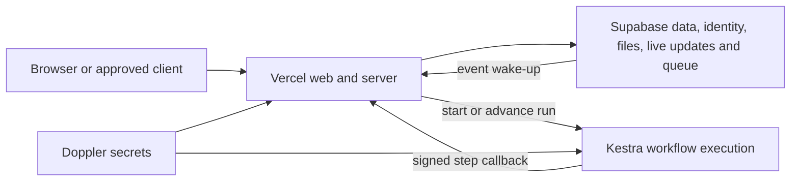
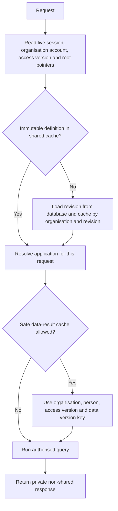

# 17. Runtime services, storage and caching

[Previous: Copying, sharing, import and export](16-copying-sharing-import-export.md) · [Specification index](README.md) · Next: [Delivery environments, database changes and testing](18-delivery-and-testing.md)

## Hosting boundaries

The platform uses three operated services:

- [Vercel](https://vercel.com/docs) runs the [Next.js](https://nextjs.org/docs) web application, server routes, and shared runtime cache.
- [Supabase](https://supabase.com/docs) provides [PostgreSQL](https://www.postgresql.org/docs/) data storage, authentication support, file storage, live updates, and a durable [message queue](https://supabase.com/docs/guides/queues).
- [Kestra](https://kestra.io/docs) executes durable workflows, schedules, migrations, access-test orchestration, backups, and operational jobs.

[Doppler](https://docs.doppler.com/docs) distributes environment secrets. It is a secret-management control, not an application data store.

## Platform services inside the codebase

The codebase is divided into sixteen named services. These are package and ownership boundaries, not sixteen separately deployed servers.

| Service | Owns |
|---|---|
| Definition | Drafts, validation, immutable published revisions, dependency graph, restore |
| Identity | Global identities, organisations, organisation accounts, invitations, sessions, sign-in |
| Access | Permissions, roles, assignments, sharing grants, access versions, allow/refuse decision, protected grant activation |
| Module | Module installation, dependencies, generated storage changes |
| Record | Record validation, storage, calculations, totals, concurrency, data versions |
| Query | Tables, boards, calendars, summaries and saved views |
| Rule | Typed conditions and immediate rule effects |
| Event | Transactional event outbox, queue dispatch, retries and failed sequences |
| Workflow | Run contracts, schedules, human approval tasks, notifications and the [Kestra](https://kestra.io/docs) boundary |
| App | Application assembly, module bindings, navigation, options and application roles |
| Page | Block registration, page resolution, form drafts, page states and rendering contract |
| Theme | Published theme values, inheritance and legibility validation |
| Search | Search-document maintenance, ranking and access recheck |
| File | Upload admission, metadata, lifecycle, storage allowance and download grants |
| Connection | Connection types, secret grants, outgoing calls, incoming messages and health |
| Interface | Versioned operation catalogue, public interface boundary and assistant tools |

Each service owns its tables and public contract. Another service calls that contract rather than reading the owner's tables. Dependency direction and build order are defined in the [revised build plan](../build-plan/README.md).

## Database and storage rules

- Every organisation-owned row carries its organisation identifier and is indexed with that identifier first where the access path requires it.
- Database row restrictions protect every organisation-owned table for select, insert, update, and delete.
- Only business-record tables explicitly marked shareable evaluate active [access grants](04-access-and-permissions.md#shared-record-access). Identity, billing, secrets, connections, activity, approval decisions, access-control rows, and other administrative tables never become visible through a record grant.
- Request database roles do not own tables and cannot bypass the row restrictions.
- The table-owner role is limited to migration and controlled verification work.
- Every database transaction establishes global identity or system actor, organisation account, organisation, application, and correlation context before reading organisation data.
- Organisation file paths begin with the organisation identifier and are protected by storage policy and server checks.
- Each service's schema is accessible only through that service's database functions or server contract.

## Event dispatch without a permanent web worker

The [record save](06-records-and-lifecycle.md#save-sequence) writes an event outbox entry and a durable [Supabase Queue](https://supabase.com/docs/guides/queues) message in the same database transaction. An asynchronous [database webhook](https://supabase.com/docs/guides/database/webhooks) wakes a protected Vercel dispatcher route. The dispatcher claims a bounded batch, honours per-record sequence, and starts [Kestra executions](https://kestra.io/docs/workflow-components/execution) for matched workflows.

A scheduled [Kestra](https://kestra.io/docs/workflow-components/triggers) recovery flow calls the platform dispatcher endpoint; it does not read the database. This recovers messages after a failed webhook or web deployment. The delivery-time choice is [Decision D11](appendices/decisions.md#d11-event-dispatch-runtime).

## Cache model

The cache model distinguishes shared public assets, shared organisation-keyed values, and values that live only for one request.

The allowed layers are:

| Layer | Location and key | Rule |
|---|---|---|
| Built application assets | [Vercel CDN](https://vercel.com/docs/caching/cdn-cache), keyed by content hash | May be shared across organisations because the content is identical and contains no organisation data. This is the explicit exception to organisation-keyed caches. |
| Request-local values | One server request | Session context, live pointers, access version, and repeated calculations may be reused only within that request. |
| Immutable definition revisions | Shared [Vercel cache](https://vercel.com/docs/caching), keyed by organisation, root key, revision and content fingerprint | Revisions never change. Cross-organisation keys are structurally impossible. |
| Resolved application and theme | Shared cache, keyed by organisation, published revisions, person where needed, and current access version | A request reads current pointers and access version before using the entry. |
| Initial data-block result | Shared cache only when explicitly allowed; keyed by organisation, person, access version, record-type data versions and query fingerprint | Never stores sensitive fields. A record save increments the owning Record service's data version, making old results unreachable. |

Current published pointers, current organisation-account state, current access version, permission decisions, secrets, and responses containing sensitive fields are never served from a cross-request cache.

The [Access service](04-access-and-permissions.md) owns access versions. The [Record service](06-records-and-lifecycle.md) owns record-type data versions. Neither counter is stored on an Identity-owned organisation row.

## Cache correctness

- A cache-writing function requires an organisation identifier except for content-hashed application assets.
- Cached values that differ by person require the person identifier and access version.
- Data cache keys name every record-type data version used by the query.
- Publication does not depend on eventual cache expiry because current pointers are read live.
- [Vercel cache invalidation](https://vercel.com/docs/cli/cache) may reclaim old entries but is not the security mechanism.
- Private page responses instruct browsers and shared networks not to store them.

### Grant cache invalidation

Creating, activating, changing, revoking, or expiring a cross-organisation grant increases both the source and recipient organisations' access versions in one protected operation. A cached permission answer computed under either old version is not served.

The first release does not place cross-organisation shared-record results in the shared data-result cache. A source record can change without changing the recipient organisation's own data version, so disabling this cache prevents stale or over-broad results until a complete cross-organisation version contract is proven. Published saved sharing conditions are evaluated by the database at query time; free-form grant conditions are not executed.

## Acceptance examples

- The static application shell can be a cross-organisation cache hit because it contains no organisation state.
- Priming every organisation-owned cache layer in Organisation A cannot create a hit in Organisation B.
- Suspending an organisation account makes the next request refuse before any person-specific cache value is used.
- Publishing a definition makes the next request read the new live pointer without waiting five minutes.
- Changing a record makes a cached data result under the old record-type data version unreachable.
- A cross-organisation shared-record query bypasses the cross-request data-result cache.
- A grant cannot expose an identity, billing, connection, activity, approval, or access-control row.
