# 18. Delivery environments, database changes and testing

[Previous: Runtime services, storage and caching](17-runtime-storage-and-caching.md) · [Specification index](README.md) · Next: [Operations, backup and recovery](19-operations-backup-and-recovery.md)

## Environments

The platform uses separate Local, Testing, and Production environments. Each has separate [Supabase](https://supabase.com/docs), [Vercel](https://vercel.com/docs), [Kestra](https://kestra.io/docs), [Doppler](https://docs.doppler.com/docs), addresses, secrets, files, queues and connections. An ordinary commercial application may also use provider test modes in Local or Testing, but that is not a platform environment invariant. An environment may contain several Vortex clusters, but it has one shared [Vortex Identity Authority](02-people-organisations-and-sign-in.md#identity-across-clusters) and no identity, trust, or federation route crosses into another environment.

No environment reads another environment's database, file store, queue, workflow state, cache, or secrets.

```mermaid
flowchart LR
    FEATURE[Feature branch] --> CHECKS[Formatting, types, unit, contract and build checks]
    CHECKS --> PREVIEW[Vercel preview]
    PREVIEW --> REVIEW[Human and automated review]
    REVIEW --> TESTING[Merge to testing]
    TESTING --> TMIG[Test migration and access suite]
    TMIG --> TAPP[Testing deployment and acceptance]
    TAPP --> APPROVE[Production approval]
    APPROVE --> PMIG[Backward-compatible production migration]
    PMIG --> PAPP[Production deployment]
    PAPP --> VERIFY[Smoke, separation and monitoring checks]
```

Pull requests do not start a database and do not run migrations or database access tests. Their required checks cover formatting, types, unit and contract tests, build, and preview. After merge to the shared `testing` branch, Kestra applies the ordered Testing migrations once and runs database constraints, row restrictions, service integration, and organisation-separation checks. A successful identified Testing revision is required before promotion to `main`.

The following outcomes are required:

- Database shape and access-rule tests run before production.
- A failed migration or access test prevents promotion.
- Testing and production migrations are applied once, in order, by [Kestra](https://kestra.io/docs).
- Application and database releases can occur in either order during deployment without breaking the running system.
- Production promotion requires an identified approved testing revision.

## Branch flow

Feature branches merge into `testing`. The verified `testing` revision is promoted to `main`. Direct unreviewed changes to either protected branch are refused. An administrator bypass is retained only as a break-glass recovery control: its use requires an incident reference, the reason ordinary review could not be used, the exact commit, the operator, the time, and an immediate follow-up review. It is never the normal delivery path and cannot make a failed required check acceptable.

The first installation of the delivery engine is a bounded bootstrap, not a promotion exception. Before its feature pull request merges, the operated Kestra resource may deploy only the pull request's exact reviewed commit SHA, with automatic branch redeployment disabled. Its Production flow may validate a `main` event and reach the approval hold, but it cannot open Production without successful Testing evidence for an ancestor with the identical migration set. After the exact commit merges to `testing`, the protected Testing event is delivered to that pinned engine and must pass. Only then may that verified revision be promoted to `main`; Coolify is returned to the protected `main` source at the same commit and normal automatic deployment begins. A moving feature branch, `testing`, or another unverified revision is never used as the bootstrap source.

- Every feature branch gets a [Vercel preview](https://vercel.com/docs/deployments/preview-deployments).
- Preview data is test data only and cannot use production credentials.
- The repository states which checks run on pull requests and which run only after merge to Testing.
- A pull request records the specification sections, decisions, migrations, tests, screenshots, privacy effect, and rollback or forward-fix plan it affects.

## Repository layout convention

Deployable applications follow the official Turborepo convention and live under `apps/`; the single Next.js composition root is `apps/web`. Shared packages remain separate workspace members and cannot become additional deployment roots. A different layout requires an explicit architecture reason and updated boundary, build, deployment, and documentation checks in the same change.

The Vercel project uses `apps/web` as its Root Directory and includes files outside that directory during the build. Its application-local `vercel.json` returns to the workspace root to install the frozen lockfile and run the one repository gate, `pnpm verify`, then publishes `.next` relative to `apps/web`. The matching Turborepo task declares `.next/**` except `.next/cache/**` as output so enabling task caching cannot omit the deployable application. Task caching is an optional build optimisation, not a release requirement. Vercel and local verification must not substitute a second command with different checks.

## Database changes

Database changes are immutable, ordered files. Once applied to a shared environment, a file is not edited. A correction is a later change.

Every change follows an expand-and-contract sequence:

1. Add compatible storage or functions.
2. Deploy code able to use old and new shapes.
3. Backfill in bounded resumable batches where required.
4. Switch reads and writes with measured verification.
5. Remove old shape only after no deployed code or retained workflow version uses it.

Generated module storage changes use the same mechanism. No web request performs schema changes.

### Supabase development and verification

- Developers use the [Supabase CLI local stack and migrations](https://supabase.com/docs/guides/local-development/cli-workflows) for reproducible database work. The repository seed contains only synthetic test data.
- The committed project uses Supabase's standard `supabase/config.toml`, `supabase/migrations/`, `supabase/seed.sql`, and `supabase/tests/` layout. The exact CLI version is pinned in the root workspace; no parallel migration directory or custom migration ledger exists.
- Each database change includes [pgTAP database tests](https://supabase.com/docs/guides/database/testing) for its constraints, functions and row rules, and runs [database linting](https://supabase.com/docs/guides/local-development/cli/testing-and-linting) over every Vortex-owned schema before review. Supabase-managed schemas and extension functions are excluded from this repository-owned lint result.
- Local tests prove fast database behaviour; they do not replace the linked Testing Supabase project. After merge to `testing`, Kestra applies the migration and runs the authoritative request-role, platform-service, and organisation-separation suite there.
- Testing issues promotion evidence only after its migration, registered pgTAP suites and database lint have all succeeded. The evidence names the exact repository, protected branch, complete commit, ordered migration files, migration-set fingerprint, Supabase CLI version, target PostgreSQL major and Kestra execution, and contains no credential.
- Production first validates and fingerprints the exact `main` commit without opening a database connection, then pauses for a named operator. The operator approves and identifies the Testing commit; Kestra records the authenticated resumer and loads the successful Testing evidence from its operational store rather than trusting retyped actor, execution or fingerprint values. Before connecting, the delivery process proves that the Testing commit is an ancestor of the Production commit and that their migration sets are identical. Remote migrations use Supabase's IPv4 session pooler on port 5432, which preserves the PostgreSQL session required by migrations and tests. Transaction mode on port 6543 is reserved for Vercel's serverless runtime and is not used for delivery. Both connections require full certificate and hostname verification against the project's Supabase root certificate.
- The Vercel-synced Doppler root configs `stg` and `prd` contain only the restricted `VORTEX_RUNTIME_DATABASE_URL` and `VORTEX_RUNTIME_DATABASE_SSL_ROOT_CERT`; there is no separate runtime-password variable. Database delivery uses a separate unsynced Doppler `Operations` environment because every Doppler branch config inherits its root secrets. Its `ops_stg` and `ops_prd` configs expose only a credential-free `VORTEX_MIGRATION_DATABASE_URL`, a separate raw `VORTEX_MIGRATION_DATABASE_PASSWORD`, and `VORTEX_DATABASE_SSL_ROOT_CERT` for the matching project-owner migration path. `ops_stg` inherits the three Testing values from the `Operations` root; `ops_prd` overrides the Production URL and password and inherits the common certificate. Kestra has one config-scoped, read-only service token per config and requests only those three named values. The Operations configs have no external sync. The four Kestra bootstrap values—the two service tokens and two distinct GitHub webhook keys—are protected Coolify runtime variables, unavailable during image builds. A webhook key authenticates only its matching GitHub-to-Kestra endpoint and grants no Doppler or database access. The delivery process validates the URL's owner, project, session-pooler host, port, and database, then supplies the password through `PGPASSWORD`, so reserved characters require no URL encoding. A migration credential never reaches Vercel, and a runtime credential is never used to apply a migration.
- Local `supabase test db` uses Supabase's Docker-based pgTAP helper. The operated Kestra flow instead runs the committed SQL tests with the pinned `pg_prove` harness inside its own image, because Kestra must not receive the host Docker socket. Both paths execute the same files in `supabase/tests/` and fail delivery on any assertion failure.
- Testing and Production each queue database delivery at concurrency one. Duplicate delivery is harmless because `supabase_migrations.schema_migrations` is the only application history. After delivery, its ordered filenames must exactly equal the selected commit's migration filenames; an extra, missing or renamed remote entry fails the run. Normal delivery never resets a shared environment. A separately authorised Testing-only recovery may rebuild an empty disposable Testing database after a fail-closed preflight proves there are no application tables, identities or files; it records before-and-after fingerprints and replays only the reviewed migration set. Production is never reset and no Production seed path exists.
- The Testing environment may use the [Index Advisor](https://supabase.com/docs/guides/database/extensions/index_advisor) against representative queries. A person reviews each suggestion and records an ordinary migration; no adviser creates a Production index directly.
- Preview builds remain database-free. They validate migration files and contracts without opening a database connection. A deployed preview server may receive only its restricted Testing runtime credential; no preview build or runtime receives a migration or table-owner credential.

## Test layers

The build separates tests by what they prove:

- Contract tests validate every definition and stable error code without a database.
- Unit tests validate pure business functions.
- Database tests validate migrations, constraints, transactions, row restrictions, and service database functions.
- Service tests validate boundaries such as file storage, queues, caches, connections, Kestra status reads, and protected workflow operations.
- Browser tests validate complete application behaviour on desktop and phone.
- Operational tests validate backup, restoration, alerting, and secret scanning.

The [organisation separation suite](20-quality-and-acceptance.md#organisation-separation-suite) is deliberately split between database and end-to-end tests; it is not rerun wholesale as a table owner where files, caches, subscriptions, public requests, and server behaviour have no meaningful table-owner equivalent.

## Release and recovery behaviour

- A production change has a defined forward fix. Database rollbacks are used only when the reverse operation is known safe and does not lose accepted data.
- Feature flags cannot bypass access, protected data handling, retention, or entitlement checks.
- A failed post-deployment verification stops further promotion and alerts the operator.
- Each environment's reviewed delivery flow binds its database connection to that environment's exact non-secret Supabase project reference. A correctly shaped connection for another project is refused before the database is opened.
- The previous web deployment remains available for rollback only while it is compatible with the current database shape.
- A deployment records code revision, migration set, definition-contract version, fixture version, operator, approvals, and verification outcome.

## Federation compatibility during delivery

The [Vortex Federation API](17-runtime-storage-and-caching.md#vortex-federation-between-clusters) is deployed with an overlap window: a cluster must continue accepting the previous compatible protocol and shared-contract version until every production cluster has moved beyond it. The cluster manifest advertises only versions the running deployment actually supports.

Before promotion, Testing runs a two-cluster matrix with the new release against the current production-compatible release in both source and recipient directions. It proves signed identity and recipient assertions, grant reconciliation, queries, actions, files, revocation, replay refusal, and safe unsupported-version errors. A database change that makes the same shared contract mean something different in the two versions is refused.

## Acceptance examples

- The documented branch flow and actual required checks agree.
- A migration that works only when the new web version deploys first is refused.
- A migration passes local pgTAP and database lint before the same tests run through Kestra against the shared Testing project.
- An access-rule test failure after merge to Testing prevents promotion to `main`; it does not retroactively fail the already merged feature pull request.
- Testing cannot send a live customer message, submit a real external transaction, or call a production connection.
- A released revision can be traced from Git commit through migration, test, deployment, and verification records.
- A rolling deployment keeps cross-cluster sharing safe between adjacent supported releases and fails closed outside the declared compatibility range.
