# 18. Delivery environments, database changes and testing

[Previous: Runtime services, storage and caching](17-runtime-storage-and-caching.md) · [Specification index](README.md) · Next: [Operations, backup and recovery](19-operations-backup-and-recovery.md)

## Environments

The platform uses separate Local, Testing, and Production environments. Each has separate [Supabase](https://supabase.com/docs), [Vercel](https://vercel.com/docs), [Kestra](https://kestra.io/docs), [Doppler](https://docs.doppler.com/docs), addresses, secrets, files, queues, connections, billing mode, and model-provider credentials.

No environment reads another environment's database, file store, queue, workflow state, cache, or secrets.

```mermaid
flowchart LR
    FEATURE[Feature branch] --> CHECKS[Types, lint, unit, contract and database access checks]
    CHECKS --> PREVIEW[Vercel preview]
    PREVIEW --> REVIEW[Human and automated review]
    REVIEW --> TESTING[Merge to testing]
    TESTING --> TMIG[Test migration and access suite]
    TMIG --> TAPP[Testing deployment and acceptance]
    TAPP --> APPROVE[Production approval]
    APPROVE --> PMIG[Backward-compatible production migration]
    PMIG --> PAPP[Production deployment]
    PAPP --> VERIFY[Smoke, separation and monitoring checks]
```

The precise pre-merge database environment is [Decision D20](appendices/decisions.md#d20-pre-merge-database-testing). The following outcomes are required regardless of the selected option:

- Database shape and access-rule tests run before production.
- A failed migration or access test prevents promotion.
- Testing and production migrations are applied once, in order, by [Kestra](https://kestra.io/docs).
- Application and database releases can occur in either order during deployment without breaking the running system.
- Production promotion requires an identified approved testing revision.

## Branch flow

Feature branches merge into `testing`. The verified `testing` revision is promoted to `main`. Direct unreviewed production changes are refused.

- Every feature branch gets a [Vercel preview](https://vercel.com/docs/deployments/preview-deployments).
- Preview data is test data only and cannot use production credentials.
- The branch check mechanism must be stated in the repository and match the selected [pre-merge decision](appendices/decisions.md#d20-pre-merge-database-testing).
- A pull request records the specification sections, decisions, migrations, tests, screenshots, privacy effect, and rollback or forward-fix plan it affects.

## Database changes

Database changes are immutable, ordered files. Once applied to a shared environment, a file is not edited. A correction is a later change.

Every change follows an expand-and-contract sequence:

1. Add compatible storage or functions.
2. Deploy code able to use old and new shapes.
3. Backfill in bounded resumable batches where required.
4. Switch reads and writes with measured verification.
5. Remove old shape only after no deployed code or retained workflow version uses it.

Generated module storage changes use the same mechanism. No web request performs schema changes.

## Test layers

The build separates tests by what they prove:

- Contract tests validate every definition and stable error code without a database.
- Unit tests validate pure business functions.
- Database tests validate migrations, constraints, transactions, row restrictions, and service database functions.
- Service tests validate boundaries such as file storage, queues, caches, connections, and workflow callbacks.
- Browser tests validate complete application behaviour on desktop and phone.
- Operational tests validate backup, restoration, alerting, and secret scanning.

The [organisation separation suite](20-quality-and-acceptance.md#organisation-separation-suite) is deliberately split between database and end-to-end tests; it is not rerun wholesale as a table owner where files, caches, subscriptions, public requests, and server behaviour have no meaningful table-owner equivalent.

## Release and recovery behaviour

- A production change has a defined forward fix. Database rollbacks are used only when the reverse operation is known safe and does not lose accepted data.
- Feature flags cannot bypass access, privacy, retention, or billing checks.
- A failed post-deployment verification stops further promotion and alerts the operator.
- The previous web deployment remains available for rollback only while it is compatible with the current database shape.
- A deployment records code revision, migration set, definition-contract version, fixture version, operator, approvals, and verification outcome.

## Acceptance examples

- The documented branch flow and actual required checks agree.
- A migration that works only when the new web version deploys first is refused.
- An access-rule test failure prevents production promotion.
- Testing cannot send a live customer email, charge a live payment method, or call a production connection.
- A released revision can be traced from Git commit through migration, test, deployment, and verification records.
