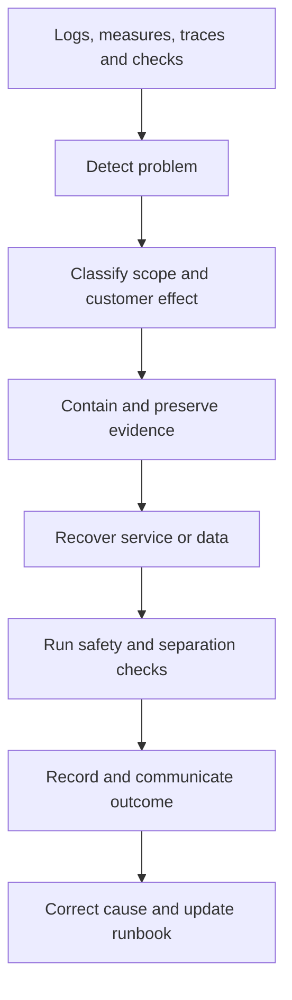

# 19. Operations, backup and recovery

[Previous: Delivery environments, database changes and testing](18-delivery-and-testing.md) · [Specification index](README.md) · Next: [Quality, accessibility and acceptance](20-quality-and-acceptance.md)

## Operating goals

Operations keep the platform observable, recoverable, secure, and understandable without giving operators routine access to customer content.



## Observability

Every request and background operation carries a correlation identifier. Logs and measures identify environment, service, operation, safe outcome, duration, and organisation by a protected internal identifier where necessary. They do not contain secrets, private file addresses, complete request bodies, or sensitive field values by default.

Required measures include:

- Request rate, latency, error and refusal rate.
- Database connection, transaction, query, lock, and row-restriction failures.
- Event age, sequence blockage, retry and failed-event count.
- Workflow start, wait, retry, failure, callback mismatch and reconciliation difference.
- File scan, quarantine, storage and removal backlog.
- Search indexing delay and access-recheck refusal.
- Cache hit, miss, unsafe-write refusal and version mismatch.
- Connection failure, rate limiting, secret refresh and incoming verification failure.
- Federation request rate, source latency, timeout, signature refusal, replay refusal, incompatible version, grant-reconciliation age, and recipient-mirror difference by source and recipient cluster.
- Metering event age, reconciliation lag and entitlement-policy mismatch.
- Backup age, size, off-site copy, restore result and privacy-removal replay result.

## Alerts and incident handling

Alerts are actionable and name an owner and runbook. Organisation separation, credential exposure, failed privacy removal, unrecoverable event sequence, failed backup, and production access-test failure are incidents rather than ordinary dashboard measures.

Incident records contain timeline, scope, affected organisations, containment, recovery, evidence, communication, cause, follow-up work, and verification. Customer communication follows the applicable contractual and legal requirements.

## Backup

Backups cover the production [PostgreSQL](https://www.postgresql.org/docs/) database, file manifests and bytes, published definitions, [Kestra](https://kestra.io/docs) workflow definitions and required state, configuration needed to rebuild services, and privacy-removal receipts.

- Before Production opens, Production enables [Supabase point-in-time recovery](https://supabase.com/docs/guides/platform/manage-your-usage/point-in-time-recovery) continuously with the provider's smallest available seven-day recovery window. PITR can restore to a chosen point with seconds-level granularity; it is not an hourly snapshot. The requested two-day PITR window is unavailable because Supabase currently offers seven, fourteen, or twenty-eight days.
- Independently of PITR, Kestra creates an encrypted logical Vortex database backup every hour and sends it to the existing Cloudflare R2 backup account under a dedicated Vortex bucket or prefix and dedicated least-privilege credential. It does not mix Vortex objects with the Kestra database prefix.
- The R2 logical-backup policy retains only the most recent 48 hours. An hourly Kestra cleanup removes older objects and an [R2 lifecycle rule](https://developers.cloudflare.com/r2/buckets/object-lifecycles/) provides a second expiry control. Cloudflare may complete lifecycle deletion up to 24 hours after expiry, so monitoring records the requested expiry and actual disappearance rather than claiming exact physical deletion at 48 hours.
- Backup objects are encrypted before upload, carry a checksum, contain no plaintext secret, and are unreadable without the separately held recovery key.
- Copies are sent to the independently controlled R2 location; no local Kestra-host copy is treated as a recovery copy.
- Access is limited, logged, and tested.
- Backup retention is documented and does not silently exceed the approved privacy policy.
- A checksum and inventory prove completeness.
- A scheduled restore test creates an isolated recovery environment and never overwrites production.

### Surviving removals and revocations

The existing independent R2 recovery location also holds an encrypted, content-free removal/revocation journal under its own prefix. This is the surviving evidence consumed by [#170](https://github.com/Abzum-NZ/Abzum-Vortex/issues/170), using the owning privacy and sharing operations; an outbox or receipt stored only in the source Supabase project cannot provide it. Entries contain operation/scope identifiers, source cluster, monotonic sequence, affected authority version, outcome and integrity evidence, never removed values, file bytes, credentials or profile details.

After authorisation, the owning operation durably records an idempotent intent outside the source project before committing its local removal/revocation. It records the committed outcome externally before reporting success. A crash between these steps leaves an explicit unresolved intent; replay keeps that scope unavailable until the outcome is established and does not infer permission from an absent completion. Retries use the same operation identifier. External-journal failure prevents a success acknowledgement; existing local restrictions remain effective. This small durability handshake is required only for removal/revocation evidence and does not introduce a general distributed transaction or another backup programme.

Each backup records a conservative replay boundary captured before its database snapshot begins, plus the unresolved intents at or below that boundary. Completion is an immutable later journal entry linked to its intent, not an in-place overwrite. Restore reconciles those earlier unresolved intents as well as all entries after the boundary; it must not assume that a pre-snapshot intent's local effect was already in the snapshot. At recovery, fence the old writers and obtain a confirmed journal high-water mark from the surviving location. Prove every sequence after the backup position through that mark is present and integrity-checked, account for both pre-boundary and later unresolved intents, and replay removals/revocations idempotently before opening affected data or access. A timestamp, latest available entry, source-project copy, or one-hour RPO is not a completeness proof. Missing entries, an unconfirmed high-water mark, or an unfenced writer keep the affected scope closed; if the missing scope cannot be identified, keep the restored cluster closed.

Journal retention covers every still-restorable database/file recovery point, including the seven-day PITR window and delayed actual expiry of backup objects. It is independent of the 48-hour logical-backup cleanup and retains only the content-free evidence required to prevent restoration of removed content or authority. Purge an entry only once no retained recovery point can require it; record that eligibility in the existing retention process.

## Restore

```mermaid
sequenceDiagram
    participant Operator
    participant Backup
    participant Isolated as Isolated recovery environment
    participant Tests
    Operator->>Backup: Select verified recovery point
    Backup->>Isolated: Restore database, files and workflow state
    Operator->>Isolated: Fence writers; verify surviving journal completeness
    Operator->>Isolated: Replay later removals and revocations; resolve blocked scopes
    Isolated->>Tests: Run integrity, access and application checks
    Tests-->>Operator: Recovery report
    Operator->>Isolated: Approve for declared recovery use or destroy test copy
```

The production recovery-point objective is at most one hour of accepted data loss. The recovery-time objective is at most eight hours from declaring a recoverable disaster to restoring the agreed minimum service. Continuous PITR, hourly R2 backups, alerting, runbooks, and restore drills must demonstrate both objectives; a backup job reporting success is not proof of recovery.

Supabase managed backups do not replace the independent copy because deleting or losing the provider project can also remove access to its managed recovery points. Restore drills test both the provider recovery path and the independent encrypted backup path.

## Database platform safeguards

- [SSL enforcement](https://supabase.com/docs/guides/platform/ssl-enforcement) is enabled for every remote database connection.
- Internal schemas are excluded from the Data API, and anonymous and signed-in browser roles have no grants on business or administrative tables. The browser uses Supabase directly only for approved Auth, private Realtime, and signed Storage flows.
- [Supabase database network restrictions](https://supabase.com/docs/guides/platform/network-restrictions) are configured in the Supabase dashboard or CLI and accept IPv4/IPv6 CIDR ranges only. They cannot allow a DNS name such as `kestra.abzum.com`, do not apply per database role, and apply to both direct Postgres and pooler routes.
- Network restrictions are deferred until the Vercel server route has stable outbound IP ranges or an equivalent private route. At that point Production allowlists both the Kestra host's fixed outbound IP ranges and Vercel's fixed egress ranges. Allowlisting only Kestra while Vercel still connects to PostgreSQL would break the application and is refused.
- Until that later hardening, remote connections require SSL, separate least-privilege database roles, strong rotated credentials, unexposed internal schemas, row-level rules, and monitoring. This deferment belongs to [Phase 13](../build-plan/README.md#phase-13--operational-readiness-and-release), not Phase 1.
- Supabase security and performance advisers and representative [Index Advisor](https://supabase.com/docs/guides/database/extensions/index_advisor) results are reviewed in Testing and again before release. Findings become tracked work; changes are reviewed migrations, never automatic Production edits.
- Read replicas are not part of the first release and have no implementation task. A future measured scaling review may propose one only with explicit read routing, consistency expectations, cost approval, monitoring, and failure tests.

## Secret management

[Doppler](https://docs.doppler.com/docs) provides environment-scoped secrets. Secrets are never committed, copied into fixtures, printed by builds, placed in browser bundles, or included in definition exports. Rotation procedures cover application, database, storage, [Kestra](https://kestra.io/docs), connection encryption keys, identity-authority signing keys, and cluster federation signing keys. Federation rotation publishes the next public key before use, overlaps verification for in-flight messages, then removes the retired key after the replay and reconciliation windows close.

## Support access

Support access is a protected, read-only Access operation, delivered in Phase 13 using Identity, Access and Activity. The operator signs in under their own global identity with current strong/recent authentication and an active support-operator role. An organisation account with explicit support-approval authority approves the exact operator, existing subject organisation account, organisation/application, permitted view/scope, purpose, ticket and expiry. The operator cannot approve their own session. Approval is mandatory: inability to obtain it leaves customer-content support unavailable. Ticket creation or editing and operator-role eligibility alone never grant access.

Every request evaluates the intersection of the operator's current approved support scope, the subject account's current ordinary Access decision (including application, record, row and field restrictions), and the organisation-approved scope. Neither the operator nor the subject is replaced in attribution: Identity verifies the operator; Access resolves the subject view plus the support restriction; Activity records both identities, approval, purpose/ticket, operation, time and outcome. No subject password, session or refresh token is issued to the operator. The initiating operator identity remains immutable and the protected read uses a separately resolved context; the frontend cannot assemble an impersonation context.

Reads, Query/Search results and file previews/downloads all enforce that intersection; private files use the ordinary authenticated gateway. Writes, named mutation actions, imports, exports, workflow starts, connection execution and delegating the support session are refused even when the subject could perform them. A customer-data change requires its separately approved ordinary named action under its own accountable actor, outside the support session. The support operation grants no change authority.

The operator, approving organisation authority, or platform security authority may revoke a session; expiry, approval revocation, operator/subject suspension, loss of the operator role, or a change reducing either scope refuses the next request, including file ranges. Use existing Access versions and live identity/account checks. Organisation-visible Activity records approval, start, termination and protected reads without copying sensitive results. Content-free operational diagnostics remain available under their ordinary permissions when customer approval is unavailable; there is no emergency impersonation exception in this feature.

## Runbooks

At minimum, runbooks cover deployment failure, database migration failure, organisation-separation incident, lost or exposed secret, stalled event sequence, workflow outage, file-scan outage, connection-provider outage, entitlement or metering mismatch, search delay, backup failure, complete restore, protected-removal failure, provider-region failure, federation signing-key exposure, one-cluster outage, incompatible federation release, cluster-directory error, and grant-mirror reconciliation backlog.

## Acceptance examples

- A restore drill proves records, files, definitions, workflow state, and removal receipts together.
- The measured restore point is no more than one hour before the declared incident, and the agreed minimum service is restored within eight hours.
- A backup stored only on the [Kestra](https://kestra.io/docs) host is refused as incomplete protection.
- Recovery succeeds from an independent copy even when the original Supabase project is unavailable.
- PITR can restore to a selected point inside its seven-day window, and the hourly R2 path can restore while treating Supabase-managed recovery as unavailable.
- R2 backup inventory never contains a successful Vortex logical backup whose requested expiry is more than 48 hours old without an alert and cleanup retry.
- A log scan finds no credentials or sensitive values in successful and failing paths.
- Support access expires automatically and appears in the organisation's activity.
- A support operator cannot self-approve, enlarge a ticket into authority, out-read the subject or approved scope, or execute a mutation/export through an otherwise permitted subject account. Revocation and expiry refuse the next read, preview and range request, with both actors attributed.
- Every production alert links to a tested runbook and an accountable owner.
- Disabling one cluster's federation route stops new remote requests without requiring database credential rotation in every other cluster.
- Restoring a source cluster replays later grant revocations and privacy-removal receipts before cross-cluster access is reopened.
- A 10:00 backup, acknowledged 10:30 removal/revocation and 10:45 source-project loss restores using the surviving journal without resurrecting content or access. Missing sequences, uncertain completion and unavailable completeness evidence keep the affected scope closed.

[Approved support delivery #409](https://github.com/Abzum-NZ/Abzum-Vortex/issues/409) owns this restricted support path; [#173](https://github.com/Abzum-NZ/Abzum-Vortex/issues/173) consumes its verified result before claiming readiness.
- A removal intent before snapshot start whose local commit/outcome occurs during or after the backup is replayed or kept explicitly unavailable; concurrent journal writes cannot disappear behind the backup marker.
