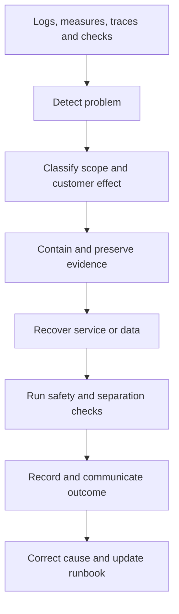
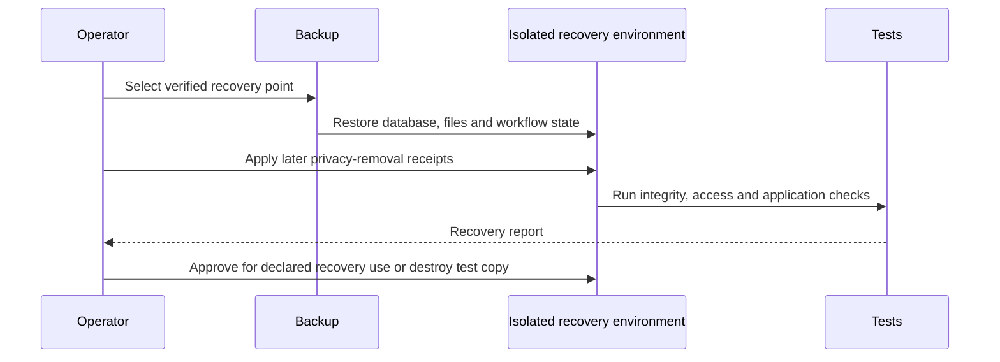

# 19. Operations, backup and recovery

[Previous: Delivery environments, database changes and testing](18-delivery-and-testing.md) · [Specification index](README.md) · Next: [Quality, accessibility and acceptance](20-quality-and-acceptance.md)

## Operating goals

Operations keep the platform observable, recoverable, secure, and understandable without giving operators routine access to customer content.

## Observability

Every request and background operation carries a correlation identifier. Logs and measures identify environment, service, operation, safe outcome, duration, and organisation by a protected internal identifier where necessary. They do not contain secrets, private file addresses, complete request bodies, or sensitive field values by default.

Required measures include:

- Request rate, latency, error and refusal rate.
- Database connection, transaction, query, lock, and row-restriction failures.
- Event age, sequence blockage, retry and failed-event count.
- Workflow start, wait, retry, failure, callback mismatch and reconciliation difference.
- File scan, quarantine, storage and removal backlog.
- Search indexing delay and access-recheck refusal.
- Cache hit, miss, unsafe-write refusal and version mismatch.
- Connection failure, rate limiting, secret refresh and incoming verification failure.
- Federation request rate, source latency, timeout, signature refusal, replay refusal, incompatible version, grant-reconciliation age, and recipient-mirror difference by source and recipient cluster.
- Billing event age, usage reconciliation and entitlement mismatch.
- Backup age, size, off-site copy, restore result and privacy-removal replay result.

## Alerts and incident handling

Alerts are actionable and name an owner and runbook. Organisation separation, credential exposure, failed privacy removal, unrecoverable event sequence, failed backup, and production access-test failure are incidents rather than ordinary dashboard measures.

Incident records contain timeline, scope, affected organisations, containment, recovery, evidence, communication, cause, follow-up work, and verification. Customer communication follows the applicable contractual and legal requirements.

## Backup

Backups cover the production [PostgreSQL](https://www.postgresql.org/docs/) database, file manifests and bytes, published definitions, [Kestra](https://kestra.io/docs) workflow definitions and required state, configuration needed to rebuild services, and privacy-removal receipts.

- Copies are encrypted and sent to an independently controlled location.
- Access is limited, logged, and tested.
- Backup retention is documented and does not silently exceed the approved privacy policy.
- A checksum and inventory prove completeness.
- A scheduled restore test creates an isolated recovery environment and never overwrites production.

## Restore

The production recovery-point objective is at most one hour of accepted data loss. The recovery-time objective is at most eight hours from declaring a recoverable disaster to restoring the agreed minimum service. Backup schedules, independent copies, alerting, runbooks, and restore drills must demonstrate both objectives; a backup job reporting success is not proof of recovery.

## Secret management

[Doppler](https://docs.doppler.com/docs) provides environment-scoped secrets. Secrets are never committed, copied into fixtures, printed by builds, placed in browser bundles, or included in definition exports. Rotation procedures cover application, database, storage, [Kestra](https://kestra.io/docs), [Stripe](https://docs.stripe.com/), connection encryption keys, identity-authority signing keys, and cluster federation signing keys. Federation rotation publishes the next public key before use, overlaps verification for in-flight messages, then removes the retired key after the replay and reconciliation windows close.

## Support access

Support access requires a named operator role, strong sign-in, a ticket, purpose, organisation approval where feasible, expiry, and activity entry visible to the organisation. Default support access is read-only impersonation of an existing permitted view. Any change requires separate approval and uses an ordinary named action.

## Runbooks

At minimum, runbooks cover deployment failure, database migration failure, organisation-separation incident, lost or exposed secret, stalled event sequence, workflow outage, file-scan outage, connection-provider outage, billing mismatch, search delay, backup failure, complete restore, privacy-removal failure, provider-region failure, federation signing-key exposure, one-cluster outage, incompatible federation release, cluster-directory error, and grant-mirror reconciliation backlog.

## Acceptance examples

- A restore drill proves records, files, definitions, workflow state, and removal receipts together.
- The measured restore point is no more than one hour before the declared incident, and the agreed minimum service is restored within eight hours.
- A backup stored only on the [Kestra](https://kestra.io/docs) host is refused as incomplete protection.
- A log scan finds no credentials or sensitive values in successful and failing paths.
- Support access expires automatically and appears in the organisation's activity.
- Every production alert links to a tested runbook and an accountable owner.
- Disabling one cluster's federation route stops new remote requests without requiring database credential rotation in every other cluster.
- Restoring a source cluster replays later grant revocations and privacy-removal receipts before cross-cluster access is reopened.
