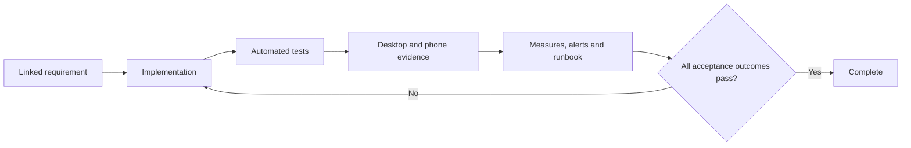
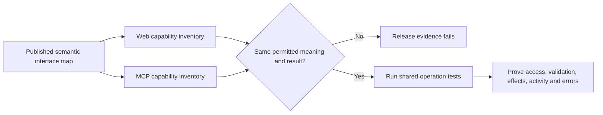

# 20. Quality, accessibility and acceptance

[Previous: Operations, backup and recovery](19-operations-backup-and-recovery.md) · [Specification index](README.md) · [Decision register](appendices/decisions.md)

## Definition of complete

A capability is complete only when its contract, implementation, access protection, tests, observability, documentation, desktop evidence, phone evidence where visible, and operational response are all complete.

## Required quality areas

- Correctness against the linked specification section and [data contract](appendices/data-contracts.md).
- Organisation separation and [access](04-access-and-permissions.md).
- Data integrity under concurrency, retry, partial failure, deletion, and restoration.
- Plain-language validation and recovery guidance.
- Stable definition-validation codes and catalogue-owned guidance that expose no raw input, internal path, protected identifier, diagnostic detail, or installed definition name; see the [definition validation error contract](appendices/data-contracts.md#definition-validation-errors).
- Keyboard, screen-reader, contrast, zoom, reduced-motion, and phone use.
- Bounded response time and resource use under stated test data.
- Safe logs, traces, diagnostics, fixtures, screenshots, and exports.
- Backward-compatible delivery and tested recovery.
- Continuous navigation, component-scoped loading and refresh, restrained motion, and equivalent reduced-motion behaviour under [core UI continuity](07-applications-pages-and-themes.md#core-ui-continuity-and-motion).
- Complete behavioural parity between the web interface and the governed [MCP surface](12-connections-and-interfaces.md#governed-mcp-access), with one permission, validation, execution, activity and error path.

## Organisation separation suite

The suite is split so each test proves the layer it claims to prove.

### Database row-restriction tests

Run through the non-owning application database role and expect refusal or no rows:

1. Read, insert, update, and delete another organisation's rows.
2. Change an owned row's organisation identifier.
3. Read as a suspended organisation-account context.
4. Read without required request context.
5. Reuse one database connection alternately for two organisations and prove context does not leak.
6. Use service, background, tenant-administrator, and public caller contexts across organisations.
7. Read a source organisation's shareable rows from a recipient context with no grant, an inactive grant, and an expired grant.
8. With one active grant, read only its records and fields; refuse every administrative or non-shareable table.
9. Prove two incomplete grants cannot be combined to create one complete permission.
10. Revoke a grant and prove the next statement in a fresh request context cannot use it.

These database cases prove source-cluster row enforcement. They run for a local recipient context and for the source context created only after a valid federation assertion; no database test opens a connection from one cluster to another.

Then run matching raw row operations through the table-owner role and prove the test data exists and is technically reachable. Only these database cases use the owner-control run; the owner never represents a web, file, cache, subscription, or public caller.

### End-to-end boundary tests

Run through ordinary product surfaces:

11. An unauthenticated request sees only an explicitly published public operation and approved fields.
12. List, upload, replace, download, and delete another organisation's files are refused.
13. A live subscription receives no other-organisation change or source values in a shared-record invalidation.
14. Organisation-owned cache entries primed in one organisation miss in another; content-hashed application assets are tested separately as the documented safe shared exception.
15. A field the caller cannot read is absent from records, search, reports, exports, workflow inputs, and interfaces.
16. Search reveals no title, count, filter value, suggestion, or highlight from another organisation.
17. Connection, workflow, and interface calls cannot cross organisation boundaries.
18. Organisation switching clears organisation-specific browser and server state.
19. Public and private file addresses cannot be exchanged to gain access.
20. One global identity with accounts in source and recipient organisations cannot combine their roles in one request.
21. Directly editing an approval display record does not activate a grant; only the protected Access-service operation can do so.
22. Shared-record lists, fields, actions, exports, files, revocation, expiry, deletion, and restoration match the approved grant policy in both directions.
23. Builds, logs, traces, screenshots, and error reports contain no credentials or prohibited sensitive content.
24. Run one approved grant through same-cluster and cross-cluster routes and prove identical fields, actions, lifecycle behaviour, activity meaning, and stable refusal codes.
25. Alter a federated body, signature, audience, cluster identifier, contract fingerprint, issue time, expiry, and nonce; every case is refused before a source business query.
26. Replay an accepted signed envelope and prove its reused nonce is refused. Retry an action with a new envelope and the same duplicate-protection key and prove it returns the existing result without applying twice.
27. Delay or drop proposal, acceptance, activation, revocation-notice, and reconciliation messages; source status remains authoritative and both mirrors converge without a distributed transaction.
28. Stop the source cluster or network and prove the recipient shows temporary unavailability without a stale persisted record or unbounded retry.
29. Run adjacent supported cluster releases in both source directions, then prove an unsupported version fails with a safe stable error.
30. Prove cross-cluster record values do not enter recipient database tables, files, search indexes, materialised report results, workflow state, cross-request cache, logs, traces, or grant mirrors.
31. Probe invalid, rotated, and valid organisation sharing codes and signed links; only an exact active lookup returns the approved organisation name and region, with no directory enumeration or private metadata.
32. Run the same grant locally and remotely; each request creates linked source and recipient usage entries without counting one category twice.
33. Refuse activation with only one side's consent or consent over different fingerprints; activate once after both authorised sides consent to the same complete fingerprint.
34. Add, remove, suspend, and restore a named recipient application role; the next request follows the account's current application access and role membership without using a role from another organisation account.
35. Change a published saved sharing condition or its grant parameters; the active grant remains pinned and unchanged until a new proposal receives both consent decisions.
36. Attempt an inline filter and a re-share from recipient to third organisation; both are refused through local and remote routes.
37. Run the same shared list, record detail, search, report, dashboard block, named action, and approved export through local and remote adapters; ordinary components show the same permitted content, source marker, and refusal meaning.
38. Search and report on shared records, then inspect recipient storage, indexes, caches, logs, and grant mirrors; no source value or materialised result remains after the response.
39. Leave export refused and prove no export starts; approve it on both sides and prove the source-generated file contains only grant-readable non-sensitive fields, expires, leaves no recipient-cluster copy, and records the non-recallable transfer warning.
40. Put one organisation account in several groups; add, remove, suspend, and restore memberships and prove direct shares and group roles change on the next request.
41. Give a tenant administrator no account in a child organisation and prove hierarchy and explicitly granted tenant operations work while organisation-account, invitation and runtime-setting administration and every record, file, search, workflow and connection read are refused. Adding an ordinary local account still grants no administration permission: the exact organisation role permission must also be present.
42. Create direct record shares to an account and a group; prove only allowlisted fields can be read or changed and that delete, restore, export, re-share, and administration remain refused.
43. Grant CRM limited collaborative access to a Service Desk case; prove CRM reads only the summary fields, changes only `status` and `priority`, adds only a public comment, and never receives internal notes, attachments, service-level calculations, or ownership controls.
44. Revoke that grant while the case is visible; the next access check removes the values from the component, closes or re-authorises live updates, and browser back navigation or client cache cannot reveal the case.
45. Authorise an MCP client for one organisation account and prove it discovers exactly the navigation, pages, fields, choices, files, actions, builder controls and administration controls available to that account in the web interface; refused content is absent rather than merely labelled unavailable.
46. Complete the same form and invoke the same action once through the web interface and once through MCP; prove both use the same typed input, revision checks, validation, permission decision, record effect, event, activity meaning and safe error catalogue.
47. Pair an authorised MCP client context with one visible web session, navigate and change a draft through semantic control identifiers, then prove the interface applies the acknowledged state. End the pairing, submit a stale revision and revoke the account's access; each next control request is refused without exposing a browser cookie, DOM handle, selector or screen coordinate.
48. Present an invalid-issuer, expired, revoked, wrong-audience or wrong-client MCP token and prove it is refused before an application operation. Then use a valid token to request an organisation, application or capability outside the live Vortex grant/current account and prove that request is separately refused. Extra standard identity scopes never create Vortex authority. Prove the server neither accepts token pass-through nor requests model sampling, model credentials or autonomous execution.
49. Send MCP requests with an invalid `Origin`, a missing required Streamable HTTP header and a header value that disagrees with the message body; prove they are refused and a missing or mismatched required header returns `HeaderMismatch`. Prove valid messages use HTTP `POST` with the required JSON or server-sent-event content negotiation, each request carries revision, client information and client capabilities in `_meta`, the modern endpoint is stateless, and `GET` is not available.

50. Register two independent applications with identical display names, role labels and authored permission keys in one organisation; their permanent scopes remain distinct, and neither registration assigns anyone access. Repeat in another organisation and prove no assignment is inherited.
51. Assign one organisation-owned role with selected permissions from two applications. Prove each application-entry, action, record and field check retains its own scope and that application administration never grants organisation administration.
52. Publish a new application release and prove live assignments and permission availability remain unchanged until explicit activation. Upgrade the active registration: new or broadened permissions remain unavailable to existing assignments until explicitly approved; custom organisation roles are not overwritten. Remove a permission or withdraw the application and prove old assignments and cached answers cannot continue using it. If two active applications supply the same module permission, withdrawing one preserves only the other's valid scope; withdrawing the last makes the permission unavailable.
53. Use the same organisation role-management operations for direct-account and Group assignments to organisation-wide and application-specific roles. Prove another organisation's account, Group, role or application cannot be substituted, and removing an assignment changes the next access decision.
54. Explicitly provision an organisation steward who can assign its first application role but cannot open or read that application without a separate use assignment. Prove an application-scoped manager cannot grant another application's permissions, including shared-module permissions in the other application's context, and two managers cannot expand their delegated powers by granting them to each other. Application updates cannot broaden a bounded delegation scope without authorised review.
55. Concurrently demote, suspend or revoke the final permanent organisation steward, including through a role edit or cluster identity-projection change. At least one effective direct permanent steward must remain. An expiring or Group-only delegate cannot be used as the replacement; pre-existing organisations require explicit adoption and no first-account inference.
56. Run direct and indirect role-grant journeys through the [IAM application](appendices/iam-application.md): requests and approvals remain linked to the exact organisation accounts, Groups, role versions and application contexts; no request has effect until the protected operation succeeds. Cover Group membership, role expansion, template acceptance/reactivation, invitations and delegation, not only direct assignment.
57. Tamper with an IAM request or review record, substitute an approver, change the proposal after approval, revoke an approver during a wait, replay another workflow response, or invoke an assignment helper directly. None grants access. Retry a valid approved request and prove one effect; a workflow outage leaves the grant pending.
58. Prove IAM's explicit first-steward setup without an existing administrator or background run, and immediate authorised removal despite a waiting approval workflow. Tenant administration, Organisation Administration and MCP provide no alternative granting bypass. [#72](https://github.com/Abzum-NZ/Abzum-Vortex/issues/72) owns definition/view evidence; [#267](https://github.com/Abzum-NZ/Abzum-Vortex/issues/267) owns the complete workflow journey, with [#200](https://github.com/Abzum-NZ/Abzum-Vortex/issues/200) adding MCP transport proof. These later journeys are not counted as early Phase 2 passes.

Every applicable case runs in both directions between two populated organisations in one cluster and in a two-cluster topology. Tests use recognisably different canary values so accidental mixing is visible. Cases 50–55 are owned by [roles and assignments #33](https://github.com/Abzum-NZ/Abzum-Vortex/issues/33), [central access #34](https://github.com/Abzum-NZ/Abzum-Vortex/issues/34), [protected administration #30](https://github.com/Abzum-NZ/Abzum-Vortex/issues/30), [access administration #40](https://github.com/Abzum-NZ/Abzum-Vortex/issues/40) and the actual [application registration/update journey #64](https://github.com/Abzum-NZ/Abzum-Vortex/issues/64); a service-level registration test is not evidence that the later interface journey exists.

## Groups and privileged-access acceptance

The [Groups and PIM matrix](appendices/groups-and-privileged-access.md#contract-compatibility-and-delivery) adds required Access evidence: direct/group eligibility alone refuses use; activation elevates one member only; current role/policy/eligibility/membership evidence and required authentication/independent approval are enforced; expiry works without a workflow; removed/restored sources never revive access; policy or role changes cannot silently broaden an activation; and the final permanent management account remains usable. [#33](https://github.com/Abzum-NZ/Abzum-Vortex/issues/33), [#34](https://github.com/Abzum-NZ/Abzum-Vortex/issues/34) and [#40](https://github.com/Abzum-NZ/Abzum-Vortex/issues/40) own private service proof; [#267](https://github.com/Abzum-NZ/Abzum-Vortex/issues/267) owns the complete IAM experience. [#283](https://github.com/Abzum-NZ/Abzum-Vortex/issues/283) proves exact historical Group-reference compatibility. None of the later UI evidence is claimed by early service tests.

## Accessibility acceptance

Visible functionality meets [Web Content Accessibility Guidelines 2.2](https://www.w3.org/TR/WCAG22/) Level AA unless a documented platform limitation has an approved remediation plan.

Every visible issue includes evidence at supported desktop and phone widths. Evidence covers normal, empty, loading, validation, refused, conflict, failure, and recovery states that apply—not only the successful path.

Visible page work also includes evidence that internal navigation keeps the application shell mounted, a slow route or block receives immediate local loading feedback, a data refresh changes only affected components and dependent totals, unsaved unrelated state remains intact, and reduced-motion mode communicates the same result without animation. Automated browser checks refuse routine internal navigation that causes a full document reload.

Motion evidence uses the six registered semantic tokens and contains no feature-specific duration, easing, distance, or spring value. Interruption tests navigate from record A to record B, open another component, and then complete record A's delayed response; record A must not flash, regain focus, finish an obsolete transition, or replace any part of the current state. The same cases run at desktop and phone widths, on a throttled low-performance profile, and with reduced motion enabled.

## MCP parity acceptance

The parity test is generated from the published [semantic interface map](07-applications-pages-and-themes.md#semantic-interface-map), not from a manually maintained list of buttons. Each meaningful control has one stable semantic identifier and one platform operation. The test compares the permitted web and MCP views for the same identity, organisation account, application version and access version.

The evidence must prove:

- Every meaningful customer-application, Studio, tenant-administration and organisation-administration capability is present on both surfaces when discoverable. View-refused content is disclosed by neither surface. A discoverable but currently unavailable control appears on both as non-invocable with the same safe reason and is absent from MCP tool choices.
- Navigation, filtering, sorting, paging, refresh, form and guided-form drafts, file operations and named actions use stable semantic resources and controls. Tests refuse reliance on display text, DOM structure, CSS selectors, pointer coordinates, animation timing or unrestricted browser scripting.
- The MCP adapter calls the same platform service as the web interface. It does not contain a second save engine, action runner, access evaluator or general schema-free record endpoint.
- A live-interface pairing is explicit, visible, expiring and immediately revocable. Every state-changing request supplies the expected semantic-state or draft revision so an agent cannot overwrite a person's newer work.
- MCP authorization is audience-bound and scope-limited, follows the approved protocol and transport revisions, and takes effect through the person's current organisation account. Access removal is effective on the next request.
- Vortex provides no embedded model, assistant, sampling request or autonomous decision loop. The external client chooses whether and how to use the permission-filtered resources and tools.

## Performance measurement

Performance tests state hardware class, network profile, dataset size, cache state, region, percentile, and measured action. “Fast on a mid-range phone” without those values is not a useful measurement.

Performance targets are operational goals, never pull-request or release-blocking budgets. Baselines and regressions are recorded in the [data contracts](appendices/data-contracts.md#performance-measurements); a sustained regression creates an owned issue and may trigger an alert. Performance pressure never weakens safety, correctness, privacy, or accessibility, and performance alone never prevents a release.

## Evidence and issue closure

Every implementation issue links:

- The relevant specification section.
- Any decided decision-register entries.
- Tests added or changed.
- Migration and compatibility notes.
- Protected data handling, access, entitlement, and operational effects.
- Visible desktop and phone evidence where applicable.
- Follow-up issues for deliberately deferred work.

Epics have completion criteria covering all children, cross-phase acceptance, unresolved decisions, and operational readiness. A checked box without linked evidence is not completion.

## Acceptance examples

- Database-owner control tests are not incorrectly applied to browser, file, cache, or subscription behaviour.
- A page issue cannot close with only a wide-screen successful screenshot.
- A performance claim can be reproduced from its stated environment and data size.
- A fixture validates every reference or clearly declares the unavailable platform fixture that blocks it.
- A release cannot be called complete while a blocking [decision](appendices/decisions.md) remains open.

## Page builder and application coverage

Contract completion [#249](https://github.com/Abzum-NZ/Abzum-Vortex/issues/249) and typed bindings [#250](https://github.com/Abzum-NZ/Abzum-Vortex/issues/250) must prove nested slots, safe property types, related contexts, form concurrency, semantic operations and immutable-release compatibility before canvas work. [HR #251](https://github.com/Abzum-NZ/Abzum-Vortex/issues/251) is an ordinary editable application, not a core domain.

Phase 6 proves available record/query/form/rendering behavior. [Complete application integration #254](https://github.com/Abzum-NZ/Abzum-Vortex/issues/254) proves workflows, files, connections, sharing and MCP after their real executors exist. Stubs and contract tests are labelled as such and never counted as live end-to-end delivery.

Private file evidence must test a copied download route, subsequent range request and revoked grant/account. Third-party call evidence must include unknown outcomes after timeout. A sequential query plan or missed performance target alone never fails a release; access, integrity and functional correctness still do.
