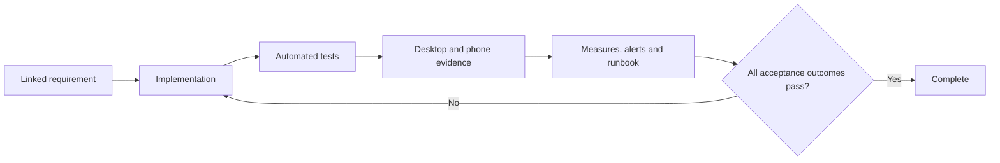

# 20. Quality, accessibility and acceptance

[Previous: Operations, backup and recovery](19-operations-backup-and-recovery.md) · [Specification index](README.md) · [Decision register](appendices/decisions.md)

## Definition of complete

A capability is complete only when its contract, implementation, access protection, tests, observability, documentation, desktop evidence, phone evidence where visible, and operational response are all complete.

## Required quality areas

- Correctness against the linked specification section and [data contract](appendices/data-contracts.md).
- Organisation separation and [access](04-access-and-permissions.md).
- Data integrity under concurrency, retry, partial failure, deletion, and restoration.
- Plain-language validation and recovery guidance.
- Keyboard, screen-reader, contrast, zoom, reduced-motion, and phone use.
- Bounded response time and resource use under stated test data.
- Safe logs, traces, diagnostics, fixtures, screenshots, and exports.
- Backward-compatible delivery and tested recovery.

## Organisation separation suite

The suite is split so each test proves the layer it claims to prove.

### Database row-restriction tests

Run through the non-owning application database role and expect refusal or no rows:

1. Read, insert, update, and delete another organisation's rows.
2. Change an owned row's organisation identifier.
3. Read as a suspended membership context.
4. Read without required request context.
5. Reuse one database connection alternately for two organisations and prove context does not leak.
6. Use service, background, assistant, and public caller contexts across organisations.

Then run matching raw row operations through the table-owner role and prove the test data exists and is technically reachable. Only these database cases use the owner-control run; the owner never represents a web, file, cache, subscription, or public caller.

### End-to-end boundary tests

Run through ordinary product surfaces:

7. An unauthenticated request sees only an explicitly published public operation and approved fields.
8. List, upload, replace, download, and delete another organisation's files are refused.
9. A live subscription receives no other-organisation change.
10. Organisation-owned cache entries primed in one organisation miss in another; content-hashed application assets are tested separately as the documented safe shared exception.
11. A field the caller cannot read is absent from records, search, reports, exports, assistant tools, workflow inputs, and interfaces.
12. Search reveals no title, count, filter value, suggestion, or highlight from another organisation.
13. Connection, workflow, interface, and assistant calls cannot cross organisation boundaries.
14. Organisation switching clears organisation-specific browser and server state.
15. Public and private file addresses cannot be exchanged to gain access.
16. Builds, logs, traces, screenshots, and error reports contain no credentials or prohibited sensitive content.

Every case runs in both directions between two populated organisations. Tests use recognisably different canary values so accidental mixing is visible.

## Accessibility acceptance

Visible functionality meets [Web Content Accessibility Guidelines 2.2](https://www.w3.org/TR/WCAG22/) Level AA unless a documented platform limitation has an approved remediation plan.

Every visible issue includes evidence at supported desktop and phone widths. Evidence covers normal, empty, loading, validation, refused, conflict, failure, and recovery states that apply—not only the successful path.

## Performance acceptance

Performance tests state hardware class, network profile, dataset size, cache state, region, percentile, and measured action. “Fast on a mid-range phone” without those values is not an acceptance test.

Budgets are maintained in the [data contracts](appendices/data-contracts.md#performance-budgets) after [Decision D22](appendices/decisions.md#d22-performance-budgets) is approved. Safety and correctness are not weakened to meet a latency target.

## Evidence and issue closure

Every implementation issue links:

- The relevant specification section.
- Any decided decision-register entries.
- Tests added or changed.
- Migration and compatibility notes.
- Privacy, access, billing, and operational effects.
- Visible desktop and phone evidence where applicable.
- Follow-up issues for deliberately deferred work.

Epics have completion criteria covering all children, cross-phase acceptance, unresolved decisions, and operational readiness. A checked box without linked evidence is not completion.

## Acceptance examples

- Database-owner control tests are not incorrectly applied to browser, file, cache, or subscription behaviour.
- A page issue cannot close with only a wide-screen successful screenshot.
- A performance claim can be reproduced from its stated environment and data size.
- A fixture validates every reference or clearly declares the unavailable platform fixture that blocks it.
- A release cannot be called complete while a blocking [decision](appendices/decisions.md) remains open.
