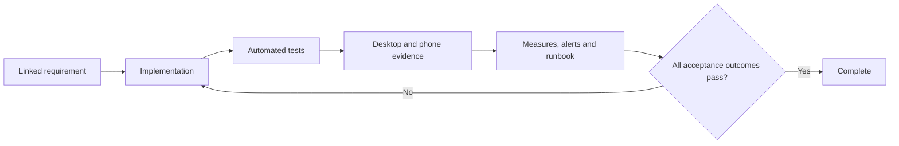

# 20. Quality, accessibility and acceptance

[Previous: Operations, backup and recovery](19-operations-backup-and-recovery.md) · [Specification index](README.md) · [Decision register](appendices/decisions.md)

## Definition of complete

A capability is complete only when its contract, implementation, access protection, tests, observability, documentation, desktop evidence, phone evidence where visible, and operational response are all complete.

## Required quality areas

- Correctness against the linked specification section and [data contract](appendices/data-contracts.md).
- Organisation separation and [access](04-access-and-permissions.md).
- Data integrity under concurrency, retry, partial failure, deletion, and restoration.
- Plain-language validation and recovery guidance.
- Keyboard, screen-reader, contrast, zoom, reduced-motion, and phone use.
- Bounded response time and resource use under stated test data.
- Safe logs, traces, diagnostics, fixtures, screenshots, and exports.
- Backward-compatible delivery and tested recovery.

## Organisation separation suite

The suite is split so each test proves the layer it claims to prove.

### Database row-restriction tests

Run through the non-owning application database role and expect refusal or no rows:

1. Read, insert, update, and delete another organisation's rows.
2. Change an owned row's organisation identifier.
3. Read as a suspended organisation-account context.
4. Read without required request context.
5. Reuse one database connection alternately for two organisations and prove context does not leak.
6. Use service, background, assistant, and public caller contexts across organisations.
7. Read a source organisation's shareable rows from a recipient context with no grant, an inactive grant, and an expired grant.
8. With one active grant, read only its records and fields; refuse every administrative or non-shareable table.
9. Prove two incomplete grants cannot be combined to create one complete permission.
10. Revoke a grant and prove the next statement in a fresh request context cannot use it.

These database cases prove source-cluster row enforcement. They run for a local recipient context and for the source context created only after a valid federation assertion; no database test opens a connection from one cluster to another.

Then run matching raw row operations through the table-owner role and prove the test data exists and is technically reachable. Only these database cases use the owner-control run; the owner never represents a web, file, cache, subscription, or public caller.

### End-to-end boundary tests

Run through ordinary product surfaces:

11. An unauthenticated request sees only an explicitly published public operation and approved fields.
12. List, upload, replace, download, and delete another organisation's files are refused.
13. A live subscription receives no other-organisation change or source values in a shared-record invalidation.
14. Organisation-owned cache entries primed in one organisation miss in another; content-hashed application assets are tested separately as the documented safe shared exception.
15. A field the caller cannot read is absent from records, search, reports, exports, assistant tools, workflow inputs, and interfaces.
16. Search reveals no title, count, filter value, suggestion, or highlight from another organisation.
17. Connection, workflow, interface, and assistant calls cannot cross organisation boundaries.
18. Organisation switching clears organisation-specific browser and server state.
19. Public and private file addresses cannot be exchanged to gain access.
20. One global identity with accounts in source and recipient organisations cannot combine their roles in one request.
21. Directly editing an approval display record does not activate a grant; only the protected Access-service operation can do so.
22. Shared-record lists, fields, actions, exports, files, revocation, expiry, deletion, and restoration match the approved grant policy in both directions.
23. Builds, logs, traces, screenshots, and error reports contain no credentials or prohibited sensitive content.
24. Run one approved grant through same-cluster and cross-cluster routes and prove identical fields, actions, lifecycle behaviour, activity meaning, and stable refusal codes.
25. Alter a federated body, signature, audience, cluster identifier, contract fingerprint, issue time, expiry, and nonce; every case is refused before a source business query.
26. Replay an accepted signed envelope and prove its reused nonce is refused. Retry an action with a new envelope and the same duplicate-protection key and prove it returns the existing result without applying twice.
27. Delay or drop proposal, acceptance, activation, revocation-notice, and reconciliation messages; source status remains authoritative and both mirrors converge without a distributed transaction.
28. Stop the source cluster or network and prove the recipient shows temporary unavailability without a stale persisted record or unbounded retry.
29. Run adjacent supported cluster releases in both source directions, then prove an unsupported version fails with a safe stable error.
30. Prove cross-cluster record values do not enter recipient database tables, files, search indexes, materialised report results, workflow state, cross-request cache, logs, traces, or grant mirrors.
31. Probe invalid, rotated, and valid organisation sharing codes and signed links; only an exact active lookup returns the approved organisation name and region, with no directory enumeration or private metadata.
32. Run the same grant locally and remotely; each request creates linked source and recipient usage entries without counting one category twice.
33. Refuse activation with only source approval, only recipient acceptance, or approvals over different fingerprints; activate once after both authorised sides approve the same complete fingerprint.
34. Add, remove, suspend, and restore a named recipient application role; the next request follows the account's current application access and role membership without using a role from another organisation account.
35. Change a published saved sharing condition or its grant parameters; the active grant remains pinned and unchanged until a new proposal receives both approvals.
36. Attempt an inline filter and a re-share from recipient to third organisation; both are refused through local and remote routes.
37. Run the same shared list, record detail, search, report, dashboard block, named action, and approved export through local and remote adapters; ordinary components show the same permitted content, source marker, and refusal meaning.
38. Search and report on shared records, then inspect recipient storage, indexes, caches, logs, and grant mirrors; no source value or materialised result remains after the response.
39. Leave export refused and prove no export starts; approve it on both sides and prove the source-generated file contains only grant-readable non-sensitive fields, expires, leaves no recipient-cluster copy, and records the non-recallable transfer warning.

Every applicable case runs in both directions between two populated organisations in one cluster and in a two-cluster topology. Tests use recognisably different canary values so accidental mixing is visible.

## Accessibility acceptance

Visible functionality meets [Web Content Accessibility Guidelines 2.2](https://www.w3.org/TR/WCAG22/) Level AA unless a documented platform limitation has an approved remediation plan.

Every visible issue includes evidence at supported desktop and phone widths. Evidence covers normal, empty, loading, validation, refused, conflict, failure, and recovery states that apply—not only the successful path.

## Performance acceptance

Performance tests state hardware class, network profile, dataset size, cache state, region, percentile, and measured action. “Fast on a mid-range phone” without those values is not an acceptance test.

Budgets are maintained in the [data contracts](appendices/data-contracts.md#performance-budgets) after [Decision D22](appendices/decisions.md#d22-performance-budgets) is approved. Safety and correctness are not weakened to meet a latency target.

## Evidence and issue closure

Every implementation issue links:

- The relevant specification section.
- Any decided decision-register entries.
- Tests added or changed.
- Migration and compatibility notes.
- Privacy, access, billing, and operational effects.
- Visible desktop and phone evidence where applicable.
- Follow-up issues for deliberately deferred work.

Epics have completion criteria covering all children, cross-phase acceptance, unresolved decisions, and operational readiness. A checked box without linked evidence is not completion.

## Acceptance examples

- Database-owner control tests are not incorrectly applied to browser, file, cache, or subscription behaviour.
- A page issue cannot close with only a wide-screen successful screenshot.
- A performance claim can be reproduced from its stated environment and data size.
- A fixture validates every reference or clearly declares the unavailable platform fixture that blocks it.
- A release cannot be called complete while a blocking [decision](appendices/decisions.md) remains open.
