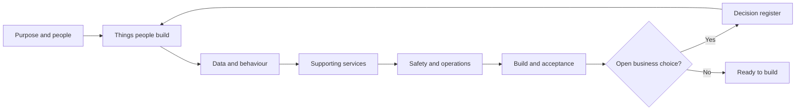

# Abzum Vortex platform specification

**Status:** Approved specification 2.0
**Date:** 1 September 2026
**Owner:** [Abzum NZ](https://github.com/Abzum-NZ)

**Source repository:** [Abzum Vortex](https://github.com/Abzum-NZ/Abzum-Vortex)
**Delivery board:** [Vortex GitHub Project](https://github.com/orgs/Abzum-NZ/projects/2/views/1)

This is a new specification for [Abzum Vortex](https://github.com/Abzum-NZ/Abzum-Vortex). It replaces the structure of the earlier [Platform Specification](https://claude.ai/code/artifact/f202d3c7-4c73-417c-bd3f-90740c2bc1d4), but does not silently discard its requirements. The [coverage map](appendices/traceability.md) records where each earlier chapter and build phase is addressed.

This document is the approved product contract for the current build scope. The [open decision register](appendices/decisions.md) is clear; a future material uncertainty must be recorded there before implementation assumes an answer.

## How to read this specification

Each section contains:

1. A plain-language explanation of the outcome.
2. A diagram showing composition or working behaviour.
3. Testable requirements.
4. Links to related sections and any future unresolved choices.

Words such as “organisation,” “module,” “application,” and “published version” have one meaning throughout. Those meanings are maintained in the [glossary](appendices/glossary.md).

## Specification sections

### Product foundation

1. [Purpose, scope and product boundaries](01-purpose-and-scope.md)
2. [Tenants, organisations, people and sign-in](02-people-organisations-and-sign-in.md)
3. [Platform composition and publication](03-composition-and-publication.md)
4. [Access and permissions](04-access-and-permissions.md)

### Things customers build

5. [Modules, fields and relationships](05-modules-fields-and-relationships.md)
6. [Records and their lifecycle](06-records-and-lifecycle.md)
7. [Applications, navigation, pages and themes](07-applications-pages-and-themes.md)
8. [Forms, actions, rules and events](08-forms-actions-rules-and-events.md)
9. [Workflows and process pipelines](09-workflows-and-pipelines.md)
10. [Queries, reports, search and live updates](10-queries-reports-search.md)

### Supporting services

11. [Files and attachments](11-files-and-attachments.md)
12. [Connections and programmable interfaces](12-connections-and-interfaces.md)
13. Artificial-intelligence functionality is deliberately outside this release; see [Product boundaries](01-purpose-and-scope.md#product-boundaries).
14. [Activity history, privacy and retention](14-activity-privacy-and-retention.md)
15. [Plans, billing, usage and announcements](15-plans-billing-and-usage.md)
16. [Copying, sharing, import and export](16-copying-sharing-import-export.md)

### Platform safety and delivery

17. [Runtime services, storage and caching](17-runtime-storage-and-caching.md)
18. [Delivery environments, database changes and testing](18-delivery-and-testing.md)
19. [Operations, backup and recovery](19-operations-backup-and-recovery.md)
20. [Quality, accessibility and acceptance](20-quality-and-acceptance.md)

### Supporting references

- [Decision register](appendices/decisions.md)
- [Plain-language glossary](appendices/glossary.md)
- [Data contracts](appendices/data-contracts.md)
- [Worked examples](appendices/worked-examples.md)
- [Coverage and traceability map](appendices/traceability.md)
- [GitHub delivery coverage](appendices/github-delivery-map.md)
- [Revised build plan](../build-plan/README.md)

## Authority and change rules

- A published numbered version of this document is authoritative only when the [open decision register](appendices/decisions.md) contains no blocking entry.
- A change to required behaviour updates this specification before the related [GitHub issue](https://github.com/orgs/Abzum-NZ/projects/2/views/1) is built.
- A change must update the affected diagram, requirement, acceptance example, [data contract](appendices/data-contracts.md), [coverage map](appendices/traceability.md), [GitHub delivery map](appendices/github-delivery-map.md), and [build-plan dependency](../build-plan/README.md).
- The repository history is the revision record. Each published specification version also records a short human-readable summary in this file.
- No issue, comment, fixture, or implementation detail overrides this specification. A conflict is recorded in the [decision register](appendices/decisions.md) and resolved before implementation continues.

## Version history

| Version | Status | Date | Summary |
|---|---|---|---|
| 2.0 | Approved | 1 September 2026 | Incorporated all remaining business choices: separate module and application versions, tenant hierarchy and tenant administrators without implicit data access, controlled permission wildcards, multi-team membership and direct record sharing, safe record/field/file rules, Kestra-authoritative workflow status and governed nodes, no AI scope, organisation-scoped erasure, tenant billing and announcements, Testing-only database checks, one-hour RPO/eight-hour RTO, non-blocking performance measurement, storage-lineage table allocation, and explicit use of Supabase Auth, row rules, Queue, Webhooks, private Realtime invalidation, Storage, database verification, advisers and managed recovery. The decision register is clear. |
| 2.0-draft.5 | Review draft | 1 September 2026 | Final sharing policy written through the specification and plan: approval by both organisations, published saved conditions, no live re-sharing, named application roles, explicit action/field/export rights, and source-executed search, reports, and approved export through ordinary record components. Resolved choices were removed from the open register. |
| 2.0-draft.4 | Review draft | 1 September 2026 | Approved exact sharing-code or signed-link recipient discovery and separate source/recipient usage allocation because source-pays-all would not materially reduce complexity. |
| 2.0-draft.3 | Review draft | 1 September 2026 | Approved one sharing experience using a local adapter inside a cluster and a signed, source-authoritative Vortex Federation API across clusters, with no persistent recipient-cluster record copy. |
| 2.0-draft.2 | Review draft | 1 September 2026 | Approved one global identity with separate organisation accounts; reviewed and corrected the contributed record-sharing proposal and exposed its remaining business choices. |
| 2.0-draft.1 | Review draft | 31 August 2026 | New structure, contradictions exposed as choices, delivery plan reconciled with the repository. |
