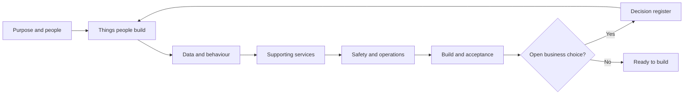

# Abzum Vortex platform specification

**Status:** Approved specification 2.16
**Date:** 5 September 2026
**Owner:** [Abzum NZ](https://github.com/Abzum-NZ)

**Source repository:** [Abzum Vortex](https://github.com/Abzum-NZ/Abzum-Vortex)
**Delivery board:** [Vortex GitHub Project](https://github.com/orgs/Abzum-NZ/projects/2/views/1)

This is a new specification for [Abzum Vortex](https://github.com/Abzum-NZ/Abzum-Vortex). It replaces the structure of the earlier [Platform Specification](https://claude.ai/code/artifact/f202d3c7-4c73-417c-bd3f-90740c2bc1d4), but does not silently discard its requirements. The [coverage map](appendices/traceability.md) records where each earlier chapter and build phase is addressed.

This document is the approved product contract for the current build scope. The [open decision register](appendices/decisions.md) contains one explicitly non-blocking Studio authoring-surface choice; confirmed runtime requirements do not depend on it. A future material uncertainty must be recorded there before implementation assumes an answer.

## Architecture review additions

- [IAM application](appendices/iam-application.md): all role grants use user-linked requests, reviews and workflows in an ordinary Vortex application, with protected effective assignment and no parallel granting surface.
- [One organisation-managed role and permission catalogue](04-access-and-permissions.md#one-organisation-managed-catalogue): application registration supplies permission declarations and role templates; explicit organisation assignments control access, and application updates never silently broaden grants.
- [Page-builder contracts and Fluid adaptation](appendices/page-builder-contracts.md): shells, slots, typed settings/data/forms, responsive layout, operation parity and immutable-release migration.
- [Review findings, subject coverage and corrected delivery order](../build-plan/architecture-review.md).
- [HR example and workflow-only approvals](appendices/page-builder-contracts.md#hr-example-policy), approved by the owner in this review. This is a normal Vortex application, never hardcoded runtime behavior.

## How to read this specification

Each section contains:

1. A plain-language explanation of the outcome.
2. A diagram showing composition or working behaviour.
3. Testable requirements.
4. Links to related sections and any future unresolved choices.

Words such as “organisation,” “module,” “application,” and “published version” have one meaning throughout. Those meanings are maintained in the [glossary](appendices/glossary.md).

## Specification sections

### Product foundation

1. [Purpose, scope and product boundaries](01-purpose-and-scope.md)
2. [Tenants, organisations, people and sign-in](02-people-organisations-and-sign-in.md)
3. [Platform composition and publication](03-composition-and-publication.md)
4. [Access and permissions](04-access-and-permissions.md)

### Things customers build

5. [Modules, fields and relationships](05-modules-fields-and-relationships.md)
6. [Records and their lifecycle](06-records-and-lifecycle.md)
7. [Applications, navigation, pages and themes](07-applications-pages-and-themes.md)
8. [Forms, actions, rules and events](08-forms-actions-rules-and-events.md)
9. [Workflows and process pipelines](09-workflows-and-pipelines.md)
10. [Queries, reports, search and live updates](10-queries-reports-search.md)

### Supporting services

11. [Files and attachments](11-files-and-attachments.md)
12. [Connections, programmable interfaces and MCP](12-connections-and-interfaces.md)
13. A Vortex-provided model or assistant is deliberately outside this release; governed external-client MCP access is covered by [Product boundaries](01-purpose-and-scope.md#product-boundaries).
14. [Activity history, privacy and retention](14-activity-privacy-and-retention.md)
15. [Entitlements and metering](15-entitlements-and-metering.md)
16. [Copying, sharing, import and export](16-copying-sharing-import-export.md)

### Platform safety and delivery

17. [Runtime services, storage and caching](17-runtime-storage-and-caching.md)
18. [Delivery environments, database changes and testing](18-delivery-and-testing.md)
19. [Operations, backup and recovery](19-operations-backup-and-recovery.md)
20. [Quality, accessibility and acceptance](20-quality-and-acceptance.md)

### Supporting references

- [Decision register](appendices/decisions.md)
- [Plain-language glossary](appendices/glossary.md)
- [Data contracts](appendices/data-contracts.md)
- [Module and application version-impact policy](appendices/version-impact-policy.md)
- [Core contract boundary](appendices/core-contract-boundary.md)
- [Worked examples](appendices/worked-examples.md)
- [Coverage and traceability map](appendices/traceability.md)
- [GitHub delivery coverage](appendices/github-delivery-map.md)
- [Revised build plan](../build-plan/README.md)

## Authority and change rules

- A published numbered version of this document is authoritative only when the [open decision register](appendices/decisions.md) contains no blocking entry.
- A change to required behaviour updates this specification before the related [GitHub issue](https://github.com/orgs/Abzum-NZ/projects/2/views/1) is built.
- A change must update the affected diagram, requirement, acceptance example, [data contract](appendices/data-contracts.md), [coverage map](appendices/traceability.md), [GitHub delivery map](appendices/github-delivery-map.md), and [build-plan dependency](../build-plan/README.md).
- The repository history is the revision record. Each published specification version also records a short human-readable summary in this file.
- No issue, comment, fixture, or implementation detail overrides this specification. A conflict is recorded in the [decision register](appendices/decisions.md) and resolved before implementation continues.
- Every privileged contract must pass the normative [core contract admission test](appendices/core-contract-boundary.md#admission-test). Business-domain functionality is built as an ordinary Vortex application unless a documented platform invariant makes that impossible.

## Version history

| Version | Status | Date | Summary |
|---|---|---|---|
| 2.16 | Approved | 5 September 2026 | IAM is the single role-grant management application. Ordinary user-linked request/review records and workflows orchestrate protected Access changes; indirect access expansion, explicit setup, immediate removal and UI/MCP parity are included. Full workflow delivery remains separate from early service foundations. |
| 2.13 | Approved | 5 September 2026 | Defined organisation selection and request-context composition: a minimum safe launcher, address-scoped tab selection, browser-supplied organisation identifier only, trusted Identity Authority binding, atomic Identity/Access scope resolution, live Access-version validation, shared row locks, transaction-local request authority and neutral unavailable outcomes. |
| 2.12 | Approved | 5 September 2026 | Defined the server-only Supabase identity-session boundary: request-specific SSR clients, `getClaims()` Proxy refresh, independent protected-operation verification, non-mutating cluster projection reads, closed temporary failures, secure hosted and loopback cookie profiles, staged writes, local sign-out, realistic refresh/revocation guarantees and no Vortex session store. |
| 2.11 | Approved | 5 September 2026 | Implemented the Access-version foundation: one private counter per organisation, exact active-scope reads, atomic invitation/account lifecycle composition, a closed change-reason catalogue, strict grants and real concurrent-increment proof. Identity can no longer expose runtime invitation acceptance or account-state changes outside the Access-owned transaction. |
| 2.10 | Approved | 4 September 2026 | Defined the cluster-local identity projection, organisation-account and fingerprint-only invitation contracts: provider identity data remains in Supabase Auth, pending invitations create no account, verified-email acceptance is single-use and concurrency-safe, and only exact pre-request Identity functions receive runtime access. |
| 2.9 | Approved | 4 September 2026 | Aligned identity email journeys with Supabase's supported verification and implicit redirect flow, including immediate fragment removal, minimum request-local credentials, no durable session before #26, isolated Testing Mailtrap evidence and a Production email-prefetch readiness control. |
| 2.8 | Approved | 4 September 2026 | Defined bounded immutable definition history and safe draft restoration: newest-first revision pagination, exact metadata reads, source and release-integrity verification, no identity allocation, exact-source provenance, stale-draft refusal and unchanged consumer pinning. |
| 2.7 | Approved | 4 September 2026 | Defined one server-only Definition-service consumer read: explicit current-or-exact revision selection, safe canonical release projection, exact manifest pinning, release-integrity verification and no cache. |
| 2.6 | Approved | 4 September 2026 | Defined stable operated Auth domains and protected-site automation access for Testing identity proof; assigned the live access-version counter exclusively to the Access service; kept Phase 2 request context application-free; and aligned identity suspension, restore provenance, contracts, delivery tasks and dependencies with those boundaries. |
| 2.5 | Approved | 4 September 2026 | Defined deterministic Definition publication: permanent-ID sharing-condition revision history, read-only exact dependency preparation, immutable releases containing their canonical compilation output and exact resolution snapshot, and one locked append that stores the one-for-one manifest and advances only the root discovery pointer without retargeting consumers. |
| 2.4 | Approved | 4 September 2026 | Defined permanent Definition source identities as database-allocated, append-only owner and alias evidence. Added stable parent-owner scope beside current compiler lookup scope so parent-key changes preserve nested component identity, and confirmed that Phase 2 seeds no starter Module or Application without an owning platform requirement. |
| 2.3 | Approved | 4 September 2026 | Corrected publication so a Module or Application may append a breaking inert release without inspecting or retargeting existing consumers. Existing applications, installations and grants remain pinned to their exact recorded releases; compatibility and storage migration are checked only when the owning operation deliberately adopts the newer release. |
| 2.2 | Approved | 3 September 2026 | Added a governed Model Context Protocol surface as a required alternative way to use every authorised interface capability. Defined a permission-filtered semantic view of navigation, forms, controls and actions; shared UI/MCP execution; optional live interface control; OAuth-bound external-agent sessions; and parity acceptance without adding an embedded model or assistant. |
| 2.1 | Approved | 2 September 2026 | Established the platform-primitives-only boundary. Removed commercial billing, ordinary approvals, business announcements, organisation business profiles and privacy case management from core; retained only generic entitlements, metering, grant consent, protected data handling and operational status. Simplified the workflow catalogue, moved motion implementation to the platform UI system, and corrected public caller contexts and safe errors. |
| 2.0 | Approved | 1 September 2026 | Incorporated all remaining business choices: separate module and application versions, tenant hierarchy and tenant administrators without implicit data access, controlled permission wildcards, multi-team membership and direct record sharing, safe record/field/file rules, Kestra-authoritative workflow status and governed nodes, no AI scope, organisation-scoped erasure, tenant billing and announcements, Testing-only database checks, one-hour RPO/eight-hour RTO, non-blocking performance measurement, storage-lineage table allocation, and explicit use of Supabase Auth, row rules, Queue, Webhooks, private Realtime invalidation, Storage, database verification, advisers and managed recovery. The decision register is clear. |
| 2.0-draft.5 | Review draft | 1 September 2026 | Final sharing policy written through the specification and plan: approval by both organisations, published saved conditions, no live re-sharing, named application roles, explicit action/field/export rights, and source-executed search, reports, and approved export through ordinary record components. Resolved choices were removed from the open register. |
| 2.0-draft.4 | Review draft | 1 September 2026 | Approved exact sharing-code or signed-link recipient discovery and separate source/recipient usage allocation because source-pays-all would not materially reduce complexity. |
| 2.0-draft.3 | Review draft | 1 September 2026 | Approved one sharing experience using a local adapter inside a cluster and a signed, source-authoritative Vortex Federation API across clusters, with no persistent recipient-cluster record copy. |
| 2.0-draft.2 | Review draft | 1 September 2026 | Approved one global identity with separate organisation accounts; reviewed and corrected the contributed record-sharing proposal and exposed its remaining business choices. |
| 2.0-draft.1 | Review draft | 31 August 2026 | New structure, contradictions exposed as choices, delivery plan reconciled with the repository. |
