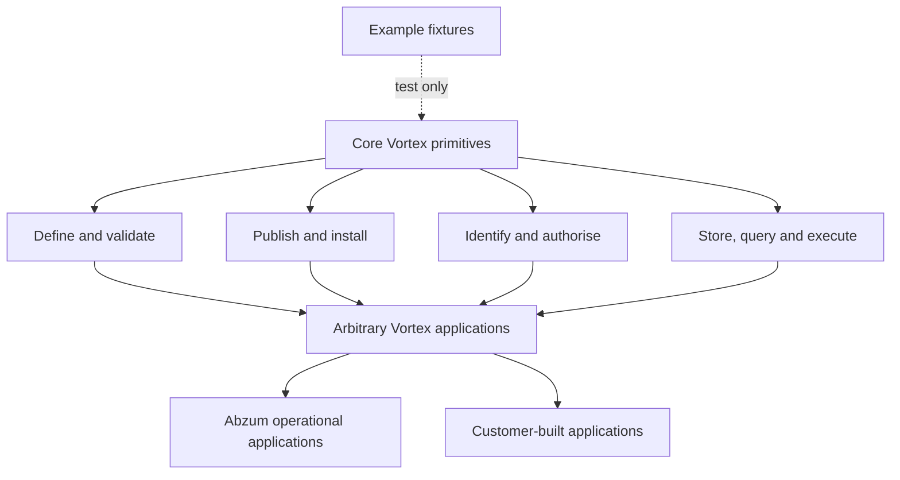
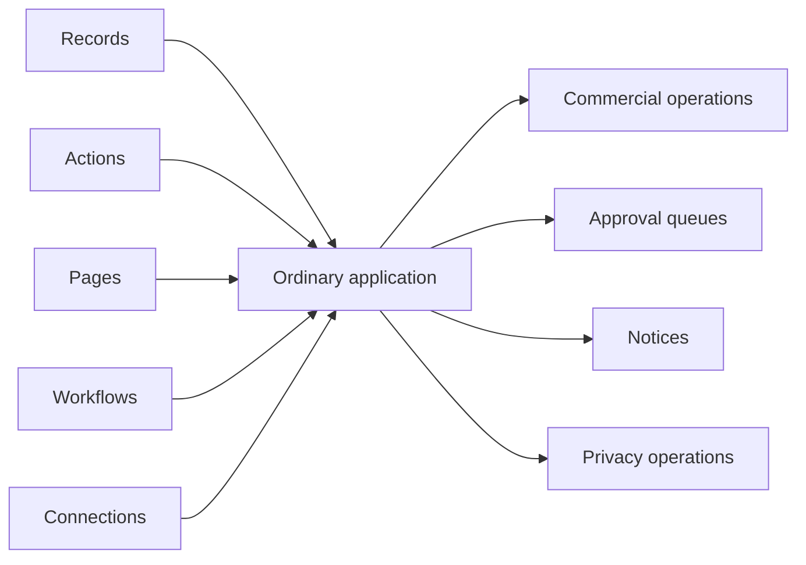

# Core contract boundary

Scoped flow execution identities are admitted only as the minimum security primitive needed to execute arbitrary configured applications safely. The [execution-identity contract](frontend-rule-designer.md#node-execution-identity) remains owned by Access; business-role policy stays in ordinary applications. See the [whole-platform review](../../build-plan/architecture-review-2026-09-07.md).

[Specification index](../README.md) · [Data contracts](data-contracts.md) · [Build plan](../../build-plan/README.md)

## Normative rule

Core Vortex contracts may describe only capabilities required to define, validate, publish, secure and execute arbitrary [Vortex applications](../03-composition-and-publication.md). Business-domain functionality — including Abzum's own operational applications — must be implemented using those same Vortex primitives unless a documented platform-level invariant makes that impossible.

This rule applies to [contracts](../../../contracts/README.md), runtime services, database schemas, workflow nodes, system interfaces, Studio tools and GitHub delivery tasks. Example applications may use business language inside [testing fixtures](../../../testing/fixtures), but their names and outcomes must never decide core behaviour.

## Admission test

A privileged core concept is allowed only when all four answers are **yes**:

1. Is it needed by arbitrary applications rather than one business domain?
2. Would implementing it as ordinary records, actions, pages and workflows make security, publication or execution impossible?
3. Can its owner, scope and enforcement point be named without referring to an example application?
4. Is the smallest safe contract documented in the [core inventory](#core-inventory)?

If any answer is no, the concept is an ordinary application capability. A delivery task cannot create an exception implicitly; an exception requires a specification change, an explicit invariant and a review of affected contracts and dependencies.

## Keep the implementation proportionate

Use the smallest implementation that satisfies the documented behaviour. A new counter, fingerprint, state or abstraction needs a concrete failure case that existing identities, revisions and transactions cannot handle. Reuse existing mechanisms; do not build speculative frameworks or turn every failure case into a separate domain concept. Reviewers must identify unnecessary machinery as well as missing safeguards. Correct the current contract and its consumers together instead of retaining obsolete representation compatibility layers.

Fix defects at their cause rather than layering compensating guards around broken behaviour, and keep unrelated maintenance outside the current feature. The current fleet implements bounded source changes and uses independent Opus 5 or GPT 5.6 Sol review with reviewer-owned fixes; code review assesses the required outcomes and relevant failure handling, and this development pass adds no tests or separate hosted/database proof gate. If a correction changes unresolved business behaviour, pause only the affected work and ask the product owner for the exact missing decision; an unresolved product decision or real prerequisite blocks its dependent pickup rather than licensing a skip to later ordered work. The architect makes technical implementation decisions and records material reasoning. Touching IAM, Access, permissions or migrations does not itself create another product approval requirement. Existing product permission and transaction safeguards still apply, and development completion authorises no Production action. Follow [agent coordination](../../build-plan/agent-coordination.md) for ownership, strict roadmap order and development completion.

For [role changes](groups-and-privileged-access.md#editing-a-role-versus-accepting-permissions), preserve three guarantees: changes are atomic and revision-checked; broadened or restored authority requires explicit fresh acceptance; competing role and assignment changes serialize or refuse as stale without partial effects. Supporting evidence is an implementation detail, not another user-facing approval process. Retain separate continuity checks only where they protect distinct behaviour; merge duplicates, not different safeguards merely because their names sound similar.

The [Access version](data-contracts.md#permission-and-role-contracts) orders access changes. Its change timestamp is observation metadata, not an additional ordering or authorisation decision. Local clock faults belong to environment verification, not new permission semantics; genuine start and expiry checks still use current trusted time.

## Core inventory

| Retained capability                                                                           | Platform-level invariant                                                                                                    | Owning boundary                                                                                |
| --------------------------------------------------------------------------------------------- | --------------------------------------------------------------------------------------------------------------------------- | ---------------------------------------------------------------------------------------------- |
| Stable identities, tenants, organisation hierarchy, organisation accounts and caller contexts | Access cannot be evaluated without a stable actor and organisation boundary.                                                | [Identity](../02-people-organisations-and-sign-in.md)                                          |
| Definitions, modules, applications, fields, pages and publication versions                    | Vortex cannot define or safely publish arbitrary applications without them.                                                 | [Composition](../03-composition-and-publication.md)                                            |
| Permissions, access decisions, grants and cross-organisation grant consent                    | Every protected read or change needs one enforceable decision; a cross-organisation grant needs immutable consent evidence. | [Access](../04-access-and-permissions.md)                                                      |
| Records, relationships, queries, events and generic actions                                   | Arbitrary application data needs a common execution language.                                                               | [Records](../06-records-and-lifecycle.md) and [queries](../10-queries-reports-search.md)       |
| One flow definition, the task registry and the Vortex flow engine: generic control flow, record operations, human input and connection calls | Every behaviour is a stored flow definition built from composition primitives, not named business outcomes. The server drives any flow that contains a protected task, and every protected task runs through the one protected-operation executor, which rechecks current authority. | [Workflows](../09-workflows-and-pipelines.md) and [Decision 1](../../build-plan/architecture-decisions-2026-09-25.md#decision-1--one-flow-definition-one-vortex-flow-engine-kestra-for-durable-work) |
| Application Kestra instance for durable flows                                                  | Customer durable flows run where the environment holds only the callback signing key, and customer text never reaches Kestra's template engine. | [Workflows](../09-workflows-and-pipelines.md) and [Decision 1](../../build-plan/architecture-decisions-2026-09-25.md#keeping-customer-text-out-of-kestras-template-engine) |
| Files, connections and interfaces                                                             | Arbitrary applications need protected binary data and external interaction boundaries.                                      | [Files](../11-files-and-attachments.md) and [connections](../12-connections-and-interfaces.md) |
| Custom component sandbox                                                                      | Package-bundled browser code must run without Vortex credentials, receive only its mapped fields and start flows only through bindings. | [Application packages](application-packages.md#custom-components)                              |
| Activity evidence, data classification, retention, legal holds and protected removal          | Security and lawful data handling must cover every application record, regardless of which application defined it.          | [Activity and retention](../14-activity-privacy-and-retention.md)                              |
| Entitlement decisions and immutable metering events                                           | Runtime resource limits must be enforceable without understanding how an entitlement was sold or assigned.                  | [Entitlements and metering](../15-entitlements-and-metering.md)                                |
| Storage lineage, cache invalidation and federation                                            | Definitions need collision-free storage and source-authoritative sharing across clusters.                                   | [Runtime and storage](../17-runtime-storage-and-caching.md)                                    |
| Runtime bundle per installation revision                                                      | Opening a page must read no definition, so each installation revision compiles once into a bundle under an immutable key that holds declared permission requirements but no decisions. | [Application packages](application-packages.md#caching)                                        |
| Operational status, recovery, audit and time-bound support access                             | The platform must remain diagnosable and recoverable even when an application is unavailable.                               | [Operations](../19-operations-backup-and-recovery.md)                                          |

## System modules

The [core inventory](#core-inventory) retains the platform concepts that cannot safely be ordinary application records, but applications must still be able to show, link and reason about them. The platform therefore publishes **system modules**: ordinary versioned modules whose **system record types** are read-only projections over the protected core storage and whose actions bind to named **protected operations**. In this specification, a **system module** is such a module; a **system record type** is a read-only record type whose typed fields project protected core storage, with standard create, update and delete refused; and a **protected operation** is a named, authority-checking platform operation that a system module action binds to and that is the only write path over the protected fact. A system record type behaves like any other [record type](../05-modules-fields-and-relationships.md) for lists, forms, links, filters, organisation-added fields, queries and flows, but it has no ordinary create, update or delete path.

A system module does not copy protected facts into application records and does not become a second authorisation authority. The projection resolves the protected fact at request time under the viewer's current authority, and the protected operation remains the only write path, re-checking current authority, target revision and the relevant safeguard in its own transaction. Publishing, installing and versioning a system module follow the ordinary [definition lifecycle](../03-composition-and-publication.md). A later [Module contract change](https://github.com/Abzum-NZ/Abzum-Vortex/issues/1029) declares the system projection storage kind, its typed read-only fields, its registered protected view or function and its revision field; this section defines the boundary those contracts must preserve.

### Concept mapping

| Core concept | Stays protected in the core | Read-only system record type | Protected operations (the only writes) | What becomes ordinary definition |
| --- | --- | --- | --- | --- |
| People (organisation accounts) | Global identity, cluster-local identity projection, organisation accounts, status and profile, and the Access decision that scopes them | Organisation-account (person) projection for the current organisation, with its Group membership | Invitation acceptance and account creation/reactivation; account suspend, reactivate and close; offboarding and ownership transfer; trusted appointment | Organisation Administration and IAM person lists, forms, links and flows; organisation-added person fields reuse [module extension points](../05-modules-fields-and-relationships.md#extension-points) |
| Invitations | Raw invitation secret, which is never stored, and its fingerprint, single-use acceptance and expiry rules | Organisation-invitation projection (address, expiry, state), never the secret | Create and revoke an invitation; accept an invitation | Organisation Administration invitation list, create form and row actions |
| Groups and memberships | Group identity and metadata, memberships, and delegated management scope | Group projection with its current members; the person projection shows Group membership | Create or edit Group metadata; add and remove membership; grant, replace and revoke management delegation | IAM Roles and Groups pages, lists, forms and selection flows |
| Permissions and roles | Permission declarations and their exact owning definition, organisation catalogue availability, immutable role templates and acceptance state | Permission-catalogue entry and role/template projection with accepted configuration and safe policy settings | Register, upgrade, reactivate and withdraw an application; accept a template; create, edit and retire a local role | IAM catalogue browsing, custom-role pages and availability lists |
| Assignments | Effective direct and Group assignments, their exact role/permission references, revisions and source evidence | Assignment projection (holder, role, time window, revision, stored state) | Grant, remove and replace an assignment; accept a changed supplied role | IAM assignment lists, request/review records and the links between them |
| Activations and delegations | Eligible and active activation facts, and bounded delegation authorities | Activation projection and delegation-authority projection | Activate, deactivate and expire an eligible role; grant, replace and revoke a delegation | IAM privileged-activation views and the delegated-scope administration journey |
| Tenants and organisations | Tenant, organisation hierarchy, lifecycle state, tenant-administrator assignments and permanent-steward facts | Tenant-structure and organisation projection (identity, parent, lifecycle, display name; no organisation application data) | Create, move, suspend, reactivate and archive an organisation; suspend and reactivate a tenant; appoint a tenant administrator | Tenant Administration structure pages, forms, lists and protected row actions |
| Settings and installed applications | Runtime and localisation setting values and their owner initializer; active application registrations, exact releases and catalogue availability | Organisation-settings projection and installed-application registration projection | Update runtime settings; register, upgrade, reactivate and withdraw an application | Organisation Administration settings form and application list; the extendable settings record ([#1045](https://github.com/Abzum-NZ/Abzum-Vortex/issues/1045)) |
| Activity entries | Activity evidence writers, retention rules and legal holds | Activity-entry projection under the viewer's current authority | Protected removal; legal-hold set and clear | Activity lists, detail pages and audit filters in any application |
| Files and connections | File storage and its sharing grants; connection instances, their encrypted credentials and allowed operations | File-metadata projection and connection-instance projection, never credentials or secret values | Upload, revoke and remove a file; create, update, test and rotate a connection; bind a connection to an application | Attachments, file lists, connection settings pages and connection-call flows |

### System record type rules

All system record types follow the same boundary:

1. **Never shared across organisations.** A system record type is scoped to exactly one organisation, and tenant structure to exactly one tenant. It is never named by an inter-application or cross-organisation grant, returned by a federation or shared-record read, inherited from a parent organisation, or copied into another organisation.
2. **Never cached across requests.** A system-record value is resolved live for each request. No cross-request cache, search index, materialised report result, continuation snapshot or offline copy holds it, so a query over a system record type always bypasses the cross-request data-result cache ([runtime and caching](../17-runtime-storage-and-caching.md#cache-model)). Presentation may be cached, but every live invalidation re-runs the current query.
3. **Read only through the one query path under the viewer's current authority.** Every system-record read uses the validated [query contract](../10-queries-reports-search.md#query-contract): organisation isolation, record visibility, field permissions and the read permission the system record type declares are applied before rows, counts, groups or totals are produced. A system record type adds no new reader, endpoint or permission vocabulary, and its declared filterable and sortable fields still obey their field rules.
4. **Never written through the record.** The one [record-change command](../06-records-and-lifecycle.md#record-change-command) refuses to create, change, delete or restore a system record, and publication refuses a form, action or flow that binds a record task to a system record type's projected fields. Every change goes through the named protected operation, which rechecks current actor authority, target revision and the relevant safeguard, and commits atomically with any Access-version change it causes and its Activity evidence. An editable request, import, direct URL, agent or MCP call cannot write the projection.

A system record type is extended only with organisation-added fields through the ordinary module [extension points](../05-modules-fields-and-relationships.md#extension-points). Their values are ordinary organisation data keyed to the system record and changed through the record-change command under their own field permissions; they never change the protected fact, and the protected storage and its write path never widen.

The administration applications are ordinary definitions over system modules, delivered as **system applications**: IAM, Organisation Administration, Tenant Administration and the Landing Zone. They supply modules, pages, lists, forms, actions and flows, and the core contains no portal-specific page or reader. Under [Decision 11](../../build-plan/architecture-decisions-2026-09-25.md#decision-11--building-installing-and-system-applications-are-permission-gated), system applications are platform packages installed when an organisation is created, and they cannot be uninstalled. People whose role grants `platform.organization.system_applications.manage` customise them through extension fields, theme, navigation and their own dependent applications, or through an organisation-owned customised copy ([#1058](https://github.com/Abzum-NZ/Abzum-Vortex/issues/1058)) that replaces the system application's installation. The protected operations and their bindings stay platform-owned: no customisation adds, removes or retargets a protected-operation binding, and platform upgrades never overwrite customisations.

## Ordinary applications, not core domains

The following are built from the retained primitives:

| Application concern                                                  | Composition                                                                                                                                                                                                                                    |
| -------------------------------------------------------------------- | ---------------------------------------------------------------------------------------------------------------------------------------------------------------------------------------------------------------------------------------------- |
| Commercial billing, pricing, subscriptions, invoices and payments    | Modules and records plus [connections](../12-connections-and-interfaces.md) and [workflows](../09-workflows-and-pipelines.md).                                                                                                                 |
| Personal start page, favourites, bookmarks and recently used         | The Landing Zone system application: organisation-account-owned records, pages, flows and a shell slot. Core supplies only the permitted-applications read, the organisation default application and generic link blocks.                     |
| Business approvals and work queues                                   | Request and decision record types, pages, permissions, human-input workflow steps and named actions.                                                                                                                                           |
| IAM access requests, reviews and administration journeys             | The ordinary [IAM application](iam-application.md) owns request/review records and workflows. Protected Access owns effective assignments and delegation because editable business records cannot safely be their own authorisation authority. |
| Tasks, comments, tags, calendar entries and notifications            | Ordinary record types and actions. Delivery to an external provider uses a connection call.                                                                                                                                                    |
| Organisation legal details, contacts, branding and business calendar | The Organisation Administration system application, using ordinary fields and pages.                                                                                                                                                             |
| Privacy request case management                                      | A platform-supplied Privacy Operations application with platform-owned protected-operation bindings that invokes protected discovery, export and removal operations.                                                                                                                                       |
| Tenant, organisation and application notices                         | An ordinary Notices application rendered through a reusable accessible banner block.                                                                                                                                                           |
| Incident, support and customer-communication records                 | Ordinary operations or service applications. Core support access references their authorisation evidence without owning the ticket record.                                                                                                     |

## Source and runtime separation

The production [definition-source boundary](data-contracts.md#runtime-and-definition-source-layers) uses readable builder keys and is capability-complete for modules, applications and platform connection types. The pure [definition compiler](../../../runtime/definition/src/compiler.ts) resolves that source to the branded stable identifiers used by runtime contracts without semantic loss. The schemas and compiler are shipping generic platform code; acceptance scenarios, expected example outcomes and storage demonstrations remain test-only evidence in the non-shipping test surface.

Core source must not contain an example application's name, module name, record type, field, workflow or connection key. Automated source guards enforce this rule. Test fixtures may assert example-specific outcomes because they are consumers of the generic platform, not inputs to its semantics.
