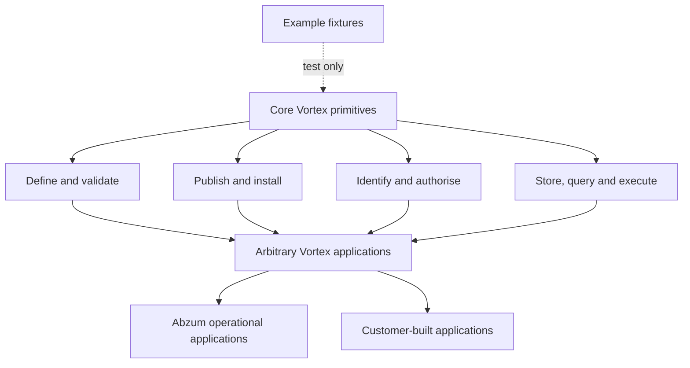
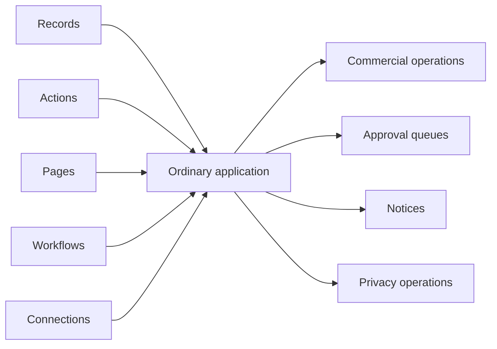

# Core contract boundary

[Specification index](../README.md) · [Data contracts](data-contracts.md) · [Build plan](../../build-plan/README.md)

## Normative rule

Core Vortex contracts may describe only capabilities required to define, validate, publish, secure and execute arbitrary [Vortex applications](../03-composition-and-publication.md). Business-domain functionality — including Abzum's own operational applications — must be implemented using those same Vortex primitives unless a documented platform-level invariant makes that impossible.

This rule applies to [contracts](../../../contracts/README.md), runtime services, database schemas, workflow nodes, system interfaces, Studio tools and GitHub delivery tasks. Example applications may use business language inside [testing fixtures](../../../testing/fixtures), but their names and outcomes must never decide core behaviour.

## Admission test

A privileged core concept is allowed only when all four answers are **yes**:

1. Is it needed by arbitrary applications rather than one business domain?
2. Would implementing it as ordinary records, actions, pages and workflows make security, publication or execution impossible?
3. Can its owner, scope and enforcement point be named without referring to an example application?
4. Is the smallest safe contract documented in the [core inventory](#core-inventory)?

If any answer is no, the concept is an ordinary application capability. A delivery task cannot create an exception implicitly; an exception requires a specification change, an explicit invariant and a review of affected contracts and dependencies.

## Keep the implementation proportionate

Use the smallest implementation that satisfies the documented behaviour. A new counter, fingerprint, state, abstraction or compatibility layer needs a concrete failure case that existing identities, revisions and transactions cannot handle. Reuse existing mechanisms; do not build speculative frameworks or turn every test case into a separate domain concept. Reviewers must identify unnecessary machinery as well as missing safeguards.

For [role changes](groups-and-privileged-access.md#editing-a-role-versus-accepting-permissions), preserve three guarantees: changes are atomic and revision-checked; broadened or restored authority requires explicit fresh acceptance; competing role and assignment changes serialize or refuse as stale without partial effects. Supporting evidence is an implementation detail, not another user-facing approval process. Retain separate continuity checks only where they protect distinct behaviour; merge duplicates, not different safeguards merely because their names sound similar.

The [Access version](data-contracts.md#permission-and-role-contracts) orders access changes. Its change timestamp is observation metadata, not an additional ordering or authorisation decision. Local clock faults belong to environment verification, not new permission semantics; genuine start and expiry checks still use current trusted time.

## Core inventory

| Retained capability | Platform-level invariant | Owning boundary |
|---|---|---|
| Stable identities, tenants, organisation hierarchy, organisation accounts and caller contexts | Access cannot be evaluated without a stable actor and organisation boundary. | [Identity](../02-people-organisations-and-sign-in.md) |
| Definitions, modules, applications, fields, pages and publication versions | Vortex cannot define or safely publish arbitrary applications without them. | [Composition](../03-composition-and-publication.md) |
| Permissions, access decisions, grants and cross-organisation grant consent | Every protected read or change needs one enforceable decision; a cross-organisation grant needs immutable consent evidence. | [Access](../04-access-and-permissions.md) |
| Records, relationships, queries, events and generic actions | Arbitrary application data needs a common execution language. | [Records](../06-records-and-lifecycle.md) and [queries](../10-queries-reports-search.md) |
| Generic control flow, record operations, human input and connection calls | Workflows need composition primitives, not named business outcomes. | [Workflows](../09-workflows-and-pipelines.md) |
| Files, connections and interfaces | Arbitrary applications need protected binary data and external interaction boundaries. | [Files](../11-files-and-attachments.md) and [connections](../12-connections-and-interfaces.md) |
| Activity evidence, data classification, retention, legal holds and protected removal | Security and lawful data handling must cover every application record, regardless of which application defined it. | [Activity and retention](../14-activity-privacy-and-retention.md) |
| Entitlement decisions and immutable metering events | Runtime resource limits must be enforceable without understanding how an entitlement was sold or assigned. | [Entitlements and metering](../15-entitlements-and-metering.md) |
| Storage lineage, cache invalidation and federation | Definitions need collision-free storage and source-authoritative sharing across clusters. | [Runtime and storage](../17-runtime-storage-and-caching.md) |
| Operational status, recovery, audit and time-bound support access | The platform must remain diagnosable and recoverable even when an application is unavailable. | [Operations](../19-operations-backup-and-recovery.md) |

## Ordinary applications, not core domains

The following are built from the retained primitives:

| Application concern | Composition |
|---|---|
| Commercial billing, pricing, subscriptions, invoices and payments | Modules and records plus [connections](../12-connections-and-interfaces.md) and [workflows](../09-workflows-and-pipelines.md). |
| Business approvals and work queues | Request and decision record types, pages, permissions, human-input workflow steps and named actions. |
| IAM access requests, reviews and administration journeys | The ordinary [IAM application](iam-application.md) owns request/review records and workflows. Protected Access owns effective assignments and delegation because editable business records cannot safely be their own authorisation authority. |
| Tasks, comments, tags, calendar entries and notifications | Ordinary record types and actions. Delivery to an external provider uses a connection call. |
| Organisation legal details, contacts, branding and business calendar | A locked Organisation Administration application using ordinary fields and pages. |
| Privacy request case management | A locked Privacy Operations application that invokes protected discovery, export and removal operations. |
| Tenant, organisation and application notices | An ordinary Notices application rendered through a reusable accessible banner block. |
| Incident, support and customer-communication records | Ordinary operations or service applications. Core support access references their authorisation evidence without owning the ticket record. |

## Source and runtime separation

The production [definition-source boundary](data-contracts.md#runtime-and-definition-source-layers) uses readable builder keys and is capability-complete for modules, applications and platform connection types. The pure [definition compiler](../../../runtime/definition/src/compiler.ts) resolves that source to the branded stable identifiers used by runtime contracts without semantic loss. The schemas and compiler are shipping generic platform code; acceptance scenarios, expected example outcomes and storage demonstrations remain test-only evidence in the non-shipping test surface.

Core source must not contain an example application's name, module name, record type, field, workflow or connection key. Automated source guards enforce this rule. Test fixtures may assert example-specific outcomes because they are consumers of the generic platform, not inputs to its semantics.
