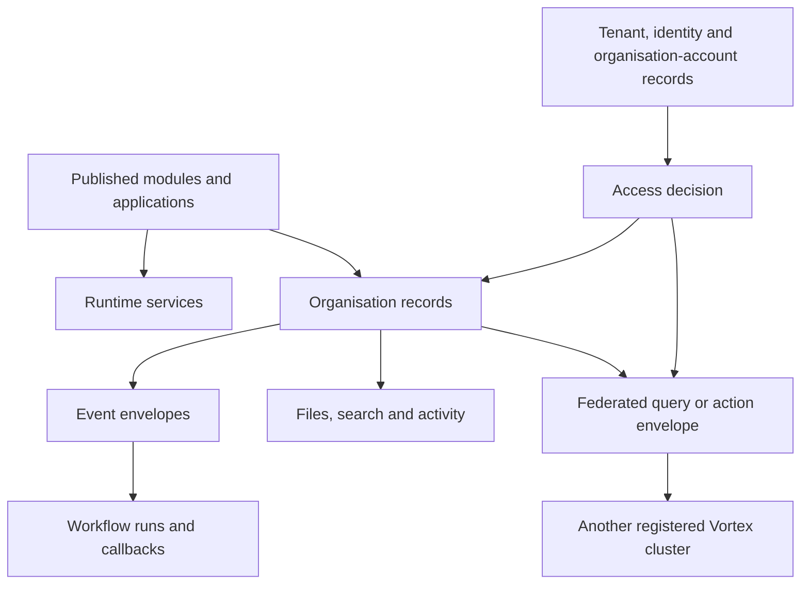

# Data contracts

[Specification index](../README.md) · [Glossary](glossary.md) · [Decision register](decisions.md)

These contracts name the information that must exist. They do not prescribe a database library or generated code structure. A value described as an identifier is an opaque platform-issued value; callers must not derive meaning from its characters.

## Identifier rules

- A platform-issued identifier is globally unique, permanent, and never reused.
- A builder key is lowercase words and digits separated by underscores, begins with a letter, and is 1–40 characters unless a narrower contract applies.
- A module or application key is unique within its owner and kind and is at most 120 characters including namespace segments.
- A label is user-facing text and may change; it is never used as identity.
- External identifiers are stored with their provider and organisation scope.

## Published definition envelope

Every publishable [module or application](../03-composition-and-publication.md#definition-ownership-and-versions) has:

| Name | Requirement |
|---|---|
| `root_id` | Permanent platform-issued identifier. |
| `organisation_id` | Owning organisation, or an explicit platform publisher identifier for platform definitions. |
| `kind` | `module` or `application`. |
| `key` | Permanent builder key within owner and kind. |
| `draft_revision` | Increasing number used for edit conflicts. |
| `draft_content` | Complete validated-shape candidate content. |
| `published_revision` | Current live revision number or absent when never published. |
| `created_at`, `created_by` | Creation time and actor. |
| `updated_at`, `updated_by` | Last draft change time and actor. |

Each immutable published revision has `root_id`, `revision`, complete `content`, `content_fingerprint`, `published_at`, `published_by`, validation-contract version, dependency manifest, and release note.

It also has a human-readable release version following the package's version policy. The increasing `revision` is the storage identity; the release version communicates compatibility. Two different revisions cannot reuse one release version in the same root.

Contained components have a permanent identifier unique inside the module or application, a builder key, and their typed content. They do not carry a separate live pointer. Platform connection types and themes are identified by platform release and catalogue version; organisation roles and connection instances are live administrative data rather than published definitions.

## Tenant, identity and organisation-account records

### Tenant

`tenant_id`, permanent `short_name`, `display_name`, state, selected plan-version reference, billing-customer reference, creation and state-change times. Tenant states are active, suspended, archived, and removal pending.

A tenant-administrator assignment has tenant, global identity, state, permissions, creator, start, expiry, revocation, and activity references. It grants no organisation record permission.

### Organisation

`organisation_id`, required `tenant_id`, optional `parent_organisation_id`, permanent `short_name`, `display_name`, `state`, `state_changed_at`, `created_at`, and `created_by`. The parent must belong to the same tenant and cannot produce a cycle. A protected path/depth representation may accelerate checks but is derived from this relationship and must be transactionally consistent.

Organisation states are active, suspended, archived, and removal pending. Exact archive/grace durations are set through [privacy and billing decisions](decisions.md).

### Global identity

`identity_id`, verified primary email, identity state, second-factor enrolment state, creation time, and last successful sign-in time. Credentials and second-factor secrets are stored only by the identity-provider boundary, not in this record.

### Identity authority

Each environment has one Vortex Identity Authority shared by its clusters. Its public contract provides authority identifier, environment, token issuer, intended audience rules, current and next asymmetric public keys, key identifiers, activation and retirement times, and supported token-contract versions. An identity token provides `identity_id`, issue and expiry times, authentication strength, session identifier, and issuer; it does not contain authoritative organisation roles or substitute for an active [organisation account](../02-people-organisations-and-sign-in.md#concepts).

### Organisation account

`organisation_account_id`, `organisation_id`, `identity_id`, organisation-specific display name, state, optional language and time-zone preferences, invitation details, activation/suspension/closure times, and access-version contribution. The pair `organisation_id` and `identity_id` is unique, so one identity cannot have two accounts in the same organisation.

### Team and membership

A team has `team_id`, organisation, key, label, state, creator, and creation/change times. A membership has organisation, team, organisation account, state, start, optional expiry, grantor, and activity reference. The pair of team and organisation account is unique while active; one account may have several memberships. Cross-organisation membership is invalid.

### Invitation

`invitation_id`, organisation, normalised invited email, proposed role assignments, one-way token fingerprint, created/invited/expiry/revocation/acceptance times, inviter organisation account, and accepted organisation account.

### Session context

Global identity or system actor, tenant, organisation, application where present, organisation account, caller kind, session and issue times, expiry, authentication strength, access version, correlation identifier, and delegated/support context where present.

### Organisation profile and preferences

The Identity service owns only organisation identity and state. Organisation profile and preferences are organisation records owned by the App service: legal/trading names, registration details, contact details, approved brand assets, language, time zone, currency, financial-year start, date and number formats. The Workflow service owns business-calendar entries and exposes working-time calculations; the App service owns their Organisation Portal editing contract.

## Permission and role contracts

A permission has `permission_id`, permanent `key`, label, description, owner kind and owner identifier, optional record type, action kind, optional named action, and `administrative` flag.

A role has key, label, description, role kind, live revision, and permission entries. A permission entry is either one exact permission or a controlled trailing wildcard scoped to one named module or application. Wildcards exclude all administrative permissions and store the permission-catalogue fingerprint plus the expanded permission identifiers accepted at that role revision.

A role assignment has organisation, role, assignee kind (`organisation_account` or `team`), assignee identifier, optional application, start and expiry times, state, grantor organisation account, and activity link. A direct person assignment names an organisation account, never a global identity.

The Access service owns an `access_version` per organisation. Every organisation-account, role, assignment, team, sharing, public-policy, or application-role publication change increases it in the same transaction.

## Module and record-type contracts

A module contains identity and publication metadata, dependencies, record types, module actions, business events, and extension points.

A record type contains key, labels, title-field reference, storage scope, ownership mode, fields, relationships, standard actions, and custom action references.

Installing a definition package also records a lineage entry with source publisher, source root and component identifiers, source release version and content fingerprint, local root and component identifiers, local published revision, compatibility state, and mapping fingerprint. A federation-compatible application binding names that lineage entry and the source contract range it can display. Visual similarity or matching builder keys without proven lineage are insufficient.

Storage scope is `organisation_shared` or `application_contained`. Ownership mode may be none, organisation account, or team. Within-organisation direct record sharing uses the contract below; cross-organisation access always uses the governed access-grant contract.

## Field contract

Every field has `field_id`, `key`, `type`, `label`, optional `help_text`, `required`, optional `default`, `unique`, `filterable`, `sortable`, optional search priority, required personal-data class, required `public_display` choice (`refused` by default or `allowed`), and type-specific `settings`. A public operation separately allowlists every accepted or returned field.

The twenty-two type keys and their settings are defined in [Modules, fields and relationships](../05-modules-fields-and-relationships.md#field-types). Attachment settings are defined only in [Files and attachments](../11-files-and-attachments.md#canonical-attachment-settings). Unsupported common properties and unknown type settings are refused.

A calendar mapping is either `start_field_id` plus `end_field_id`, or `start_field_id` plus whole-number `duration_field_id` and explicit `duration_unit`. A money aggregate carries one currency code and refuses inputs containing a second currency code.

## Record storage contract

Every organisation-owned business record provides:

| Name | Requirement |
|---|---|
| `organisation_id` | Required organisation owner. |
| `record_type_id` | Required stable record-type identity. |
| `record_id` | Required permanent record identity. |
| `application_id` | Required only for application-contained storage. |
| `definition_revision` | Published module revision used for validation. |
| `owner_organisation_account_id` | Present when ownership is enabled; it must belong to the record's organisation. |
| `lifecycle_state` | `active`, `soft_deleted`, or `removal_pending`. |
| `concurrency_number` | Starts at one and increases on every accepted change. |
| `created_at`, `created_by` | Required creation record. |
| `updated_at`, `updated_by` | Required last-change record. |
| `deleted_at`, `deleted_by` | Present after soft deletion. |
| `removal_due_at` | Present when permanent removal is scheduled. |

Business fields are stored according to the published record-type contract. Relationship storage repeats the organisation identifier on both endpoints and enforces matching organisation scope.

The Record service owns a `data_version` for each organisation and record type. A committed create, change, delete, restore, relationship change, or access-relevant ownership change increases it.

Unique values remain reserved while `lifecycle_state` is `soft_deleted` or `removal_pending` and are released only by permanent removal.

## Direct record-share contract

A direct share applies to one record and one recipient inside the record's organisation:

| Name | Requirement |
|---|---|
| `direct_share_id` | Permanent identifier. |
| `organisation_id`, `record_type_id`, `record_id` | Required source record in the current organisation. |
| `recipient_kind`, `recipient_id` | `organisation_account` or `team`, belonging to the same organisation. |
| `readable_field_ids` | Explicit non-empty allowlist that the grantor can read. |
| `changeable_field_ids` | Explicit subset of readable fields that the grantor can change. |
| `starts_at`, `expires_at` | Required start and optional expiry. |
| `status` | `active`, `revoked`, or `expired`. |
| `granted_by`, `granted_at`, `reason` | Required grant evidence. |
| `revoked_by`, `revoked_at`, `revocation_reason` | Present after revocation. |

The grantor must currently hold `record.share`; the operation refuses fields or authority the grantor cannot delegate. The contract never grants delete, restore, export, re-share, ownership, or administration. Direct-share and team changes increase the organisation access version.

## Access grant contract

An access grant authorises one recipient context to perform named actions on source-owned records. It never transfers record ownership, replaces a module binding, or authorises an administrative table.

Every access grant provides:

| Name | Requirement |
|---|---|
| `grant_id` | Required permanent grant identity. |
| `source_cluster_id` | Required cluster that authoritatively stores the grant and records. |
| `source_organisation_id` | Required organisation that owns the records. |
| `source_application_id` | Required only when sharing application-contained records. |
| `recipient_cluster_id` | Required cluster that stores the recipient organisation account, application, roles, and non-content grant mirror. May equal the source cluster. |
| `recipient_organisation_id` | Required for cross-organisation grants; equal to the source for inter-application grants. |
| `recipient_application_id` | Required application from which the records may be requested. It must have a compatible module binding. |
| `recipient_role_ids` | Required non-empty set of roles in the named recipient application. An account must currently hold at least one of them. |
| `scope_kind` | Exactly one of `module`, `record_type`, `saved_condition`, or `record`. |
| `module_root_id` | Required stable module identity. |
| `record_type_id` | Required for record-type, saved-condition, and record scope. |
| `saved_condition_id`, `saved_condition_revision`, `saved_condition_fingerprint`, and `parameters` | Required only for saved-condition scope. The condition is published, the revision remains pinned for the grant, and parameter values must match its declared contract. |
| `record_id` | Required only for record scope. |
| `allowed_action_keys` | Required explicit action allowlist. Empty means no mutation. Every named action must be published as shareable by the source definition. |
| `readable_field_ids` | Required explicit field allowlist. Sensitive fields are refused in the first release. |
| `changeable_field_ids` | Required subset of readable fields; empty for read-only grants. |
| `export_allowed` | Required boolean; defaults to false in the creation experience and requires separate approval when true. |
| `approved_recipient_region` | Required source-approved service region for a cross-cluster grant. A different current recipient region suspends access until a newly approved payload activates. |
| `starts_at`, `expires_at` | Required start and expiry for a cross-organisation grant. No indefinite access is inferred. |
| `status` | `draft`, `pending_approval`, `active`, `suspended`, `revoked`, or `expired`. |
| `created_by_organisation_account_id` | Required source organisation account that proposed the grant. |
| `approval_request_id` | Required for a cross-organisation grant and links the exact approved payload fingerprint. |
| `contract_version`, `contract_fingerprint` | Required published source record contract understood by source and recipient applications. |
| `recipient_binding_id`, `definition_mapping_fingerprint` | Required recipient application binding and validated source-to-local component mapping. |
| `activated_at` | Present only after the Access service verifies the required decisions and activates the grant. |
| `revoked_at` | Present after revocation. |
| `revoked_by_organisation_account_id`, `revocation_reason` | Present after an authorised revocation. |

Only fields belonging to the chosen `scope_kind` may be populated. Grant validation and activation refuse an incompatible module binding, missing or empty recipient audience, sensitive field, unknown or non-shareable action, invalid condition parameter, unpinned condition revision, source/recipient reversal, or recipient equal to a forbidden audience.

One grant must independently cover record, action, and field. The runtime cannot take scope from one grant and fields or actions from another. When more than one complete grant allows the same request, the activity entry records every grant relied upon. A recipient cannot use a received record or result as the source of another live grant.

## Approval request contract

An approval request records a protected governance decision for cross-organisation sharing, access changes, or sensitive record actions. The platform-owned `vortex.approvals` capability supplies its screens and workflow, but ordinary module writes are not authoritative. Only the owning platform service can accept a decision and execute the approved action.

| Name | Requirement |
|---|---|
| `request_id` | Required permanent request identity. |
| `source_organisation_id` | Required organisation proposing the protected action. |
| `source_cluster_id` | Required cluster that owns the protected action. |
| `request_type` | Required: `cross_app_grant`, `cross_org_share`, or `record_action`. |
| `title` | Required human-readable description, 1–200 characters. |
| `payload_fingerprint` | Required fingerprint of the complete proposed action; changing the payload invalidates earlier decisions. |
| `status` | Required: `draft`, `pending`, `approved`, `refused`, `withdrawn`, `expired`, or `executed`. |
| `requested_by_organisation_account_id` | Required organisation account that created the request. |
| `requested_at` | Required creation timestamp. |
| `recipient_organisation_id` | Required for cross-organisation requests. |
| `recipient_cluster_id` | Required for cross-organisation requests and may equal the source cluster. |
| `required_decisions` | For `cross_org_share`, exactly one source-approval side and one recipient-acceptance side, each with its authorised role identifiers. |
| `expires_at` | Required deadline after which undecided requests expire. |
| `result_resource_id` | Present after the owning service executes the approved action. |

Each approval decision is an immutable child entry with request, decision side (`source_approval` or `recipient_acceptance`), payload fingerprint, approver organisation, approver organisation account, decision (`approved` or `refused`), time, optional safe note, authentication strength, and correlation identifier. A cross-organisation request requires one approved entry for each side over the same fingerprint. A later revocation of the resulting grant creates a separate grant event; it does not rewrite the approval history.

## Federation contracts

Federation transports the existing grant, query, action, file, and refusal contracts between clusters. It never exposes database tables or accepts raw SQL.

### Cluster manifest

| Name | Requirement |
|---|---|
| `cluster_id` | Required permanent cluster identity. |
| `environment` | Required `local`, `testing`, or `production`; requests cannot cross environments. |
| `federation_base_address` | Required approved HTTPS address. |
| `service_region` | Required deployment region used by sharing-policy checks. Changing it suspends grants that did not approve the new region. |
| `routed_organisation_ids` | Protected list of globally unique organisation identifiers currently served by the cluster; it contains no organisation profile or business data. |
| `status` | `active`, `draining`, `disabled`, or `retired`. Only `active` accepts new grants. |
| `protocol_versions` | Required supported federation protocol versions and compatibility ranges. |
| `shared_contract_versions` | Required supported query, action, grant, file, error, and identity-assertion contract versions. |
| `signing_keys` | Current and next public keys with key identifier, approved asymmetric algorithm, activation time, and retirement time. Verifiers accept only the platform algorithm allowlist; private keys never appear. |
| `issued_at`, `expires_at`, `manifest_signature` | Required directory-issued validity and integrity evidence. |

### Recipient discovery entry

The recipient directory stores a one-way fingerprint of the organisation sharing code, permanent organisation identifier, current cluster identifier, approved organisation display name, service region, state, issue and rotation times, and directory signature. A successful exact-code or signed-link lookup returns only the approved name, region, and a short-lived proposal address. It returns no people, account, role, application, record, file, plan, or billing information. Rotating the sharing code does not change existing grants because they use the permanent organisation identifier.

### Recipient assertion

A recipient assertion is short lived and signed by the recipient cluster. It contains `assertion_id`, `recipient_cluster_id`, `recipient_cluster_region`, `recipient_organisation_id`, `recipient_organisation_account_id`, global `identity_id`, `recipient_application_id`, current recipient role identifiers, recipient `access_version`, requested `grant_id`, intended `source_cluster_id`, authentication strength, issue and expiry times, one-use nonce, and correlation identifier. It contains no password, identity-provider private key, database credential, source role, or record value.

### Federated request envelope

Every cross-cluster request provides federation protocol version, operation name, sender and intended receiver cluster, issue and expiry times, one-use nonce, correlation identifier, duplicate-protection key where the operation can change state, shared-contract version and fingerprint, and a typed operation payload. A shared-record query, action, or file request also requires the recipient assertion; grant-control messages instead carry their exact signed proposal, decision, receipt, or revocation evidence. HTTPS protects transport. The [HTTP Message Signature](https://www.rfc-editor.org/rfc/rfc9421.html) and [Content-Digest](https://www.rfc-editor.org/rfc/rfc9530.html) protect the signed request components and body.

The response provides the same correlation identifier, source cluster, operation outcome, shared-contract version, source issue time, optional continuation token or result, and a stable safe error. A response never reveals whether an unapproved record exists.

### Federated query and action

A federated query provides request kind (`list`, `record`, `search`, or `report`), `grant_id`, source organisation, module, record type, published module revision, readable field projection, validated filter or search term, optional grouping and totals, stable sort, bounded page size, optional continuation token, and optional permitted count request. The source performs every filter, search, sort, grouping, total, grant, field, row-restriction, and pagination check before returning records or aggregates. Each record reference contains source cluster, source organisation, record type, record identifier, and concurrency number.

A recipient application search may run several independent federated `search` queries for a bounded set of active grant mirrors. Each result remains tied to one source and grant. The recipient merges them into a request-only Shared result group and does not create a shared search document. A saved report names exactly one source organisation, record type, grant, definition revision, selected readable fields, filter, grouping, totals, sort, and presentation. The recipient may store that non-content definition but never its source rows or calculated results.

A federated export request provides `grant_id`, source query fingerprint, declared format, approved readable field projection, maximum rows, duplicate-protection key, and download expiry. The source owns the bounded job and temporary file, rechecks the grant and saved condition during generation, and returns only a short-lived download instruction. The recipient cluster does not store the file. The source and recipient record linked usage and activity entries without including exported values.

A federated action provides `grant_id`, one source record reference, named action, validated action input, expected concurrency number, and duplicate-protection key. The source returns the ordinary action outcome and new concurrency number. A remote action cannot create a recipient-owned relationship or span a transaction in both clusters.

A federated file operation provides `grant_id`, source record reference, attachment field, operation (`upload_admit`, `upload_complete`, `preview`, or `download`), expected record concurrency where a save is involved, file identifier where present, and duplicate-protection key for a changing operation. The source File and Record services own every instruction, byte, scan, attachment, limit, and retention decision.

### Recipient grant mirror

The recipient stores one non-content mirror with `grant_id`, source and recipient cluster/organisation/application identifiers, approved recipient region, recipient role identifiers, contract version and fingerprint, definition-mapping fingerprint, source route, state, source proposal fingerprint, recipient decision reference, signed activation receipt, local access-version contribution, last reconciliation time, and safe last outcome. It stores no source record fields, files, query results, search documents, or workflow payloads. The source grant remains authoritative when the mirror disagrees or is stale.

## Action, rule and condition contracts

An action contains identifier, key, label, subject record type, permission, sharing setting (`refused` by default or `allowed`), inputs, precondition, and ordered effects. Effects are `set_field`, `create_linked_record`, or `announce_event`. A shared action executes wholly in the source organisation and cannot create a relationship to recipient-owned data.

A rule contains identifier, trigger, condition, priority, and one effect. Effects are `refuse`, `set_value`, `require`, `show_or_hide`, `warn`, or `start_background_work`.

A condition node has an operator and typed operands. Boolean groups use `all`, `any`, or `not`. Publication sets maximum nesting, operand count, and relationship hops. It refuses an operator/type mismatch or unknown operand source.

A saved sharing condition belongs to one source record type and contains permanent identifier, key, published revision, contract fingerprint, typed parameter declarations, closed condition tree, declared field and relationship dependencies, and publication-test cases. It cannot read recipient data, execute code, call a connection, or accept an undeclared parameter. A grant pins its revision and values; later publication does not change an active grant.

## Application, page and block contracts

An application contains root identity and its own release version, exact resolved module/version bindings, options, application permissions and roles, navigation, pages, actions, rules, events, workflows, process pipelines, theme settings or platform-theme binding, connections, interfaces, public addresses, and default states.

A page has a stable contained identifier, name, one of the six page types, subject where required, page-level access, block tree or guided-form steps, commit action where required, optional standard-page replacement, and desktop/phone layout.

A block placement has placement identifier, registered block identifier and release version, settings, desktop start/span/height, phone order/behaviour, visibility condition, view/use permission, and declared data reading where applicable.

A block registration has permanent identifier, palette name/icon/group, zero to forty typed settings, allowed child blocks, phone behaviour, resizable-height flag, live-update flag, and public-page flag. Its seventeen setting controls and seven palette groups are listed in [Applications, navigation, pages and themes](../07-applications-pages-and-themes.md#page-composition).

## Event envelope

`event_id`, organisation, optional application, module, record type, record identifier, event name, occurrence time, actor, correlation identifier, causation identifier, published definition revisions, per-record sequence, and declared carried values.

Dispatch state is stored separately: status, available time, claim owner and expiry, attempts, last safe error code, delivered time, and failed-sequence resolution. Personal or sensitive field values cannot be carried.

## Workflow execution reference and protected operation

A Vortex workflow reference has `run_id`, tenant, organisation, application and application version, workflow identifier and contained version, Kestra execution identifier and namespace, trigger and source identifier, start actor, duplicate-protection key, human-task links, safe activity links, last refresh time, and a clearly non-authoritative last-known state snapshot.

A business side-effect receipt has run, node, attempt, duplicate-protection key, accepted time, safe input fingerprint, outcome, and resulting record/action/event identifiers. It proves duplicate safety but does not become the workflow-state authority.

A [Kestra protected-operation request](../09-workflows-and-pipelines.md#protected-operation-contract) carries:

- Contract version.
- Run, step, and attempt.
- Organisation and application.
- Workflow published revision.
- Named platform operation and validated inputs.
- Issue and expiry times.
- Duplicate-protection key.
- Signed caller proof.

The response is `completed`, `already_completed`, `waiting`, `retryable_failure`, or `permanent_refusal`, with a stable safe code and optional next poll time. Kestra's execution API is authoritative for queued, running, waiting, completed, cancelled, and failed workflow status.

## Query limits

| Limit | Draft value |
|---|---|
| Relationship hops | 2 |
| Board columns | 12 |
| Guided-form steps | 2–20 |
| Blocks per page | 1–200 |
| Blocks per guided-form step | 1–40 |
| Workflow steps | 1–100 |
| Workflow nesting depth | 5 |
| Records in one workflow repeat | 1,000, processed in pages |
| One workflow wait | 90 days |
| Default interactive query page | 50 records |
| Maximum interactive query page | 200 records |
| Interface page | 100 records by default; maximum 500 when published |
| Export page | 1,000 records per background batch |

These are safety and product-shape limits, not performance release gates. Changing one requires contract review, compatibility evidence, and updated tests.

## File contract

A file record has file identifier, organisation, lifecycle state, original safe display name, detected media type, extension, size, checksum, storage key, scanner name/version/result, preview references, uploader, creation/activation/deletion/removal times, owning attachment references, and legal-hold state.

An upload grant has organisation, person, target record/field, allowed policy fingerprint, maximum bytes, expiry, and one-time identifier. A download grant has the same access-bound context and a short expiry.

## Connection and interface contracts

A connection instance has organisation, connection-type revision, encrypted-secret reference, authorised applications, state, grant scopes, token expiry, last health result, and administrator activity link.

An incoming message has organisation, connection, message type, provider message identifier or fingerprint, verified time, safe payload reference, duplicate state, workflow trigger result, and retention due time.

An interface operation has interface and major version, operation key, input/output shapes, authentication method, permission, visibility, rate/size limits, duplicate-protection rule, called action/query/workflow, and stable error catalogue. An interface dependency records minimum and maximum accepted major/minor versions.

## Activity and retention contracts

An activity entry has organisation, activity identifier, time, actor, action, subject identifiers, safe changed-field names, source, correlation, outcome, and optional retained-detail reference protected by a stronger permission.

A retention policy has organisation, data category, selection rule, active period, recovery period, removal schedule, legal bounds, state, creator, approver, and version.

A permanent-removal receipt has non-content identifiers or protected fingerprints, category, scope, completion time, policy, job, outcome, and any lawful exception. It is sufficient to reapply removal after backup restore without retaining the removed content.

## Plan, subscription and usage contracts

A plan version has plan identifier, immutable version, price and currency, billing interval, entitlement catalogue, measured-category limits, warning thresholds, grace duration, trial and cancellation retention, overage rules, effective time, and publisher. A tenant subscription has tenant, selected plan version, Stripe customer/subscription references, state, period dates, grace-end time, entitlement fingerprint, and last reconciled provider event.

A usage entry has tenant, organisation, category, quantity, unit, time window, source event, duplicate-protection key, correlation identifier, accepted time, and optional correction link. A seat snapshot counts active human organisation accounts only and retains the contributing organisation-account identifiers for reconciliation.

## Announcement contract

An announcement has identifier, publisher kind and identifier, audience scope (`platform`, `tenant`, `organisation`, or `application`), audience identifier where required, type (`information`, `warning`, or `critical`), plain-language message, optional approved link, start and end times, dismissibility, state, creator, publisher, and activity reference. A dismissal has announcement, organisation account, and time. A condition-owned mandatory announcement may clear when its billing, security, or operational condition clears.

## Error response

Every refused or failed operation returns a stable code, plain-language message, correlation identifier, and safe field/component path where useful. Validation may return several independent errors. Responses never include a stack trace, SQL text, secret, hidden identifier, private record value, or other organisation's existence.

## Performance measurements

Each measurement names operation, dataset, cache state, region, device, network, percentile, measured client/server/database time, code revision, and comparison baseline. Targets and regression thresholds create observations, alerts, and owned improvement work; performance results never automatically block a pull request or release. Safety, access, correctness, privacy, and accessibility gates remain independent.
