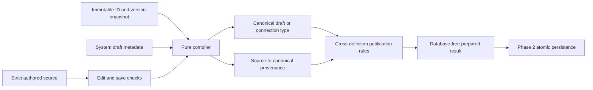
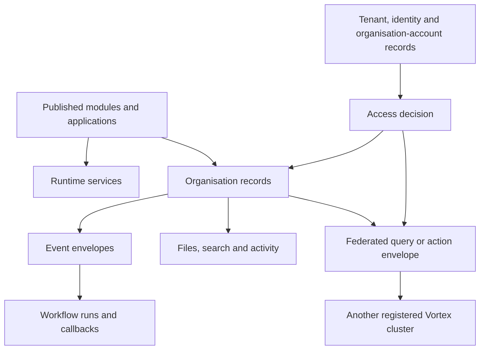
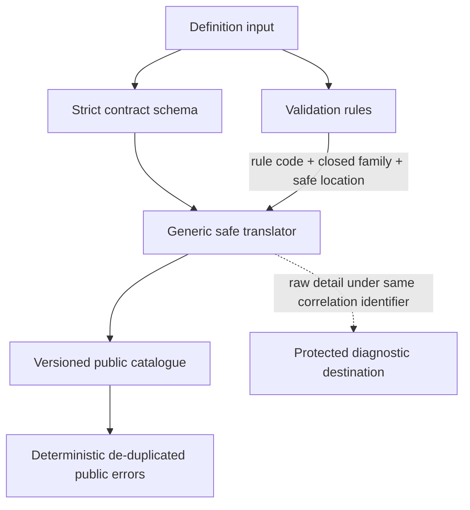

# Data contracts

[Specification index](../README.md) · [Glossary](glossary.md) · [Decision register](decisions.md)

These contracts name the information that must exist. They do not prescribe a database library or generated code structure. A value described as an identifier is an opaque platform-issued value; callers must not derive meaning from its characters.

## Runtime and definition-source layers

Canonical runtime contracts use camel-case properties and immutable platform-issued identifiers. They never identify a tenant, organisation, application, module, record type, field, role, person, or record by a display name or fixture alias.

The production authored-source boundary for module, application and connection-type JSON is strict, complete and separate from the canonical runtime layer. Readable local aliases exist only in that source layer. The exported [source contracts](../../../contracts/src/definition-source.ts) refuse publication state, release versions, exact dependency results, fingerprints, publisher and publication time. Field defaults have one source location and event triggers name their record type explicitly, so valid source cannot be silently discarded or guessed. The pure [Definition compiler](../../../runtime/definition/src/compiler.ts) accepts one source document, an immutable identifier/version resolution snapshot and, for customer-managed definitions, system-supplied draft metadata. Each snapshot identity names its exact component owner; even root assignments must match the authored definition key or root alias, and one global uniqueness check covers roots and contained components. Publication additionally accepts the strict [publication context](../../../contracts/src/definition-compilation-contracts.ts), containing immutable compiled dependencies and prior published histories. The compiler verifies the snapshot fingerprint, resolves aliases and compatible version requirements, and returns complete forward-mapped provenance plus an artifact binding over definition kind/key/root, the comparator-assigned exact version, canonical-content fingerprint and resolution-snapshot fingerprint. An application's resolved-dependency manifest must match its module and connection bindings one-for-one, with no missing, duplicate, extra, or substituted resolution. Dependencies must match all of that evidence plus their declared version requirement and resolved version. Publication never accepts caller-supplied dependant state and never retargets a consumer. Existing consumers keep their exact recorded release; installation, application-binding, storage-migration and grant-migration operations validate adoption of a newer release. Any value-changing or component-level mapping must match the compiler's closed source-path transformation catalogue; no generic fallback or containing-component heuristic can certify a discarded property. It performs no database or network access. The static [semantic-rule registry](../../../runtime/definition/src/validation.ts) registers each validation engine once at its earliest valid stage and declares the exact closed failure codes that aggregate may emit. Acceptance scenarios and storage demonstrations remain non-shipping test data validated by the [fixture gate](../../../testing/fixtures/validate-fixtures.test.ts). The maintained implementation index is [`contracts/README.md`](../../../contracts/README.md).

## Identifier rules

- A platform-issued identifier is globally unique, permanent, and never reused.
- A builder key is lowercase words and digits separated by underscores, begins with a letter, and is 1–40 characters unless a narrower contract applies.
- A module or application key is unique within its owner and kind and is at most 120 characters including namespace segments.
- A label is user-facing text and may change; it is never used as identity.
- External identifiers are stored with their provider and organisation scope.

## Published definition envelope

Every publishable [module or application](../03-composition-and-publication.md#definition-ownership-and-versions) has:

| Name | Requirement |
|---|---|
| `root_id` | Permanent platform-issued identifier. |
| `organisation_id` | Owning organisation, or an explicit platform publisher identifier for platform definitions. |
| `kind` | `module` or `application`. |
| `key` | Permanent builder key within owner and kind. |
| `draft_revision` | Increasing number used for edit conflicts. |
| `draft_source` | Complete strict authored-source document. |
| `source_contract_version`, `source_fingerprint` | The source contract used to read the draft and the fingerprint used for stale-edit protection. |
| `published_revision` | Current revision offered when preparing a new consumer, or absent when never published. It is not a global live-consumer pointer and never retargets an existing consumer's exact recorded release. |
| `created_at`, `created_by` | Creation time and actor. |
| `updated_at`, `updated_by` | Last draft change time and actor. |

Each immutable published revision has `root_id`, `revision`, complete `authored_source`, `authored_source_fingerprint`, `source_contract_version`, complete canonical `content`, `content_fingerprint`, `published_at`, `published_by`, validation-contract version, dependency manifest, and release note. Restore copies the stored authored source into a later draft; Vortex never tries to reconstruct editable source from canonical content.

It also has a human-readable release version following the package's version policy. Vortex assigns the minimum valid next patch, minor, or major version from the structural comparison; the builder confirms or cancels publication and cannot enter a different number. The increasing `revision` is the storage identity; the release version communicates compatibility. Two different revisions cannot reuse one release version in the same root.

The database-free [version-impact contract](version-impact-policy.md) accepts one canonical module or application draft and its immutable publication history. Its strict result is `no_change`, `initial_release`, or `release_required`; every result identifies the definition kind/root and carries a comparison fingerprint. Required releases contain the assigned stable version plus closed, deterministic reason codes and safe component locations. Confirmation recomputes the current result and refuses a stale fingerprint, different assigned version, different definition root, or unchanged content.

Contained components have a permanent identifier unique inside the module or application, a builder key, and their typed content. They do not carry a separate live pointer. Platform connection types and themes are identified by platform release and catalogue version; organisation roles and connection instances are live administrative data rather than published definitions. A connection type is authored through the same strict source boundary for platform maintainers, but compiles into a platform catalogue item rather than becoming a third customer-managed publishable definition kind.

### Definition source identity evidence

Each customer-managed Definition root has one permanent source identity whose identifier is the root identifier. Every contained source component has one database-allocated permanent identifier, definition root, component kind, authored owner `id`, stable owner scope, creation time, and creating actor. The stable owner scope uses the owning component's `id` for nested fields, relationships, guided steps, workflow nodes, and interface operations; it never depends on a mutable parent key.

Each authentic source alias has the Definition root, current compiler lookup scope, component kind, alias, stable owner scope, owner `id`, permanent identifier, creation time, and creating actor. Aliases include authored component ids, readable keys where present, root aliases, and public paths where present. Owner and alias evidence is append-only. Removing a component does not release an identifier or alias, and a key or path rename adds an alias rather than changing identity. A historical alias cannot be reassigned. Callers provide only validated authored source; the trusted Definition service derives requirements, while PostgreSQL allocates identifiers and records context-derived evidence atomically with root creation or a successful expected-revision draft save.

## Tenant, identity and organisation-account records

### Tenant

`tenant_id`, permanent `short_name`, `display_name`, state, `created_at`, `created_by`, `state_changed_at`, and positive `revision`. Tenant identifiers and short names are cluster-unique and permanent; display names may change and need not be unique. State-change time cannot precede creation time. Tenant states are active, suspended, archived, and removal pending. Commercial customer or subscription references are ordinary application records and never part of this core identity contract.

A tenant-administrator assignment has tenant, global identity, state, permissions, creator, start, expiry, revocation, and activity references. It grants no organisation record permission.

### Organisation

`organisation_id`, required permanent `tenant_id`, optional `parent_organisation_id`, permanent `short_name`, `display_name`, `state`, `created_at`, `created_by`, `state_changed_at`, and positive `revision`. The parent must belong to the same tenant and cannot produce a cycle. Organisation short names are unique within their tenant; display names may change and need not be unique. State-change time cannot precede creation time.

The parent link is the only stored hierarchy representation. Reparenting changes that link while descendants retain theirs, so the complete subtree moves without rewriting descendant rows. Hierarchy and lifecycle changes share one tenant-row serialisation point, preventing concurrent opposing changes from bypassing cycle or final-state validation. No closure table, materialised path, duplicated depth, `ltree`, or arbitrary depth cap is introduced.

Organisation states are active, suspended, archived, and removal pending. Data recovery and removal timing comes only from versioned [retention policy](../14-activity-privacy-and-retention.md#retention-policies), legal constraints and platform safety rules; commercial state cannot weaken them.

Archived or removal-pending tenants cannot retain active or suspended organisations. Archived or removal-pending organisations cannot retain active or suspended direct children. These are deferred final-state constraints so a complete subtree transition may be explicitly ordered inside one transaction; invalid committed states are refused. Suspension never cascades by rewriting descendant rows.

### Global identity

`identity_id`, verified primary email, identity state, second-factor enrolment state, creation time, and last successful sign-in time. Credentials and second-factor secrets are stored only by the identity-provider boundary, not in this record.

### Identity authority

Each environment has one Vortex Identity Authority shared by its clusters. Its public verification configuration provides the authority identifier, environment, token issuer, standard JWKS address, the ordinary `authenticated` audience, and the first-release `ES256` signing algorithm. Local may use an HTTP loopback issuer; Testing and Production require HTTPS. Neither URL may contain credentials, a query or a fragment. The JWKS address is validated authority evidence; the server-side verifier derives the Supabase project origin from the issuer and the official Supabase client obtains the same standard endpoint when it verifies claims. The separate server-only authentication-journey configuration supplies that project origin and its publishable key. Vortex does not copy a managed public key into its own record or store a Supabase private signing key.

The raw provider boundary accepts Supabase's required standard claims: `iss`, `aud`, `exp`, `iat`, `sub`, `role`, `aal`, `session_id`, `email`, `phone`, and `is_anonymous`, plus documented optional and future claims. Cryptographic verification and the configured issuer and audience checks happen before projection. The raw claim object is an external input, not a canonical Vortex identity or access contract. In particular, `role`, `phone`, `app_metadata`, `user_metadata`, and unknown claims are never copied into Vortex authority.

The closed verified-identity result provides `identity_id`, `verified_primary_email`, issuer, the normalised `authenticated` audience, session identifier, issue and expiry times, authentication strength, and the verified JWT key identifier. `sub` becomes `identity_id`; the email claim from a non-anonymous authenticated session becomes `verified_primary_email`; `session_id`, `aal`, `iat`, `nbf` when present, and `exp` are validated and converted without changing their meaning. Verification uses an injectable clock, permits at most 60 seconds of clock difference, refuses a token that is expired, not yet active or unreasonably future-issued, and requires expiry after issue time. Email confirmation is an authority configuration and journey invariant because the JWT has no separate confirmed-email claim. The email proves the person's verified primary address at token issue time but grants no tenant, organisation, application, role, team, record, or capability access.

The verification and journey boundaries accept only the environment's modern `sb_publishable_` API key, including the key produced by the pinned current Supabase CLI for Local. They reject legacy anonymous JWT keys, service-role, `sb_secret_` and other privileged keys. Stable failure classes do not expose provider or cryptographic details. Supabase owns `auth.*`; Vortex never creates, repairs, migrates or directly queries `auth.identities`.

Ordinary identity tokens use no custom access-token hook because the standard claims are sufficient. Confirmation and recovery messages carry `token_hash` in a URL fragment so it is not sent in the HTTP request URL, access logs or referrer. Browser code submits the token to a server action in the request body; the server uses `verifyOtp`, and any returned provider session is request-local and discarded after the immediate operation. Organisation accounts consume the verified identity identifier and email under their own lifecycle rules. Session handling consumes the same verified result and separately owns `@supabase/ssr`, cookie persistence, refresh, sign-out, revocation, and global-identity state checks.

### Organisation account

`organisation_account_id`, `organisation_id`, `identity_id`, organisation-specific display name, state, optional language and time-zone preferences, invitation details, activation/suspension/closure times, and access-version contribution. The pair `organisation_id` and `identity_id` is unique, so one identity cannot have two accounts in the same organisation.

### Team and membership

A team has `team_id`, organisation, key, label, state, creator, and creation/change times. A membership has organisation, team, organisation account, state, start, optional expiry, grantor, and activity reference. The pair of team and organisation account is unique while active; one account may have several memberships. Cross-organisation membership is invalid.

### Invitation

`invitation_id`, organisation, normalised invited email, proposed role assignments, one-way token fingerprint, created/invited/expiry/revocation/acceptance times, inviter organisation account, and accepted organisation account.

### Session context

The session context is a closed union by caller kind. A human or federated caller has a global identity and organisation account; a system caller has a system actor; an unauthenticated public caller has neither and uses `anonymous` authentication strength. Every variant carries tenant, organisation, optional application, session and issue times, expiry, access version and correlation identifier. Only the permitted variants may carry delegated or support context.

The optional application value is the permanent application-root identifier. It is absent only when the operation legitimately occurs before application selection or belongs to an explicitly application-independent platform path. Its absence never means every application: an application-contained database policy, cache key, operation, page or interface refuses a context without the exact application root.

The database preserves the complete union as one transaction-local value. Structural validation and setting that value do not grant authority. The trusted server begins the transaction as `vortex_runtime`, executes the initializer available only to that role, and then enters `vortex_request` with `SET LOCAL ROLE`; only the request role may call the read-only context accessors used by protected service SQL. The server does this only after the owning identity and request boundaries verify their inputs, and later policies still check the current live tenant, organisation-account, session, role and access state they require. Commit, rollback or connection reuse cannot carry the role or value into another transaction.

### Organisation runtime settings

The Identity boundary owns only the language, time zone, default currency, date format, number format and revision required to render arbitrary application data before an administration application loads. Legal/trading names, registration details, contact details, brand assets, financial-year choices and business-calendar entries are ordinary records owned by administration applications under the [core contract boundary](core-contract-boundary.md).

## Permission and role contracts

A permission has `permission_id`, permanent `key`, label, description, owner kind and owner identifier, optional record type, action kind, optional named action, and `administrative` flag. A module or application definition owns a complete permission declaration containing every field except the owner kind and identifier, which are unambiguously supplied by the containing definition. The live permission catalogue adds that owner context; it does not invent or alter permission meaning.

A role has key, label, description, role kind, live revision, and permission entries. An organisation role lists exact permissions only. An application role lists exact permissions or uses the sole entry `*`, which expands only to the non-administrative permissions declared by that exact application revision. It never includes module, tenant, organisation-administration, security, entitlement, protected-data, export, or sharing-administration permissions. The published role stores the application permission-catalogue fingerprint and expanded identifiers accepted at that revision.

A role contained in an application definition uses the same closed meaning in a source-friendly form: it lists exact permission keys or uses `*` as the only list entry. `*` expands only to non-administrative permissions declared by that application revision. It never includes permissions merely supplied by a module binding.

A role assignment has organisation, role, assignee kind (`organisation_account` or `team`), assignee identifier, optional application, start and expiry times, state, grantor organisation account, and activity link. A direct person assignment names an organisation account, never a global identity.

The Access service owns an `access_version` per organisation. Every organisation-account, role, assignment, team, sharing, public-policy, or application-role publication change increases it in the same transaction.

## Module and record-type contracts

A module contains identity and publication metadata, dependencies, record types, permission declarations, module actions, business events, saved sharing conditions, and extension points.

A record type contains key, labels, title-field reference, permanent `storage_contract_id`, storage scope, ownership mode, fields, relationships, standard actions, and custom action references. A signed package install preserves the storage-contract identity only while its stored meaning and lineage fingerprint remain compatible. An independent definition or structural fork receives a new identity even when its names match another definition.

Installing a definition package also records a lineage entry with source publisher, source root and component identifiers, source release version and content fingerprint, local root and component identifiers, local published revision, compatibility state, and mapping fingerprint. A federation-compatible application binding names that lineage entry and the source contract range it can display. Visual similarity or matching builder keys without proven lineage are insufficient.

Storage scope is `organisation_shared` or `application_contained`. Ownership mode is none, organisation account, team, or inherited. Inherited ownership names exactly one relationship and derives access from that parent; it is intended for dependent and joining records that cannot be owned independently. Authored source states organisation-account ownership explicitly; the compiler does not translate a vague “individual” mode. Within-organisation direct record sharing uses the contract below; cross-organisation access always uses the governed access-grant contract.

## Field contract

Every field has `field_id`, `key`, `type`, `label`, optional `help_text`, `required`, optional `default`, `unique`, `filterable`, `sortable`, optional search priority, required personal-data class, required `public_display` choice (`refused` by default or `allowed`), and type-specific `settings`. A public operation separately allowlists every accepted or returned field.

A calculation field uses one closed expression kind: join text fields, apply a numeric operation to named field/literal operands, subtract a named percentage, evaluate a typed condition, offset a date/date-time, or determine whether a deadline has passed while excluding explicitly listed terminal states. Its declared result type must match the expression kind and its field dependencies are explicit. A total uses one fully qualified `module:record_type.relationship` source relationship, one closed aggregate operation, an explicit result type, an optional compatible field, and an optional typed condition. The relationship must target the total-owning record; aggregate fields and filter operands resolve in the relationship's source record. Count is a whole number; sum, minimum and maximum preserve the compatible source-field type; average is decimal or money. Neither contract accepts an arbitrary expression or filter object.

A relationship names one source field and either one target record type or an explicit polymorphic target list. This lets a single logical link-to-one-of-several relationship retain one stable relationship identity, including when inherited ownership or totals refer to it.

The twenty-two type keys and their settings are defined in [Modules, fields and relationships](../05-modules-fields-and-relationships.md#field-types). Attachment settings are defined only in [Files and attachments](../11-files-and-attachments.md#canonical-attachment-settings). Unsupported common properties and unknown type settings are refused.

A calendar mapping is either `start_field_id` plus `end_field_id`, or `start_field_id` plus whole-number `duration_field_id` and explicit `duration_unit`. A money aggregate carries one currency code and refuses inputs containing a second currency code.

## Record storage contract

Every organisation-owned business record provides:

| Name | Requirement |
|---|---|
| `organisation_id` | Required organisation owner. |
| `module_root_id` | Required permanent module definition identity. |
| `record_type_id` | Required stable record-type identity. |
| `storage_contract_id` | Required permanent compatible storage-lineage identity. It resolves through the protected Record service catalog to exactly one physical table in the cluster. |
| `record_id` | Required permanent record identity. |
| `application_root_id` | Required only for application-contained storage and absent for organisation-shared storage. It is the receiving organisation's application root, not a display name or package key. |
| `definition_revision` | Published module revision used for validation. |
| `owner` | Absent for none or inherited ownership. Otherwise exactly one organisation-account or team owner from the record's organisation, matching the published record-type ownership mode. |
| `lifecycle_state` | `active`, `soft_deleted`, or `removal_pending`. |
| `concurrency_number` | Starts at one and increases on every accepted change. |
| `created_at`, `created_by` | Required creation record. |
| `updated_at`, `updated_by` | Required last-change record. |
| `deleted_at`, `deleted_by` | Present after soft deletion. |
| `removal_due_at` | Present when permanent removal is scheduled. |

Every storage-catalog entry contains `storage_contract_id`, owning service, physical schema and table token, module and record-type lineage, active compatible revision range, state, creation migration, and content fingerprint. Every field mapping contains `storage_contract_id`, permanent `field_id`, physical column token, database value type, introduction migration, optional retirement migration, and state. Physical tokens are allocated once, contain no mutable business name, fit PostgreSQL identifier limits, and are collision-checked before migration.

The runtime record exposes ownership as the union above. Physical record tables provide nullable protected organisation-account and team owner identifiers plus a constraint derived from the published ownership mode: neither for none or inherited ownership, exactly the matching one for organisation-account or team ownership. An inherited record resolves its owner and access through its declared parent relationship rather than copying the parent owner.

Business fields are stored according to the published record-type contract. Organisation-shared uniqueness and indexes begin with `organisation_id`. Application-contained uniqueness and indexes begin with `organisation_id, application_root_id`. Relationship storage repeats the organisation identifier on both endpoints and enforces matching organisation scope; when both endpoints are application-contained it also enforces the same application root.

The Record service owns a `data_version` for each organisation, storage contract, and applicable application root. A committed create, change, delete, restore, relationship change, or access-relevant ownership change increases it.

Unique values remain reserved while `lifecycle_state` is `soft_deleted` or `removal_pending` and are released only by permanent removal.

## Direct record-share contract

A direct share applies to one record and one recipient inside the record's organisation:

| Name | Requirement |
|---|---|
| `direct_share_id` | Permanent identifier. |
| `organisation_id`, `record_type_id`, `record_id` | Required source record in the current organisation. |
| `recipient_kind`, `recipient_id` | `organisation_account` or `team`, belonging to the same organisation. |
| `readable_field_ids` | Explicit non-empty allowlist that the grantor can read. |
| `changeable_field_ids` | Explicit subset of readable fields that the grantor can change. |
| `starts_at`, `expires_at` | Required start and optional expiry. |
| `status` | `active`, `revoked`, or `expired`. |
| `granted_by`, `granted_at`, `reason` | Required grant evidence. |
| `revoked_by`, `revoked_at`, `revocation_reason` | Present after revocation. |

The grantor must currently hold `record.share`; the operation refuses fields or authority the grantor cannot delegate. The contract never grants delete, restore, export, re-share, ownership, or administration. Direct-share and team changes increase the organisation access version.

## Access grant contract

An access grant authorises one recipient context to perform named actions on source-owned records. It never transfers record ownership, replaces a module binding, or authorises an administrative table.

Every access grant provides:

| Name | Requirement |
|---|---|
| `grant_id` | Required permanent grant identity. |
| `source_cluster_id` | Required cluster that authoritatively stores the grant and records. |
| `source_organisation_id` | Required organisation that owns the records. |
| `source_application_id` | Required only when sharing application-contained records. |
| `recipient_cluster_id` | Required cluster that stores the recipient organisation account, application, roles, and non-content grant mirror. May equal the source cluster. |
| `recipient_organisation_id` | Required for cross-organisation grants; equal to the source for inter-application grants. |
| `recipient_application_id` | Required application from which the records may be requested. It must have a compatible module binding. |
| `recipient_role_ids` | Required non-empty set of roles in the named recipient application. An account must currently hold at least one of them. |
| `scope_kind` | Exactly one of `module`, `record_type`, `saved_condition`, or `record`. |
| `module_root_id` | Required stable module identity. |
| `record_type_id` | Required for record-type, saved-condition, and record scope. |
| `saved_condition_id`, `saved_condition_revision`, `saved_condition_fingerprint`, and `parameters` | Required only for saved-condition scope. The condition is published, the revision remains pinned for the grant, and parameter values must match its declared contract. |
| `record_id` | Required only for record scope. |
| `allowed_action_keys` | Required explicit action allowlist. Empty means no mutation. Every named action must be published as shareable by the source definition. |
| `readable_field_ids` | Required explicit field allowlist. Sensitive fields are refused in the first release. |
| `changeable_field_ids` | Required subset of readable fields; empty for read-only grants. |
| `export_allowed` | Required boolean; defaults to false in the creation experience and requires separate approval when true. |
| `approved_recipient_region` | Required source-approved service region for a cross-cluster grant. A different current recipient region suspends access until a newly approved payload activates. |
| `starts_at`, `expires_at` | Required start and expiry for a cross-organisation grant. No indefinite access is inferred. |
| `status` | `draft`, `pending_consent`, `active`, `suspended`, `revoked`, or `expired`. |
| `created_by_organisation_account_id` | Required source organisation account that proposed the grant. |
| `consent_request_id` | Required for a cross-organisation grant and links the exact consented proposal fingerprint. |
| `contract_version`, `contract_fingerprint` | Required published source record contract understood by source and recipient applications. |
| `recipient_binding_id`, `definition_mapping_fingerprint` | Required recipient application binding and validated source-to-local component mapping. |
| `activated_at` | Present only after the Access service verifies the required decisions and activates the grant. |
| `revoked_at` | Present after revocation. |
| `revoked_by_organisation_account_id`, `revocation_reason` | Present after an authorised revocation. |

Only fields belonging to the chosen `scope_kind` may be populated. Grant validation and activation refuse an incompatible module binding, missing or empty recipient audience, sensitive field, unknown or non-shareable action, invalid condition parameter, unpinned condition revision, source/recipient reversal, or recipient equal to a forbidden audience.

One grant must independently cover record, action, and field. The runtime cannot take scope from one grant and fields or actions from another. When more than one complete grant allows the same request, the activity entry records every grant relied upon. A recipient cannot use a received record or result as the source of another live grant.

## Grant-consent contract

Grant consent records only the protected evidence required to activate a cross-organisation sharing grant. It is not a general approval, task or sensitive-record-action facility. Ordinary business approvals are application records and cannot activate a grant.

| Name | Requirement |
|---|---|
| `request_id` | Required permanent request identity. |
| `source_organisation_id` | Required organisation proposing the protected action. |
| `source_cluster_id` | Required cluster that owns the protected action. |
| `recipient_organisation_id`, `recipient_cluster_id` | Required recipient of the proposed cross-organisation grant. |
| `proposed_grant_fingerprint` | Required fingerprint of the complete proposed grant; changing the proposal invalidates earlier decisions. |
| `status` | Required: `draft`, `pending`, `consented`, `refused`, `withdrawn`, `expired`, or `activated`. |
| `requested_by_organisation_account_id` | Required organisation account that created the request. |
| `requested_at` | Required creation timestamp. |
| `required_decisions` | Exactly one `source_authorization` side and one `recipient_acceptance` side, each with its authorised role identifiers. |
| `expires_at` | Required deadline after which undecided requests expire. |

Each consent decision is an immutable child entry with request, decision side, proposed-grant fingerprint, approver organisation, approver organisation account, decision (`consented` or `refused`), time, optional safe note, authentication strength, and correlation identifier. The source and recipient must be different organisations. Activation requires one consented entry for each side over the same fingerprint. A later revocation creates a separate grant event; it does not rewrite the consent history.

## Federation contracts

Federation transports the existing grant, query, action, file, and refusal contracts between clusters. It never exposes database tables or accepts raw SQL.

### Cluster manifest

| Name | Requirement |
|---|---|
| `cluster_id` | Required permanent cluster identity. |
| `environment` | Required `local`, `testing`, or `production`; requests cannot cross environments. |
| `federation_base_address` | Required approved HTTPS address. |
| `service_region` | Required deployment region used by sharing-policy checks. Changing it suspends grants that did not approve the new region. |
| `routed_organisation_ids` | Protected list of globally unique organisation identifiers currently served by the cluster; it contains no organisation profile or business data. |
| `status` | `active`, `draining`, `disabled`, or `retired`. Only `active` accepts new grants. |
| `protocol_versions` | Required supported federation protocol versions and compatibility ranges. |
| `shared_contract_versions` | Required supported query, action, grant, file, error, and identity-assertion contract versions. |
| `signing_keys` | Current and next public keys with key identifier, approved asymmetric algorithm, activation time, and retirement time. Verifiers accept only the platform algorithm allowlist; private keys never appear. |
| `issued_at`, `expires_at`, `manifest_signature` | Required directory-issued validity and integrity evidence. |

### Recipient discovery entry

The recipient directory stores a one-way fingerprint of the organisation sharing code, permanent organisation identifier, current cluster identifier, approved organisation display name, service region, state, issue and rotation times, and directory signature. A successful exact-code or signed-link lookup returns only the approved name, region, and a short-lived proposal address. It returns no people, account, role, application, record, file, plan, or billing information. Rotating the sharing code does not change existing grants because they use the permanent organisation identifier.

### Recipient assertion

A recipient assertion is short lived and signed by the recipient cluster. It contains `assertion_id`, `recipient_cluster_id`, `recipient_cluster_region`, `recipient_organisation_id`, `recipient_organisation_account_id`, global `identity_id`, `recipient_application_id`, current recipient role identifiers, recipient `access_version`, requested `grant_id`, intended `source_cluster_id`, authentication strength, issue and expiry times, one-use nonce, and correlation identifier. It contains no password, identity-provider private key, database credential, source role, or record value.

### Federated request envelope

Every cross-cluster request provides federation protocol version, operation name, sender and intended receiver cluster, issue and expiry times, one-use nonce, correlation identifier, duplicate-protection key where the operation can change state, shared-contract version and fingerprint, and a typed operation payload. A shared-record query, action, or file request also requires the recipient assertion; grant-control messages instead carry their exact signed proposal, decision, receipt, or revocation evidence. HTTPS protects transport. The [HTTP Message Signature](https://www.rfc-editor.org/rfc/rfc9421.html) and [Content-Digest](https://www.rfc-editor.org/rfc/rfc9530.html) protect the signed request components and body.

The response provides the same correlation identifier, source cluster, operation outcome, shared-contract version and source issue time. Only a `completed` response may carry a result or continuation token. A `refused`, `unavailable`, or `retryable_failure` response forbids both and requires a closed catalogue code for that outcome. A response never reveals whether an unapproved record exists.

### Federated query and action

A federated query provides request kind (`list`, `record`, `search`, or `report`), `grant_id`, source organisation, module, record type, published module revision, readable field projection, validated filter or search term, optional grouping and totals, stable sort, bounded page size, optional continuation token, and optional permitted count request. The source performs every filter, search, sort, grouping, total, grant, field, row-restriction, and pagination check before returning records or aggregates. Each record reference contains source cluster, source organisation, record type, record identifier, and concurrency number.

A recipient application search may run several independent federated `search` queries for a bounded set of active grant mirrors. Each result remains tied to one source and grant. The recipient merges them into a request-only Shared result group and does not create a shared search document. A saved report names exactly one source organisation, record type, grant, definition revision, selected readable fields, filter, grouping, totals, sort, and presentation. The recipient may store that non-content definition but never its source rows or calculated results.

A federated export request provides `grant_id`, source query fingerprint, declared format, approved readable field projection, maximum rows, duplicate-protection key, and download expiry. The source owns the bounded job and temporary file, rechecks the grant and saved condition during generation, and returns only a short-lived download instruction. The recipient cluster does not store the file. The source and recipient record linked usage and activity entries without including exported values.

A federated action provides `grant_id`, one source record reference, named action, validated action input, expected concurrency number, and duplicate-protection key. The source returns the ordinary action outcome and new concurrency number. A remote action cannot create a recipient-owned relationship or span a transaction in both clusters.

A federated file operation provides `grant_id`, source record reference, attachment field, operation (`upload_admit`, `upload_complete`, `preview`, or `download`), expected record concurrency where a save is involved, file identifier where present, and duplicate-protection key for a changing operation. The source File and Record services own every instruction, byte, scan, attachment, limit, and retention decision.

### Recipient grant mirror

The recipient stores one non-content mirror with `grant_id`, source and recipient cluster/organisation/application identifiers, approved recipient region, recipient role identifiers, contract version and fingerprint, definition-mapping fingerprint, source route, state, source proposal fingerprint, local access-version contribution, last reconciliation time, and safe last outcome. Evidence depends on state: pending carries the proposal and may carry a recipient decision but no activation receipt; active requires the recipient decision and signed activation receipt; suspended adds signed suspension evidence; revoked or expired carries signed state evidence and carries the activation pair only when activation had occurred. It stores no source record fields, files, query results, search documents, or workflow payloads. The source grant remains authoritative when the mirror disagrees or is stale.

## Action, rule and condition contracts

An action contains identifier, key, label, subject record type, permission, sharing setting (`refused` by default or `allowed`), uniquely keyed typed inputs, precondition, and one to ten ordered effects. Each input has a label and required flag. Its validation contract is discriminated by type: plain/formatted text, number, Boolean, date, date-time, one-or-more record-type reference, or organisation-account reference. One input cannot accept another type's settings. Effects are `set_field`, `create_record`, `copy_relationships`, `soft_delete_subject`, or `announce_event`. A relationship-copy effect names every source relationship and its target-record input; it never means “all relationships.” A shared action executes wholly in the source organisation and cannot create a relationship to recipient-owned data.

A rule contains identifier, subject record type, trigger, condition, priority, and one effect. Module rules may use `refuse`, `set_value`, `require`, or `warn`. Application rules may additionally use `show_or_hide` and `start_background_work`, because only applications own page components and workflows. There is no separate permission-approval rule.

A condition node has an operator and typed field, value, or parameter operands. Either side of a binary comparison may use any of those operands, so field-to-field comparison is explicit rather than encoded as a value. Boolean groups use `all`, `any`, or `not`. Every authored and canonical condition is limited to ten nesting levels and one hundred total operands. Publication also enforces the relevant relationship-hop limit and refuses wrong unary/binary arity, an operator/type mismatch, or an unknown operand source.

A saved sharing condition belongs to one source record type and contains permanent identifier, key, system-derived published revision and contract fingerprint, typed parameter declarations, a closed condition tree, declared local field dependencies, and publication tests. Every test provides explicit source-field values, parameter values, and an expected result. It cannot traverse relationships in the first release, read recipient data, execute code, call a connection, or accept an undeclared parameter. A grant pins its revision and values; later publication does not change an active grant.

## Application, page and block contracts

An application contains root identity and its own release version, exact resolved module/version bindings, application permission declarations and roles, navigation, pages, actions, rules, events, workflows, process pipelines, theme settings or platform-theme binding, version-pinned connection bindings, interfaces, public addresses, and default states.

A process pipeline contains one record type and stage field, uniquely keyed stages with labels and explicit entry/exit actions or workflows, named transitions with optional permission/action and typed gate, and time targets with a stage, date-time field and escalation event. Every stage, field, action, workflow, permission and event reference resolves before publication.

A page has a stable contained identifier, name, one of the six page types, subject where required, page-level access, block tree or guided-form steps, commit action where required, optional standard-page replacement, and desktop/phone layout. On a record-scoped page, every query, commit action, replacement and typed block reference must target that same record type.

A block placement has placement identifier, registered block identifier and release version, settings, desktop start/span/height, phone order/behaviour, visibility condition, view/use permission, and declared data reading where applicable. Each setting is a tagged literal or a typed field, relationship, action, page, query, process-pipeline, record-type, or record reference. Publication matches the value kind to the registered control, resolves the referenced definition component, and checks its record target against the containing page. On a public page, selected, filtered, grouped, aggregated and sorted query fields, block references, visibility fields, permissions, action subject and action effects must all stay within the explicit public allowlist; administrative permissions are refused.

A block registration has permanent identifier, palette name/icon/group, zero to forty typed settings, allowed child blocks, phone behaviour, resizable-height flag, live-update flag, and public-page flag. Its seventeen setting controls and seven palette groups are listed in [Applications, navigation, pages and themes](../07-applications-pages-and-themes.md#page-composition).

## Event envelope

`event_id`, organisation, optional application, module, record type, record identifier, event name, occurrence time, actor, correlation identifier, causation identifier, published definition revisions, per-record sequence, and declared carried values.

Dispatch state is stored separately: status, available time, claim owner and expiry, attempts, last safe error code, delivered time, and failed-sequence resolution. Personal or sensitive field values cannot be carried.

## Live invalidation envelope

A live invalidation contains contract version, organisation, application, record type, optional record identifier, change kind, record-type data version, optional record version, sequence, occurrence time, and correlation identifier. It contains no business field, file address, display label, permission result, or shared-record value.

The message is sent only through a private, authorised channel and is not proof that its recipient may read the record. A client that receives it must use the ordinary authorised query or record path. Duplicate, delayed, and out-of-order messages are safe because the fresh read and current data/access versions determine the displayed result.

## Workflow execution reference and protected operation

A Vortex workflow reference has `run_id`, tenant, organisation, application and application version, workflow identifier and contained version, trigger and source identifier, start actor, duplicate-protection key, human-input links, safe activity links, last refresh time, and a clearly non-authoritative last-known state snapshot. A published workflow trigger contains unique typed inputs, a nullable typed condition, and an explicit duplicate-protection rule. Event inputs resolve to carried fields. A schedule trigger owns its closed cadence, interval, time zone and cadence-specific clock fields; it cannot name an undeclared external schedule. Every other non-event input resolves by payload key, type and allowed record target against the exact action, incoming-message shape or interface operation that owns the trigger; trigger kinds whose first-release contract has no inputs must publish an empty input list. A child workflow names its exact parent, the parent contains the matching child-start node, and current-record type flows only through that verified chain. A trigger-input value names only one declared local input. Every fixed node output declares its key, value type and record-target source where applicable; a form request declares its dynamic outputs and allowed record targets in the node definition. Link-field assignments retain target record types, while file nodes require a file reference and an attachment field. The workflow adapter stores its Kestra execution mapping privately; provider-specific identifiers are not part of the canonical application contract.

An application side-effect receipt has run, node, attempt, duplicate-protection key, accepted time, safe input fingerprint, outcome, and resulting record/action/event identifiers. It proves duplicate safety but does not become the workflow-state authority.

A [Kestra protected-operation request](../09-workflows-and-pipelines.md#protected-operation-contract) carries:

- Contract version.
- Run, step, and attempt.
- Organisation and application.
- Workflow published revision.
- Named platform operation and validated inputs.
- Issue and expiry times.
- Duplicate-protection key.
- Signed caller proof.

The response is `completed`, `already_completed`, `waiting`, `retryable_failure`, or `permanent_refusal`, with a stable safe code and optional next poll time. Kestra's execution API is authoritative for queued, running, waiting, completed, cancelled, and failed workflow status.

## Query limits

| Limit | Draft value |
|---|---|
| Relationship hops | 2 |
| Board columns | 12 |
| Guided-form steps | 2–20 |
| Blocks per page | 1–200 |
| Blocks per guided-form step | 1–40 |
| Workflow steps | 1–100 |
| Workflow nesting depth | 5 |
| Records in one workflow repeat | 1,000, processed in pages |
| One workflow wait | 90 days |
| Default interactive query page | 50 records |
| Maximum interactive query page | 200 records |
| Interface page | 100 records by default; maximum 500 when published |
| Export page | 1,000 records per background batch |

These are safety and product-shape limits, not performance release gates. Changing one requires contract review, compatibility evidence, and updated tests.

## File contract

A file record has file identifier, organisation, lifecycle state, original safe display name, detected media type, extension, size, checksum, storage key, scanner name/version/result, preview references, uploader, creation/activation/deletion/removal times, owning attachment references, and legal-hold state.

An upload grant has organisation, person, target record/field, allowed policy fingerprint, maximum bytes, expiry, and one-time identifier. A download grant has the same access-bound context and a short expiry.

## Connection and interface contracts

A connection instance has organisation, connection-type revision, encrypted-secret reference, authorised applications, state, grant scopes, token expiry, last health result, and administrator activity link.

An incoming message has organisation, connection, message type, provider message identifier or fingerprint, verified time, safe payload reference, duplicate state, workflow trigger result, and retention due time.

An interface operation has interface and major version, operation key, explicit HTTP method and application-relative path, target-aware input/output shapes, authentication method, required permission, visibility, rate/size limits, duplicate-protection rule, called action/query/workflow, and stable error catalogue. Each shape field declares type, required status, and its exact target binding. A custom action requires one subject binding and bindings for all required declared inputs, with no output fields. A query has no inputs and returns at least one selected field, plus optional standard page information. An interface-triggered workflow has no inputs and returns exactly its run identifier. Standard record actions, query parameters, action results, and workflow inputs remain unavailable until their owning contracts explicitly define those values. Publication resolves every binding and checks its type. A public operation refuses administrative permissions and non-shareable actions; its action condition, subject values, changed fields and created-record values may use only fields approved for public display on the correct record type. Public query outputs receive the same field approval check. An interface dependency records minimum and maximum accepted major/minor versions.

### MCP parity contracts

An **MCP authorisation grant** has a permanent grant identifier, identity, OAuth `client_id`, safe client display information and registration method, exact MCP resource audience, approved organisation-account and application scopes, approved capability scopes, issue/expiry/revocation times, access-version bindings and safe activity links. An approved organisation is represented by that identity's separate account in that organisation; the grant never combines roles between accounts. The grant never contains a browser cookie, OAuth refresh token, external-provider credential, model credential or unrestricted service authority. Current account and access state may always narrow or revoke it.

An **MCP interaction context** has an opaque context identifier, authorisation grant, active tenant/organisation-account/application context, exact application version, creation/last-use/expiry times, and optional live-interface pairing. Every self-contained request separately carries the MCP revision and client capabilities required by `2026-07-28`; the context is Vortex state and is not a connection-scoped protocol session. A pairing contains a one-time approved browser-session reference, current semantic-state revision and termination time; it contains no DOM reference or browser credential.

A **semantic interface resource** has schema version, organisation account, application and exact version, page and optional record context, semantic-state revision, and ordered permission-filtered navigation, region, form and control entries. It exposes only entries the current caller may discover. It may describe a visible temporarily unavailable control with one safe catalogue reason, but never includes a denied item, hidden field, secret value, CSS selector, pixel coordinate or executable browser content.

A **semantic control entry** has a stable control identifier, control kind, plain label and description, containing page/region, current availability, optional safe unavailable reason, typed input or value contract, confirmation or reauthentication requirement, exact target operation, duplicate-protection rule where changing, and result shape. The server retains the required permission in the internal operation binding but never projects that permission key to the client. A discoverable unavailable entry appears in the semantic resource but not the invocable tool choices. Control kinds cover navigation, page/record opening, view-state selection, query/filter/sort/page/refresh, form draft and guided step, named action, file operation, builder change, publication and administration. A semantic form entry additionally has form and draft identifiers, current draft revision, field order, write-only markers, allowed choices, validation results and commit action.

An **MCP tool request** identifies the interaction context, protocol revision and client capabilities, semantic control, expected semantic-state or draft revision, typed input and duplicate-protection key where required. The result is the ordinary platform operation outcome plus correlation/activity references and the new state, draft or record revision. MCP protocol failures remain distinct from application validation or access refusals; application results use the same stable safe codes as the web interface.

The server may page resources with opaque cursors and announce that resource or tool lists changed. A cursor is scoped to its authorisation grant, interaction context, protocol revision, application version and access version and cannot be reused to cross any of them.

## Activity and retention contracts

An activity entry has organisation, activity identifier, time, actor, action, subject identifiers, safe changed-field names, source, correlation, outcome, and optional retained-detail reference protected by a stronger permission.

A retention policy has organisation, data category, an optional saved-condition identifier/revision/fingerprint supplied together, active period, recovery period, removal schedule, legal-constraint keys, state, creator, approver, and version.

A permanent-removal receipt has non-content identifiers or protected fingerprints, category, selection fingerprint, completion time, policy, job, outcome, and any lawful exception. It is sufficient to reapply removal after backup restore without retaining the removed content.

## Protected removal contract

A protected removal command has command identifier, tenant, one or more organisations, data categories, optional saved-condition identifier and revision, optional protected subject fingerprint, requesting actor, authorising actor, issue time and correlation identifier. It describes one authorised platform operation, not the workflow or case used to reach that authorisation.

## Entitlement and metering contracts

An entitlement-check request has tenant, optional organisation attribution, namespaced capability key, positive requested quantity, unit and correlation identifier. A decision is `allowed` with an accepted quantity no greater than the requested quantity and an optional remaining quantity, or `refused` with a stable safe reason. Both outcomes identify the policy revision used.

A metering event has event identifier, tenant, optional organisation, capability key, positive quantity, unit, occurrence time, optional source event, duplicate-protection key, correlation identifier and acceptance time. It contains no price, payment, subscription, invoice, plan, chargeable flag or active-person charging rule. See [Entitlements and metering](../15-entitlements-and-metering.md).

## Error response

Every refused or failed operation returns only a stable code, its fixed catalogue-owned message key and a correlation identifier. The first closed catalogue maps `invalid_request`, `not_found`, `operation_refused`, `conflict`, `rate_limited`, `temporarily_unavailable`, and `operation_failed` to their matching `errors.*` message keys. A caller cannot invent a code, pair a code with a different message key, supply public wording, add interpolation values, or expose a raw object path. Validation may return several independent errors through its more specific catalogue. Responses never include a stack trace, SQL text, secret, hidden identifier, private record value, or other organisation's existence.

### Definition validation errors

Definition validation uses a separate versioned public catalogue implemented by [`contracts/src/validation-errors.ts`](../../../contracts/src/validation-errors.ts) and explained in the [author guide](../../../contracts/VALIDATION_ERRORS.md). The catalogue is generic: it has no installed application, module, record-type, field, workflow, connection, or example-fixture name and never changes its behaviour for one definition.

Each public definition error has the catalogue version, stable code, catalogue-owned plain message and guidance, correlation identifier, and optional safe location. A safe location contains only the definition kind, the definition's builder-visible key, and an ordered set of typed builder-visible keys explicitly supplied by the caller. It contains no raw object path or protected identifier.

The closed first catalogue covers a missing value, invalid value or format, unsupported choice, unknown property, too few or too many items, duplicate key, broken or unresolved reference, invalid scope, incompatible version, dependency cycle, unsafe public content, incompatible definition change, and a safe fallback. Public text comes only from the catalogue and cannot be supplied by a validator or caller.

Strict schema failures and published validation-rule failures converge on the same public result:

Schema messages, submitted values, display labels, raw paths, internal identifiers and diagnostics are never copied into public output. A raw schema path is translated only through an explicit safe path map and otherwise points to the definition root. Required paths are declared explicitly rather than inferred from changeable library wording. Unknown schema issue kinds and malformed rule handoffs use the safe fallback. A protected diagnostic destination may receive raw details under the same correlation identifier, but its failure cannot change the public response.

The Definition compiler has a separate closed, typed internal refusal-code registry covering every direct compiler refusal and every failure code declared by the semantic-rule registry. Constructing a compiler error with an unregistered code fails the boundary itself. Resolution failures carry the nearest authorised builder-visible component—such as the dependency, record type, field, action, workflow or workflow node—rather than collapsing every nested failure to the document root. Automated inventory tests keep direct call sites and declared semantic emissions inside this registry.

Errors sort deterministically by safe location and catalogue order. Duplicate public code-and-location pairs collapse to one error. [Issue #15](https://github.com/Abzum-NZ/Abzum-Vortex/issues/15) owns the validation stages and rule catalogue; its rules emit only the structured rule-failure handoff and do not own public codes or wording.

## Performance measurements

Each measurement names operation, dataset, cache state, region, device, network, percentile, measured client/server/database time, code revision, and comparison baseline. Targets and regression thresholds create observations, alerts, and owned improvement work; performance results never automatically block a pull request or release. Safety, access, correctness, privacy, and accessibility gates remain independent.
