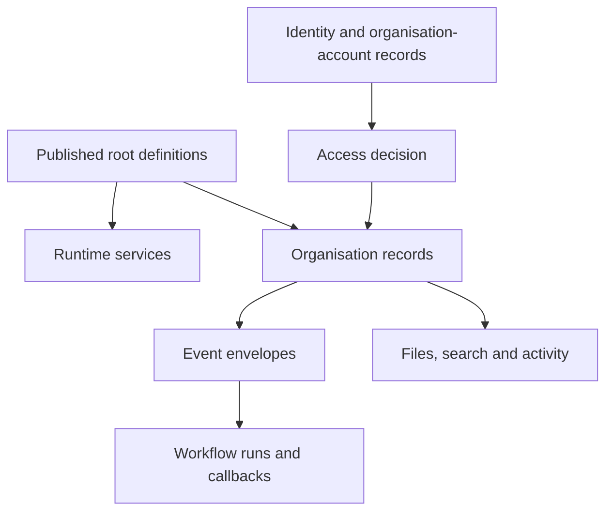

# Data contracts

[Specification index](../README.md) · [Glossary](glossary.md) · [Decision register](decisions.md)

These contracts name the information that must exist. They do not prescribe a database library or generated code structure. A value described as an identifier is an opaque platform-issued value; callers must not derive meaning from its characters.

## Identifier rules

- A platform-issued identifier is globally unique, permanent, and never reused.
- A builder key is lowercase words and digits separated by underscores, begins with a letter, and is 1–40 characters unless a narrower contract applies.
- A root definition key is unique within its owner and at most 120 characters including namespace segments.
- A label is user-facing text and may change; it is never used as identity.
- External identifiers are stored with their provider and organisation scope.

## Published definition envelope

Every [root definition](../03-composition-and-publication.md#definition-ownership) has:

| Name | Requirement |
|---|---|
| `root_id` | Permanent platform-issued identifier. |
| `organisation_id` | Owning organisation, or an explicit platform publisher identifier for platform definitions. |
| `kind` | `module`, `application`, `theme`, `connection_type`, `interface`, or `organisation_role`. |
| `key` | Permanent builder key within owner and kind. |
| `draft_revision` | Increasing number used for edit conflicts. |
| `draft_content` | Complete validated-shape candidate content. |
| `published_revision` | Current live revision number or absent when never published. |
| `created_at`, `created_by` | Creation time and actor. |
| `updated_at`, `updated_by` | Last draft change time and actor. |

Each immutable published revision has `root_id`, `revision`, complete `content`, `content_fingerprint`, `published_at`, `published_by`, validation-contract version, dependency manifest, and release note.

It also has a human-readable release version following the package's version policy. The increasing `revision` is the storage identity; the release version communicates compatibility. Two different revisions cannot reuse one release version in the same root.

Contained components have a permanent identifier unique inside the root, a builder key, and their typed content. They do not carry a separate live pointer under [Decision D02](decisions.md#d02-publication-boundaries) option A.

## Identity and organisation-account records

### Organisation

`organisation_id`, permanent `short_name`, `display_name`, `state`, `state_changed_at`, `owner_organisation_account_id`, `created_at`, and `created_by`.

Organisation states are active, suspended, archived, and removal pending. Exact archive/grace durations are set through [privacy and billing decisions](decisions.md).

### Global identity

`identity_id`, verified primary email, identity state, second-factor enrolment state, creation time, and last successful sign-in time. Credentials and second-factor secrets are stored only by the identity-provider boundary, not in this record.

### Organisation account

`organisation_account_id`, `organisation_id`, `identity_id`, organisation-specific display name, state, optional language and time-zone preferences, invitation details, activation/suspension/closure times, and access-version contribution. The pair `organisation_id` and `identity_id` is unique, so one identity cannot have two accounts in the same organisation. Group/team assignment shape follows [Decision D23](decisions.md#d23-groups-and-teams).

### Invitation

`invitation_id`, organisation, normalised invited email, proposed role assignments, one-way token fingerprint, created/invited/expiry/revocation/acceptance times, inviter organisation account, and accepted organisation account.

### Session context

Global identity or system actor, organisation, application where present, organisation account, caller kind, session and issue times, expiry, authentication strength, access version, correlation identifier, and delegated/support context where present.

### Organisation profile and preferences

The Identity service owns only organisation identity and state. Organisation profile and preferences are organisation records owned by the App service: legal/trading names, registration details, contact details, approved brand assets, language, time zone, currency, financial-year start, date and number formats. The Workflow service owns business-calendar entries and exposes working-time calculations; the App service owns their Organisation Portal editing contract.

## Permission and role contracts

A permission has `permission_id`, permanent `key`, label, description, owner kind and owner identifier, optional record type, action kind, optional named action, and `administrative` flag.

A role root has key, label, description, role kind, and permission entries. Wildcard shape is unavailable until [Decision D03](decisions.md#d03-permission-wildcards) is decided.

A role assignment has organisation, role, assignee kind, assignee identifier, optional application, start and expiry times, state, grantor organisation account, and activity link. A direct person assignment names an organisation account, never a global identity. Assignment to a team uses the team model selected in [Decision D23](decisions.md#d23-groups-and-teams).

The Access service owns an `access_version` per organisation. Every organisation-account, role, assignment, team, sharing, public-policy, or application-role publication change increases it in the same transaction.

## Module and record-type contracts

A module contains identity and publication metadata, dependencies, record types, module actions, business events, and extension points.

A record type contains key, labels, title-field reference, storage scope, ownership mode, fields, relationships, standard actions, and custom action references.

Storage scope is `organisation_shared` or `application_contained`. Ownership mode and within-organisation individual sharing depend on [D24](decisions.md#d24-individual-record-sharing); cross-organisation sharing depends on [D31](decisions.md#d31-cross-organisation-sharing-release-scope).

## Field contract

Every field has `field_id`, `key`, `type`, `label`, optional `help_text`, `required`, optional `default`, `unique`, `filterable`, `sortable`, optional search priority, required personal-data class, required public-display choice, and type-specific `settings`.

The twenty-two type keys and their settings are defined in [Modules, fields and relationships](../05-modules-fields-and-relationships.md#field-types). Attachment settings are defined only in [Files and attachments](../11-files-and-attachments.md#canonical-attachment-settings). Unsupported common properties and unknown type settings are refused.

## Record storage contract

Every organisation-owned business record provides:

| Name | Requirement |
|---|---|
| `organisation_id` | Required organisation owner. |
| `record_type_id` | Required stable record-type identity. |
| `record_id` | Required permanent record identity. |
| `application_id` | Required only for application-contained storage. |
| `definition_revision` | Published module revision used for validation. |
| `owner_organisation_account_id` | Present when ownership is enabled; it must belong to the record's organisation. |
| `lifecycle_state` | `active`, `soft_deleted`, or `removal_pending`. |
| `concurrency_number` | Starts at one and increases on every accepted change. |
| `created_at`, `created_by` | Required creation record. |
| `updated_at`, `updated_by` | Required last-change record. |
| `deleted_at`, `deleted_by` | Present after soft deletion. |
| `removal_due_at` | Present when permanent removal is scheduled. |

Business fields are stored according to the published record-type contract. Relationship storage repeats the organisation identifier on both endpoints and enforces matching organisation scope.

The Record service owns a `data_version` for each organisation and record type. A committed create, change, delete, restore, relationship change, or access-relevant ownership change increases it.

## Access grant contract

An access grant authorises one recipient context to perform named actions on source-owned records. It never transfers record ownership, replaces a module binding, or authorises an administrative table.

Every access grant provides:

| Name | Requirement |
|---|---|
| `grant_id` | Required permanent grant identity. |
| `source_organisation_id` | Required organisation that owns the records. |
| `source_application_id` | Required only when sharing application-contained records. |
| `recipient_organisation_id` | Required for cross-organisation grants; equal to the source for inter-application grants. |
| `recipient_application_id` | Required application from which the records may be requested. It must have a compatible module binding. |
| `recipient_role_ids` | Recipient roles allowed to use the grant if [D32](decisions.md#d32-recipient-audience) chooses role-scoped access. |
| `scope_kind` | Exactly one of `module`, `record_type`, `saved_condition`, or `record`. |
| `module_root_id` | Required stable module identity. |
| `record_type_id` | Required for record-type, saved-condition, and record scope. |
| `saved_condition_id` and `parameters` | Required only for saved-condition scope; the condition is published and parameters must match its contract. |
| `record_id` | Required only for record scope. |
| `allowed_action_keys` | Required explicit action allowlist. Empty means no mutation. |
| `readable_field_ids` | Required explicit field allowlist. Sensitive fields are refused in the first release. |
| `changeable_field_ids` | Required subset of readable fields; empty for read-only grants. |
| `export_allowed` | Required boolean; defaults to false in the creation experience and requires separate approval when true. |
| `starts_at`, `expires_at` | Required start and optional expiry. No indefinite default is inferred. |
| `status` | `draft`, `pending_approval`, `active`, `revoked`, or `expired`. |
| `created_by_organisation_account_id` | Required source organisation account that proposed the grant. |
| `approval_request_id` | Required for a cross-organisation grant and links the exact approved payload fingerprint. |
| `activated_at` | Present only after the Access service verifies the required decisions and activates the grant. |
| `revoked_at` | Present after revocation. |
| `revoked_by_organisation_account_id`, `revocation_reason` | Present after an authorised revocation. |

Only fields belonging to the chosen `scope_kind` may be populated. Grant validation and activation refuse an incompatible module binding, missing reference, sensitive field, unknown action, invalid condition parameter, source/recipient reversal, or recipient equal to a forbidden audience.

One grant must independently cover record, action, and field. The runtime cannot take scope from one grant and fields or actions from another. When more than one complete grant allows the same request, the activity entry records every grant relied upon. Grants never permit re-sharing under [D28](decisions.md#d28-cross-organisation-sharing-chains).

## Approval request contract

An approval request records a protected governance decision for cross-organisation sharing, access changes, or sensitive record actions. The platform-owned `vortex.approvals` capability supplies its screens and workflow, but ordinary module writes are not authoritative. Only the owning platform service can accept a decision and execute the approved action.

| Name | Requirement |
|---|---|
| `request_id` | Required permanent request identity. |
| `source_organisation_id` | Required organisation proposing the protected action. |
| `request_type` | Required: `cross_app_grant`, `cross_org_share`, or `record_action`. |
| `title` | Required human-readable description, 1–200 characters. |
| `payload_fingerprint` | Required fingerprint of the complete proposed action; changing the payload invalidates earlier decisions. |
| `status` | Required: `draft`, `pending`, `approved`, `refused`, `withdrawn`, `expired`, or `executed`. |
| `requested_by_organisation_account_id` | Required organisation account that created the request. |
| `requested_at` | Required creation timestamp. |
| `recipient_organisation_id` | Required for cross-organisation requests. |
| `required_decisions` | Required source and recipient approver sides and role identifiers under [D26](decisions.md#d26-cross-organisation-sharing-approval). |
| `expires_at` | Required deadline after which undecided requests expire. |
| `result_resource_id` | Present after the owning service executes the approved action. |

Each approval decision is an immutable child entry with request, payload fingerprint, approver organisation, approver organisation account, decision (`approved` or `refused`), time, optional safe note, authentication strength, and correlation identifier. A later revocation of the resulting grant creates a separate grant event; it does not rewrite the approval history.

## Action, rule and condition contracts

An action contains identifier, key, label, subject record type, permission, inputs, precondition, and ordered effects. Effects are `set_field`, `create_linked_record`, or `announce_event`.

A rule contains identifier, trigger, condition, priority, and one effect. Effects are `refuse`, `set_value`, `require`, `show_or_hide`, `warn`, or `start_background_work`.

A condition node has an operator and typed operands. Boolean groups use `all`, `any`, or `not`. Publication sets maximum nesting, operand count, and relationship hops. It refuses an operator/type mismatch or unknown operand source.

## Application, page and block contracts

An application contains root identity, module/version bindings, options, application permissions and roles, navigation, pages, actions, rules, events, workflows, process pipelines, theme binding, assistant policy, connections, interfaces, public addresses, and default states.

A page has a stable contained identifier, name, one of the six page types, subject where required, page-level access, block tree or guided-form steps, commit action where required, optional standard-page replacement, and desktop/phone layout.

A block placement has placement identifier, registered block identifier and release version, settings, desktop start/span/height, phone order/behaviour, visibility condition, view/use permission, and declared data reading where applicable.

A block registration has permanent identifier, palette name/icon/group, zero to forty typed settings, allowed child blocks, phone behaviour, resizable-height flag, live-update flag, and public-page flag. Its seventeen setting controls and seven palette groups are listed in [Applications, navigation, pages and themes](../07-applications-pages-and-themes.md#page-composition).

## Event envelope

`event_id`, organisation, optional application, module, record type, record identifier, event name, occurrence time, actor, correlation identifier, causation identifier, published definition revisions, per-record sequence, and declared carried values.

Dispatch state is stored separately: status, available time, claim owner and expiry, attempts, last safe error code, delivered time, and failed-sequence resolution. Personal or sensitive field values cannot be carried.

## Workflow run and callback

A workflow run has `run_id`, organisation, application, workflow identifier and published revision, trigger and source identifier, start actor, duplicate-protection key, state, current step, start/update/end times, cancellation record, and retained activity link.

A step attempt has run, step, attempt number, step kind, duplicate-protection key, issued/started/completed times, safe input fingerprint, state, safe result or error reference, and resulting record/action/event identifiers.

A [Kestra callback](../09-workflows-and-pipelines.md#callback-contract) carries:

- Contract version.
- Run, step, and attempt.
- Organisation and application.
- Workflow published revision.
- Named platform operation and validated inputs.
- Issue and expiry times.
- Duplicate-protection key.
- Signed caller proof.

The response is `completed`, `already_completed`, `waiting`, `retryable_failure`, or `permanent_refusal`, with a stable safe code and optional next poll time.

## Query limits

| Limit | Draft value |
|---|---|
| Relationship hops | 2 |
| Board columns | 12 |
| Guided-form steps | 2–20 |
| Blocks per page | 1–200 |
| Blocks per guided-form step | 1–40 |
| Workflow steps | 1–100 |
| Workflow nesting depth | 5 |
| Records in one workflow repeat | 1,000, processed in pages |
| One workflow wait | 90 days |
| Default interactive query page | 50 records |
| Maximum interactive query page | 200 records |
| Interface page | 100 records by default; maximum 500 when published |
| Export page | 1,000 records per background batch |

Values not inherited from the earlier specification are draft limits and must be confirmed with [performance budgets](decisions.md#d22-performance-budgets) before publication.

## File contract

A file record has file identifier, organisation, lifecycle state, original safe display name, detected media type, extension, size, checksum, storage key, scanner name/version/result, preview references, uploader, creation/activation/deletion/removal times, owning attachment references, and legal-hold state.

An upload grant has organisation, person, target record/field, allowed policy fingerprint, maximum bytes, expiry, and one-time identifier. A download grant has the same access-bound context and a short expiry.

## Connection and interface contracts

A connection instance has organisation, connection-type revision, encrypted-secret reference, authorised applications, state, grant scopes, token expiry, last health result, and administrator activity link.

An incoming message has organisation, connection, message type, provider message identifier or fingerprint, verified time, safe payload reference, duplicate state, workflow trigger result, and retention due time.

An interface operation has interface and major version, operation key, input/output shapes, authentication method, permission, visibility, rate/size limits, duplicate-protection rule, called action/query/workflow, and stable error catalogue. An interface dependency records minimum and maximum accepted major/minor versions.

## Activity and retention contracts

An activity entry has organisation, activity identifier, time, actor, action, subject identifiers, safe changed-field names, source, correlation, outcome, and optional retained-detail reference protected by a stronger permission.

A retention policy has organisation, data category, selection rule, active period, recovery period, removal schedule, legal bounds, state, creator, approver, and version.

A permanent-removal receipt has non-content identifiers or protected fingerprints, category, scope, completion time, policy, job, outcome, and any lawful exception. It is sufficient to reapply removal after backup restore without retaining the removed content.

## Error response

Every refused or failed operation returns a stable code, plain-language message, correlation identifier, and safe field/component path where useful. Validation may return several independent errors. Responses never include a stack trace, SQL text, secret, hidden identifier, private record value, or other organisation's existence.

## Performance budgets

Numeric budgets remain `TBD-D22` until [Decision D22](decisions.md#d22-performance-budgets) is decided and baseline measurements exist. Each published budget must name operation, dataset, cache state, region, device, network, percentile, and maximum server/database time.
