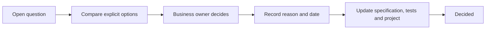

# Open decision register

[Specification index](../README.md) · [Revised build plan](../../build-plan/README.md)

This register contains only unresolved product or operating choices that must not be hidden as implementation assumptions. “Recommended” means the current draft is written in that direction; it does not mean the choice has been made. After a choice is approved and its effects are written into the specification, contracts, tests, build plan, and GitHub tasks, its entry is removed from this register.

## How to answer

Reply with the decision number and option, for example: `D02 A, D03 B`. Add conditions or a different option where none fits. Decisions are grouped so they can be handled in several short conversations.

## Foundation decisions — decide before Phase 1

### D02 Publication boundaries

**Question:** What receives its own live version?

- **A — Six root definitions with contained components (recommended).** Module, application, theme, connection type, interface, and organisation role publish independently. Pages, rules, workflows, and other application parts publish with their application.
- **B — Every major component publishes independently.** Pages, rules, events, workflows, and pipelines each have a live version.
- **C — Application package only.** Nearly everything publishes together with an application; shared modules are copied into it.

**Draft effect:** [Platform composition and publication](../03-composition-and-publication.md) follows A.

### D03 Permission wildcards

**Question:** May a role grant groups of permissions with a wildcard?

- **A — No wildcards in the first release (recommended).** Every permission is named, giving the clearest review and smallest accidental grant risk.
- **B — Controlled trailing wildcards.** A role may grant a named module or application’s non-administrative permissions with a trailing wildcard.
- **C — Wildcards for organisation roles only.** Application roles always name permissions individually.

**Draft effect:** [Access and permissions](../04-access-and-permissions.md) remains open until this decision.

### D04 Public field approval

**Question:** What proves that a field may appear publicly?

- **A — Field approval plus operation allowlist (recommended).** The field says public display is allowed and each public page/interface names the fields it actually uses.
- **B — Operation allowlist only.** A public page/interface may name any non-sensitive field.
- **C — Separate public projection.** Builders create a dedicated public record shape instead of marking source fields.

**Draft effect:** [Access and permissions](../04-access-and-permissions.md#public-access) and [data contracts](data-contracts.md#field-contract) follow A.

### D05 Calendar duration

**Question:** How does a calendar entry obtain its length?

- **A — Start and end fields only.** Every timed item uses two date-time values.
- **B — Start plus whole number and explicit unit only.** The page chooses minutes, hours, or days.
- **C — Either explicit method per page (recommended).** Publication requires start/end or start/whole-number/unit; it never guesses the unit.

**Draft effect:** [Applications, navigation, pages and themes](../07-applications-pages-and-themes.md) follows C.

### D06 Attachment type policy

**Question:** How should builders restrict uploads?

- **A — Broad file groups only.** For example image or document.
- **B — Filename extensions only.** For example `.pdf` or `.png`.
- **C — Broad groups plus optional narrower extensions (recommended).** Actual detected content must match the group and the extension must be allowed when a list exists.

**Draft effect:** [Files and attachments](../11-files-and-attachments.md) follows C.

### D07 Required links and deletion

**Question:** What happens when a parent record has children with a required link?

- **A — Refuse parent deletion until links are resolved (recommended default).** A separately configured dependent-child relationship may soft-delete children.
- **B — Always soft-delete the children.** Required links imply dependent ownership.
- **C — Allow empty required links after deletion.** The field remains required only for active editing.

**Draft effect:** [Modules, fields and relationships](../05-modules-fields-and-relationships.md#relationships) follows A and refuses C.

### D08 Multi-currency totals

**Question:** What does a money total return when source records use several currencies?

- **A — One result per currency (recommended).** The value is an ordered currency/value collection; it never pretends to be one scalar amount.
- **B — Refuse mixed currencies.** A filter or module rule must produce one currency.
- **C — Convert to one reporting currency.** Requires an exchange-rate source, effective time, rounding policy, and audit trail.

**Draft effect:** [Queries, reports, search and live updates](../10-queries-reports-search.md) supports A pending approval.

### D09 Field type changes

**Question:** How should an incompatible published field change be performed?

- **A — Add, migrate, switch, retire (recommended).** Only proven widening changes occur in place.
- **B — General automatic conversion.** The platform attempts conversions and reports rejected records.
- **C — Never convert.** Even widening changes require a new field.

**Draft effect:** [Modules, fields and relationships](../05-modules-fields-and-relationships.md#field-changes-after-publication) follows A.

### D10 Uniqueness and restoration

**Question:** Does a soft-deleted record reserve a unique value?

- **A — Reserve during the recovery period (recommended).** Restoration normally succeeds; a permanent removal releases the value.
- **B — Release immediately.** A restore that now conflicts remains deleted until the value is changed through a recovery form.
- **C — Configurable per field.** Builders select reserved or released.

**Draft effect:** [Records and their lifecycle](../06-records-and-lifecycle.md) remains open.

## Runtime and safety decisions — decide before Phases 3–7

### D11 Event dispatch runtime

**Question:** What wakes background event delivery without a permanent Vercel worker?

- **A — Durable Supabase queue, database webhook wake-up, and scheduled Kestra recovery call (recommended).** Normal delivery is event-driven; recovery does not read the database directly.
- **B — Kestra polls a platform endpoint on a short schedule.** Simpler but adds delay and constant polling.
- **C — Add a fourth permanent worker service.** Strong worker semantics but changes the approved operating footprint.

**Draft effect:** [Runtime services, storage and caching](../17-runtime-storage-and-caching.md#event-dispatch-without-a-permanent-web-worker) follows A.

### D12 Workflow state authority

**Question:** Which system is authoritative for business-visible workflow status?

- **A — Vortex is authoritative; Kestra executes (recommended).** Every accepted step result is recorded by Vortex and reconciled with Kestra execution state.
- **B — Kestra is authoritative.** Vortex reads Kestra state when people view a run.
- **C — Shared authority.** Each owns some business states, requiring a conflict-resolution policy.

**Draft effect:** [Workflows and process pipelines](../09-workflows-and-pipelines.md) follows A.

### D13 Model-assisted workflow step

**Question:** Should a workflow be able to request a model-produced structured result in the first release?

- **A — Yes, behind organisation and application policy (recommended if assistant ships).** The step returns data only and cannot directly write or send.
- **B — Assistant conversations only.** Defer model use in unattended workflows.
- **C — No model features in the first release.** Remove the assistant and model step from the initial build.

**Draft effect:** [Workflows and process pipelines](../09-workflows-and-pipelines.md#workflow-steps) includes the step pending this decision.

### D17 Access-change speed

**Question:** How quickly must a removal of access take effect?

- **A — The next request (recommended).** Every request reads current organisation-account state and access version before person-specific cache use.
- **B — Within 30 seconds.** Allows short caching of access context.
- **C — Within 60 seconds.** Lower database load but a larger revocation window.

**Draft effect:** [Runtime services, storage and caching](../17-runtime-storage-and-caching.md#cache-model) is designed for A.

### D18 Search and cache freshness

**Question:** How quickly must saved changes and removals appear in derived reads?

- **A — Access removal next request; ordinary search updates within 10 seconds (recommended).** Live record reads remain immediate.
- **B — Everything within 30 seconds.** Simpler common target.
- **C — Strongly current search.** A save waits for search update, increasing save time and coupling.

**Draft effect:** [Queries, reports, search and live updates](../10-queries-reports-search.md) follows A.

### D20 Pre-merge database testing

**Question:** Where should migrations and database access rules be tested before merging into `testing`?

- **A — GitHub Actions with an isolated local Supabase/PostgreSQL instance (recommended).** Reintroduces a narrow CI workflow for database checks while Vercel remains the preview/build surface.
- **B — One Supabase preview branch per pull request.** Closest hosted environment but adds branch cost and lifecycle work.
- **C — No pre-merge database run.** Kestra tests only after merge into the shared Testing environment; fastest setup but allows broken migrations onto `testing`.

**Draft effect:** [Delivery environments, database changes and testing](../18-delivery-and-testing.md) requires a selection before the branch checks are rewritten.

## Product policy decisions — decide before their feature phases

### D14 Assistant provider and data policy

**Question:** What model-provider policy is acceptable?

- **A — One approved provider and region, no shared-model training, short provider retention (recommended first release).** Personal fields require explicit allowlisting; sensitive fields remain excluded initially.
- **B — Several approved providers selected per organisation.** More choice, with more policy, testing, and support work.
- **C — Customer-supplied provider account.** Customers control commercial terms, while Vortex still enforces access and tool safety.

**Draft effect:** [Assistant and model-assisted work](../13-assistant.md) can be finalised only after provider, region, retention, and field policy are named.

### D15 Personal-data erasure scope

**Question:** How should erasure work for a person belonging to several organisations?

- **A — Two explicit request scopes (recommended).** An organisation request removes or anonymises that organisation's personal data; closing the global identity separately coordinates all organisation accounts and global identity data.
- **B — Organisation request always deletes the global identity.** One organisation could affect unrelated organisation accounts.
- **C — Global account is never erased through the product.** Only organisation data is handled in-product; global requests require operator work.

**Draft effect:** [Activity history, privacy and retention](../14-activity-privacy-and-retention.md) follows A.

### D16 Billing and limit enforcement

**Question:** What happens when payment fails or an organisation exceeds a limit?

- **A — Warning then grace period; refuse new consumption but preserve read/export (recommended).** Security or legal suspension is separate. Count active organisation accounts as seats.
- **B — Immediate read-only state after payment failure.** Strong collection control with higher customer disruption.
- **C — Allow measured overage.** Continue service and bill approved overages; requires explicit plan terms.

**Also decide:** grace-period length, warning thresholds, seat definition, trial length, and cancellation retention.

**Draft effect:** [Plans, billing and usage limits](../15-plans-billing-and-usage.md) follows A without inventing the missing durations.

### D19 Cross-organisation copy policy

**Question:** What should happen when a copied application has unavailable dependencies?

- **A — Create an incomplete draft and block publication (recommended).** Show every missing dependency and let the builder install, map, replace, or remove it.
- **B — Refuse the copy entirely.** Nothing is created until all dependencies exist.
- **C — Automatically copy every copyable dependency.** Secrets and organisation-specific items still require replacement.

**Draft effect:** [Copying, sharing, import and export](../16-copying-sharing-import-export.md) follows A.

### D21 Recovery objectives

**Question:** What maximum data loss and restoration time should production promise?

- **A — Up to 15 minutes of data loss and service restored within 4 hours (recommended starting target).** Requires frequent database recovery points and tested automation.
- **B — Up to 1 hour of data loss and restoration within 8 hours.** Lower cost, larger business impact.
- **C — Near-zero data loss and restoration within 1 hour.** Requires materially more redundancy and cost.

**Draft effect:** [Operations, backup and recovery](../19-operations-backup-and-recovery.md) does not state a promise until this is decided.

### D22 Performance budgets

**Question:** What user-facing performance target should acceptance use?

- **A — Define separate budgets for navigation, record open, save, and search at p75 and p95 on named desktop/phone and network profiles (recommended).** Collect baseline data before fixing numbers.
- **B — One universal page-load target.** Easier to state but poorly represents saves, search, and live applications.
- **C — No release-blocking budget in the first release.** Measure only, then set targets later.

**Draft effect:** [Quality, accessibility and acceptance](../20-quality-and-acceptance.md) requires A's measured numbers before performance can block a release.

## Additional scope decisions

### D23 Groups and teams

**Question:** May one organisation account belong to more than one group or team?

- **A — Several teams per person (recommended).** Matches role assignment and record collaboration but needs explicit team-management and visibility rules.
- **B — Exactly one group per organisation.** Simpler and matches the earlier specification.
- **C — One primary group plus several working teams.** Separates reporting structure from collaboration.

### D24 Individual record sharing

**Question:** Is sharing one record directly with one person included in the first release?

- **A — No; ownership, teams and application scopes only (recommended for initial scope).** Add individual sharing later as a deliberate model extension.
- **B — Yes, read-only individual sharing.** Requires share lifecycle, search, export and activity support.
- **C — Yes, configurable read/change sharing.** Largest permission and audit surface.

**Boundary:** This decides direct sharing with an organisation account or team inside one organisation. Cross-organisation grants separately require one named recipient application and one or more recipient application roles under the permanent [grant contract](data-contracts.md#access-grant-contract).

### D25 Organisation creation

**Question:** Who can create a new organisation?

- **A — Abzum operator only (recommended first release).** No public organisation sign-up.
- **B — Invited partner administrators.** Controlled delegated creation.
- **C — Public self-service with trial and billing setup.** Requires abuse, verification and automated lifecycle controls.

## Clearing a resolved entry

Before removing an approved entry from this register:

1. Write the final behaviour and its boundaries into the relevant specification sections.
2. Update data contracts, diagrams, worked examples, acceptance tests, and build dependencies.
3. Update the affected GitHub issues and record the owner, date, choice, reason, and rejected trade-offs in the review pull request or issue history.
4. Run the document, link, diagram, and repository checks.
5. Remove the resolved entry and every obsolete link to it. The repository and GitHub history retain the decision evidence.
