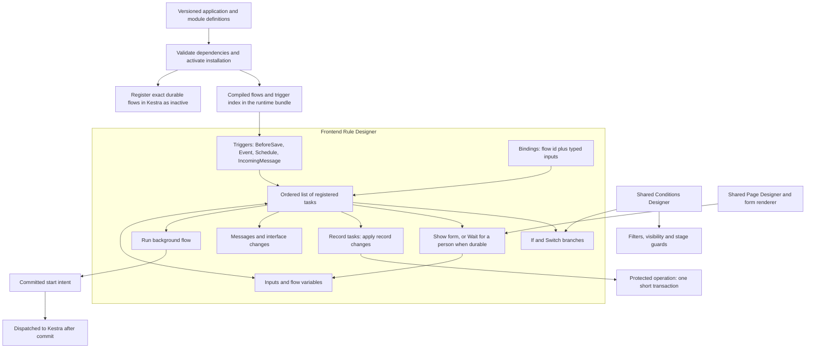
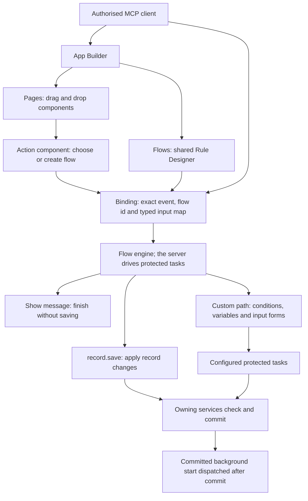
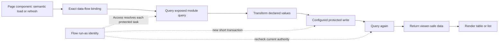
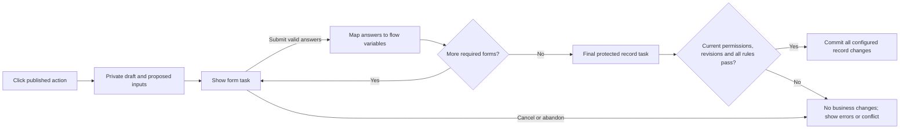

# Frontend Rule Designer

[Specification index](../README.md) · [Forms, actions, rules and events](../08-forms-actions-rules-and-events.md) · [Page builder](page-builder-contracts.md) · [Durable workflows](../09-workflows-and-pipelines.md) · [Architecture decisions](../../build-plan/architecture-decisions-2026-09-25.md)

## Purpose

One Frontend Rule Designer authors every flow in the one flow language: save rules, named actions, screen flows, background flows and durable workflows. The Conditions Designer and Page Designer are reused components, not competing rule or form engines. Business-specific behaviour lives in application and module definitions.

This specification incorporates the owner's September 2026 designer, variables, packaged-installation and custom-form decisions, and [Decisions 1–3](../../build-plan/architecture-decisions-2026-09-25.md#decision-1--one-flow-definition-one-vortex-flow-engine-kestra-for-durable-work) of the architecture decisions of 25 September 2026. It describes required delivery, not functionality already implemented. The flow contract below replaces the separate rule-graph, current-user flow and workflow node-and-edge representations throughout current definitions and consumers.

## Composition

A registration always identifies the organisation, application installation, exact application or module release and contained flow identity. Two applications with the same label never share a registration accidentally.

## One flow language

Save rules, named-action bodies, screen flows and background workflows are one authored artefact: a **flow**. A flow is stored data inside the release of the module or application that owns it; it is never code. Its shape follows the Kestra flow definition, so its durable form compiles to a Kestra flow. The execution kind selects where a flow runs, not a different language, canvas, catalogue or runtime. There is one task registry, one validator and one publication path for every flow.

### Flow shape

Every flow declares:

| Field | Meaning |
| --- | --- |
| `id`, `key` | Permanent identity plus a stable, human-readable key. Labels never select or authorise a flow. |
| Owner | Exactly one owner: the module or application release that contains the flow. There are no platform-managed or ownerless flows. |
| `namespace` | Derived from the owner and never authored. The Kestra namespace and flow id are generated per installation ([09](../09-workflows-and-pipelines.md)) and are never this value. |
| `description`, `labels` | Text for builders. Labels are for search and diagnostics only. |
| `execution` | One of `interactive`, `transaction`, `background` or `durable` ([execution kinds](#execution-kinds)). |
| `runAs` | Whose authority each protected task uses, fixed by the execution kind and how the flow starts ([Run as](#run-as)). |
| Invocation permission | The permission checked before the flow may start through any binding. |
| `inputs`, `variables` | Named values typed with the one Vortex value-type catalogue ([#982](https://github.com/Abzum-NZ/Abzum-Vortex/issues/982)); inputs are required or optional, variables may have defaults. |
| `triggers[]` | Only the automatic starts: `BeforeSave`, `Event`, `Schedule` and `IncomingMessage` ([triggers and bindings](#triggers-and-bindings)). Every other start is a binding. |
| `tasks[]` | An ordered, nested list of tasks, including the control tasks below. |
| `outputs` | Named, typed results returned to the caller. |
| `errors`, `finally` | Tasks that run on failure, and tasks that always run. The default error handler shows refused, validation, conflict and uncertain outcomes safely. |
| `retry`, `timeout`, `concurrency` | Execution policies. Retries and long timeouts are allowed only in durable flows. |

Control tasks give the ordered list its structure without a free node-and-edge graph:

- **If** — two declared branches on a typed condition.
- **Switch** — a bounded multi-way choice on one typed value.
- **For each** — bounded iteration over a declared collection.
- **Sequential** — an ordered group of tasks run one after another.
- **Run flow** — invoke another flow as an explicit nested call with typed inputs and outputs.
- **Stop** — end the flow with a declared outcome.
- Durable only: **Parallel**, **Wait until** (resume at a declared time or date-time value) and **Wait for a person** (an assigned human task that can outlive sessions).

The visual editor draws the task list and its branches like Kestra's topology view, but position is presentation only: the authored task order, branches and declared outcomes determine execution. No author draws a free graph and no second editable trigger or condition graph exists.

### Triggers and bindings

A **trigger** is an automatic start held in the flow's own `triggers[]`. There are exactly four:

| Trigger | Starts | Execution kind |
| --- | --- | --- |
| `BeforeSave` | Inside the save transaction of a named record type, before commit, for every writer ([Decision 3](../../build-plan/architecture-decisions-2026-09-25.md#decision-3--save-rules-run-where-they-cannot-be-bypassed)) | `transaction` |
| `Event` | After a committed record change: one of the [seven standard events](../08-forms-actions-rules-and-events.md#events) or a declared business event | `background`; work that waits is handed to a durable flow through Run background flow |
| `Schedule` | At a closed recurrence value owned by the flow | `durable` |
| `IncomingMessage` | On a verified incoming [connection](../12-connections-and-interfaces.md) message | `background`, or `durable` when the work waits |

Each trigger declares its typed inputs, an optional entry condition and its duplicate-protection rule. Any compiled trigger index is derived from the published flows, never a second independently editable list.

Every start made by a person or another system is a **binding**, not a trigger. A component placement, navigation item, interface operation, agent tool or parent flow holds a binding: the exact flow id plus a typed input map. Pages never hold flow logic of their own. Web controls, MCP tools and interface operations use the same entry point ([#979](https://github.com/Abzum-NZ/Abzum-Vortex/issues/979) specifies that one start path).

### Execution kinds

| Execution kind | Started by | Where it runs | Guarantees |
| --- | --- | --- | --- |
| `interactive` | A person or an agent through a binding | The page for browser and pure tasks; the server orchestrator from the first task when any reachable task is protected | Answered within the request; each protected task commits or refuses in its own short transaction; no transaction stays open across a person's input. |
| `transaction` | A `BeforeSave` trigger, a named action's binding, or a Run flow task | Inside one record-save transaction | Only pure tasks, reads under the saver's authority and changes to the record being saved (a named action's record tasks compile into its one apply-record-changes call); no human wait, network call, identity switch, background start or independent commit. |
| `background` | The event dispatcher after a commit, or a verified incoming message | The server orchestrator | Re-runs in full on redelivery; duplicate keys make every protected effect happen once; no waits. |
| `durable` | A `Schedule` or `IncomingMessage` trigger, or a Run background flow task | Kestra | Schedules, waits, human tasks, retries and external calls; calls back into Vortex only for protected operations and for evaluating conditions and formulas. |

#### Who drives a flow

- A flow whose reachable tasks are all browser or pure tasks runs entirely in the page.
- Any flow that contains a protected task is driven by the server orchestrator from its first task. The browser never drives protected work.
- At a browser task, such as Show form, Confirm or Show message, the server returns a typed intent and a continuation. The continuation is a private draft ([#68](https://github.com/Abzum-NZ/Abzum-Vortex/issues/68)) or an encrypted, expiring token. The page or MCP client resumes the flow with it; caller JSON is never trusted continuation authority.
- The server issues the run id. Duplicate-protection keys are (run id, task path, iteration).

### Task placement

Every task type is registered once in the task registry ([#983](https://github.com/Abzum-NZ/Abzum-Vortex/issues/983)) with its version, its typed properties, outputs and outcomes, its default policy, how it compiles for Kestra, and:

- its run locations: **browser**; **server**, a protected operation in its own short transaction; **transaction**, only inside the owning record save; **durable**, on Kestra;
- its effect class: **pure**, **read**, **change**, **background start** or **interface**.

Publication refuses a flow that puts a task where it cannot run. Work moves between execution kinds only through an explicit **Run flow** task, which invokes another flow with its own declared execution kind, or a **Run background flow** task, which commits a start intent for a durable flow; it never migrates silently. A transaction flow may Run flow only another transaction flow. [Durable workflows](../09-workflows-and-pipelines.md) use this same task registry rather than a second language or catalogue.

### Closed reference syntax

A flow reads values with one closed reference syntax:

- `{{ inputs.x }}` — a declared flow input.
- `{{ vars.x }}` — a declared flow variable.
- `{{ trigger.record.field }}` — a field on the triggering record.
- `{{ trigger.previous.field }}` — the previous value of a field on the triggering record.
- `{{ outputs.task.key }}` — a declared output of an earlier task, including `{{ outputs.task.outcome }}`.
- `{{ execution.actor }}` — the verified execution actor.
- `{{ execution.now }}` — the execution time.

No functions, filters, arithmetic, scripts or code are allowed; the syntax names only declared values. The compiler resolves every reference to a typed reference, and no text is ever evaluated as a template. Protected values and secrets never enter this syntax and resolve only through the existing protected connection bindings. A reference to an undeclared name, a task that cannot precede the reader or an incompatible type fails publication rather than evaluating to an empty or false value.

### Formulas

Calculate tasks, conditions and computed fields use one **formula**: a typed JSON expression tree over a closed operator catalogue, never text. The catalogue covers:

- exact decimal and money arithmetic with declared precision and rounding;
- comparison, boolean logic and conditionals;
- text join;
- date offset and difference;
- `now`, which is allowed only in read-time computed fields and in interactive or background flows.

There are no user-defined functions, loops or undeclared reads. One evaluator is shared by the browser and the server; durable flows evaluate conditions and formulas through the Vortex evaluator over the protected callback, never in Kestra's template engine.

A read-time computed field, such as overdue or days remaining, is computed whenever a record is read and is never stored. Queries that use a read-time computed field bypass the data-result cache ([17](../17-runtime-storage-and-caching.md#cache-model)), because its value changes without any data change. A value that does not depend on time, and that totals must use, remains a stored calculated field ([05](../05-modules-fields-and-relationships.md)). Components never compute business values.

### Limits and refusals

One interactive or background run has at most 100 For each items, at most 25 protected operations, at most 10 seconds of server time and a Run flow depth of at most 3. Cycles between flows are refused at publication.

A refused, conflict or invalid outcome from a protected task sends the flow to its `errors` handler, unless the task sets `allowRefusal: true`; the flow then branches on `{{ outputs.task.outcome }}`.

### Runtime package placement

The flow engine is built in-house and has three parts. The pure interpreter and typed task intents and outcomes live in shared Rule (tier 1), with no server-service imports or generic service callback registry; the browser and the server share it. The existing App package (tier 8) owns the headless server orchestrator, which runs protected tasks through the one protected-operation executor ([#989](https://github.com/Abzum-NZ/Abzum-Vortex/issues/989)) and calls lower-tier public Query, Record, Access and Workflow APIs. The browser runner in `ui` runs interface tasks ([#1013](https://github.com/Abzum-NZ/Abzum-Vortex/issues/1013)). Record saves call only Rule's pure transaction-safe subset, never App. Page (tier 9) and the sole web composition root consume typed pause and presentation intents and supply the protected form-continuation adapter in [#68](https://github.com/Abzum-NZ/Abzum-Vortex/issues/68); App must not import Page or hide an upward dependency in a callback. The server adapter validates continuation evidence before resuming. No new service package or weakened boundary rule.

A binding does not itself make a flow read-only. Page or component load, field change, selection, refresh and manual actions may run configured changing tasks. Pure feedback is a deliberately effect-free evaluation of a flow, not a prohibition on binding a separate effectful flow to the same semantic event. Transaction flows retain the strict transaction-safe subset. The designer explains unavailable combinations.

Human input pauses the execution, not a database transaction. Schedules, waits, human tasks, retries and external calls use the durable execution kind and the same task registry, not a separate frontend or background engine.

## Pages compose; flows define actions

Every user-facing application action has a flow binding: standard record commands, custom record actions, toolbar, menu and row commands, action buttons and form submission. Every flow belongs to the application or module release that contains it. Module-owned queries, flows and protected operations remain reusable dependencies. Pages store layout, data and form context and typed event-to-flow bindings, not executable business behaviour or label-selected handlers.

### Configure a component without leaving the App Builder

1. Drop an action component and open its **Action** inspector. Choose a quick action (Save, Show message, Navigate or an eligible named action), **Create flow**, or **Use existing flow**. The page inspector opens the same Frontend Rule Designer with the current context, and returns to the selected component afterward.
2. A Submit button dropped into one explicitly bound form receives the generated default Save flow: one `record.save` task. Show the exact target form and record type immediately. A generic button or an ambiguous or unbound form requires configuration; never silently save the nearest or first form. Allow an unfinished draft, but refuse publication of an action missing its required binding.
3. A generated default is a real application-owned flow with a permanent identity and editable tasks. A builder with the builder permission can add tasks before `record.save` (look up values, calculate, confirm, validate) and after it (show a message, navigate, run a background flow). Defaults are created only during authoring, never during rendering or execution. They do not need an artificial record, background run or extra approval.
4. Selecting or replacing a flow validates the supplied record, selection or form context and typed inputs. Pure feedback and preview cannot execute effectful tasks, while declared component and interactive execution can. Reusing a flow is deliberate; show its linked controls before editing shared behaviour, and offer an explicit copy for an independent variant. Duplicating a component preserves its flow reference and reports that reuse rather than secretly creating different behaviour.
5. Pages, bindings and flows use the existing application draft revision and publish and activate together. Renaming a label preserves identity. Missing or deleted flows, incompatible inputs, missing form or operation targets and unresolved task versions prevent publication. Withdrawal or replacement cannot leave a hidden working fallback. Current definitions use explicit flow bindings throughout; remove obsolete direct-binding readers and conversions.

The form declares one default submit binding. Clicking its Submit button, pressing Enter and using a supported Save shortcut invoke that same binding once; a click handler plus a native submit event must not start it twice. Other buttons have explicit separate bindings and are not implicit form submits. Record gestures such as a board-card move or inline-edit commit also enter their declared action flow, with typed source and target context. Cancelling a journey before its first protected commit leaves business data unchanged; after a confirmed commit, Cancel cannot claim to undo it.

This rule covers configurable action entry points, not browser primitives. Typing into an input, tabbing focus, opening native selection choices, layout and rendering do not require one new flow per keystroke. Their registered behaviour remains generic; any configured reaction uses the declared binding. Existing navigation and view-control descriptors can provide a one-task flow binding without bespoke page handlers. Query execution, transport, backend service internals and infrastructure maintenance are not wrapped in recursive flows.

### Saving is a task, not hidden page behaviour

Every record task calls one protected operation, **apply record changes** ([#1060–#1065](https://github.com/Abzum-NZ/Abzum-Vortex/issues/1060)). The record tasks are `record.save`, `record.create`, `record.setFields`, `record.link`, `record.delete`, `record.restore` and `record.changes`. One call is one transaction that enforces the access decision for each touched record, field permissions, pipeline transitions and gates, action-only fields, revision checks, `BeforeSave` flows, and read-time and stored computed values. A flow cannot split or bypass this operation: record changes that must succeed or fail together are one `record.changes` task.

A flow may finish without any business write or may contain several Query records, record, Run flow and Run background flow tasks. Each changing task commits or refuses its own bounded operation; later tasks may read, write, collect input or return results as configured. Earlier commits are not rolled back by later failure or Cancel. There is no implicit whole-flow transaction.

The server must re-evaluate mandatory required answers, conditions, validation and authority through every permitted invocation path, including web, MCP, programmable interfaces, imports and durable callers. Presentation-only conditions are not security policies. A required business condition belongs in a `BeforeSave` flow or in the protected operation, not merely on a button. Another button or a raw save or action call cannot evade a requirement by choosing an easier flow or claiming its gates passed. Conversely, showing a popup need not manufacture a database transaction.

The flow engine orchestrates registered tasks; Record (including named actions), Query, Access, Definition and Workflow services still own their protected operations. This is one configurable action route over those services, not a universal service that replaces them. The lower-level [named-operation task](https://github.com/Abzum-NZ/Abzum-Vortex/issues/50) precedes the [rule runtime](https://github.com/Abzum-NZ/Abzum-Vortex/issues/58); it does not acquire a reverse dependency just because the later UI supplies a flow entry point.

### MCP app authoring and invocation

The same [governed MCP capabilities](../12-connections-and-interfaces.md#governed-mcp-access) must allow an authorised builder to create an application, configure its module dependencies, compose pages, add components, create, select, copy and link flows, edit triggers, bindings, conditions, tasks, variables and form mappings, inspect validation and reference usage, preview, publish and install. Use existing Definition operations and revisions with stable semantic identities; do not generate a separate tool for every button or task. Preview is simulated and cannot submit business data. The external agent supplies no runtime code or privileged permission evidence.

At runtime the MCP client invokes the same published action binding and receives the same typed intents, form requests, permitted fields, messages, validation and final outcomes, resuming with the same continuation. A headless client can receive a popup's structured message without an open browser; moving an actual interface still requires the existing explicit session pairing. Required user decisions and confirmations remain required. No embedded model, assistant or second action executor is introduced.

## Component data flows

This is one possible configuration, not a required sequence. Protected operations remain in their existing services, with no transaction spanning the whole diagram.

The Records table and other data components run their configured query directly through the Query engine, which enforces access, withheld fields, paging and totals; the component never fetches data itself. A **data flow** is used only when a builder adds transform or write tasks. Its **Data flow** inspector selects or creates an application flow, chooses the module's exposed query and maps declared inputs and returned columns. Authors may add transformation, condition and changing tasks, including Query → Write → Query again → Return data. Each is a configurable task in the same designer; data loading is not a separate execution engine or universally read-only mode.

A module-exposed query has permanent identity, module release, declared typed parameters, allowed fields, filter, sort and group capabilities and a typed bounded result. This is an explicit versioned extension of the existing [query contract](../10-queries-reports-search.md#query-contract), not raw SQL or a query selected by label. The application resolves it through its exact installed module binding. Keep named reusable query definitions distinct from a person's saved view; both reuse Query, not competing read engines.

Query tasks delegate to Query with the verified effective actor. Filtering, sorting, grouping, totals and pagination apply before returning a bounded page. Transform tasks can project or derive values from permitted input fields; they cannot forge record identities, source markers, capabilities, revision evidence or pagination tokens. Dataset-wide changes to row membership, order or totals belong in the query, not a transform of one returned page. Display-derived columns are not editable source fields without an explicit write mapping. Shared-source restrictions remain unchanged.

Return data validates the component's expected schema, rows, safe capabilities, paging and source context. It rechecks the viewer's access independently of execution identity. A new query after writes returns fresh values; returning the earlier snapshot is explicitly labelled and cannot appear as current saved data. Errors, permission refusal and partial flow failure are distinct from an empty table.

Load, explicit refresh, filter, sort, paging and relevant-input changes have exact semantic bindings. Renders, speculative prefetch, retries and cache reads never start writes. A safe default flow only reads, but published configuration may add writes on those events. The builder previews this effect summary; this is not another approval gate. A deliberate refresh is a new invocation and may write again. A write's own invalidation refreshes affected read results without recursively rerunning its originating write path. Explicit same-cause re-entry is refused; changed filter or selection discards stale display responses while preserving confirmed write outcomes. Do not invent a global polling or orchestration service.

## Flow ownership

Every flow has exactly one owner: the module or application release that contains it. There are no platform-managed flows, hidden flow internals, extension slots or separate flow use and edit permissions. Behaviour that must stay hidden or platform-controlled is a protected operation; reusable platform behaviour ships as ordinary flows in [system modules](core-contract-boundary.md#system-modules). [#980](https://github.com/Abzum-NZ/Abzum-Vortex/issues/980) retires the remaining managed-flow text and contracts elsewhere.

Changing a flow is changing its owner's draft, gated by the builder permissions in the [application packages appendix](application-packages.md#permissions): `platform.organization.definition_drafts.manage` to change drafts and `platform.organization.definition_releases.manage` to publish. Enforce these in Definition, publication and service boundaries, not just a disabled editor. "Super Administrator" is a role carrying protected capabilities, not a hardcoded role-name check or universal tenant bypass.

[System applications](core-contract-boundary.md#ordinary-applications-not-core-domains) (IAM, Organisation Administration, Tenant Administration and the Landing Zone) are platform packages installed when an organisation is created, and they cannot be uninstalled. People holding `platform.organization.system_applications.manage` customise them through extension fields, theme, navigation and their own dependent applications and flows, or through an organisation-owned customised copy that replaces the system application's installation. Their protected operations and operation bindings stay platform-owned: a customisation cannot add, remove or retarget a protected-operation binding. Platform upgrades never overwrite customisations.

## Run as

This section describes target runtime behaviour. Current-person execution uses the initiating person's protected request context. [#322](https://github.com/Abzum-NZ/Abzum-Vortex/issues/322) and [#541](https://github.com/Abzum-NZ/Abzum-Vortex/issues/541) implement the scoped execution grants for specified accounts and System actors. Actual row, field, derived-value, file, component and MCP integration remains in the downstream owning tasks; it does not make the identity foundation depend on the later flow engine.

A flow's `runAs` decides whose authority each protected task uses. It follows from the execution kind and how the flow starts:

| Flow | Runs as |
| --- | --- |
| `interactive` | The initiating person. An agent acts as its person. |
| `transaction` | The saver: the actor of the save or named action that owns the transaction. |
| `durable`, started through Run background flow | The run-as of the flow that started it: the initiating person when started from an interactive flow. |
| `background`, and `durable` started by `Schedule` or `IncomingMessage` | A declared specified account or System, through a scoped execution grant. |

Access is rechecked before every protected task. A task never overrides the flow's run-as. A system-started flow without a human initiator must declare an eligible specified account or System; it cannot invent a person. Pure browser presentation tasks operate in the viewer's interface and gain no authority. Actor identity comes from trusted bindings, not a UUID, actor object or flag submitted by the client.

| Identity | Resolution and authority |
| --- | --- |
| Initiating person | The original verified initiating organisation account |
| Specified account | Exact active organisation account plus a current, explicit execution grant for this flow and allowed input scope |
| System | Registered system actor with explicitly granted organisation, application and operation scope; never a database service-role credential or unrestricted global administrator |

Authoring a run-as reference does not grant its use. An execution grant is distinct from existing role-management delegation. Access owns explicit grant, register, replace and revoke operations with current scope, target actor, exact installation, release, flow and operation, permitted resource and input bounds and optional expiry. A grantor must hold explicit authority to grant that scope; customer app editors cannot turn an edit into impersonation or system power. Resolve permanent IDs rather than labels. Use existing revision checks and Access-version invalidation; expired, revoked, disabled or wrong-scope actors fail without fallback. Broadened definitions require fresh bounded authorisation; install, copy and rollback never manufacture or revive a grant.

At each protected task, check the current execution grant or system capability, the effective actor's current operation access, exact task inputs and record revisions. A grant intentionally permits an operation within its explicit scope, but it never supplies a human-only approval, PIM activation or recent authentication belonging to someone else. Non-delegable operations remain non-delegable. Keep the owning operation's Activity entry under its effective actor. A flow started by a committed change links its content-free grant-use Activity entry to the originating change through existing correlation, retaining exact flow release, task and safe outcome. A system-started flow records its actual verified System actor and cause, never an invented human account. Reuse the existing Activity append contract rather than widening its envelope or creating another history store.

Each protected task under a specified account or System starts a new, separately Access-resolved short transaction. Never mutate or reuse a preceding human transaction context, accept a caller-created trusted context, or upgrade its locks. Current lifecycle, grant and permission checks happen within the owning operation's supported transaction boundary. The headless [scoped execution-identity task](https://github.com/Abzum-NZ/Abzum-Vortex/issues/322) owns this authority; [typed bindings](https://github.com/Abzum-NZ/Abzum-Vortex/issues/250) describe references without granting them.

Execution access is not display access. Keep privileged intermediate values server-side and return only permitted projections or safe operation receipts. Recheck row and field access for the actual viewer before any table, form, message, error, branch outcome, count, derived value, export or MCP response can expose it. Do not send an unrestricted result to the browser and mask it afterward. The same restriction prevents a transformation or write to a viewer-readable field from laundering protected inputs; reject unsafe mappings or require an existing explicitly authorised disclosure operation. No silent declassification or cross-organisation authority switch.

## Triggers

A flow's `triggers[]` holds only `BeforeSave`, `Event`, `Schedule` and `IncomingMessage` ([triggers and bindings](#triggers-and-bindings)). Several flows may share a trigger; they run in their stable published order. Do not maintain hidden event listeners outside the published definition.

`BeforeSave` names its record type and the record operations it covers: create, update and each named transition. It never applies to deletion, restoration, linking or reassignment by inference. The server runs it inside apply record changes for every writer: web, agent, interface, import and Kestra. Its refusals, requirements and warnings are authoritative. The browser runs the same flow while a person edits, to show feedback at once; browser results are never trusted. Collect additional answers before the save, not inside it.

`Event` names both the event and its record type; publication proves that the event exists and carries every declared field input the flow reads. `Schedule` owns a closed recurrence value. `IncomingMessage` uses its connection's named mapping and input shape. Effectful reactions run only on the exact committed occurrence, and redelivery never repeats a protected effect.

Everything a person or component does is a binding to a flow. The semantic events a component placement can bind are:

| Binding source | Semantic events | Behaviour |
| --- | --- | --- |
| Manual | Named button, menu command, row action or selected-record action | Start a permitted interactive flow. Selection is a typed, bounded list, never a comma-separated string or an implicit first record. |
| Page and form lifecycle | Page ready, form ready, form reset, form submit | Run the bound flow once for the semantic event; rendering again is not another start. |
| Input | Selected field value changed; field left | Re-evaluate using typed draft values. "Changed" means a value change, not every render or key press. |
| View controls | Row or selection changed, tab changed, guided step changed, filter, sort or page changed | React only to the named semantic control. Do not depend on DOM selectors. |

"Field matches value" is a condition, not a continuously running watcher. Requirements and visibility evaluate on relevant changes, including initial state. A one-off reaction when a condition becomes true or false is a field-change binding whose flow compares declared previous and current draft values; an already-true initial value is not a transition. What happens after a save or named action succeeds, is refused or fails is the rest of the same flow, following the record task's declared outcome, never a separate result trigger. Time passing alone is not a binding; use a `Schedule` trigger. Effectful reactions run only on the exact bound semantic event, not each render, mount retry or implicit cache read.

Publication checks every task against its declared run locations and effect class. Interactive flows may execute configured reads and changes; pure feedback and preview never execute effects. Transaction flows retain the transaction-safe subset. A flow cannot recursively restart the same cause chain. A misplaced task, unknown task or invalid reference fails before execution rather than being skipped.

## Shared Conditions Designer

Use one field → comparison → value editor with nested **All / Any / Not** groups and a readable sentence preview. Reuse it for If and Switch branches, trigger entry conditions, list filters, field visibility, validation, record visibility and pipeline guards. It serialises the Vortex typed condition tree, which is part of the one formula, not a library query string.

The host supplies the allowed fields, operands and operators. A list filter does not receive transient flow variables or previous form values; an access condition never accepts a browser-supplied actor identity. General flows can use declared inputs, flow variables, current permitted values and explicitly typed previous values where a previous state exists. Initial creation has no previous record; missing and null are distinct. The flow contract adds any missing previous-value and changed semantics explicitly rather than hiding them in literal JSON.

Operators include typed equality, ordering, ranges, empty and not-empty, membership and appropriate text comparisons. Relationship traversal is only through the already allowed, bounded context. Invalid fields, operands, types or unavailable values are errors, not false values that can become true through Not. Browser and server use the same pure evaluator; query and security evaluation preserve matching database meaning. No JavaScript, PHP, SQL, formula script or library SQL export is accepted as a condition.

## Inputs and flow variables

The UI calls these **Flow variables** to distinguish them from infrastructure environment variables and secrets. They are available throughout one run, not shared between users, runs or applications.

| Value group | Who supplies it | Rules |
| --- | --- | --- |
| Inputs | Trigger or binding input map | Named, typed, required or optional and validated; no undeclared payload keys. |
| Context | Vortex | Read-only actor, organisation, installation, triggering record and available previous values. Client context is never authority. |
| Flow variables | Defaults, Set variables task or explicit output mapping | Declared name, stable identity, type and optional default. Values may change along the selected path. |
| Task outputs | A named completed task | Typed outputs; available only where that task has executed. |
| Result | Completed protected task or flow | Safe committed, refused, conflict, validation, partial or uncertain outcome; available only after that task. Flow completion is not evidence that every task committed. |

Support the one value-type catalogue, including bounded lists, structured values and references whose allowed record types are declared. Use a value picker for literals, fields, inputs, variables and earlier task outputs. Never require authors to type `$env[...]` or code.

Defaults are evaluated once per run in a deterministic order. Setting a variable validates its type. At a branch merge, a variable needs a default or an assignment on every incoming path before a required read; publication refuses an uninitialised read. An optional value requires an explicit empty check or fallback. Outside durable Parallel tasks, a run has one active path and no shared mutable state.

Sensitive values retain their source restrictions; variables are not a way to reveal hidden data or send it to another organisation. Logs and previews redact them. Browser variables never contain provider credentials. A Run background flow task maps only declared allowed inputs and permitted references, never the entire variable bag; the event envelope's protected-data restrictions remain. Backend secrets continue to resolve through existing protected connection bindings.

Durable flows retain typed trigger inputs and task outputs. A flow variable passed to a durable flow becomes a validated input snapshot, not a live shared variable. This feature does not introduce mutable environment-wide state in Kestra.

## Task catalogue and extensibility

### All authored behaviour is configured through tasks

Automatic starts use the flow's trigger list and other starts use bindings; conditions use If or Switch tasks; forms, field and variable changes, saving, messages, navigation and background starts use their registered tasks. A Stop task or the flow's outputs declare the terminal outcome. Inputs and variable declarations are flow settings; changing their values during execution is a task operation.

Each task exposes readable settings, typed input and value mappings, typed outputs and its supported declared outcomes. An author can add, configure, reorder or remove eligible tasks and choose the route for each declared outcome. Show form exposes validated-answer and Cancel outcomes; `record.save` exposes committed, validation, refused, conflict and uncertain outcomes. Registered tasks define which outcomes exist, so an author cannot invent a success outcome or suppress a required check. Task-output values can be mapped to declared flow variables for later tasks.

The quick-action inspector is a compact editor for those same task settings. A default Save flow is one `record.save` task; it is not a separate kind of hardcoded flow. There are no hidden action chains, separate success or error scripts or button-side saves. Continue and Cancel on a displayed form return through that Show form task's declared outcome in the current flow; the continuation identifies the paused task without letting the caller select an arbitrary next task or start the action twice.

Flexibility comes from task configuration and composition, not bypassing operation guarantees. Authors can branch, collect input, query, transform results and invoke multiple protected operations in their chosen order. Commits occur at changing tasks, never implicitly on page rendering. Add later task types through the versioned registration contract below; application authors configure their settings rather than uploading executable code.

| Task | What it configures | Run locations | Effect class |
| --- | --- | --- | --- |
| If / Switch | Shared condition with Yes/No routes, or a bounded multi-way choice | Browser, server, transaction, durable | Pure |
| For each / Sequential | Bounded iteration or an ordered group of tasks | Browser, server, transaction, durable | Pure |
| Run flow | Exact flow id and typed input map; the called flow declares its own execution kind | Server, transaction (another transaction flow only), durable | Of the called flow |
| Stop | Declared terminal outcome | All | Pure |
| Parallel / Wait until / Wait for a person | Concurrent branches; resume at a declared time; an assigned human task with an exact reusable form | Durable | Pure, pure, interface |
| Run background flow | Exact published durable flow id and typed input map; the start intent commits before dispatch | Server | Background start |
| Show form / Confirm | Exact reusable form, defaults, output mappings and Continue/Cancel outcomes | Browser | Interface |
| Set variables / Calculate | Typed mapping or formula | Browser, server, transaction, durable | Pure |
| Query records | Exact module-exposed query, typed parameters, fields and filter, sort and page inputs | Server, transaction (under the saver's authority), durable | Read |
| Transform / Return data | Typed mappings of permitted results and the caller output contract | Browser, server, durable | Pure |
| Set field | A proposed draft value, or a change to the record being saved | Browser (draft only), transaction | Change |
| Require field / Refuse / Warn | Conditional requirement, safe refusal or non-refusing validation message | Browser (feedback only), transaction | Pure |
| `record.save`, `record.create`, `record.setFields`, `record.link`, `record.delete`, `record.restore`, `record.changes` | One apply-record-changes call with explicit record, field-to-value and relationship-key maps | Server, transaction (inside a named action's one call), durable | Change |
| Announce event | Declared business event written when the owning apply-record-changes call commits | Transaction | Change |
| Show/hide / Enable/disable | Published field or component presentation | Browser | Interface |
| Show message / Focus field | Safe message or focus target | Browser | Interface |
| Refresh / Navigate / Open-close panel / Set view filter | Exact permitted semantic target and declared parameters | Browser | Interface |
| Generate export | Bounded export | Server, durable | Read |
| Attach file / Move file | Approved file on an attachment field | Server, durable | Change |
| Call connection / Acknowledge message | Named connection operation, or the exact verified incoming message | Durable; Acknowledge message also server | Change |

Record tasks reuse the one apply-record-changes operation and the named [actions](../08-forms-actions-rules-and-events.md#actions) built on it. The designer does not acquire direct table-writing tasks. Data selection reuses existing authorised Page and Query bindings; arbitrary searches, raw network calls and unbounded lists are not synchronous calculation tasks. Calculations use the one formula, not a scripting runtime. Custom backend scripts are platform-reviewed Kestra script tasks inside durable flows, added and installed only by Vortex super administrators ([application packages](application-packages.md#custom-scripts)).

Task registrations declare permanent type identity and version, typed properties, outputs and outcomes, run locations, effect class, default policy, renderer, Kestra compilation and safe error meaning. Implementations ship through reviewed platform releases. Application packages configure tasks but cannot upload implementations or self-declare security capabilities. Unknown, incompatible or misplaced tasks fail publication and installation.

Published flows pin task versions; adding a new type never silently changes existing flows. There is one registry for interactive, transaction, background and durable tasks: the execution kind and declared run locations decide where a task runs, not a separate frontend or background catalogue. Reuse the same task cards, value pickers and Conditions Designer everywhere.

## Custom forms and all-or-nothing submission

**Collect first, commit together is an available pattern, not a global flow restriction.** When an administrator requires all answers before any business change, place all Show form tasks before one record task, using `record.changes` when several records must change together. Cancel, abandonment or invalid input before that task causes no business effects. In a flow that already committed an earlier task, those earlier effects remain; the interface must say so. A presentation-only journey may collect input and finish without saving.

The repetition in this illustration means a finite configured sequence of forms, not an unbounded loop. Reuse [Page Designer form and guided-form blocks](page-builder-contracts.md#forms-actions-and-semantic-controls), layout, validation, themes, accessibility and semantic controls. The Show form inspector selects or opens that same designer; no embedded second form builder. A reusable input form binds to a declared response schema and can collect values without any record yet existing. Dialog, drawer or inline step are presentation choices. Its Continue validates and returns answers to the flow; business changes occur only at configured protected tasks. A form may appear before or after such a task. Label input-only responses Continue rather than implying a saved record.

Private draft persistence is not a committed business record. Reuse the person, organisation, application and form draft boundary and revisions planned in [#68](https://github.com/Abzum-NZ/Abzum-Vortex/issues/68); that runtime is not yet delivered. Do not add a durable rule-run database or keep a request, connection or database transaction open during user input. Resume follows the existing draft policy, exact form and flow version and current access checks. Cancel closes the journey; pending private drafts may be cleared by that existing policy. No automatic final submission on close, timeout or reload.

On final submission the server validates the exact published flow and required typed answers, recomputes the necessary conditions and derived values, checks the actual current actor and record revisions, and then applies the configured record changes in one apply-record-changes call. A client claim that it executed a task or fulfilled a condition is not evidence. The complete mandatory path must be derivable and validated from the submitted inputs and server-owned context; otherwise publication refuses that definition. Unrelated data changing while a form is open cannot silently change the meaning of the confirmed action: stale affected records return a conflict and a clear refresh and review path.

One apply-record-changes call may affect several permitted records in one transaction. A flow may call several operations, but their transactions are separate. Cross-service, cross-organisation and external effects cannot be advertised as one atomic save. Compensation, if supported, is an explicit later protected action, not automatic rollback. Shared-record actions remain entirely source-authoritative under [sharing rules](../04-access-and-permissions.md).

Show form is a browser task: it is forbidden in transaction, background and durable flows and in pure feedback evaluation. In an interactive flow the server returns its typed intent and continuation, without an open server request or database transaction. A form's Continue returns validated answers; a record or Run flow task determines when records actually change. Required business checks remain enforced by apply record changes for every invocation path.

An upgrade never silently resumes a draft against changed forms. For the initial implementation, refuse stale installation or version submissions and offer restart; preserve only permitted draft values for explicit re-entry. Withdrawing an app or revoking access refuses resume and clears protected UI state. Use the draft revisions and operation duplicate protection to be delivered by [#68](https://github.com/Abzum-NZ/Abzum-Vortex/issues/68) and [#47](https://github.com/Abzum-NZ/Abzum-Vortex/issues/47)/[#50](https://github.com/Abzum-NZ/Abzum-Vortex/issues/50) for simultaneous web and MCP edits and repeated final submissions. Do not invent additional continuity counters.

Long waits, requests assigned to someone else and recoverable business work after submission use the durable **Wait for a person** task ([09](../09-workflows-and-pipelines.md#asking-a-person)), reusing the same form renderer. That durable wait can survive sessions; it is not an open transaction either. A Cancel in an input journey never promises to reverse an earlier, separately completed business operation.

## Deterministic execution and failure

A run follows its authored task order, branches and declared outcomes within the [limits](#limits-and-refusals): bounded For each, Run flow depth of at most 3, no cycles between flows, and waits, retries and Parallel only in durable flows. Stable published order governs flows on the same trigger. Publication resolves reads and writes and refuses unordered conflicting writers. A Set field task does not recursively restart its own trigger; dependent calculations use declared order. Invalid flows never partly execute.

`BeforeSave` flows run once after type and context checks and before final validation and commit. Candidate-field changes are revalidated. Refusals collect safe errors where possible; no branch can clear a mandatory server refusal. In browser feedback, recompute required and visibility state from the current draft rather than leaving a previous true result stuck on screen.

An unknown task or invalid variable fails safely rather than being skipped. If execution already committed earlier tasks, failure preserves those results and reports partial completion; unexecuted changes remain unapplied. A later display failure cannot report rollback or resubmit completed writes. Discard obsolete display responses without pretending that a committed write was cancelled. Refresh only affected components and remove refused data before animation.

Do not automatically restart an interactive flow after failure. Duplicate-protection keys are (run id, task path, iteration), with the server-issued run id bound to the exact release, inputs and effective actor, reusing the operation receipts planned in [#47](https://github.com/Abzum-NZ/Abzum-Vortex/issues/47)/[#50](https://github.com/Abzum-NZ/Abzum-Vortex/issues/50). Same-task retries recover its result, not another write; changing inputs is a new intentional invocation. Dependent tasks advance only from verified prior outcomes or server-recomputed required paths, never a caller's claimed executed-task list. If an earlier outcome is uncertain, reconcile it before continuing. Background runs re-run in full on redelivery; duplicate keys (occurrence, installation revision, flow, task path, iteration) make every protected effect happen once. Structural bounds protect termination; performance measurements alone do not block releases.

## Kestra integration decision

A durable flow started through Run background flow runs as the initiating person; a durable flow started by `Schedule` or `IncomingMessage` runs as its declared specified account or System ([Run as](#run-as)). Access is rechecked at every protected callback. Existing durable definitions keep their recorded run-as until converted; conversion never silently adds authority.

Kestra is core platform infrastructure that only Vortex super administrators reach. Customer flows still compile into Kestra flows, and Kestra's template engine uses the same `{{ }}` delimiters, so the [Kestra compiler](https://github.com/Abzum-NZ/Abzum-Vortex/issues/1087) follows four rules:

1. Customer text (labels, values, conditions) is emitted only as typed Kestra inputs or as JSON inside `` blocks, never as template text.
2. After compilation, a check refuses the flow if any `{{` or `{%` appears outside the references the compiler generated itself. A flow that fails the check is never registered.
3. Customer flows run on an application Kestra instance whose environment holds only the callback signing key. Operational secrets live only in a separate operations Kestra instance.
4. Durable conditions and formulas are evaluated by the Vortex evaluator through the protected callback, and Kestra's native control tasks branch only on that result.

Keep immediate evaluation in Vortex, not Kestra. [Kestra's synchronous API](https://kestra.io/docs/how-to-guides/synchronous-executions-api) can wait for execution results, but that does not establish bounded latency on our installation or share Vortex's save transaction. No hosted latency benchmark was performed for this decision. Correctness, offline draft feedback and availability—not a claim that Kestra is slow—determine the boundary.

Run background flow commits a start intent with typed inputs through Vortex's protected Workflow operation; dispatch calls Kestra afterward. A later interactive failure does not revoke an already accepted start. Report accepted and pending separately from running and completed. No browser credentials, provider namespace or arbitrary flow ID is exposed. See [durable hand-off](../08-forms-actions-rules-and-events.md#starting-durable-work). [#979](https://github.com/Abzum-NZ/Abzum-Vortex/issues/979) specifies the one start path, including record-free starts with typed inputs; do not fabricate a record to start record-free work.

## Package registration, publication and upgrades

Modules own reusable record-type flows (save rules, named actions and event reactions); applications own page interactions, action journeys, forms and application flows. Application publication resolves the exact module flows plus application flows, action bindings, forms, queries, task versions, flow references and declared input and output maps. Missing or incompatible dependencies refuse publication. The authoring canvas is not needed to execute installed definitions.

1. Validate the complete immutable application candidate and its resolved dependencies. Save and publish alone do not change active registrations.
2. Prepare the installation's compiled flows and trigger index in its runtime bundle. No browser render registers a live flow.
3. When the application includes durable flows, compile them and register their exact inactive versions in Kestra.
4. Activate the exact Vortex installation and its flow registrations together. Readers follow the installation's active revision; permission changes follow existing Access-version rules, not a new rule counter.
5. Reconcile durable schedules as specified in [workflow installation](../09-workflows-and-pipelines.md#installation-registration-and-activation).

Retries converge; a failed upgrade leaves the prior active installation and flows intact. Only one active registration exists for each exact installation, trigger and flow; duplicate module imports do not double-run it. Shared module definitions still bind independently to each consuming application context. Rollback selects a verified retained release through normal activation. Withdrawal disables new flow starts without deleting records or history. Already accepted durable work retains its recorded version and documented withdrawal policy; it is not governed by the stricter restart rule for an unsubmitted interactive draft.

There is no distributed database transaction with Kestra. Prepared provider flows cannot execute application effects before Vortex activation. No per-app engine deployment or Kestra restart is required. Package and gallery installs reuse this path rather than creating another registry.

## Designer experience and package choice

| Component | Selected approach | Reason and boundary |
| --- | --- | --- |
| Flow canvas | `@xyflow/react` (React Flow), with selected [React Flow UI components](https://reactflow.dev/learn/tutorials/getting-started-with-react-flow-components) | The canvas edits the structured task list, like Kestra's topology view, with shadcn-based cards; Vortex still owns execution and its flow contract. No free node-and-edge JSON. |
| Conditions Designer | `react-querybuilder` with its official [shadcn registry](https://react-querybuilder.js.org/docs/compat#shadcnui) | Reuse grouped condition editing with Vortex field, operator and value controls. One adapter maps to the single Vortex condition tree; no SQL export or package evaluator becomes authority. |
| Custom input forms | Existing Puck-backed Page Designer adapter and registered form renderer | One reusable layout, input and validation system, with form-response bindings rather than another form product. |
| Alternative considered | [Rete.js](https://retejs.org/docs/concepts/engine/) | Offers dataflow and control-flow engines; not selected because Vortex already owns its execution semantics and needs a canvas, not an additional engine. |

Follow current official package APIs and pin compatible versions in the lockfile when implementation begins. No packages are installed by this specification change. Implement reversible task mapping and context-restricted operators in the conditions UI; represent unsupported package behaviour explicitly rather than silently changing Vortex semantics. Keep editor-specific positions and selection state separate from execution meaning. React Flow and Puck data are private adapter representations, not public contracts.

The Next.js editor is an interactive client component inside the existing application shell; server-owned authority and credentials stay outside it. Reuse the shared shadcn/ui components (Base UI primitives, architecture decision 12) and motion tokens. Load heavy canvas code only when the designer is opened, following [Next.js lazy loading](https://nextjs.org/docs/app/guides/lazy-loading).

The default editor shows a searchable eligible-task palette, a readable ordered task list and a single selected-task inspector. A Variables panel lists type, default and where a value is set and used. Tasks show plain-language summaries and labelled branch outcomes. Offer Add next task and keyboard editing, not drag-only operation; undo and redo operate on the application draft. Show required configuration errors at the task and exact field. Test mode accepts sample inputs, shows the chosen path and safe variable changes, and never writes records or starts real workflows. Test forms use the same renderer. No database identifiers or code expressions are required in ordinary authoring.

Keep the [application-wide navigation](../07-applications-pages-and-themes.md) visible at the far left, followed by the task palette, central flow canvas and right-hand inspector. Users can drag tasks into the list or a branch, with equivalent click and keyboard operations. Task position affects presentation only; the authored order, branches and declared outcomes determine execution. Editing a page's linked flow retains the application context and provides a return to the originating component. The [HTML prototype checkpoint](../../prototypes/app-designer/README.md) demonstrates this arrangement without claiming a production engine or authenticated MCP server.

The [Redoo Start reference](https://documentation.redoo.support/redoo-networks-manuals/workflow-designer-en/workflow-actions/start/) and supplied screenshots informed trigger setup, grouped conditions and output mappings. Its [User Interaction reference](https://documentation.redoo.support/redoo-networks-manuals/workflow-designer-en/workflow-actions/user-interaction/) informed form reuse. Vortex does not copy its code-based expressions, business-specific tasks, implicit first-record selection or condition-bypass options.

## Current contracts and delivery

Three node-and-edge representations are delivered today and are replaced by the one flow contract: the `before_save` rule graph ([rule-graph contracts](../../../contracts/src/rule-graph-contracts.ts)), current-user flows ([application flow bindings](../../../contracts/src/application-flow-bindings.ts)) and durable workflows ([automation contracts](../../../contracts/src/automation-contracts.ts)). The [mapping table](../08-forms-actions-rules-and-events.md#one-flow-language-mapping) in 08 maps every current element to its replacement. The legacy single-effect application rules are already removed ([#987](https://github.com/Abzum-NZ/Abzum-Vortex/issues/987)).

[#976](https://github.com/Abzum-NZ/Abzum-Vortex/issues/976) delivers the flow definition contract ([#981](https://github.com/Abzum-NZ/Abzum-Vortex/issues/981)), the value-type catalogue ([#982](https://github.com/Abzum-NZ/Abzum-Vortex/issues/982)), the task registry ([#983](https://github.com/Abzum-NZ/Abzum-Vortex/issues/983)), compilation with permanent identities and a dependency manifest ([#984](https://github.com/Abzum-NZ/Abzum-Vortex/issues/984)), one validator ([#985](https://github.com/Abzum-NZ/Abzum-Vortex/issues/985)), the conversion of shipped definitions ([#986](https://github.com/Abzum-NZ/Abzum-Vortex/issues/986)), the removal of the old graph formats ([#988](https://github.com/Abzum-NZ/Abzum-Vortex/issues/988)) and the protected-operation executor ([#989](https://github.com/Abzum-NZ/Abzum-Vortex/issues/989)). Durable compilation follows in the runnable Kestra flows work ([#1085](https://github.com/Abzum-NZ/Abzum-Vortex/issues/1085), [#1087](https://github.com/Abzum-NZ/Abzum-Vortex/issues/1087)).

The first executable profile is `BeforeSave` in the transaction-safe subset: If, Set variables, Set field, Require field, Warn, Refuse and Stop. Complete its definitions, fixtures and publication, read and restore path before its interpreter. Later profiles extend the same flow contract and engine as their owning adapters become available; the full registry specified above remains required, not silently narrowed.

Applicable `BeforeSave` flows run in ascending priority, with permanent flow ID
as the canonical lexical tie-break. Each receives the preceding candidate;
requirements and warnings accumulate. A refusal stops the sequence with no
applicable write patch. The shared Rule entry point owns this order, rather than
each caller inventing its own order.

Require-field checks are returned to Record and evaluated against the final
candidate after owning generators, not while traversing that task. Initial
typed decoding must let later tasks supply required values or correct an
intermediate value that is outside a field's configured policy. The complete
final candidate must still satisfy all owning field and access rules before any
write. See the [save sequence](../06-records-and-lifecycle.md#save-sequence).

Module-exposed query contracts and their complete Definition lifecycle belong to [#54](https://github.com/Abzum-NZ/Abzum-Vortex/issues/54). Headless component and binding descriptors belong to [#250](https://github.com/Abzum-NZ/Abzum-Vortex/issues/250). Early current-person flow execution consumes the query and binding contracts and the existing protected request context. Specified-account and System execution grants and trusted actor resolution belong to [#322](https://github.com/Abzum-NZ/Abzum-Vortex/issues/322) and [#541](https://github.com/Abzum-NZ/Abzum-Vortex/issues/541), a prerequisite only for background and scheduled flows that run under them. Flow execution uses the owning Query and Access engines throughout.

Each flow carries the fields in [flow shape](#flow-shape) plus its exact contract version. Each task declares its registered type and version and its typed properties and value maps. Referenced flows, forms, query bindings and task types participate in the existing dependency manifest, reference validation and version-impact comparison. New semantics must be carried through authored source, canonical output, publication, persistence, reads, restore and fixtures together. Use existing Definition source and validation version selection; do not infer flow support from JSON shape or invent a parallel version store.

Current draft editing, publication and execution use the same declared flow contract. Update checked-in definitions and consumers together; no legacy read adapter or format conversion is required.

## Acceptance and delivery coverage

Component data execution supports Query/Transform/Write/Query/Return, viewer-safe outputs and cursors, no render or prefetch effects and no self-invalidation loops through [#54](https://github.com/Abzum-NZ/Abzum-Vortex/issues/54), [#58](https://github.com/Abzum-NZ/Abzum-Vortex/issues/58) and [#67](https://github.com/Abzum-NZ/Abzum-Vortex/issues/67). Execution identity implementation in [#322](https://github.com/Abzum-NZ/Abzum-Vortex/issues/322) covers exact initiating-person, specified-account and System scope, concurrent revocation and use, no fallback and initiator and effective-actor activity. General flows ensure earlier commits survive a later refusal or Cancel.

| Functionality | Owning tasks |
| --- | --- |
| Condition parity; initial true vs becomes true; null vs missing; illegal context operands; no script execution | [#57](https://github.com/Abzum-NZ/Abzum-Vortex/issues/57), [#58](https://github.com/Abzum-NZ/Abzum-Vortex/issues/58) |
| One flow contract, task registry and validator; run-location and reference refusal; limits; variable defaults, types and branch assignment; no cross-run leakage | [#981](https://github.com/Abzum-NZ/Abzum-Vortex/issues/981), [#983](https://github.com/Abzum-NZ/Abzum-Vortex/issues/983), [#985](https://github.com/Abzum-NZ/Abzum-Vortex/issues/985) |
| `BeforeSave` refusals and field changes; all-or-nothing record changes; direct API and MCP cannot bypass required answers or rules | [#47](https://github.com/Abzum-NZ/Abzum-Vortex/issues/47), [#50](https://github.com/Abzum-NZ/Abzum-Vortex/issues/50), [#58](https://github.com/Abzum-NZ/Abzum-Vortex/issues/58), [#1059](https://github.com/Abzum-NZ/Abzum-Vortex/issues/1059) |
| Form without an existing record; several required forms; defaults and output maps; collect-first Cancel leaves no business effects; sequential Cancel preserves earlier commits; stale or duplicate submission; same renderer | [#250](https://github.com/Abzum-NZ/Abzum-Vortex/issues/250), [#65](https://github.com/Abzum-NZ/Abzum-Vortex/issues/65), [#68](https://github.com/Abzum-NZ/Abzum-Vortex/issues/68) |
| Server-driven interactive runs, browser intents and continuations | [#579](https://github.com/Abzum-NZ/Abzum-Vortex/issues/579), [#1013](https://github.com/Abzum-NZ/Abzum-Vortex/issues/1013), [#1014](https://github.com/Abzum-NZ/Abzum-Vortex/issues/1014) |
| Registration on install; no run on publish; duplicate imports; same-name apps; failed upgrade, rollback and withdrawal | [#64](https://github.com/Abzum-NZ/Abzum-Vortex/issues/64), [#76](https://github.com/Abzum-NZ/Abzum-Vortex/issues/76), [#112](https://github.com/Abzum-NZ/Abzum-Vortex/issues/112) |
| Typed background-start inputs; no call before commit; pending during outage; exact accepted version preserved; record-free starts | [#76](https://github.com/Abzum-NZ/Abzum-Vortex/issues/76), [#77](https://github.com/Abzum-NZ/Abzum-Vortex/issues/77), [#78](https://github.com/Abzum-NZ/Abzum-Vortex/issues/78), [#979](https://github.com/Abzum-NZ/Abzum-Vortex/issues/979) |
| Durable Wait for a person versus interactive Show form; safe assigned response and draft reuse | [#81](https://github.com/Abzum-NZ/Abzum-Vortex/issues/81), [#83](https://github.com/Abzum-NZ/Abzum-Vortex/issues/83) |
| Accessible editor, simulated preview trace, scoped refresh, stale response removal and same controls through MCP, including form Continue, Cancel and Submit | [#59](https://github.com/Abzum-NZ/Abzum-Vortex/issues/59), [#64](https://github.com/Abzum-NZ/Abzum-Vortex/issues/64), [#68](https://github.com/Abzum-NZ/Abzum-Vortex/issues/68), [#200](https://github.com/Abzum-NZ/Abzum-Vortex/issues/200) |
| Complete declared flows in definition-driven examples, with no business-specific core branches | [#74](https://github.com/Abzum-NZ/Abzum-Vortex/issues/74), [#251](https://github.com/Abzum-NZ/Abzum-Vortex/issues/251) and their later capability owners |

The [delivery plan](../../build-plan/frontend-rule-designer.md) records the dependency order and exact issue updates. This feature does not pre-empt unfinished Access work or require infrastructure maintenance.
