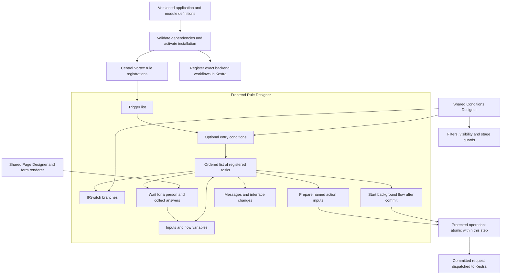
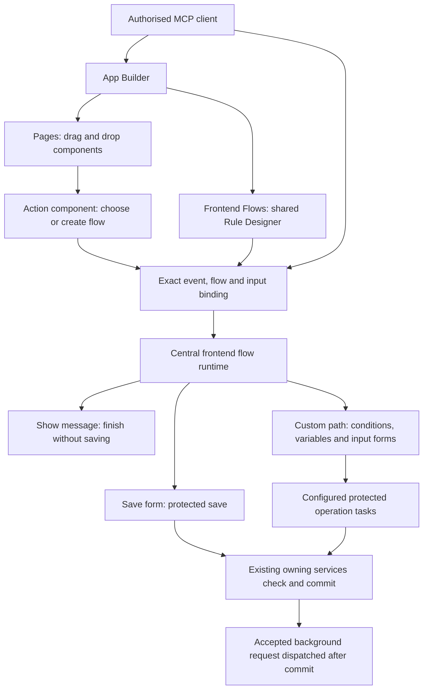
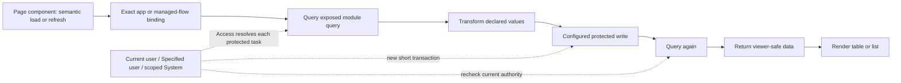
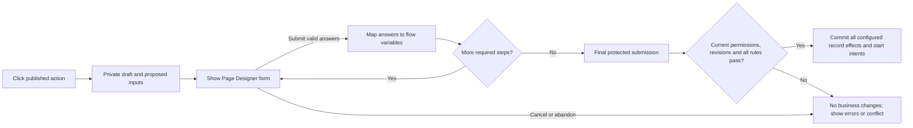

# Frontend Rule Designer

[Specification index](../README.md) · [Forms, actions, rules and events](../08-forms-actions-rules-and-events.md) · [Page builder](page-builder-contracts.md) · [Durable workflows](../09-workflows-and-pipelines.md)

## Purpose

One Frontend Rule Designer authors immediate rules and interactive action journeys from triggers, conditions and registered tasks in the one flow language. The Conditions Designer and Page Designer are reused components, not competing rule or form engines. Business-specific behaviour lives in application definitions.

This specification incorporates the owner's September 2026 designer, variables, packaged-installation and custom-form decisions. It describes required delivery, not functionality already implemented. The flow contract below replaces the earlier single-effect contract and the separate node-and-edge representations throughout current definitions and consumers. The approved component read/write and task-identity decisions supersede the earlier single-commit and automatic-trigger restrictions; this document specifies target behaviour, not delivered execution.

## Composition

Central means one generic runtime and catalogue, not one unscoped global list. A registration always identifies the organisation, application installation, exact application/module release and contained rule identity. Two applications with the same label never share a registration accidentally.

## One flow language

Save rules, named-action bodies, screen flows and background workflows are one authored artefact: a **flow**. The flow language has the same shape as a [Kestra flow](../09-workflows-and-pipelines.md): identity, labels, inputs, variables, triggers, an ordered task list, outputs, error and finally handlers, and execution settings. Execution kind selects where a flow runs, not a different language, canvas, catalogue or runtime. There is one task catalogue, one validator and one publication path for every flow.

### Flow shape

Every flow declares:

| Field                       | Meaning                                                                                                              |
| --------------------------- | -------------------------------------------------------------------------------------------------------------------- |
| Identifier and key          | Permanent identity plus a stable, human-readable key. Labels never select or authorise a flow.                       |
| Owner                       | The application or module that owns the flow, and the exact release it belongs to.                                   |
| Description and labels      | Authored documentation and diagnostics only.                                                                         |
| Execution kind              | `interactive`, `transaction` or `durable`.                                                                           |
| Run as                      | Default identity binding; a task may inherit it or override it within its declared support.                          |
| Invocation permission       | The permission checked before the flow may start.                                                                    |
| Inputs                      | Named, typed, required or optional values supplied by the trigger or caller.                                         |
| Variables                   | Named, typed flow values with optional defaults.                                                                     |
| Triggers                    | One or more typed triggers that start the flow, each with an optional entry condition and duplicate-protection rule. |
| Tasks                       | An ordered list of tasks, including the control tasks below.                                                         |
| Outputs                     | Named, typed values a completed flow exposes to its caller.                                                          |
| Error and finally handlers  | Tasks that run when the flow fails and after the flow ends, in either case.                                          |
| Retry, timeout, concurrency | Execution policy for the flow and its tasks.                                                                         |

Control tasks give the ordered list its structure without a free node-and-edge graph:

- **If** — two declared branches on a typed condition.
- **Switch** — a bounded multi-way choice on one typed value.
- **For each** — bounded iteration over a declared collection.
- **Sequential** — an ordered group of tasks run one after another.
- **Run flow** — invoke another flow as an explicit nested call.
- **Wait for a person** — pause for a form response without holding a database transaction open.
- **Wait until** — resume at a declared time or date-time value.
- **Stop** — end the flow with a declared outcome.

The visual editor may draw tasks and their connections, but position and wiring are presentation only: the authored task order, branches and declared outcomes determine execution. No author draws a free graph and no second editable trigger or condition graph exists.

### Execution kinds and task placement

| Execution kind | Where it runs                                  | Guarantees                                                                                                                                                              |
| -------------- | ---------------------------------------------- | ----------------------------------------------------------------------------------------------------------------------------------------------------------------------- |
| Interactive    | The central flow runtime, with protected steps | A configured sequence of pure, query, form and changing tasks; each protected step uses its owning service; no browser authority and no open transaction across waits.  |
| Transaction    | Inside the owning record transaction           | The transaction-safe subset only: no human wait, network I/O, identity switching or nested independent commit.                                                          |
| Durable        | Kestra                                         | Long-running retries, schedules, cross-session recovery and assigned human work.                                                                                        |

Every task type declares where it may run — **browser**, **inside the owning record transaction**, **protected server step** or **durable Kestra** — and its effect category (pure, read, change, durable-start or interactive). Publication refuses a flow that puts a task where it cannot run. A flow changes execution kind only through an explicit **Run flow** task, which invokes another flow with its own declared execution kind, or a **Start background flow** task, which starts a durable flow; it never migrates silently. [Durable workflows](../09-workflows-and-pipelines.md) use this same task catalogue rather than a second language or catalogue.

### Closed reference syntax

A flow reads values with one closed reference syntax:

- `{{ inputs.x }}` — a declared flow input.
- `{{ vars.x }}` — a declared flow variable.
- `{{ trigger.record.field }}` — a field on the triggering record.
- `{{ trigger.previous.field }}` — the previous value of a field on the triggering record.
- `{{ outputs.task.key }}` — a declared output of an earlier task.
- `{{ execution.actor }}` — the verified execution actor.
- `{{ execution.now }}` — the execution time.

No functions, filters, arithmetic, scripts or code are allowed; the syntax resolves only declared names and returns a typed value. Protected values and secrets never enter this syntax and resolve only through the existing protected connection bindings. A reference to an undeclared name, a task that cannot precede the reader or an incompatible type fails publication rather than evaluating to an empty or false value.

### Runtime package placement

Keep the deterministic task interpreter and typed task intents/outcomes in shared Rule (tier 1), with no server-service imports or generic service callback registry. The existing App package (tier 8) owns this task's headless server orchestrator and calls lower-tier public Query, Record, Access and Workflow APIs. Record save flows call only Rule's pure transaction-safe subset, never App. Page (tier 9) and the sole web composition root consume typed pause/presentation intents and supply the protected form-continuation adapter in [#68](https://github.com/Abzum-NZ/Abzum-Vortex/issues/68); App must not import Page or hide an upward dependency in a callback. The server adapter validates continuation evidence before resuming; caller JSON is not trusted continuation authority. [#64](https://github.com/Abzum-NZ/Abzum-Vortex/issues/64) adds later UI/installation consumers, not a prerequisite for this headless adapter. No new service package or weakened boundary rule.

A trigger does not itself make a flow read-only. Page/component load, field change, selection, refresh and manual actions may run configured changing tasks. Pure feedback is a deliberately effect-free evaluation context, not a prohibition on configuring a separate effectful flow for the same semantic event. Before-save flows retain the strict transaction-safe subset. Tasks declare their effect category and supported execution kinds; the designer explains unavailable combinations.

Vortex coordinates short steps and may await protected queries/operations without blocking the browser. Human input pauses the execution, not a database transaction. Long-running retries, scheduled work, cross-session autonomous recovery and assigned human work use the durable execution kind and the same task catalogue, not a separate frontend or background engine.

## Pages compose; flows define actions

Every user-facing application action has a Frontend Flow binding: standard record commands, custom record actions, toolbar/menu/row commands, action buttons and form submission. Data components also bind a flow that returns their declared data result. Application-owned flows belong to the application; platform-managed flows are exact versioned catalogue dependencies with separate use/edit permissions. Module-owned queries, rules and protected operations remain reusable dependencies. Pages store layout, data/form context and typed event-to-flow bindings, not executable business behaviour or label-selected handlers.

### Configure a component without leaving the App Builder

1. Drop an action component and open its **Action** inspector. Choose a quick action (Save form, Show message, Navigate or an eligible named action), **Create flow**, or **Use existing flow**. The page inspector opens the same Frontend Rule Designer with the current context, and returns to the selected component afterward.
2. A Submit button dropped into one explicitly bound form may receive a generated one-task **Save form** flow by default. Show the exact target form and operation immediately. A generic button or an ambiguous/unbound form requires configuration; never silently save the nearest or first form. Allow an unfinished draft, but refuse publication of an action missing its required binding.
3. A generated default is a real application-owned flow with a permanent identity and editable task settings. One ordered task with its trigger and terminal outcome is supplied automatically; authors do not have to draw a graph. Defaults are created only during authoring, never during rendering or execution. They do not need an artificial record, background run or extra approval.
4. Selecting or replacing a flow validates the supplied record/selection/form context and typed inputs. Pure feedback/preview cannot execute effectful tasks, while declared component and interactive execution can. Reusing a flow is deliberate; show its linked controls before editing shared behaviour, and offer an explicit copy for an independent variant. Duplicating a component preserves its flow reference and reports that reuse rather than secretly creating different behaviour.
5. Pages, bindings and flows use the existing application draft revision and publish/activate together. Renaming a label preserves identity. Missing/deleted flows, incompatible inputs, missing form/operation targets and unresolved task versions prevent publication. Withdrawal or replacement cannot leave a hidden working fallback. Current definitions use explicit flow bindings throughout; remove obsolete direct-binding readers and conversions.

The form declares one default submit binding. Clicking its Submit button, pressing Enter and using a supported Save shortcut invoke that same binding once; a click handler plus a native submit event must not start it twice. Other buttons have explicit separate bindings and are not implicit form submits. Record gestures such as a board-card move or inline-edit commit also enter their declared action flow, with typed source/target context. Cancelling a journey before its first protected commit leaves business data unchanged; after a confirmed commit, Cancel cannot claim to undo it.

This rule covers configurable action entry points, not browser primitives. Typing into an input, tabbing focus, opening native selection choices, layout and rendering do not require one new flow per keystroke. Their registered behaviour remains generic; any configured reaction uses the declared trigger. Existing navigation and view-control descriptors can provide a one-task flow binding without bespoke page handlers. Query execution, transport, backend service internals and infrastructure maintenance are not wrapped in recursive frontend flows.

### Saving is a task, not hidden page behaviour

**Save form** maps the exact bound draft to its declared protected operation. It is an ordinary configurable task, not another save executor. A flow may finish without any business write or may contain several Query records, Save form, Run action and Start background flow tasks. Each changing task commits or refuses its own supported bounded operation; later tasks may read, write, collect input or return results as configured. Earlier commits are not rolled back by later failure or Cancel. A supported atomic operation can group its own bounded record effects; there is no implicit whole-flow transaction.

The server must re-evaluate mandatory required answers, conditions, validation and authority through every permitted invocation path, including web, MCP, programmable interfaces and durable callers. Presentation-only conditions are not security policies. Configuring a required business condition must attach it to the protected operation/save rules or the required server-validated action entry, not merely to a button. Another button or a raw save/action call cannot evade a requirement by choosing an easier flow or claiming its gates passed. Conversely, showing a popup need not manufacture a database transaction.

The flow runtime orchestrates registered tasks; Record (including named actions), Query, Access, Definition and Workflow services still own their protected operations. This is one configurable action route over those services, not a universal service that replaces them. The lower-level [named-operation task](https://github.com/Abzum-NZ/Abzum-Vortex/issues/50) precedes the [rule runtime](https://github.com/Abzum-NZ/Abzum-Vortex/issues/58); it does not acquire a reverse dependency just because the later UI supplies a flow entry point.

### MCP app authoring and invocation

The same [governed MCP capabilities](../12-connections-and-interfaces.md#governed-mcp-access) must allow an authorised builder to create an application, configure its module dependencies, compose pages, add components, create/select/copy/link flows, edit triggers/conditions/tasks/variables and form mappings, inspect validation and reference usage, preview, publish and install. Use existing Definition operations and revisions with stable semantic identities; do not generate a separate tool for every button or task. Preview is simulated and cannot submit business data. The external agent supplies no runtime code or privileged permission evidence.

At runtime the MCP client invokes the same published action binding and receives the same form requests, permitted fields, messages, validation and final outcomes. A headless client can receive a popup's structured message without an open browser; moving an actual interface still requires the existing explicit session pairing. Required user decisions and confirmations remain required. No embedded model, assistant or second action executor is introduced.

## Component data flows

This is one possible configuration, not a required sequence. The default can use only Query and Return data. Protected operations remain in their existing services, with no transaction spanning the whole diagram.

Dropping a Records DataTable/ListView or another data component opens a **Data flow** inspector. Select a managed flow or create an application flow; choose the module's exposed query and map declared inputs and returned columns. The simple default is Start → Query records → Return data. Authors may add transformation, condition and changing tasks, including Query → Write → Query again → Return data. Each is a configurable task in the same designer; data loading is not a separate execution engine or universally read-only mode.

A module-exposed query has permanent identity, module release, declared typed parameters, allowed fields/filter/sort/group capabilities and a typed bounded result. This is an explicit versioned extension of the existing [query contract](../10-queries-reports-search.md#query-contract), not raw SQL or a query selected by label. The application resolves it through its exact installed module binding. Keep named reusable query definitions distinct from a person's saved view; both reuse Query, not competing read engines.

Query tasks delegate to Query with the verified effective actor. Filtering, sorting, grouping, totals and pagination apply before returning a bounded page. Transform tasks can project or derive values from permitted input fields; they cannot forge record identities, source markers, capabilities, revision evidence or pagination tokens. Dataset-wide changes to row membership/order/totals belong in the query, not a transform of one returned page. Display-derived columns are not editable source fields without an explicit write mapping. Shared-source restrictions remain unchanged.

Return data validates the component's expected schema, rows, safe capabilities, paging and source context. It rechecks the viewer's access independently of execution identity. A new query after writes returns fresh values; returning the earlier snapshot is explicitly labelled and cannot appear as current saved data. Errors, permission refusal and partial flow failure are distinct from an empty table.

Load, explicit refresh, filter, sort, paging and relevant-input changes have exact semantic trigger bindings. Renders, speculative prefetch, retries and cache reads never start writes. A safe default flow only reads, but published configuration may add writes on those events. The builder previews this effect summary; this is not another approval gate. A deliberate refresh is a new invocation and may write again. A write's own invalidation refreshes affected read results without recursively rerunning its originating write path. Explicit same-cause re-entry is refused; changed filter/selection discards stale display responses while preserving confirmed write outcomes. Do not invent a global polling or orchestration service.

## Managed and application-owned flows

| Definition                      | Who can configure it                                                                                                                    | Runtime meaning                                                   |
| ------------------------------- | --------------------------------------------------------------------------------------------------------------------------------------- | ----------------------------------------------------------------- |
| Application-owned flow          | Authorised application editors                                                                                                          | Exact app release, normal task validation and grants              |
| Published platform-managed flow | Customer authors can select it and change declared public parameters/extension slots only; protected platform editors control internals | Exact immutable catalogue version; no automatic privilege         |
| Platform-internal flow          | Only holders of the explicit platform discovery/edit/use capabilities                                                                   | Not exposed in customer picker, package contents or MCP catalogue |

“Super Administrator” is a role carrying protected capabilities, not a hardcoded role-name check or universal tenant bypass. Flow-use, definition-read, definition-edit and task-execution permissions are separate. Enforce locks in Definition/publication/service boundaries, not just a disabled editor. Public metadata exposes only declared inputs/outputs and safe descriptions, not hidden flow internals.

Managed flows require a versioned extension of the existing exact platform dependency/version mechanism; the current code does not yet implement managed-flow definitions. Do not add a new publication root or independently mutable global runtime list. A locked version may declare typed, effect-limited extension slots. Customer tasks at those slots are validated into the server's one resolved task list at publication; client projections still omit protected internals. No arbitrary runtime child-flow calls or inheritance framework is needed. Copying/exporting/restore cannot unlock private definitions, broaden an extension or retain authority grants. Platform updates create new immutable versions; existing consumers remain pinned until normal upgrade. Business-specific policy remains ordinary application definitions, not locked platform code.

## Node execution identity

This section describes target runtime behaviour. Current-person execution uses the initiating person's protected request context. [#322](https://github.com/Abzum-NZ/Abzum-Vortex/issues/322) later implements Access-owned binding, per-task resolution and viewer-safe handoff for specified and System actors. Actual row/field/derived/file/component/MCP integration remains in the downstream owning tasks; it does not make the identity foundation depend on the later flow engine.

A flow declares its default **Run as** binding; each applicable task may inherit or override it. The default is Current user.

| Mode           | Resolution and authority                                                                                                                                                |
| -------------- | ----------------------------------------------------------------------------------------------------------------------------------------------------------------------- |
| Current user   | Original verified initiating organisation account, never the actor of the preceding overridden task                                                                     |
| Specified user | Exact active organisation account plus current, explicit execution delegation for this flow/task/operation and allowed input scope                                      |
| System         | Registered system actor with explicitly granted organisation/application/operation scope; never a database service-role credential or unrestricted global administrator |

A system-started flow without a human initiator must declare an eligible system binding; Current user cannot invent one. Pure browser presentation tasks operate in the viewer's interface and gain no authority from an override. Any query/change under another identity executes server-side through its owning service. Actor identity comes from trusted bindings, not a UUID, actor object or flag submitted by the client.

Authoring a run-as reference does not grant its use. Execution delegation is distinct from existing role-management delegation. Access owns explicit grant/register/replace/revoke operations with current scope, beneficiary/eligible invokers, target actor, exact installation/release/task/operation, permitted resource/input bounds and optional expiry. A delegator must hold explicit authority to grant that scope; customer app editors cannot turn an edit into impersonation or system power. Resolve permanent IDs rather than labels. Use existing revision checks and Access-version invalidation; expired/revoked/disabled/wrong-scope actors fail without fallback. Broadened definitions require fresh bounded authorization; install/copy/rollback never manufactures or revives a grant.

At each protected task, check permission to invoke the published flow, current execution delegation/system capability, effective actor's current operation access, exact task inputs and record revisions. Authorized delegation intentionally permits an operation the initiator could not perform directly, but only within that explicit scope. It never supplies a human-only approval, PIM activation or recent authentication belonging to someone else. Non-delegable operations remain non-delegable. Keep the owning operation's Activity entry under its effective actor. When an initiating organisation account exists, link its content-free delegation-use Activity entry through existing correlation, retaining exact flow release/task and safe outcome. A system-started flow records its actual verified System actor and cause, never an invented human account. Reuse the existing Activity append contract rather than widening its envelope or creating another history store.

Each identity-changing protected task starts a new, separately Access-resolved short transaction. Never mutate or reuse the preceding human transaction context, accept a caller-created trusted context, or upgrade its locks. Current lifecycle, grant and permission checks happen within the owning operation's supported transaction boundary. The headless [scoped execution-identity task](https://github.com/Abzum-NZ/Abzum-Vortex/issues/322) owns this authority; [typed bindings](https://github.com/Abzum-NZ/Abzum-Vortex/issues/250) describe references without granting them.

Execution access is not display access. Keep privileged intermediate values server-side and return only permitted projections or safe operation receipts. Recheck row/field access for the actual viewer before any table, form, message, error, branch outcome, count, derived value, export or MCP response can expose it. Do not send an unrestricted result to the browser and mask it afterward. The same restriction prevents a transformation/write to a viewer-readable field from laundering protected inputs; reject unsafe mappings or require an existing explicitly authorised disclosure operation. No silent declassification or cross-organisation authority switch.

## Triggers

Every flow has a list of declared triggers, each with an optional entry condition and a stable priority. Reuse a definition with explicit bindings when more than one event should start the same behaviour. Do not maintain hidden event listeners outside the published definition.

| Trigger family       | Configurable events                                                                | Behaviour                                                                                                                                                                  |
| -------------------- | ---------------------------------------------------------------------------------- | -------------------------------------------------------------------------------------------------------------------------------------------------------------------------- |
| Manual               | Named button, menu command, row action or selected-record action                   | Start a permitted interactive journey. Selection is a typed, bounded list, never a comma-separated string or an implicit first record.                                     |
| Page/form lifecycle  | Page ready, form ready, form reset                                                 | Run the configured tasks once for the semantic event; rendering again is not another start.                                                                                |
| Input                | Selected field value changed; field left                                           | Re-evaluate using typed draft values. “Changed” means a value change, not every render or key press.                                                                       |
| Condition transition | A condition becomes true or becomes false after its declared watched values change | Compare before/after values. Initial evaluation is explicit; the default does not treat an already-true initial value as a transition.                                     |
| Before submission    | Before save, or before the selected named action                                   | One server-authoritative validation/adjustment phase; creation/update and the selected action can be distinguished. Collect additional answers before entering this phase. |
| Submission result    | Save/action succeeded, refused or failed                                           | Follow the published outcome, preserving previous committed results and preventing same-cause re-entry.                                                                    |
| View controls        | Row/selection changed, tab changed, guided step changed, filter applied/cleared    | React only to the named semantic control. Do not depend on DOM selectors.                                                                                                  |

Before-save does not cover deletion, restoration, link/unlink, reassignment or state transitions by inference. Bind before-action to the exact supported published operation; use confirmed operation results for UI feedback and the [seven committed record events](../08-forms-actions-rules-and-events.md#events) for durable reactions. The owning operation must enforce its own permissions and rules for web, MCP and interfaces alike.

“Field matches value” is a condition, not a continuously running watcher. Requirements and visibility evaluate on relevant changes, including initial state. A one-off reaction uses becomes-true/becomes-false. Time passing alone is not a frontend trigger; use a schedule. Effectful reactions run only on the exact configured semantic event, not each render, mount retry or implicit cache read.

Publication checks every task against its declared execution kinds and effect category. Component/interactive flows may execute configured reads and changes; pure feedback/preview never executes effects. Before-save/before-action flows retain the transaction-safe subset and cannot Wait for a person, switch execution identity or start an independent transaction. Result-triggered flows may perform explicitly configured follow-up work, but cannot recursively restart the same cause chain. A misplaced task, unknown task or invalid reference fails before execution rather than being skipped.

## Shared Conditions Designer

Use one field → comparison → value editor with nested **All / Any / Not** groups and a readable sentence preview. Reuse it for start gates, If/Switch branches, list filters, field visibility, validation, record visibility and pipeline guards. It serializes the Vortex typed condition contract, not a library query string.

The host supplies the allowed fields, operands and operators. A list filter does not receive transient flow variables or previous form values; an access condition never accepts a browser-supplied actor identity. General rules can use declared inputs, run variables, current permitted values and explicitly typed previous values where a previous state exists. Initial creation has no previous record; missing and null are distinct. The rule-contract extension must add any missing previous-value/changed semantics explicitly rather than hiding them in literal JSON.

Operators include typed equality, ordering, ranges, empty/not-empty, membership and appropriate text comparisons. Relationship traversal is only through the already allowed, bounded context. Invalid fields, operands, types or unavailable values are errors, not false values that can become true through Not. Browser and server use the same pure evaluator; query/security evaluation preserves matching database meaning. No JavaScript, PHP, SQL, formula script or library SQL export is accepted as a condition.

## Inputs and flow variables

The UI calls these **Flow variables** to distinguish them from infrastructure environment variables and secrets. They are available throughout one run, not shared between users, runs or applications.

| Value group    | Who supplies it                                        | Rules                                                                                                                                       |
| -------------- | ------------------------------------------------------ | ------------------------------------------------------------------------------------------------------------------------------------------- |
| Inputs         | Published trigger or submitted form                    | Named, typed, required/optional and validated; no undeclared payload keys.                                                                  |
| Context        | Vortex                                                 | Read-only actor, organisation, installation, subject and available before/current values. Client context is never authority.                |
| Flow variables | Defaults, Set variables task or explicit output mapping | Declared name, stable identity, type and optional default. Values may change along the selected path.                                       |
| Task outputs   | A named completed task                                 | Typed outputs; available only where that task has executed.                                                                                 |
| Result         | Completed operation task or flow                       | Safe confirmed/refused/conflict/partial outcome; available only after that task. Flow completion is not evidence that every step committed. |

Support the existing typed value kinds, including bounded lists, structured values and references whose allowed record types are declared. Use a value picker for literals, fields, inputs, variables and previous task outputs. Never require authors to type `$env[...]` or code.

Defaults are evaluated once per run in a deterministic order. Setting a variable validates its type. At a branch merge, a variable needs a default or an assignment on every incoming path before a required read; publication refuses an uninitialised read. An optional value requires an explicit empty check or fallback. There is one active path, no concurrent branches or shared mutable state in the initial task catalogue.

Sensitive values retain their source restrictions; variables are not a way to reveal hidden data or send it to another organisation. Logs and previews redact them. Browser variables never contain provider credentials. Backend handoff maps only declared allowed inputs and permitted references, never the entire variable bag; the event envelope's protected-data restrictions remain. Backend secrets continue to resolve through existing protected connection bindings.

Durable flows retain typed trigger inputs and task outputs. A flow variable passed to Kestra becomes a validated input snapshot, not a live shared variable. The backend's existing Set values/output mechanism is reused; this feature does not introduce mutable environment-wide state in Kestra.

## Task catalogue and extensibility

### All authored behaviour is configured through tasks

Triggers use the flow's trigger list; conditions use If or Switch tasks; forms, field/variable changes, saving, messages, navigation and background starts use their registered tasks. The trigger inspector configures the trigger list and optional entry conditions. Any compiled trigger index is derived from that definition, never a second independently editable trigger or condition. A Stop task or the flow's outputs declare the terminal outcome. Inputs and variable declarations are flow settings; changing their values during execution is a task operation.

Each task exposes readable settings, typed input/value mappings, typed outputs and its supported declared outcomes. An author can add, configure, reorder or remove eligible tasks and choose the route for each declared outcome. Wait for a person exposes validated-answer and Cancel outcomes; Save form exposes confirmed success and safe refusal/conflict outcomes. Registered tasks define which outcomes exist, so an author cannot invent a success outcome or suppress a required check. Task-output values can be mapped to declared flow variables for later steps.

The quick-action inspector is a compact editor for those same task settings. A default Save flow means one Save form task with its trigger and terminal outcome supplied automatically; it is not a separate kind of hardcoded flow. There are no hidden action chains, separate success/error scripts or button-side saves. Continue/Cancel on a displayed form returns through that Wait for a person task's declared outcome in the current flow; the semantic binding identifies that continuation without letting the caller select an arbitrary next task or starting the action twice.

Flexibility comes from task configuration and composition, not bypassing operation guarantees. Authors can branch, collect input, query, transform results and invoke multiple protected operations in their chosen order. Commits occur at changing tasks, never implicitly on page rendering. Add later task kinds through the versioned registration contract below; application authors configure their settings rather than uploading executable code.

| Task                                                    | What it configures                                                            | Where it may run                                                          |
| ------------------------------------------------------- | ----------------------------------------------------------------------------- | ------------------------------------------------------------------------- |
| Start / Stop                                            | Trigger list and terminal outcome                                             | All execution kinds                                                       |
| If / Switch                                             | Shared condition with Yes/No routes, or a bounded multi-way choice            | All execution kinds                                                       |
| For each / Sequential                                   | Bounded iteration or an ordered group of tasks                                | Interactive, durable                                                      |
| Run flow                                                | Invoke another flow, which declares its own execution kind                     | All execution kinds                                                       |
| Start background flow                                   | Exact published durable flow binding and typed input map                      | Interactive, transaction; accepted intent commits before dispatch          |
| Wait for a person                                       | Exact reusable form, defaults, output mappings, Continue/Cancel routes        | Interactive, durable; never inside the owning record transaction           |
| Wait until / Delay                                      | Resume at a declared time or date-time value                                  | Durable                                                                   |
| Query records                                           | Exact module-exposed query, typed parameters, fields, filter/sort/page inputs | Protected server step; interactive or durable                             |
| Transform / Return data                                 | Typed mappings of permitted results and the caller output contract            | Browser and protected server step; no hidden record writes                |
| Set variables / Calculate value                         | Typed mapping or registered pure calculation                                  | All execution kinds; only allowed operands for that kind                  |
| Set field                                               | Proposed draft value or an allowed server candidate-field change              | Interactive, transaction                                                  |
| Require field / Refuse / Warn                           | Conditional requirement, safe refusal or non-refusing validation message      | Owning record transaction and protected server validation                 |
| Create / Change / Soft-delete / Duplicate record        | One bounded record operation with an explicit field-to-value map              | Owning record transaction, protected server step or durable               |
| Add relationship / Copy relationships                   | Explicit published relationship keys                                          | Owning record transaction, protected server step or durable               |
| Run action / Save form                                  | Map typed inputs and invoke one protected operation at this step              | Interactive; commits this operation only                                  |
| Announce event                                          | Declared business event when the save commits                                 | Owning record transaction                                                 |
| Show/hide / Enable/disable                              | Published field or component presentation                                     | Browser only; never changes actual permission                             |
| Show message / Focus field                              | Safe message/location or focus target                                         | Browser only; validation messages have server-safe equivalents            |
| Refresh / Navigate / Open-close panel / Set view filter | Exact permitted semantic target and declared parameters                       | Browser; post-submit uses confirmed results                               |
| Format value / Generate export                          | Registered pure formatter or bounded export                                   | Protected server step, durable                                            |
| Attach file / Move file                                 | Approved file on an attachment field                                          | Protected server step, durable                                            |
| Call connection / Acknowledge message                   | Named connection operation, or the exact verified incoming message            | Durable                                                                   |

Create, update, delete and relationship operations reuse named [actions](../08-forms-actions-rules-and-events.md#actions) and their existing bounded effects. The designer does not acquire direct table-writing tasks. Data selection reuses existing authorised Page/Query bindings; arbitrary searches, raw network calls and unbounded lists are not synchronous calculation tasks. Reusable calculations use the existing registered pure value operations, not a new scripting runtime.

Task registrations declare permanent kind identity/version, typed input/output/settings, declared execution kinds, declared outcomes, effect category (pure/read/change/durable-start/interactive), supported actor modes, renderer and safe error meaning. Implementations ship through reviewed platform releases. Application packages configure tasks but cannot upload implementations or self-declare security capabilities. Unknown, incompatible or misplaced tasks fail publication and installation.

Published flows pin task versions; adding a new kind never silently changes existing flows. There is one catalogue for interactive, transaction and durable tasks: the execution kind and declared placement decide where a task runs, not a separate frontend or background catalogue. Reuse the same task cards, value pickers and Conditions Designer everywhere.

## Custom forms and all-or-nothing submission

**Collect first, commit together is an available pattern, not a global flow restriction.** When an administrator requires all answers before any business change, place all required forms before a supported atomic operation task. Cancel, abandonment or invalid input before that task causes no business effects. In a sequential flow that already committed an earlier task, those earlier effects remain; the interface must say so. A presentation-only journey may collect input and finish without saving.

The repetition in this illustration means a finite configured sequence of forms, not an unbounded loop. Reuse [Page Designer form and guided-form blocks](page-builder-contracts.md#forms-actions-and-semantic-controls), layout, validation, themes, accessibility and semantic controls. The Wait for a person inspector selects or opens that same designer; no embedded second form builder. A reusable input form binds to a declared response schema and can collect values without any record yet existing. Dialog, drawer or inline step are presentation choices. Its Continue validates and returns answers to the journey; business changes occur only at configured protected operation tasks. A form may appear before or after such a task. Label input-only responses Continue rather than implying a saved record.

Private draft persistence is not a committed business record. Reuse the person/organisation/application/form draft boundary and revisions planned in [#68](https://github.com/Abzum-NZ/Abzum-Vortex/issues/68); that runtime is not yet delivered. Do not add a durable rule-run database or keep a request, connection or database transaction open during user input. Resume follows the existing draft policy, exact form/flow version and current access checks. Cancel closes the journey; pending private drafts may be cleared by that existing policy. No automatic final submission on close, timeout or reload.

On final submission the server validates the exact published operation and required typed answers, recomputes the necessary conditions/derived values, checks the actual current actor and record revisions, and then applies the configured bounded effects in one short transaction. A client claim that it executed a task or fulfilled a condition is not evidence. The complete mandatory path must be derivable and validated from the submitted inputs and server-owned context; otherwise publication refuses that definition. Unrelated data changing while a form is open cannot silently change the meaning of the confirmed action: stale affected records return a conflict and a clear refresh/review path.

An atomic operation may affect several permitted records in its owning transaction. A sequential flow may call several operations, but their transactions are separate. Cross-service, cross-organisation and external effects cannot be advertised as one atomic save. Compensation, if supported, is an explicit later protected action, not automatic rollback. Shared-record actions remain entirely source-authoritative under [sharing rules](../04-access-and-permissions.md).

Wait for a person is forbidden inside transaction flows and pure feedback evaluation. In an effectful component/interactive flow it runs at its configured point, without an open server request or database transaction. A form's Continue returns validated answers; a Save form or Run action task determines when records actually change. Required business checks remain enforced by the protected operation for every invocation path.

An upgrade never silently resumes a draft against changed forms. For the initial implementation, refuse stale installation/version submissions and offer restart; preserve only permitted draft values for explicit re-entry. Withdrawing an app or revoking access refuses resume and clears protected UI state. Use the draft revisions and operation duplicate protection to be delivered by [#68](https://github.com/Abzum-NZ/Abzum-Vortex/issues/68) and [#47](https://github.com/Abzum-NZ/Abzum-Vortex/issues/47)/[#50](https://github.com/Abzum-NZ/Abzum-Vortex/issues/50) for simultaneous web/MCP edits and repeated final submissions. Do not invent additional continuity counters.

Long waits, requests assigned to someone else and recoverable business work after submission use the durable [Wait for a person task](../09-workflows-and-pipelines.md#safe-workflow-node-catalogue), reusing the same form renderer. That durable wait can survive sessions; it is not an open transaction either. A Cancel in an input journey never promises to reverse an earlier, separately completed business operation.

## Deterministic execution and failure

The initial interactive flow has one start, explicit terminal outcomes and no unrestricted cycles, recursive calls, parallel paths, polling, timers or unbounded iteration. Stable published flow order governs flows on the same trigger. Publication resolves reads/writes and refuses unordered conflicting writers. A Set field task does not recursively restart its own trigger; dependent calculations use declared order. Invalid flows never partly execute.

Before-save runs once after type/context checks and before final validation and commit. Candidate-field changes are revalidated. Refusals collect safe errors where possible; no branch can clear a mandatory server refusal. In frontend feedback, recompute required/visibility state from the current draft rather than leaving a previous true result stuck on screen.

An unknown task or invalid variable fails safely rather than being skipped. If execution already committed earlier tasks, failure preserves those results and reports partial completion; unexecuted changes remain unapplied. A later display failure cannot report rollback or resubmit completed writes. Discard obsolete display responses without pretending that a committed write was cancelled. Refresh only affected components and remove refused data before animation.

Do not automatically restart an entire changing flow after failure. Reuse the operation duplicate-protection and outcome receipts planned in [#47](https://github.com/Abzum-NZ/Abzum-Vortex/issues/47)/[#50](https://github.com/Abzum-NZ/Abzum-Vortex/issues/50) with a stable, server-validated invocation/task identity, bound to exact release, inputs and effective actor. Same-step retries recover its result, not another write; changing inputs is a new intentional invocation. Dependent steps advance only from verified prior outcomes or server-recomputed required paths, never a caller's claimed executed-task list. Reuse private draft continuations and operation receipts, adding only the required typed linkage in the owning tasks, not a parallel event store or durable scheduler. If an earlier outcome is uncertain, reconcile it before continuing. Structural bounds protect termination; performance measurements alone do not block releases.

## Kestra integration decision

Per-task Run as applies to the task that accepts a durable start. The dispatched durable flow keeps its existing versioned flow-wide initiating-person/System semantics and protected Vortex operation checks. This change does not silently add specified-user/per-task authority to old durable flow definitions.

Keep immediate evaluation in Vortex, not Kestra. [Kestra's synchronous API](https://kestra.io/docs/how-to-guides/synchronous-executions-api) can wait for execution results, but that does not establish bounded latency on our installation or share Vortex's save transaction. No hosted latency benchmark was performed for this decision. Correctness, offline draft feedback and availability—not a claim that Kestra is slow—determine the boundary.

Use Start background workflow through Vortex's protected Workflow operation. Its accepted intent commits at that configured step, optionally with the same owning atomic operation's record effects; dispatch calls Kestra afterward. A later frontend failure does not revoke an already accepted start. Report accepted/pending separately from running/completed. No browser credentials, provider namespace or arbitrary flow ID is exposed. See [durable handoff](../08-forms-actions-rules-and-events.md#starting-durable-work).

The current action/subject-bound trigger remains supported. Explicit typed input maps and record-free starts require the versioned bindings owned by [#250](https://github.com/Abzum-NZ/Abzum-Vortex/issues/250), with validation/execution completed by [#76](https://github.com/Abzum-NZ/Abzum-Vortex/issues/76), [#77](https://github.com/Abzum-NZ/Abzum-Vortex/issues/77) and [#78](https://github.com/Abzum-NZ/Abzum-Vortex/issues/78). This decision approves that bounded contract extension, not widening unrelated event, interface or child triggers. Do not fabricate a record to start record-free work.

## Package registration, publication and upgrades

Modules own reusable subject-record rules; applications own page interactions, action journeys, forms and durable workflows. Application publication resolves the exact module rules plus application rules, action bindings, forms, queries, task versions, flow references and declared input/output maps. Missing or incompatible dependencies refuse publication. The authoring canvas is not needed to execute installed definitions.

1. Validate the complete immutable application candidate and its resolved dependencies. Save and publish alone do not change active registrations.
2. Prepare Vortex rule bindings for that installation. No browser render registers a live rule.
3. When the application includes durable workflows, prepare and verify their exact inactive versions using the existing Kestra adapter.
4. Activate the exact Vortex installation and its rule/operation registrations together. Invalidate readers using the existing installation revision; permission changes follow existing Access-version rules, not a new rule counter.
5. Reconcile durable schedules as specified in [workflow installation](../09-workflows-and-pipelines.md#installation-registration-and-activation).

Retries converge; a failed upgrade leaves the prior active installation and rules intact. Only one active rule binding exists for each exact installation/event/rule; duplicate module imports do not double-run it. Shared module definitions still bind independently to each consuming application context. Rollback selects a verified retained release through normal activation. Withdrawal disables new rule invocations and starts without deleting records or history. Already accepted durable work retains its recorded version and documented withdrawal policy; it is not governed by the stricter restart rule for an unsubmitted interactive draft.

There is no distributed database transaction with Kestra. Prepared provider flows cannot execute application effects before Vortex activation. No per-app engine deployment or Kestra restart is required. Package/gallery installs reuse this path rather than creating another registry.

## Designer experience and package choice

| Component              | Selected approach                                                                                                                                        | Reason and boundary                                                                                                                                                                         |
| ---------------------- | -------------------------------------------------------------------------------------------------------------------------------------------------------- | ------------------------------------------------------------------------------------------------------------------------------------------------------------------------------------------- |
| Flow canvas            | `@xyflow/react` (React Flow), with selected [React Flow UI components](https://reactflow.dev/learn/tutorials/getting-started-with-react-flow-components) | Existing task/connection interaction and shadcn-based cards; Vortex still owns execution and its flow contract.                                                                            |
| Conditions Designer    | `react-querybuilder` with its official [shadcn registry](https://react-querybuilder.js.org/docs/compat#shadcnui)                                         | Reuse grouped condition editing with Vortex field/operator/value controls. One adapter maps to the single Vortex condition tree; no SQL export or package evaluator becomes authority. |
| Custom input forms     | Existing Puck-backed Page Designer adapter and registered form renderer                                                                                  | One reusable layout/input/validation system, with form-response bindings rather than another form product.                                                                                  |
| Alternative considered | [Rete.js](https://retejs.org/docs/concepts/engine/)                                                                                                      | Offers dataflow/control-flow engines; not selected because Vortex already owns its execution semantics and needs a canvas, not an additional engine.                                        |

Follow current official package APIs and pin compatible versions in the lockfile when implementation begins. No packages are installed by this specification change. Implement reversible task mapping and context-restricted operators in the conditions UI; represent unsupported package behaviour explicitly rather than silently changing Vortex semantics. Keep editor-specific positions and selection state separate from execution meaning. React Flow and Puck data are private adapter representations, not public contracts.

The Next.js editor is an interactive client component inside the existing application shell; server-owned authority and credentials stay outside it. Reuse existing shadcn components and motion tokens. Load heavy canvas code only when the designer is opened, following [Next.js lazy loading](https://nextjs.org/docs/app/guides/lazy-loading).

The default editor shows a searchable eligible-task palette, a readable ordered task list and a single selected-task inspector. A Variables panel lists type, default and where a value is set/used. Tasks show plain-language summaries and labelled branch outcomes. Offer Add next step and keyboard editing, not drag-only operation; undo/redo operates on the application draft. Show required configuration errors at the task and exact field. Test mode accepts sample inputs, shows the chosen path and safe variable changes, and never writes records or starts real workflows. Test forms use the same renderer. No database identifiers or code expressions are required in ordinary authoring.

Keep the [application-wide navigation](../07-applications-pages-and-themes.md) visible at the far left, followed by the task palette, central flow canvas and right-hand inspector. Users can drag tasks onto the canvas and connect labelled outcomes, with equivalent click and keyboard operations. Task position and wiring affect presentation only; the authored order, branches and declared outcomes determine execution. Editing a page's linked flow retains the application context and provides a return to the originating component. The [HTML prototype checkpoint](../../prototypes/app-designer/README.md) demonstrates this arrangement without claiming a production engine or authenticated MCP server.

The [Redoo Start reference](https://documentation.redoo.support/redoo-networks-manuals/workflow-designer-en/workflow-actions/start/) and supplied screenshots informed trigger setup, grouped conditions and output mappings. Its [User Interaction reference](https://documentation.redoo.support/redoo-networks-manuals/workflow-designer-en/workflow-actions/user-interaction/) informed form reuse. Vortex does not copy its code-based expressions, business-specific tasks, implicit first-record selection or condition-bypass options.

## Current contracts and delivery

The first executable flow profile is `before_save`, delivered through an explicit
Module source/validation pair `3.0.0` and the shared versioned flow type. Its
complete task catalogue is Start, If, Set variables, Set field, Require
field, Warn, Refuse/Stop and outputs. Complete this profile's definitions, fixtures and
publication/read/restore path before its interpreter. Subsequent profiles extend
the same flow contract and engine as their owning adapters become available;
the full catalogue specified above remains required, not silently narrowed.
Current flows use one explicit representation; obsolete single-effect readers and conversion paths are removed. See the
[bounded delivery plan](../../build-plan/issue-58-shared-rule-graph-foundation.md).

Applicable before-save flows run in ascending priority, with permanent rule ID
as the canonical lexical tie-break. Each receives the preceding candidate;
requirements and warnings accumulate. A refusal stops the sequence with no
applicable write patch. The shared Rule entry point owns this order, rather than
each caller inventing its own order.

Require-field checks are returned to Record and evaluated against the final
candidate after owning generators, not while traversing that task. Initial
typed decoding must let later tasks supply required values or correct an
intermediate value that is outside a field's configured policy. The complete
final candidate must still satisfy all owning field and access rules before any
write. See the [save sequence](../06-records-and-lifecycle.md#save-sequence).

Module-exposed query contracts and their complete Definition lifecycle belong to [#54](https://github.com/Abzum-NZ/Abzum-Vortex/issues/54). Headless component, managed-flow and actor-binding descriptors belong to [#250](https://github.com/Abzum-NZ/Abzum-Vortex/issues/250). Early current-person flow execution consumes the query and binding contracts and the existing protected request context. Private specified/System execution grants and trusted actor resolution belong to [#322](https://github.com/Abzum-NZ/Abzum-Vortex/issues/322), a prerequisite only for the later delegated execution functionality. Flow execution uses the owning Query and Access engines throughout.

The current flow representation replaces the obsolete single-effect shape. [#58](https://github.com/Abzum-NZ/Abzum-Vortex/issues/58) owns the explicit versioned flow source/canonical schema extension, compiler, task catalogue validation and headless execution; [#57](https://github.com/Abzum-NZ/Abzum-Vortex/issues/57) owns shared condition extensions. [#250](https://github.com/Abzum-NZ/Abzum-Vortex/issues/250) owns form-response, journey submission and workflow-operation binding contracts. Use existing Definition source/validation version selection; do not infer flow support from JSON shape or invent a parallel version store.

A flow declares permanent identity, owner/subject context, exact contract version, description and labels, execution kind, run-as, invocation permission, typed input and variable declarations, a trigger list, an ordered task list, typed outputs, error and finally handlers, and retry, timeout and concurrency settings. Each task declares its catalogue kind/version and typed configuration/value maps. Referenced actions, forms, query bindings, flows and task kinds participate in the existing dependency manifest, reference validation and version-impact comparison. New semantics must be carried through authored source, canonical output, publication, persistence, reads, restore and fixtures together.

Current draft editing, publication and execution use the same declared flow contract. Update checked-in definitions and consumers together; no legacy read adapter or format conversion is required.

## Acceptance and delivery coverage

Component data execution supports Query/Transform/Write/Query/Return, viewer-safe outputs/cursors, no render/prefetch effects and no self-invalidation loops through [#54](https://github.com/Abzum-NZ/Abzum-Vortex/issues/54), [#58](https://github.com/Abzum-NZ/Abzum-Vortex/issues/58) and [#67](https://github.com/Abzum-NZ/Abzum-Vortex/issues/67). Later execution identity implementation in [#322](https://github.com/Abzum-NZ/Abzum-Vortex/issues/322) covers exact current/specified/System scope, concurrent revocation/use, no fallback and initiator/effective-actor activity. The managed-flow extension of [#73](https://github.com/Abzum-NZ/Abzum-Vortex/issues/73) and [#112](https://github.com/Abzum-NZ/Abzum-Vortex/issues/112) implements managed-flow versioning and locks without copied grants; it does not block early application publication. General flows ensure earlier commits survive a later refusal or Cancel.

| Functionality                                                                                                                                                                                                                  | Owning tasks                                                                                                                                                                                                                                 |
| ---------------------------------------------------------------------------------------------------------------------------------------------------------------------------------------------------------------------- | -------------------------------------------------------------------------------------------------------------------------------------------------------------------------------------------------------------------------------------------- |
| Condition parity; initial true vs becomes true; null vs missing; illegal context operands; no script execution                                                                                                         | [#57](https://github.com/Abzum-NZ/Abzum-Vortex/issues/57), [#58](https://github.com/Abzum-NZ/Abzum-Vortex/issues/58)                                                                                                                         |
| All task schemas and dependency references; flow order and bounded-iteration refusal; variable defaults/types/branch assignment; no cross-run leakage; one current flow representation                                        | [#58](https://github.com/Abzum-NZ/Abzum-Vortex/issues/58)                                                                                                                                                                                    |
| Before-save refusals and field changes; all-or-nothing final operation; direct API/MCP cannot bypass required answers or rules                                                                                         | [#47](https://github.com/Abzum-NZ/Abzum-Vortex/issues/47), [#50](https://github.com/Abzum-NZ/Abzum-Vortex/issues/50), [#58](https://github.com/Abzum-NZ/Abzum-Vortex/issues/58)                                                              |
| Form without an existing record; several required forms; defaults/output maps; collect-first Cancel leaves no business effects; sequential Cancel preserves earlier commits; stale/duplicate submission; same renderer | [#250](https://github.com/Abzum-NZ/Abzum-Vortex/issues/250), [#65](https://github.com/Abzum-NZ/Abzum-Vortex/issues/65), [#68](https://github.com/Abzum-NZ/Abzum-Vortex/issues/68)                                                            |
| Registration on install; no run on publish; duplicate imports; same-name apps; failed upgrade, rollback and withdrawal                                                                                                 | [#64](https://github.com/Abzum-NZ/Abzum-Vortex/issues/64), [#76](https://github.com/Abzum-NZ/Abzum-Vortex/issues/76), [#112](https://github.com/Abzum-NZ/Abzum-Vortex/issues/112)                                                            |
| Typed variable handoff; no call before commit; pending during outage; exact accepted version preserved; record-free path has explicit contract                                                                         | [#76](https://github.com/Abzum-NZ/Abzum-Vortex/issues/76), [#77](https://github.com/Abzum-NZ/Abzum-Vortex/issues/77), [#78](https://github.com/Abzum-NZ/Abzum-Vortex/issues/78)                                                              |
| Durable request_form versus interactive Show form; safe assigned response and draft reuse                                                                                                                              | [#81](https://github.com/Abzum-NZ/Abzum-Vortex/issues/81), [#83](https://github.com/Abzum-NZ/Abzum-Vortex/issues/83)                                                                                                                         |
| Accessible editor, simulated preview trace, scoped refresh, stale response removal and same controls through MCP, including form Continue/Cancel/Submit                                                                             | [#59](https://github.com/Abzum-NZ/Abzum-Vortex/issues/59), [#64](https://github.com/Abzum-NZ/Abzum-Vortex/issues/64), [#68](https://github.com/Abzum-NZ/Abzum-Vortex/issues/68), [#200](https://github.com/Abzum-NZ/Abzum-Vortex/issues/200) |
| Complete declared flows in definition-driven examples, with no business-specific core branches                                                                                                                     | [#74](https://github.com/Abzum-NZ/Abzum-Vortex/issues/74), [#251](https://github.com/Abzum-NZ/Abzum-Vortex/issues/251) and their later capability owners                                                                                                                                                                                  |

The [delivery plan](../../build-plan/frontend-rule-designer.md) records the dependency order and exact issue updates. This feature does not pre-empt unfinished Access work or require infrastructure maintenance.
