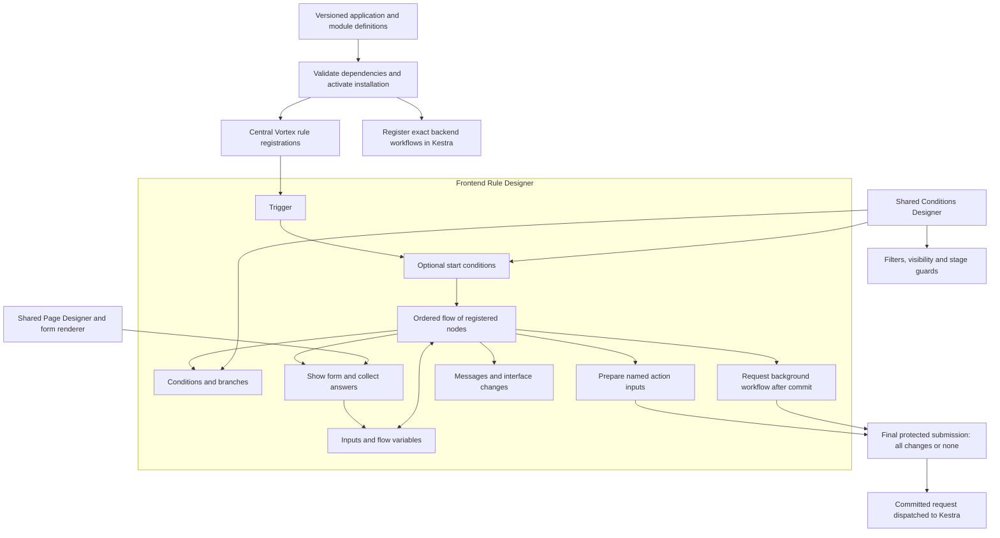
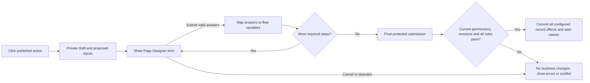

# Frontend Rule Designer

[Specification index](../README.md) · [Forms, actions, rules and events](../08-forms-actions-rules-and-events.md) · [Page builder](page-builder-contracts.md) · [Durable workflows](../09-workflows-and-pipelines.md)

## Purpose

One Frontend Rule Designer authors immediate rules and interactive action journeys from triggers, conditions and registered nodes. The Conditions Designer and Page Designer are reused components, not competing rule or form engines. Business-specific behaviour lives in application definitions.

This specification incorporates the owner's September 2026 designer, variables, packaged-installation and custom-form decisions. It describes required delivery, not functionality already implemented. The current single-effect rule contract requires the explicit compatible extension described below.

## Composition

Central means one generic runtime and catalogue, not one unscoped global list. A registration always identifies the organisation, application installation, exact application/module release and contained rule identity. Two applications with the same label never share a registration accidentally.

## Three execution contexts, one authoring language

| Context                        | What happens                                                                                            | What cannot happen                                                               |
| ------------------------------ | ------------------------------------------------------------------------------------------------------- | -------------------------------------------------------------------------------- |
| Immediate feedback             | On an input or page event, calculate draft values, conditions and presentation promptly.                | No record writes, external calls or durable starts.                              |
| Interactive action journey     | Run immediate steps, show one or more forms, collect answers and prepare one final protected operation. | No business writes between forms and no transaction held while a person thinks.  |
| Authoritative save/action rule | Recheck and execute the permitted rule graph inside the owning Vortex transaction.                      | No form prompt, network call, delay or Kestra execution inside that transaction. |

The author sees these as eligible triggers and nodes in the same designer, with explanations for unavailable combinations. There is no second frontend-only language and no second action executor. A synchronous segment may await its final protected Vortex submission without blocking the browser thread. Human input pauses the interactive journey, not a running database transaction. Long-running or assigned work uses the existing [durable workflow](../09-workflows-and-pipelines.md).

## Triggers

Every flow has one start and one declared trigger binding, an optional start condition and a stable priority. Reuse a definition with explicit bindings when more than one event should start the same behaviour. Do not maintain hidden event listeners outside the published definition.

| Trigger family       | Configurable events                                                                | Behaviour                                                                                                                                                                  |
| -------------------- | ---------------------------------------------------------------------------------- | -------------------------------------------------------------------------------------------------------------------------------------------------------------------------- |
| Manual               | Named button, menu command, row action or selected-record action                   | Start a permitted interactive journey. Selection is a typed, bounded list, never a comma-separated string or an implicit first record.                                     |
| Page/form lifecycle  | Page ready, form ready, form reset                                                 | Apply defaults and presentation once for that context; rendering again is not another start.                                                                               |
| Input                | Selected field value changed; field left                                           | Re-evaluate using typed draft values. “Changed” means a value change, not every render or key press.                                                                       |
| Condition transition | A condition becomes true or becomes false after its declared watched values change | Compare before/after values. Initial evaluation is explicit; the default does not treat an already-true initial value as a transition.                                     |
| Before submission    | Before save, or before the selected named action                                   | One server-authoritative validation/adjustment phase; creation/update and the selected action can be distinguished. Collect additional answers before entering this phase. |
| Submission result    | Save succeeded, save failed, action succeeded, action failed                       | Update presentation using the confirmed safe result. Success means committed, not merely optimistic display.                                                               |
| View controls        | Row/selection changed, tab changed, guided step changed, filter applied/cleared    | React only to the named semantic control. Do not depend on DOM selectors.                                                                                                  |

Before-save does not cover deletion, restoration, link/unlink, reassignment or state transitions by inference. Bind before-action to the exact supported published operation; use confirmed operation results for UI feedback and the [seven committed record events](../08-forms-actions-rules-and-events.md#events) for durable reactions. The owning operation must enforce its own permissions and rules for web, MCP and interfaces alike.

“Field matches value” is a condition, not a continuously running watcher. For visibility, required fields and validation, evaluate the current condition every relevant change/save, including initial form state. For a one-off reaction, choose becomes-true/becomes-false. Passing time alone does not fire a frontend rule; use a backend schedule. Page, field and selection triggers cannot start record mutations or background work automatically. They may prepare an action which still needs its published submission.

Publication checks every reachable trigger-to-node path against three explicit phase bounds. Page/form lifecycle, input, condition-transition, view-control and submission-result triggers are feedback/presentation-only: they may prepare draft values but cannot reach final Submit or durable-start acceptance. Manual triggers own the interactive collect-first journey. Before-submission triggers run only the authoritative save/action subset and cannot Show form. Submission-result flows cannot restart or retry the completed/refused operation. Unsupported combinations are refused, not silently skipped.

## Shared Conditions Designer

Use one field → comparison → value editor with nested **All / Any / Not** groups and a readable sentence preview. Reuse it for start gates, branch nodes, list filters, field visibility, validation, record visibility and pipeline guards. It serializes the Vortex typed condition contract, not a library query string.

The host supplies the allowed fields, operands and operators. A list filter does not receive transient flow variables or previous form values; an access condition never accepts a browser-supplied actor identity. General rules can use declared inputs, run variables, current permitted values and explicitly typed previous values where a previous state exists. Initial creation has no previous record; missing and null are distinct. The rule-contract extension must add any missing previous-value/changed semantics explicitly rather than hiding them in literal JSON.

Operators include typed equality, ordering, ranges, empty/not-empty, membership and appropriate text comparisons. Relationship traversal is only through the already allowed, bounded context. Invalid fields, operands, types or unavailable values are errors, not false values that can become true through Not. Browser and server use the same pure evaluator; query/security evaluation also proves matching database meaning. No JavaScript, PHP, SQL, formula script or library SQL export is accepted as a condition.

## Inputs and flow variables

The UI calls these **Flow variables** to distinguish them from infrastructure environment variables and secrets. They are available throughout one run, not shared between users, runs or applications.

| Value group    | Who supplies it                                        | Rules                                                                                                                        |
| -------------- | ------------------------------------------------------ | ---------------------------------------------------------------------------------------------------------------------------- |
| Inputs         | Published trigger or submitted form                    | Named, typed, required/optional and validated; no undeclared payload keys.                                                   |
| Context        | Vortex                                                 | Read-only actor, organisation, installation, subject and available before/current values. Client context is never authority. |
| Flow variables | Defaults, Set variable node or explicit output mapping | Declared name, stable identity, type and optional default. Values may change along the selected path.                        |
| Node outputs   | A named completed node                                 | Typed outputs; available only where that node has executed.                                                                  |
| Result         | Final operation                                        | Confirmed success/refusal/conflict and permitted returned values. It is not available before submission.                     |

Support the existing typed value kinds, including bounded lists, structured values and references whose allowed record types are declared. Use a value picker for literals, fields, inputs, variables and previous node outputs. Never require authors to type `$env[...]` or code.

Defaults are evaluated once per run in a deterministic order. Setting a variable validates its type. At a branch merge, a variable needs a default or an assignment on every incoming path before a required read; publication refuses an uninitialised read. An optional value requires an explicit empty check or fallback. There is one active path, no concurrent branches or shared mutable state in the initial frontend catalogue.

Sensitive values retain their source restrictions; variables are not a way to reveal hidden data or send it to another organisation. Logs and previews redact them. Browser variables never contain provider credentials. Backend handoff maps only declared allowed inputs and permitted references, never the entire variable bag; the event envelope's protected-data restrictions remain. Backend secrets continue to resolve through existing protected connection bindings.

Durable workflows retain their own typed trigger inputs and node outputs. A frontend variable passed to Kestra becomes a validated input snapshot, not a live shared variable. The backend's existing Set values/output mechanism is reused; this feature does not introduce mutable environment-wide state in Kestra.

## Initial frontend node catalogue and extensibility

| Node                                                    | What it configures                                                                                   | Allowed contexts                                                                        |
| ------------------------------------------------------- | ---------------------------------------------------------------------------------------------------- | --------------------------------------------------------------------------------------- |
| Start / Finish                                          | Trigger and terminal outcome                                                                         | All                                                                                     |
| Condition                                               | Shared condition with Yes/No routes                                                                  | All                                                                                     |
| Set variable / Calculate value                          | Typed mapping or registered pure calculation                                                         | All; only allowed operands for that context                                             |
| Set field                                               | Proposed draft value or an allowed server candidate-field change                                     | Feedback, interactive, save/action                                                      |
| Require field / Refuse                                  | Conditional requirement or safe validation message                                                   | Feedback and server validation; server repeats enforcement                              |
| Show/hide / Enable/disable                              | Published field or component presentation                                                            | UI only; never changes actual permission                                                |
| Show message / Focus field                              | Safe message/location or focus target                                                                | UI only; validation messages have server-safe equivalents                               |
| Show form                                               | Exact reusable form, defaults, output mappings, Submit/Cancel routes                                 | Interactive journey, before final submission only                                       |
| Prepare action / Submit                                 | Map inputs to one published named action or supported owning-service operation and finally submit it | Interactive; no generic sequence of independently committed writes                      |
| Refresh / Navigate / Open-close panel / Set view filter | Exact permitted semantic target and declared parameters                                              | UI; post-submit uses confirmed results                                                  |
| Start background workflow                               | Exact published workflow binding and typed input mapping                                             | Prepared in interactive flow or requested by a save rule; accepted only at final commit |

Create, update, delete and relationship operations reuse named [actions](../08-forms-actions-rules-and-events.md#actions) and their existing bounded effects. The frontend designer does not acquire direct table-writing nodes. Data selection uses existing authorised Page/Query bindings; arbitrary searches, raw network calls and unbounded lists are not synchronous calculation nodes. Reusable calculations use the existing registered pure value operations, not a new scripting runtime.

Node registrations declare permanent kind identity/version, input/output and setting schemas, available contexts, branch ports, permitted effects, renderer and safe error meaning. Initial registrations are platform code shipped through a normal reviewed release. Adding a node extends that catalogue and its tests; it does not require rewriting the canvas. Application packages configure registered nodes but cannot upload implementations or self-declare new security capabilities. Unknown/incompatible nodes fail publication and installation explicitly.

Published graphs pin node versions; adding a new kind never silently changes existing flows. Frontend and durable catalogues remain distinct because their execution guarantees differ; reuse node cards, value pickers and the Conditions Designer where applicable. The existing durable 24-node catalogue is not enlarged merely by adding frontend nodes.

## Custom forms and all-or-nothing submission

**Default: collect first, commit together.** An administrator can require several custom forms before the configured operation is allowed to submit. Missing answers, Cancel or abandonment means no business submission and no background start.

The repetition in this illustration means a finite configured sequence of forms, not a loop node. Reuse [Page Designer form and guided-form blocks](page-builder-contracts.md#forms-actions-and-semantic-controls), layout, validation, themes, accessibility and semantic controls. The Show form inspector selects or opens that same designer; no embedded second form builder. A reusable input form binds to a declared response schema and can collect values without any record yet existing. Dialog, drawer or inline step are presentation choices. Its Submit validates and returns answers to the journey; only the journey's final Submit performs the protected business operation. Label intermediate buttons Continue where needed to avoid implying a saved record.

Private draft persistence is not a committed business record. Reuse existing person/organisation/application/form draft storage and revisions; do not add a durable rule-run database or keep a request, connection or database transaction open during user input. Resume follows the existing draft policy, exact form/flow version and current access checks. Cancel closes the journey; pending private drafts may be cleared by that existing policy. No automatic final submission on close, timeout or reload.

On final submission the server validates the exact published operation and required typed answers, recomputes the necessary conditions/derived values, checks the actual current actor and record revisions, and then applies the configured bounded effects in one short transaction. A client claim that it visited a node or fulfilled a condition is not evidence. The complete mandatory path must be derivable and validated from the submitted inputs and server-owned context; otherwise publication refuses that definition. Unrelated data changing while a form is open cannot silently change the meaning of the confirmed action: stale affected records return a conflict and a clear refresh/review path.

The initial journey prepares **one final owning operation**, not multiple independently committed service calls. Its existing transaction may affect the allowed records covered by that operation; it is not limited to one field or one record. It cannot combine unrelated service transactions, source organisations or external systems and claim atomicity. Such composition requires an explicit durable process and truthful completion states, not an invisible early commit. Shared-record actions remain entirely source-authoritative under [sharing rules](../04-access-and-permissions.md).

Show form is forbidden inside before-save/before-action transaction rules and automatic field-change feedback. Attach the interactive preparation journey to the action entry point instead. This preserves the administrator's all-or-nothing requirement without locking records throughout a person's idle time. The server-side named action remains protected when called directly through an interface or MCP; all required inputs and validations still apply.

An upgrade never silently resumes a draft against changed forms. For the initial implementation, refuse stale installation/version submissions and offer restart; preserve only permitted draft values for explicit re-entry. Withdrawing an app or revoking access refuses resume and clears protected UI state. Reuse draft revisions and existing command duplicate protection for simultaneous web/MCP edits and repeated final submissions. Do not invent additional continuity counters.

Long waits, requests assigned to someone else and recoverable business work after submission use the durable [request_form node](../09-workflows-and-pipelines.md#safe-workflow-node-catalogue), reusing the same form renderer. That durable wait can survive sessions; it is not an open transaction either. A Cancel in an input journey never promises to reverse an earlier, separately completed business operation.

## Deterministic execution and failure

The initial frontend graph has one start, explicit terminal outcomes and no cycles, recursive calls, parallel paths, polling, timers or unbounded iteration. Stable published rule order governs graphs on the same trigger. Publication resolves reads/writes and refuses unordered conflicting writers. A Set field node does not recursively restart its own trigger; dependent calculations use declared order. Invalid graphs never partly execute.

Before-save runs once after type/context checks and before final validation and commit. Candidate-field changes are revalidated. Refusals collect safe errors where possible; no branch can clear a mandatory server refusal. In frontend feedback, recompute required/visibility state from the current draft rather than leaving a previous true result stuck on screen.

An unknown node or invalid variable is a safe execution failure, not a silently skipped step. No final commit occurs on an incomplete/error/cancel path. After-commit display failure cannot turn success into a reported rollback or resubmit the business operation. A later response for an old form, app, draft or selection cannot overwrite the current context. Refresh exactly the affected components, retain unrelated input/focus, honour reduced motion and remove refused data before animation.

No hidden automatic retry of a whole interactive flow. Retrying a final submission uses the same operation command identity and the existing safe outcome/reconciliation contract. Structural size/step bounds protect termination; performance measurements guide optimisation and do not independently block releases.

## Kestra integration decision

Keep immediate evaluation in Vortex, not Kestra. [Kestra's synchronous API](https://kestra.io/docs/how-to-guides/synchronous-executions-api) can wait for execution results, but that does not establish bounded latency on our installation or share Vortex's save transaction. No hosted latency benchmark was performed for this decision. Correctness, offline draft feedback and availability—not a claim that Kestra is slow—determine the boundary.

Use Start background workflow through Vortex's protected Workflow operation. A successful final operation records its start intent with its business changes; dispatch calls Kestra after commit. Show accepted/pending separately from running/completed. An outage keeps the committed request pending without undoing the save. No browser credential, provider namespace or arbitrary flow ID is exposed. See [durable handoff](../08-forms-actions-rules-and-events.md#starting-durable-work).

The current action/subject-bound trigger remains supported. Explicit typed input maps and record-free starts require the versioned bindings owned by [#250](https://github.com/Abzum-NZ/Abzum-Vortex/issues/250), with validation/execution completed by [#76](https://github.com/Abzum-NZ/Abzum-Vortex/issues/76), [#77](https://github.com/Abzum-NZ/Abzum-Vortex/issues/77) and [#78](https://github.com/Abzum-NZ/Abzum-Vortex/issues/78). This decision approves that bounded contract extension, not widening every legacy event, interface or child trigger. Do not fabricate a record to start record-free work.

## Package registration, publication and upgrades

Modules own reusable subject-record rules; applications own page interactions, action journeys, forms and durable workflows. Application publication resolves the exact module rules plus application rules, action bindings, forms, queries, node versions, workflow references and declared input/output maps. Missing or incompatible dependencies refuse publication. The authoring canvas is not needed to execute installed definitions.

1. Validate the complete immutable application candidate and its resolved dependencies. Save and publish alone do not change active registrations.
2. Prepare Vortex rule bindings for that installation. No browser render registers a live rule.
3. When the application includes durable workflows, prepare and verify their exact inactive versions using the existing Kestra adapter.
4. Activate the exact Vortex installation and its rule/operation registrations together. Invalidate readers using the existing installation revision; permission changes follow existing Access-version rules, not a new rule counter.
5. Reconcile durable schedules as specified in [workflow installation](../09-workflows-and-pipelines.md#installation-registration-and-activation).

Retries converge; a failed upgrade leaves the prior active installation and rules intact. Only one active rule binding exists for each exact installation/event/rule; duplicate module imports do not double-run it. Shared module definitions still bind independently to each consuming application context. Rollback selects a verified retained release through normal activation. Withdrawal disables new rule invocations and starts without deleting records or history. Already accepted durable work retains its recorded version and documented withdrawal policy; it is not governed by the stricter restart rule for an unsubmitted interactive draft.

There is no distributed database transaction with Kestra. Prepared provider flows cannot execute application effects before Vortex activation. No per-app engine deployment or Kestra restart is required. Package/gallery installs reuse this path rather than creating another registry.

## Designer experience and package choice

| Component              | Selected approach                                                                                                                                        | Reason and boundary                                                                                                                                                                         |
| ---------------------- | -------------------------------------------------------------------------------------------------------------------------------------------------------- | ------------------------------------------------------------------------------------------------------------------------------------------------------------------------------------------- |
| Flow canvas            | `@xyflow/react` (React Flow), with selected [React Flow UI components](https://reactflow.dev/learn/tutorials/getting-started-with-react-flow-components) | Existing node/edge interaction and shadcn-based cards; Vortex still owns execution and its graph contract.                                                                                  |
| Conditions Designer    | `react-querybuilder` with its official [shadcn registry](https://react-querybuilder.js.org/docs/compat#shadcnui)                                         | Reuse grouped condition editing with Vortex field/operator/value controls. A tested adapter maps to the single Vortex condition tree; no SQL export or package evaluator becomes authority. |
| Custom input forms     | Existing Puck-backed Page Designer adapter and registered form renderer                                                                                  | One reusable layout/input/validation system, with form-response bindings rather than another form product.                                                                                  |
| Alternative considered | [Rete.js](https://retejs.org/docs/concepts/engine/)                                                                                                      | Offers dataflow/control-flow engines; not selected because Vortex already owns its execution semantics and needs a canvas, not an additional engine.                                        |

Follow current official package APIs and pin compatible versions in the lockfile when implementation begins. No packages are installed by this specification change. Prove round-trip mapping and context-restricted operators before integrating the conditions UI; report any unsupported package behaviour rather than silently changing Vortex semantics. Keep editor-specific positions/selection state separate from execution meaning. React Flow and Puck data are private adapter representations, not public contracts.

The Next.js editor is an interactive client component inside the existing application shell; server-owned authority and credentials stay outside it. Reuse existing shadcn components and motion tokens. Load heavy canvas code only when the designer is opened, following [Next.js lazy loading](https://nextjs.org/docs/app/guides/lazy-loading).

The default editor shows a searchable eligible-node palette, readable flow canvas and a single selected-node inspector. A Variables panel lists type, default and where a value is set/used. Nodes show plain-language summaries and labelled branch outcomes. Offer Add next step and keyboard editing, not drag-only operation; undo/redo operates on the application draft. Show required configuration errors at the node and exact field. Test mode accepts sample inputs, shows the chosen path and safe variable changes, and never writes records or starts real workflows. Test forms use the same renderer. No database identifiers or code expressions are required in ordinary authoring.

The [Redoo Start reference](https://documentation.redoo.support/redoo-networks-manuals/workflow-designer-en/workflow-actions/start/) and supplied screenshots informed trigger setup, grouped conditions and output mappings. Its [User Interaction reference](https://documentation.redoo.support/redoo-networks-manuals/workflow-designer-en/workflow-actions/user-interaction/) informed form reuse. Vortex does not copy its code-based expressions, business-specific nodes, implicit first-record selection or condition-bypass options.

## Contracts and compatibility delivery

The existing single-effect rule representation remains an immutable legacy contract. [#58](https://github.com/Abzum-NZ/Abzum-Vortex/issues/58) owns the explicit versioned rule-flow source/canonical schema extension, compiler, node catalogue validation and headless execution; [#57](https://github.com/Abzum-NZ/Abzum-Vortex/issues/57) owns shared condition extensions. [#250](https://github.com/Abzum-NZ/Abzum-Vortex/issues/250) owns form-response, journey submission and workflow-operation binding contracts. Use existing Definition source/validation version selection; do not infer graph support from JSON shape or invent a parallel version store.

A rule flow declares permanent identity, owner/subject context, exact contract version, trigger binding, optional condition, priority, typed input/variable declarations, nodes, labelled edges and terminal/submission outcomes. Each node declares its catalogue kind/version and typed configuration/value maps. Referenced actions, forms, query bindings, workflows and node kinds participate in the existing dependency manifest, reference validation and version-impact comparison. New semantics must be carried through authored source, canonical output, publication, persistence, reads, restore and fixtures together.

Legacy single effects may be shown as a one-effect graph through a lossless read adapter. Editing into the new format creates a new explicitly versioned draft; it never rewrites a published release or silently broadens a legacy trigger. Existing page V1/V2 selection remains unchanged until its owning versioned extension is delivered. Write the complete positive/negative fixture set before the corresponding new runtime code, including all declared node kinds, form mappings and installation dependencies.

## Acceptance and delivery coverage

| Proof                                                                                                                                                               | Owning tasks                                                                                                                                                                                                                                 |
| ------------------------------------------------------------------------------------------------------------------------------------------------------------------- | -------------------------------------------------------------------------------------------------------------------------------------------------------------------------------------------------------------------------------------------- |
| Condition parity; initial true vs becomes true; null vs missing; illegal context operands; no script execution                                                      | [#57](https://github.com/Abzum-NZ/Abzum-Vortex/issues/57), [#58](https://github.com/Abzum-NZ/Abzum-Vortex/issues/58)                                                                                                                         |
| All node schemas and dependency references; graph order/cycle refusal; variable defaults/types/branch assignment; no cross-run leakage; old-release compatibility   | [#58](https://github.com/Abzum-NZ/Abzum-Vortex/issues/58)                                                                                                                                                                                    |
| Before-save refusals and field changes; all-or-nothing final operation; direct API/MCP cannot bypass required answers or rules                                      | [#47](https://github.com/Abzum-NZ/Abzum-Vortex/issues/47), [#50](https://github.com/Abzum-NZ/Abzum-Vortex/issues/50), [#58](https://github.com/Abzum-NZ/Abzum-Vortex/issues/58)                                                              |
| Form without an existing record; several required forms; defaults/output maps; Cancel/abandon leaves no business effects; stale/duplicate submission; same renderer | [#250](https://github.com/Abzum-NZ/Abzum-Vortex/issues/250), [#65](https://github.com/Abzum-NZ/Abzum-Vortex/issues/65), [#68](https://github.com/Abzum-NZ/Abzum-Vortex/issues/68)                                                            |
| Registration on install; no run on publish; duplicate imports; same-name apps; failed upgrade, rollback and withdrawal                                              | [#64](https://github.com/Abzum-NZ/Abzum-Vortex/issues/64), [#76](https://github.com/Abzum-NZ/Abzum-Vortex/issues/76), [#112](https://github.com/Abzum-NZ/Abzum-Vortex/issues/112)                                                            |
| Typed variable handoff; no call before commit; pending during outage; exact accepted version preserved; record-free path has explicit contract                      | [#76](https://github.com/Abzum-NZ/Abzum-Vortex/issues/76), [#77](https://github.com/Abzum-NZ/Abzum-Vortex/issues/77), [#78](https://github.com/Abzum-NZ/Abzum-Vortex/issues/78)                                                              |
| Durable request_form versus interactive Show form; safe assigned response and draft reuse                                                                           | [#81](https://github.com/Abzum-NZ/Abzum-Vortex/issues/81), [#83](https://github.com/Abzum-NZ/Abzum-Vortex/issues/83)                                                                                                                         |
| Accessible editor, test trace, scoped refresh, stale response removal and same controls through MCP, including form Continue/Cancel/Submit                          | [#59](https://github.com/Abzum-NZ/Abzum-Vortex/issues/59), [#64](https://github.com/Abzum-NZ/Abzum-Vortex/issues/64), [#68](https://github.com/Abzum-NZ/Abzum-Vortex/issues/68), [#200](https://github.com/Abzum-NZ/Abzum-Vortex/issues/200) |
| Independent full-flow proof in definition-driven examples, with no business-specific core branches                                                                  | [#254](https://github.com/Abzum-NZ/Abzum-Vortex/issues/254)                                                                                                                                                                                  |

The [delivery plan](../../build-plan/frontend-rule-designer.md) records the dependency order and exact issue updates. This feature does not pre-empt unfinished Access work or require infrastructure maintenance.
