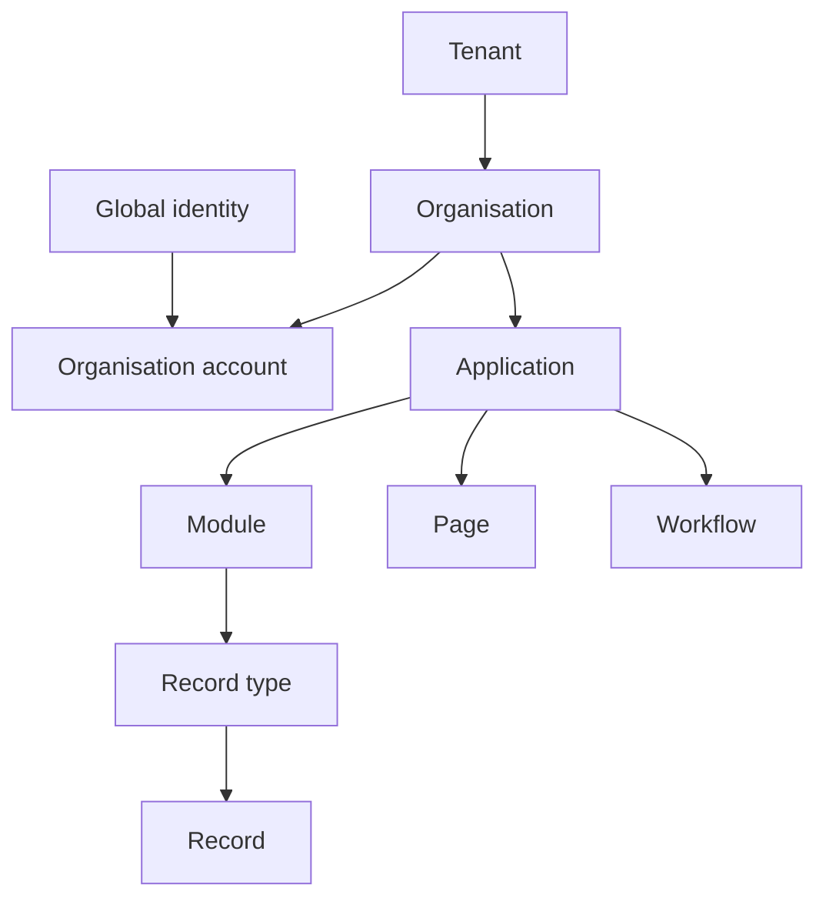

# Plain-language glossary

[Specification index](../README.md) · [Decision register](decisions.md)

| Term | Meaning and governing section |
|---|---|
| Access decision | The allow-or-refuse answer described in [Access and permissions](../04-access-and-permissions.md). |
| Access grant | A source organisation's limited, approved, and revocable permission for a named recipient context to use specified records, actions, and fields under [Shared-record access](../04-access-and-permissions.md#shared-record-access). |
| Action | A named operation that participates in one [record save](../08-forms-actions-rules-and-events.md#actions). |
| Application | A published user experience composed from modules, described in [Applications, navigation, pages and themes](../07-applications-pages-and-themes.md). |
| Application binding | Application-specific settings attached to a reusable module field or record type, described in [Modules, fields and relationships](../05-modules-fields-and-relationships.md#application-level-bindings). |
| Application role | A collection of permissions inside one [application](../04-access-and-permissions.md#application-roles). |
| Grant consent | Immutable source authorisation and recipient acceptance over one exact cross-organisation grant proposal under the [grant-consent contract](data-contracts.md#grant-consent-contract). It is not a general business approval. |
| Attachment | A record field linking one or more files under [Files and attachments](../11-files-and-attachments.md). |
| Block | A platform-supplied page component with a validated setting contract, described in [Applications, navigation, pages and themes](../07-applications-pages-and-themes.md#page-composition). |
| Builder | A person authorised to edit definitions. |
| Cache | A temporary copy used to avoid repeated work under [Runtime services, storage and caching](../17-runtime-storage-and-caching.md#cache-model). |
| Cluster | One operated Vortex runtime and its organisation database, file store, queue, and service deployment. Clusters share published contracts and an environment's identity authority but remain separate security and availability boundaries under [Vortex federation](../17-runtime-storage-and-caching.md#vortex-federation-between-clusters). |
| Cluster directory | The protected catalogue of cluster identifiers, approved addresses, regions, supported versions, status, and public signing keys under [Cluster identity and discovery](../17-runtime-storage-and-caching.md#cluster-identity-and-discovery). It stores no customer records. |
| Connection | An organisation's authorised link to another system under [Connections, programmable interfaces and MCP](../12-connections-and-interfaces.md). |
| Connection instance | One organisation's encrypted credentials and grants for a platform-catalogue connection type. |
| Connection type | A platform-catalogue description of authentication, allowed operations and safety policy. |
| Contained component | A page, field, rule, workflow, or similar item published with its module or application under [Platform composition and publication](../03-composition-and-publication.md#definition-ownership-and-versions). |
| Concurrency number | A number changed on every record update so a later edit is not silently overwritten, described in [Records and their lifecycle](../06-records-and-lifecycle.md#concurrent-changes). |
| Definition | A versioned description of structure or behaviour. Root definitions and publication are described in [Platform composition and publication](../03-composition-and-publication.md). |
| Draft | The editable, non-live version of a module or application. |
| Engine | Earlier name for a code ownership boundary. This specification uses **platform service**; see [Runtime services, storage and caching](../17-runtime-storage-and-caching.md#platform-services-inside-the-codebase). |
| Event | A committed statement that something happened, described in [Forms, actions, rules and events](../08-forms-actions-rules-and-events.md#events). |
| Event outbox | Database records written with a business save and later delivered safely. |
| Field | One named value on a record type, described in [Modules, fields and relationships](../05-modules-fields-and-relationships.md#common-field-properties). |
| Federation | A signed Vortex-to-Vortex request that lets a recipient use source-owned records across clusters without database credentials or a persistent recipient copy under [Vortex federation](../17-runtime-storage-and-caching.md#vortex-federation-between-clusters). |
| Gallery | A reviewed catalogue of definition packages under [Copying, sharing, import and export](../16-copying-sharing-import-export.md#gallery). |
| Global identity | One human sign-in that can be linked to a separate account in several organisations under [People, organisations and sign-in](../02-people-organisations-and-sign-in.md). |
| Guided form | A form split into two to twenty steps and committed once, described in [Applications, navigation, pages and themes](../07-applications-pages-and-themes.md#forms-and-guided-forms). |
| Interface | A versioned catalogue of operations for approved software callers, described in [Connections, programmable interfaces and MCP](../12-connections-and-interfaces.md#programmable-interfaces). |
| Model Context Protocol (MCP) | The standard protocol used by an authorised external client to discover and invoke the same permission-filtered capabilities a person can use in Vortex, under [Governed MCP access](../12-connections-and-interfaces.md#governed-mcp-access). It does not mean Vortex embeds a model or assistant. |
| Legal hold | A protected instruction that prevents permanent removal of matching data under [Activity history, privacy and retention](../14-activity-privacy-and-retention.md#legal-holds). |
| Module | A reusable description of business data and meaning, described in [Modules, fields and relationships](../05-modules-fields-and-relationships.md). |
| Organisation | One private workspace inside a tenant. Its data and access do not flow to its parent, children, or tenant administrators. |
| Organisation account | One global identity's separate account inside one organisation, with its own status, profile, roles, teams, preferences, and application access. Earlier drafts called this a membership. |
| Organisation role | A collection of organisation-wide permissions under [Access and permissions](../04-access-and-permissions.md#organisation-roles). |
| Page | A published application screen type and block layout under [Applications, navigation, pages and themes](../07-applications-pages-and-themes.md#page-types). |
| Permission | One permanently named right that a role may grant. |
| Process pipeline | The ordered business stages of a record under [Workflows and process pipelines](../09-workflows-and-pipelines.md#process-pipelines). |
| Public operation | A narrowly published page or interface operation that does not require an organisation account. |
| Published version | An immutable, numbered snapshot used by live requests under [Platform composition and publication](../03-composition-and-publication.md#draft-and-published-versions). |
| Query | A validated request for bounded rows, groups or totals under [Queries, reports, search and live updates](../10-queries-reports-search.md#query-contract). |
| Recipient assertion | A short-lived statement signed by the recipient cluster confirming the current person, organisation account, application, roles, access version, intended source, and grant under the [federation contracts](data-contracts.md#recipient-assertion). |
| Recipient grant mirror | Non-content routing and status information stored by the recipient cluster; the source grant remains authoritative under the [federation contracts](data-contracts.md#recipient-grant-mirror). |
| Record | One organisation-owned instance of a record type under [Records and their lifecycle](../06-records-and-lifecycle.md). |
| Record type | A named business object and its fields inside a module. |
| Publishable definition | One independently published module or application. |
| Rule | Immediate typed logic evaluated during a record save under [Forms, actions, rules and events](../08-forms-actions-rules-and-events.md#rules). |
| Semantic interface map | The permission-filtered, stable description of navigation, pages, forms and controls used by both the web interface and MCP, under [Applications, navigation, pages and themes](../07-applications-pages-and-themes.md#semantic-interface-map). It contains meaning and typed operations, not DOM details or screen coordinates. |
| Saved view | A saved query and arrangement under [Queries, reports, search and live updates](../10-queries-reports-search.md#saved-views). |
| Saved sharing condition | A published and tested condition that defines which changing source records a grant may cover under [Record sharing](../16-copying-sharing-import-export.md#scope-and-saved-sharing-conditions). |
| Sensitive field | A field carrying higher-risk personal or confidential data under [Activity history, privacy and retention](../14-activity-privacy-and-retention.md#personal-data-classification). |
| Soft deletion | Recoverable deletion before permanent removal under [Records and their lifecycle](../06-records-and-lifecycle.md#deletion-and-restoration). |
| Tenant | The customer-level governance and security boundary that owns one or more hierarchical organisations under [Tenants, organisations, people and sign-in](../02-people-organisations-and-sign-in.md). |
| Tenant administrator | A tenant-level administrator who can manage organisation structure and explicitly granted protected tenant operations but receives no organisation record access from that role. |
| Theme | Validated design values contained by an application or supplied by the platform catalogue under [Applications, navigation, pages and themes](../07-applications-pages-and-themes.md#themes). |
| Vortex Identity Authority | The environment-wide sign-in authority that gives one person a stable global identity across clusters while each cluster keeps its own organisation accounts under [Identity across clusters](../02-people-organisations-and-sign-in.md#identity-across-clusters). |
| Workflow | Durable background work executed with Kestra under [Workflows and process pipelines](../09-workflows-and-pipelines.md). |

## Page-builder additions

| Term | Meaning |
|---|---|
| Shell | A reusable layout contained in an Application, with named page-content slots; never an independently published root. |
| Slot | A registered, named, typed location containing one ordered list of child placements. |
| Binding context | Explicit current page record, related-record/query context or row item against which fields and operation inputs resolve. |
| Application-contained editable data module | An authoring group over the existing application-contained data definitions, released with its Application rather than as a new independent publication kind. |

See [page-builder contracts](page-builder-contracts.md) for normative identity, validation and migration rules.
