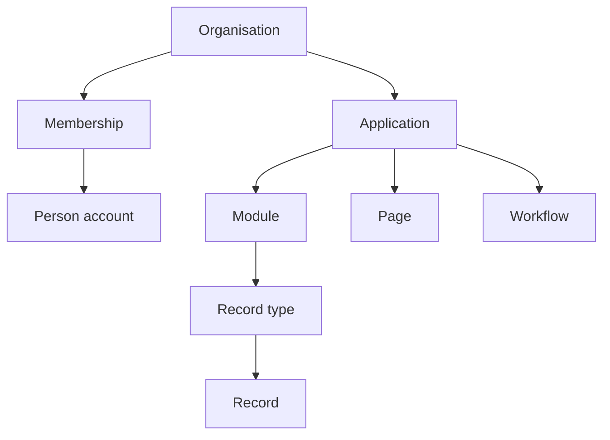

# Plain-language glossary

[Specification index](../README.md) · [Decision register](decisions.md)

| Term | Meaning and governing section |
|---|---|
| Access decision | The allow-or-refuse answer described in [Access and permissions](../04-access-and-permissions.md). |
| Action | A named operation that participates in one [record save](../08-forms-actions-rules-and-events.md#actions). |
| Application | A published user experience composed from modules, described in [Applications, navigation, pages and themes](../07-applications-pages-and-themes.md). |
| Application binding | Application-specific settings attached to a reusable module field or record type, described in [Modules, fields and relationships](../05-modules-fields-and-relationships.md#application-level-bindings). |
| Application role | A collection of permissions inside one [application](../04-access-and-permissions.md#application-roles). |
| Assistant | The optional model-assisted experience governed by [Assistant and model-assisted work](../13-assistant.md). |
| Attachment | A record field linking one or more files under [Files and attachments](../11-files-and-attachments.md). |
| Block | A platform-supplied page component with a validated setting contract, described in [Applications, navigation, pages and themes](../07-applications-pages-and-themes.md#page-composition). |
| Builder | A person authorised to edit definitions. |
| Cache | A temporary copy used to avoid repeated work under [Runtime services, storage and caching](../17-runtime-storage-and-caching.md#cache-model). |
| Connection | An organisation's authorised link to another system under [Connections and programmable interfaces](../12-connections-and-interfaces.md). |
| Connection instance | One organisation's encrypted credentials and grants for a published connection type. |
| Connection type | A reusable definition of authentication, allowed operations and safety policy. |
| Contained component | A page, field, rule, workflow, or similar item published with its root definition under [Platform composition and publication](../03-composition-and-publication.md#definition-ownership). |
| Concurrency number | A number changed on every record update so a later edit is not silently overwritten, described in [Records and their lifecycle](../06-records-and-lifecycle.md#concurrent-changes). |
| Definition | A versioned description of structure or behaviour. Root definitions and publication are described in [Platform composition and publication](../03-composition-and-publication.md). |
| Draft | The editable, non-live version of a root definition. |
| Engine | Earlier name for a code ownership boundary. This specification uses **platform service**; see [Runtime services, storage and caching](../17-runtime-storage-and-caching.md#platform-services-inside-the-codebase). |
| Event | A committed statement that something happened, described in [Forms, actions, rules and events](../08-forms-actions-rules-and-events.md#events). |
| Event outbox | Database records written with a business save and later delivered safely. |
| Field | One named value on a record type, described in [Modules, fields and relationships](../05-modules-fields-and-relationships.md#common-field-properties). |
| Gallery | A reviewed catalogue of definition packages under [Copying, sharing, import and export](../16-copying-sharing-import-export.md#gallery). |
| Guided form | A form split into two to twenty steps and committed once, described in [Applications, navigation, pages and themes](../07-applications-pages-and-themes.md#forms-and-guided-forms). |
| Interface | A versioned catalogue of operations for approved software callers, described in [Connections and programmable interfaces](../12-connections-and-interfaces.md#programmable-interfaces). |
| Legal hold | A protected instruction that prevents permanent removal of matching data under [Activity history, privacy and retention](../14-activity-privacy-and-retention.md#legal-holds). |
| Membership | The connection between one person account and one organisation, described in [People, organisations and sign-in](../02-people-organisations-and-sign-in.md). |
| Module | A reusable description of business data and meaning, described in [Modules, fields and relationships](../05-modules-fields-and-relationships.md). |
| Organisation | One customer's private workspace. The user interface does not use the technical word “tenant.” |
| Organisation role | A collection of organisation-wide permissions under [Access and permissions](../04-access-and-permissions.md#organisation-roles). |
| Page | A published application screen type and block layout under [Applications, navigation, pages and themes](../07-applications-pages-and-themes.md#page-types). |
| Permission | One permanently named right that a role may grant. |
| Person account | One human identity that can have memberships in several organisations under [People, organisations and sign-in](../02-people-organisations-and-sign-in.md). |
| Process pipeline | The ordered business stages of a record under [Workflows and process pipelines](../09-workflows-and-pipelines.md#process-pipelines). |
| Public operation | A narrowly published page or interface operation that does not require an organisation membership. |
| Published version | An immutable, numbered snapshot used by live requests under [Platform composition and publication](../03-composition-and-publication.md#draft-and-published-versions). |
| Query | A validated request for bounded rows, groups or totals under [Queries, reports, search and live updates](../10-queries-reports-search.md#query-contract). |
| Record | One organisation-owned instance of a record type under [Records and their lifecycle](../06-records-and-lifecycle.md). |
| Record type | A named business object and its fields inside a module. |
| Root definition | One independently published module, application, theme, connection type, interface, or organisation role. |
| Rule | Immediate typed logic evaluated during a record save under [Forms, actions, rules and events](../08-forms-actions-rules-and-events.md#rules). |
| Saved view | A saved query and arrangement under [Queries, reports, search and live updates](../10-queries-reports-search.md#saved-views). |
| Sensitive field | A field carrying higher-risk personal or confidential data under [Activity history, privacy and retention](../14-activity-privacy-and-retention.md#personal-data-classification). |
| Soft deletion | Recoverable deletion before permanent removal under [Records and their lifecycle](../06-records-and-lifecycle.md#deletion-and-restoration). |
| Theme | Published, validated design values used by an application under [Applications, navigation, pages and themes](../07-applications-pages-and-themes.md#themes). |
| Workflow | Durable background work executed with Kestra under [Workflows and process pipelines](../09-workflows-and-pipelines.md). |
