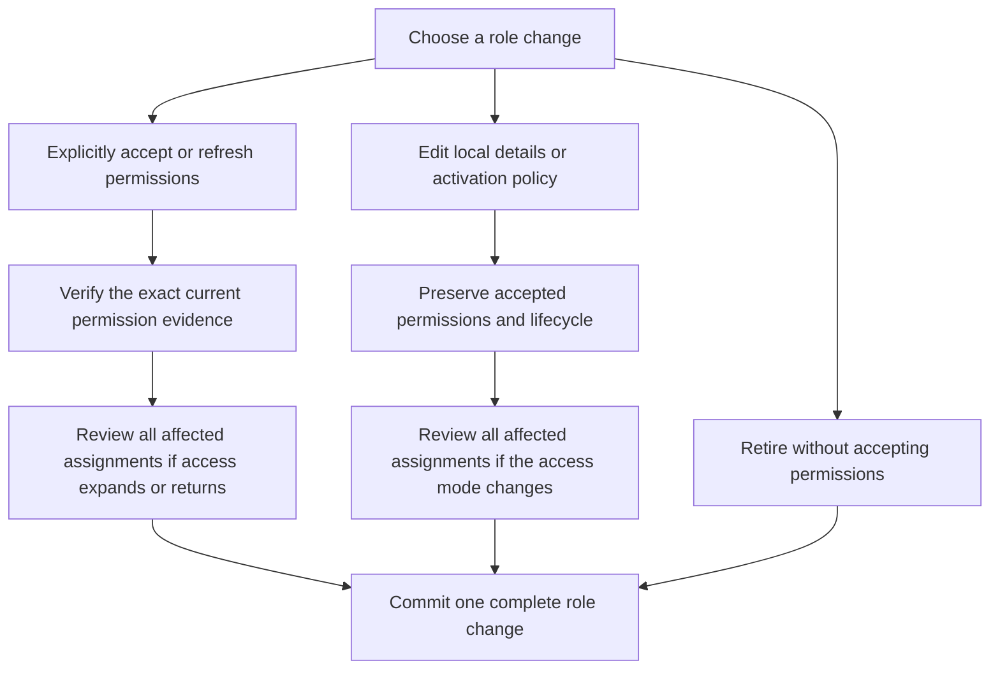
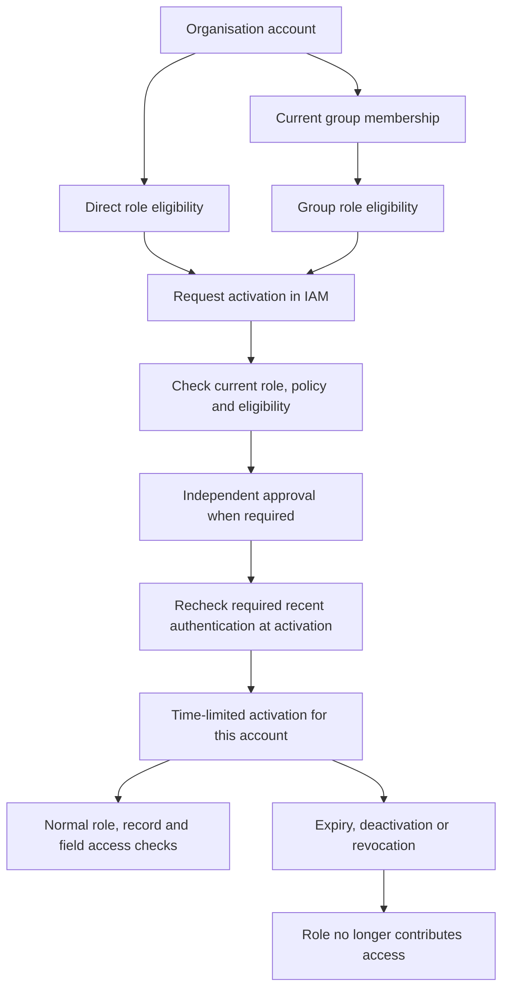
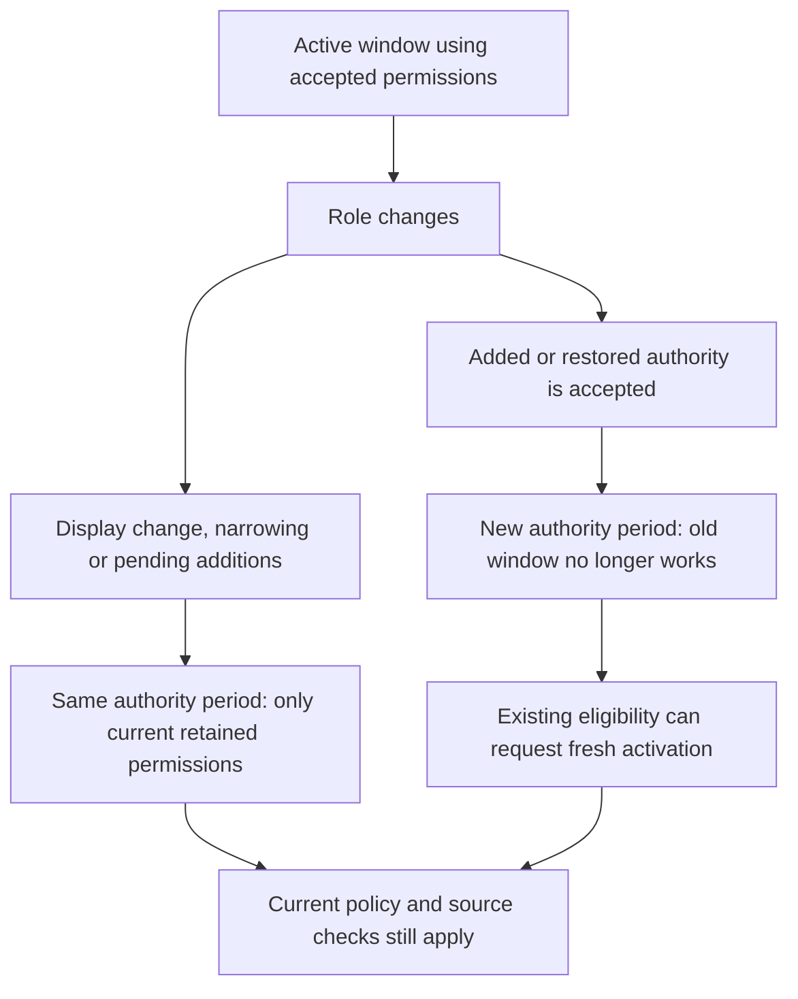
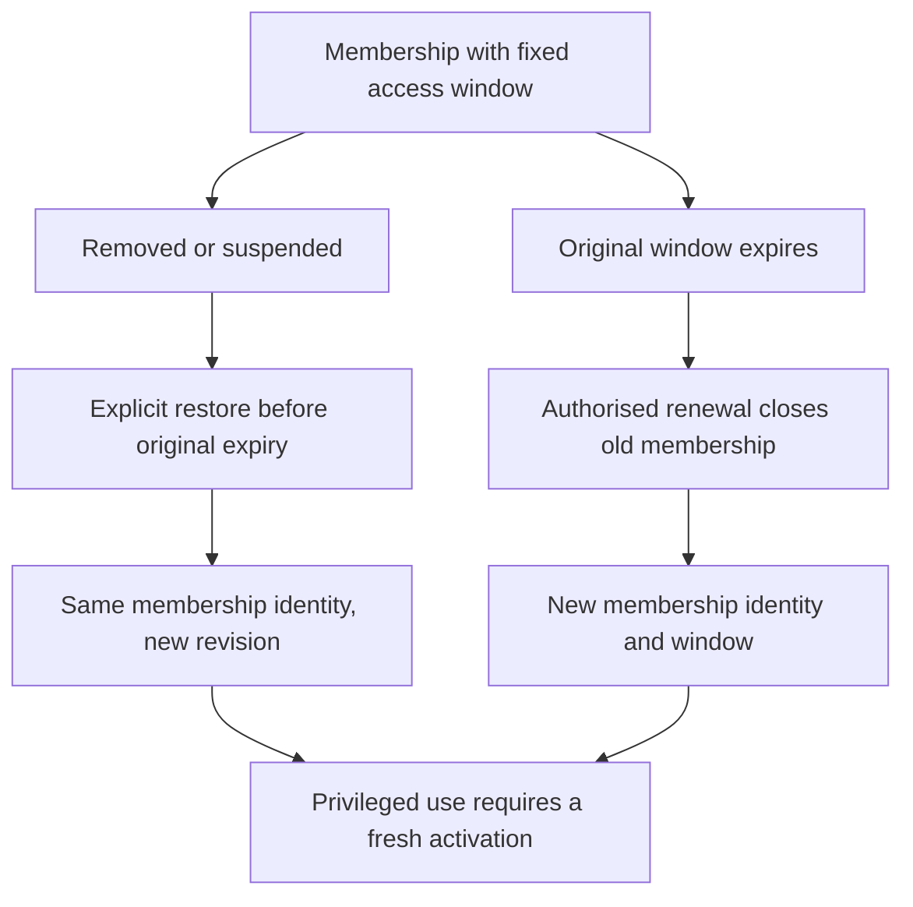

# Groups and privileged role activation

[Access specification](../04-access-and-permissions.md) · [IAM application](iam-application.md) · [Data contracts](data-contracts.md#permission-and-role-contracts) · [Build plan](../../build-plan/README.md)

## Product model

The access-management model is **Roles and Groups**. A role defines exact permissions; a group collects organisation accounts and can receive role assignments. A group is not a business department, work queue or application-specific team. Those business concepts remain ordinary application records and can refer to a group when their definitions require it.

An account may belong to several groups in its own organisation. Group membership does not cross organisation or global-identity boundaries. The initial implementation uses explicit account memberships, not nested groups or rule-driven membership. Adding those capabilities later requires their own access-expansion, revocation and continuity rules.

Some roles are classified as privileged. A privileged role may require **Privileged Identity Management (PIM)**: eligibility to request that role is separate from permission to use it now. This follows the useful distinction in [Microsoft Entra PIM](https://learn.microsoft.com/en-us/entra/id-governance/privileged-identity-management/pim-configure), without promising an Entra clone or directory synchronisation.

## Privileged classification and policy

Each live organisation role has protected, revisioned privilege classification and an explicit assignment policy: standing access is permitted, or activation is required. Privileged does not itself mean active or permanently assigned. Application publication and template registration create neither classification authority nor assignments; the organisation governs the accepted local role and policy through IAM.

A role containing a permission marked administrative is always classified as privileged; an administrator cannot downgrade that classification. Organisations may classify additional roles as privileged. Classification alone does not force PIM or grant access: the separately governed assignment policy determines whether activation is required.

For newly configured privileged operational roles, recommend activation-required access. An authorised administrator can deliberately retain standing access where required; the UI must make that choice and its consequences visible. Role names, copied templates, record fields and client-supplied flags cannot select or weaken the policy.

An activation policy defines the finite maximum activation duration, whether a reason is required, required recent authentication and whether an independent approval is required. These are explicit organisation settings, not hardcoded universal durations. An incomplete policy cannot enable activation. The governed IAM workflow selects the reviewers and presents the policy, while protected Access facts hold the policy revision and enforce its requirements. No new general-purpose approval engine belongs in core.

For the initial closed contract, a standing-access role has no activation-policy reference and accepts standing assignments only. An activation-required role pins a complete immutable activation-policy identity, revision and fingerprint and accepts eligible assignments only. A standard role may also deliberately select activation-required policy; privileged classification and assignment policy remain separate. Changing the policy cannot grandfather incompatible assignments into active use or convert them automatically. This avoids an unused activation policy for the standing minimum steward.

The assignment itself has an immutable kind, `standing` or `eligible`; it does not pin the activation-policy continuity number. Changes to activation duration, reason, authentication or approval requirements leave compatible eligibility in place. Old requests and activation windows fail the changed policy-period check, while a fresh activation must satisfy the new exact policy. Eligibility still grants no permission.

Changing between standing and activation-required makes incompatible assignments dormant, without converting or rewriting them. Returning deliberately to an earlier mode may make a still-current matching-kind assignment usable again only after the protected policy change reviews the [complete affected-assignment manifest](data-contracts.md#permission-and-role-contracts). Standing use may then resume under current role permissions; eligibility still requires a fresh activation. Revoked or expired assignments do not resume. Every mode change, including a return, pins the exact proposed role/policy revision and all non-revoked direct-account and Group assignments, including scheduled and naturally expired rows; their current revisions bind assignment kind and time bounds. The protected transaction refuses a missing, extra or stale entry under the existing governance and role locks. A combined permission expansion and mode change reuses one manifest and one check. Same-mode policy-detail edits require normal protected policy authority but no assignment regrant, rewrite or separate assignment manifest.

Each role also records a policy continuity number, beginning at one. Every later role revision requires its immediate predecessor. An unchanged assignment policy and exact activation-policy reference retain that number; changing either advances it exactly once. Returning from policy A to B and then A therefore starts a new period, rather than reviving earlier requests or activations. Classification, display, lifecycle or permission-only changes do not themselves advance this policy-specific number; their separate authority and continuity checks still apply. Revisions and continuity numbers cannot exceed the shared safe-integer limit. See the [concrete role-policy contract](data-contracts.md#permission-and-role-contracts).

Changing privilege classification, weakening policy, granting eligibility or changing membership that supplies eligibility is an access-management operation. It requires current management permission, the grantor's delegated scope and the IAM journey; holding the role for personal use alone cannot authorise it. A lower-security clone is a new governed role and grant, never a shortcut around these checks.

## Editing a role versus accepting permissions

Changing a role's local name, description or activation policy is not permission acceptance. An application-role edit preserves its accepted permission entries, original acceptance evidence and current lifecycle, including a pending-review or unavailable state. It cannot make pending additions live or restore a withdrawn permission. A custom-role edit likewise preserves its selected entries unless the administrator explicitly chooses to replace or refresh that selection. A custom role copied from a template remains independent and retains its original template provenance. The copy may keep a nonempty exact subset of that template's currently assignable permissions, but cannot add unrelated permissions within the copy operation; those require explicit custom-role selection. Accepting a supplied application role uses the complete currently assignable template projection.

Accepting the current application template is a separate operation. It uses the exact currently registered application release and template, not an arbitrary historical release. Replacing or refreshing custom-role permissions also uses exact current permission evidence. Both operations apply the [complete affected-assignment review](data-contracts.md#permission-and-role-contracts) whenever authority is broadened or restored. A standing/activation-required mode change requires that review even when no permission is added; a same-mode policy-detail change does not.

Retirement preserves the role's accepted snapshot and permanently prevents further use or restoration. It must not depend on reading a currently available source application or accepting new permissions. A stale request, duplicate creation, repeated retirement or request that changes none of the stored configuration or acceptance evidence is refused without advancing the role or Access version. There is no separate successful-replay receipt.

These are the required behaviours of the private [role-change composition #33](https://github.com/Abzum-NZ/Abzum-Vortex/issues/33). The [protected operation #40](https://github.com/Abzum-NZ/Abzum-Vortex/issues/40) and [IAM journey #267](https://github.com/Abzum-NZ/Abzum-Vortex/issues/267) must add current caller authority and the permanent-steward safeguard before users can perform them.

## Eligibility is not active access

| Fact                              | Effect                                                                                                                                                                                 |
| --------------------------------- | -------------------------------------------------------------------------------------------------------------------------------------------------------------------------------------- |
| Standing role assignment          | Gives the role's currently accepted permissions while the assignment and all other access conditions are valid, only where the role policy permits standing access.                    |
| Eligible assignment to an account | Permits that account to request activation within its eligibility window; grants no role permissions by itself.                                                                        |
| Eligible assignment to a group    | Makes each currently valid member eligible to request the role; it does not activate the role for the whole group.                                                                     |
| Activated role                    | Gives one exact organisation account time-limited use of the accepted role after its current activation requirements succeed. It is protected Access state, not a new sign-in session. |

Use **role activation**, rather than a second temporary group-membership mechanism, for the first PIM implementation. Microsoft documents both approaches in [PIM for Groups](https://learn.microsoft.com/en-us/entra/id-governance/privileged-identity-management/concept-pim-for-groups); Vortex starts with one activation path. Group membership can remain valid when a role activation expires, but it provides only eligibility for an activation-required role.

An activation-required role cannot be made usable through a direct standing assignment, an active group role assignment, an invitation, a role-copy operation or delegated management scope. Eligibility and delegation never substitute for the role's active-use requirement. Activating a role also does not manufacture delegation: management operations still require both the active management permission and the independently bounded delegation.

## Activation and immediate loss of access

Activation is requested by the beneficiary through the currently authenticated organisation account. The server selects that beneficiary; a form cannot activate another person's role by supplying an account identifier. Bind the request to the exact role, accepted permission evidence, eligibility assignment, policy revision, requested duration and originating membership when group-derived. Independent approval, when required, cannot be supplied by the beneficiary themselves and must remain within the approver's current delegated scope.

Pending, refused, cancelled or stale requests grant nothing. Approval is not activation until the protected operation succeeds. Check recent-authentication evidence at activation, after any approval wait, using [verified evidence #276](https://github.com/Abzum-NZ/Abzum-Vortex/issues/276); token refresh, token issue time or an authentication-strength label alone is not recent MFA. A policy without independent approval still uses the governed IAM action and protected checks, not a fabricated approval record.

Protected activation evidence identifies one account, role, the historical role revision used at activation, its authority continuity number, exact eligibility and policy evidence, originating membership when applicable, start, finite expiry and revocation. Eligibility and originating membership are pinned by exact identity and current revision. The end cannot exceed the requested/policy duration or known eligibility and membership end times. Do not copy the permission set into every activation; bind the accepted role authority so newly added permissions cannot enter an existing activation silently.

Activation starts when its protected operation succeeds; scheduling a future activation is not part of the initial model. A direct activation records its exact eligibility assignment, while a Group-derived activation also records the exact membership that supplied eligibility. “Active” on a timing-only assignment or activation view is not an access decision: current account, role, source and policy checks still apply, and active eligibility alone grants nothing. The [closed fact contracts](data-contracts.md#permission-and-role-contracts) reject incomplete source evidence rather than guessing a membership.

### Retained permissions during role review

Every role has an authority continuity number, starting at one, separate from its policy continuity number. An immediate successor retains the authority number only when its accepted permission set is a subset of the predecessor's set and it is not restoring a non-granting role (`unavailable` or `retired`) to `active` or `acceptance_required`. Otherwise the number advances exactly once. Restoration advances it even when the sets are equal or empty. Exhaustion refuses the change; it never wraps or resets.

This defensive calculation does not authorise a lifecycle transition: retired roles cannot be restored, and automatic application changes leave them untouched. Returning an unavailable role to an empty pending-review state and later accepting actual permissions are two distinct transitions, each advancing the number under the same rule.

Compare exact application context, permission owner kind and identity, permission identity, permission continuity number and meaning fingerprint. Labels, entry order and original acceptance/source fingerprints are provenance, not permission identity. Compare only the sealed immediate predecessor, not a complete history on every access request. The [role contracts](data-contracts.md#permission-and-role-contracts) name this field `authorityContinuityRevision`.

An existing activation checks the current authority number and policy number, then uses the role's current retained accepted entries and current permission availability/continuity. It does not require the historical role revision to equal the latest revision. Display changes, pure narrowing and pending additions therefore preserve still-valid use; removed permissions stop contributing immediately. Explicit acceptance of added, restored or changed authority advances the number and makes old activation windows ineffective. A fresh activation is required; permissions never silently enter an existing window.

This number binds activation windows, not the lifetime of the underlying standing or eligible assignment. Broader role acceptance still checks the complete affected-assignment manifest. Existing eligibility may request a fresh activation of the retained, nonempty accepted remainder while the role is `acceptance_required`; that is not a new assignment and cannot include pending additions. New assignments still require an active role. A pending activation request pins the exact proposed role revision and must be refreshed after a role change, even when an already active window can retain reduced access.

### Current-state checks and revocation

Every access check requires the activation, originating eligibility, membership, account, role and relevant permission continuity to remain valid. Expiry uses current database time; it does not wait for Kestra, a scheduled cleanup or a notification. Cache validity ends no later than the next relevant transition. Explicit changes use the existing atomic Access-version mechanism and governance lock.

Removing the originating membership or revoking its eligibility ends that activation, even if another eligibility path exists. Restoration or a new membership cannot resurrect it. The person may make a fresh request using a currently valid path. Revocation of a role or application, loss of accepted permission continuity, or changing activation policy cannot preserve broader old access. Role/policy changes invalidate pending requests; the separate authority and policy continuity rules prevent active windows from gaining new authority after reacceptance while preserving the valid remainder during pending review.

For the initial release, removing or suspending a membership means the same inactive membership state, stored as `revoked`; there is no separate suspension lifecycle. An authorised IAM restore may make that same membership identity live at a higher revision. It clears the current revocation fields, retains the original grant provenance and records the restoring actor, time and correlation as the current change. Earlier activation windows remain invalid because they name the old membership revision. By contrast, revoked role assignments and delegation are terminal: granting them again requires a new identity and an authorised grant. Group retirement is also terminal. Never simulate suspension by changing a start or expiry time.

Membership, role-assignment and delegation time bounds stay fixed for each grant identity. Restore is possible only while the membership's original expiry is absent or still in the future. A restored future-start membership remains scheduled; a permanent membership can be restored without inventing an expiry. After natural expiry, renewal closes the old membership and creates a new membership identity and window through one authorised change. It does not extend the old window or make the gap look like continuous access. Only one non-revoked membership may occupy an organisation/Group/account pair, including a scheduled or naturally expired row; renewal must therefore close that predecessor before creating its replacement. None of these changes revives an old activation.

Users can end their own activation; authorised administrators can revoke it immediately. These reductions do not wait for approval. Requests and review history remain visible as ordinary IAM records under their normal permissions, separately from whether access is effective now.

## Permanent management access

The existing [permanent-steward invariant](../04-access-and-permissions.md#initial-organisation-stewardship) remains explicit. At least one nominated active account retains the exact direct, non-expiring minimum management role and delegation, plus the required IAM operating role after setup. Those narrowly scoped recovery/management roles permit standing access. They grant no unrelated business-data use.

This is not a bypass flag on arbitrary assignments. A change that would make the final qualifying steward activation-only, remove its management application or require approval from a nonexistent approver is refused unless a qualifying replacement is established atomically. Ordinary privileged operational roles can use PIM without making the organisation unable to administer itself. Never infer this exception from a name, tenant status or first sign-in.

## Contract compatibility and delivery

“Group” is the current product term. Existing immutable artifacts and historical permission keys containing `team` are legacy serialisations, not a second access concept. Do not search-and-replace stored identities, keys, migrations or published V1 bytes. Introduce new Group contracts and labels through an explicit compatibility change, test old readers and exact identity mapping, and use Groups in all new user-facing work. Platform catalogue display metadata changes require a new catalogue version without changing existing permanent permission identity or meaning.

Current account/Group assignees, delegated holders, business-record ownership and direct-share recipients use the `group` discriminator and Group identity. The exact Definition V1 authored/compiled ownership enums continue to serialise `team`; explicit version-bound adapters translate that one meaning without changing source or compiled fingerprints. Stored V1 Access-version reasons likewise retain `team_membership_changed`, while the current contract names that meaning `group_membership_changed`. Each reader/writer accepts its own closed representation, not a union of legacy and current spellings. No unused Group directory, new whole-organisation validation registry or rewrite of historical fixture rows is required. Actual membership and assignment isolation remains the responsibility of #33's protected facts and operations.

The [platform catalogue's `1.0.1` display revision](platform-permission-catalogue.md#group-facing-metadata-revision) supplies Group-facing labels while preserving permanent permission keys, meaning and existing accepted grants. Its explicit transition and safe initializer replay are separate from granting a role or activating PIM.

| Owner                                                                                                                                                                             | Required completion                                                                                                                                                                                                              |
| --------------------------------------------------------------------------------------------------------------------------------------------------------------------------------- | -------------------------------------------------------------------------------------------------------------------------------------------------------------------------------------------------------------------------------- |
| [#283](https://github.com/Abzum-NZ/Abzum-Vortex/issues/283)                                                                                                                       | Current Group vocabulary and explicit compatibility across historical serialized references, exact identities, catalogue display metadata and later ownership/share consumers.                                                   |
| [#33](https://github.com/Abzum-NZ/Abzum-Vortex/issues/33)                                                                                                                         | Group/assignment compatibility, protected role policy and classification, eligible assignments, account-specific activations, continuity, expiry and permanent-steward facts. Private foundations only; no public grant surface. |
| [#34](https://github.com/Abzum-NZ/Abzum-Vortex/issues/34)                                                                                                                         | The sole effective-permission decision, including activation-required roles, no standing/group bypass and correct validity bounds.                                                                                               |
| [#40](https://github.com/Abzum-NZ/Abzum-Vortex/issues/40)                                                                                                                         | Protected policy, eligibility, activation and deactivation operations and safe read models; current authority and verified policy evidence.                                                                                      |
| [#72](https://github.com/Abzum-NZ/Abzum-Vortex/issues/72)                                                                                                                         | Ordinary IAM definitions for Roles and Groups, eligible/active views, policy presentation and linked requests. No early direct-grant UI.                                                                                         |
| [#267](https://github.com/Abzum-NZ/Abzum-Vortex/issues/267)                                                                                                                       | Complete IAM activation journeys, required authentication, conditional independent approval, effective-state display and expiry/revocation proof using generic workflows.                                                        |
| [#29](https://github.com/Abzum-NZ/Abzum-Vortex/issues/29), [#36](https://github.com/Abzum-NZ/Abzum-Vortex/issues/36), [#200](https://github.com/Abzum-NZ/Abzum-Vortex/issues/200) | Isolation, group-based visibility and the same governed agent operations; no group/share/MCP path supplies missing active-role authority.                                                                                        |

This extends the existing Access and IAM tasks, not a separate role evaluator or business approval service. Early Access remains independently testable before the later IAM workflow experience. Neither private tests nor ordinary approval records count as completed user-facing PIM. Held [#30](https://github.com/Abzum-NZ/Abzum-Vortex/issues/30) is documented for compatibility but is not authorised to start.

Acceptance must prove direct and group eligibility without active access; individual activation without elevating fellow members; required authentication and independent approval; no self-approval; exact request/role/policy binding; expiry without workflow availability; group removal/readdition without revival; role/policy broadening without silent gains; concurrent revocation; separate accounts across organisations; and permanent management availability.
