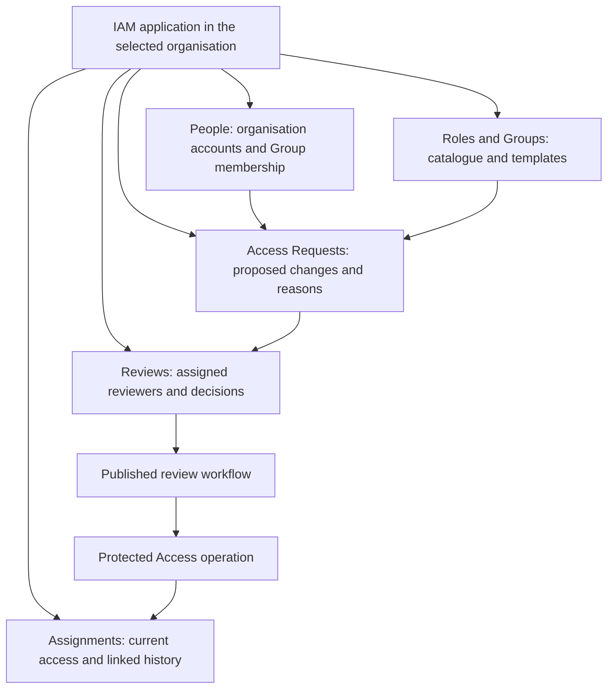
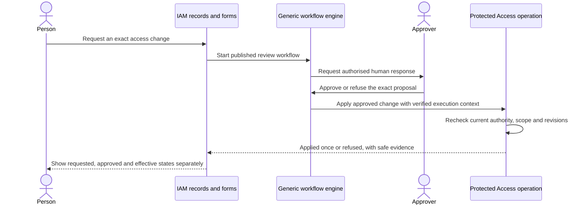
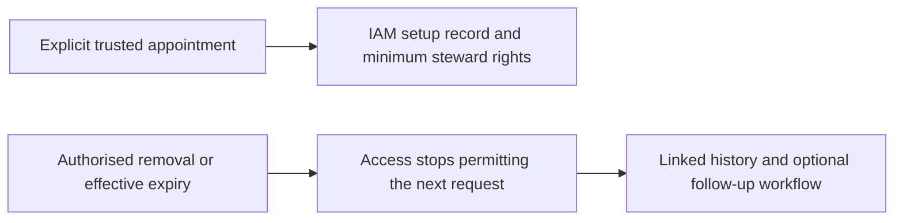

# IAM application: people, access requests and role grants

[Access rules](../04-access-and-permissions.md) · [Workflow rules](../09-workflows-and-pipelines.md) · [Application definitions #72](https://github.com/Abzum-NZ/Abzum-Vortex/issues/72) · [Complete governed journey #267](https://github.com/Abzum-NZ/Abzum-Vortex/issues/267)

## One application for managing access

Use **Roles and Groups** throughout IAM. [Privileged role activation](groups-and-privileged-access.md) adds separate eligible and active views, activation requests, policy-controlled authentication/independent review, and immediate deactivation. Eligibility grants follow the normal governed assignment journey below. A later activation follows its current role policy: required independent approval uses the generic human-input workflow; a policy without that requirement uses the published IAM action without fabricating an approval. Neither path can bypass protected Access checks.

IAM is the Vortex application through which people request, review, grant and remove access. Roles remain owned by an organisation; IAM is their management application, not a new global owner. Each application contributes its permissions and role templates to that organisation's catalogue. People receive assignments through their exact organisation account or a Group in that organisation, never through a global identity shared across organisations.

IAM uses ordinary versioned modules, records, relationships, pages, forms, actions and workflows. It has locked publisher ownership for its protected operation bindings and update lineage, like the other [administration applications](../07-applications-pages-and-themes.md). The core runtime does not recognise its display name, module names or business request states. An authorised binding means a reviewed published binding to a protected operation, not a client-supplied application name or identifier.

Tenant-governance journeys run through an IAM instance in that tenant where the person has an explicitly granted active organisation account and the necessary IAM operating role, as well as the separate tenant capability for the requested action. Tenant-administrator status alone does not open IAM or its request records. No designated global management organisation or implicit first-organisation choice is required. Request and review history stays in the IAM instance's organisation; tenant authority does not expose another organisation's application records. Trusted initial setup explicitly appoints any required account and operating role.

## Records and ownership

| IAM module | Records or views | Authority |
| --- | --- | --- |
| People | Safe organisation-account directory and Group membership views; requester, approver and beneficiary links | Existing [Identity](../02-people-organisations-and-sign-in.md) and [Access](../04-access-and-permissions.md) facts, not a copied user directory |
| Roles and Groups | Available permissions, organisation roles, supplied templates, Groups and delegated management scope | Protected organisation catalogue through [#32](https://github.com/Abzum-NZ/Abzum-Vortex/issues/32), [#33](https://github.com/Abzum-NZ/Abzum-Vortex/issues/33) and [#40](https://github.com/Abzum-NZ/Abzum-Vortex/issues/40) |
| Access Requests | Request, proposed change items, reason, target account or Group, role and permission version, application context, start and expiry | Ordinary application records describing intent; they confer no access |
| Reviews | Reviewer links, responses, comments and decision history for the exact proposal | Ordinary application records linked to protected human-input execution evidence; editable display state is not authorisation |
| Assignments | Current effective assignments plus links to requests, reviews, workflow and operation outcomes | Protected live Access read models; historical application records cannot recreate or override an effective assignment |

The records shown in IAM are connected to people by stable organisation-account references. A Group assignment also shows the currently affected members. Global identity is used only to relate the person's accounts, not to transfer grants between them. Exact live assignment facts retain their [protected Access contracts](data-contracts.md#permission-and-role-contracts); do not introduce an independently editable assignment copy merely to render a normal record page.

## Grant and approval workflow

Every user-facing role grant goes through an IAM action and its governed workflow. This includes direct or Group assignment, Group membership that adds access, role edits that expand current assignments, application-template acceptance or reactivation, invitations with intended assignments and onward delegation. Tenant-administrator grants use the same IAM experience with separately checked tenant-governance authority; tenant authority never substitutes for an organisation role.

Use the generic [human-input step](../09-workflows-and-pipelines.md#asking-a-person), not a core role-approval node or a second approval engine. The default is one currently authorised approver within their delegated scope. Additional independent review steps may be configured through the governed application workflow; approval never enlarges the approver's authority.

Approval covers the exact beneficiary, role or permission meaning, application context, start, expiry and proposal revision. Changing those values invalidates the previous approval. Immediately before applying a change, Access rechecks current actor and approver authority, delegated scope, account and Group state, active catalogue evidence and the last-permanent-steward safeguard. Losing authority during a wait prevents the later grant.

The protected operation consumes verified action/workflow context and the corresponding protected human response, not an editable `approved` flag, supplied approver identifier or unverified workflow identifier. A copied request, import, direct URL, ordinary record update or MCP call cannot bypass this path. Private mutation helpers remain internal; other applications request changes through IAM's published interface instead of exposing parallel assignment endpoints. These restrictions are enforced through generic published-operation bindings and current Access rules, never an `IAM` name check.

Retries apply an accepted change once. A refused, cancelled, expired, changed or failed request gives no access. An approved request is not shown as effective until the protected operation succeeds; historical approval never overrides current revocation or expiry. Workflow outages leave grants pending, not implicitly approved.

## Setup and removal

The first administrator cannot require approval from an administrator who does not yet exist. IAM therefore includes a guided setup journey over the narrow [trusted appointment and adoption operation #30](https://github.com/Abzum-NZ/Abzum-Vortex/issues/30). It explicitly names the steward and records the setup outcome. The core appointment supplies the documented management snapshot and delegation. The complete IAM setup also explicitly accepts the minimum operating role from the exact governed IAM release, so the steward can enter IAM and use its necessary request/review and management views. This is a separate version-pinned application assignment, not a wildcard, a new hardcoded platform permission or access to unrelated applications. The trusted setup authority is limited to this appointment and exact reviewed operating-role handoff; it cannot select arbitrary beneficiaries or application grants.

This synchronous setup does not depend on a background workflow already being available. The trusted provisioning boundary supplies the approved setup definition and target; a generic rendered setup form cannot create its own authority. Do not present the organisation as ready for access administration until the account, required catalogue and both management and IAM operating assignments are effective. Partial setup remains unavailable and may be safely resumed through that same bounded setup operation. It is not a second general-purpose granting surface, and cannot infer the owner from first sign-in or tenant status.

Once IAM is active, its necessary operating permissions form part of the permanent-steward availability check. Removing the last steward's IAM operating role, withdrawing the required IAM installation or upgrading it so no steward can use the management journey is refused until an authorised replacement is effective. Store the exact required published role/permission references through the generic protected management binding; never identify them by the IAM display name. [#33](https://github.com/Abzum-NZ/Abzum-Vortex/issues/33) and [#40](https://github.com/Abzum-NZ/Abzum-Vortex/issues/40) supply the assignment safeguard, while [#64](https://github.com/Abzum-NZ/Abzum-Vortex/issues/64) and [#267](https://github.com/Abzum-NZ/Abzum-Vortex/issues/267) activate and prove the application-level handoff. Early service-only stewardship does not claim this later application availability proof.

Authorised revocation runs immediately through IAM's protected action; it does not wait in a grant-approval queue. Expiry, suspension and loss of Group membership are enforced on the next protected request even if workflow execution is unavailable. History and notification workflows may follow removal but cannot delay it. The final permanent steward cannot be removed without an active replacement.

## Delivery and proof

Complete the IAM application definitions and all references before dedicated IAM UI work. [#72](https://github.com/Abzum-NZ/Abzum-Vortex/issues/72) supplies definitions and available views using the generic page runtime. [#267](https://github.com/Abzum-NZ/Abzum-Vortex/issues/267) completes approval, durable workflow and effective-grant journeys after [#76](https://github.com/Abzum-NZ/Abzum-Vortex/issues/76) and [#81](https://github.com/Abzum-NZ/Abzum-Vortex/issues/81). This split avoids making early Access foundations depend on the later workflow engine. Early private service tests do not count as a finished IAM experience and must not ship a temporary direct-grant UI or public endpoint.

Prove the complete journey for two organisations, one identity with separate accounts, direct and Group grants, indirect expansion, stale approvals, revoked approver authority, retries, application withdrawal/reactivation, first-steward setup and immediate removal. [MCP #200](https://github.com/Abzum-NZ/Abzum-Vortex/issues/200) exposes the same IAM actions and approvals, not lower-level bypasses. Record desktop, phone, keyboard, screen-reader and reduced-motion evidence. Request and review data remain ordinary application functionality under the [core contract boundary](core-contract-boundary.md).
