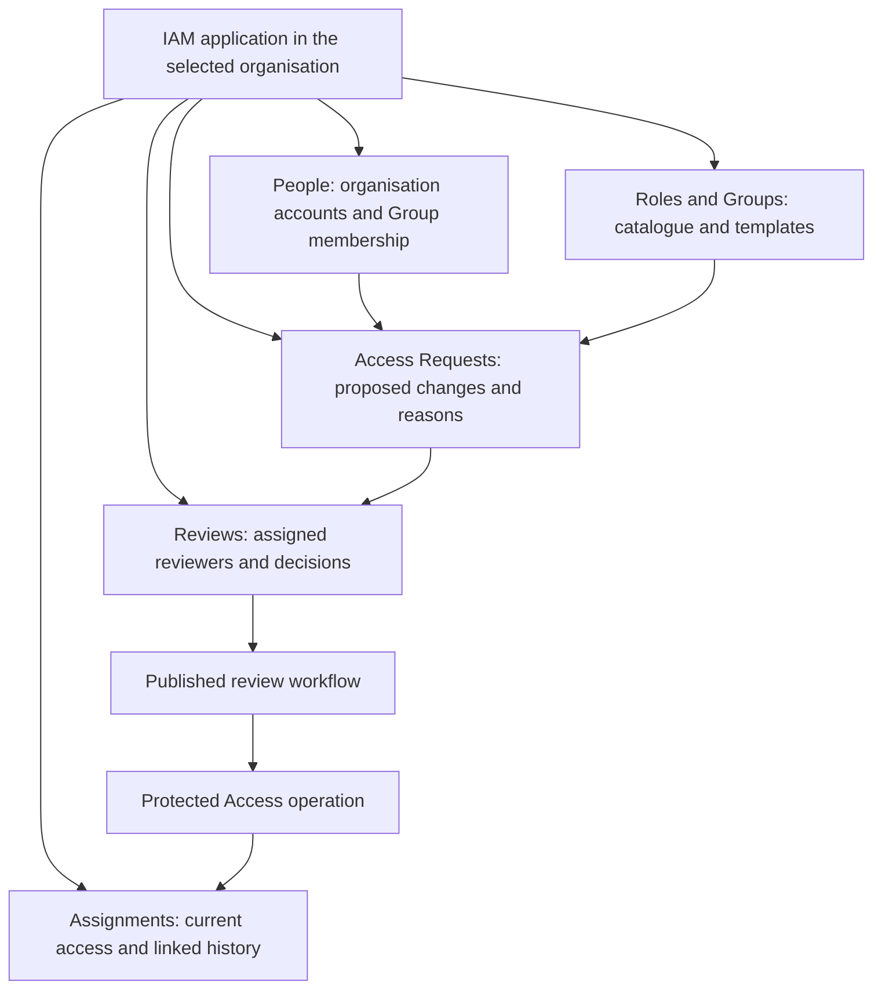
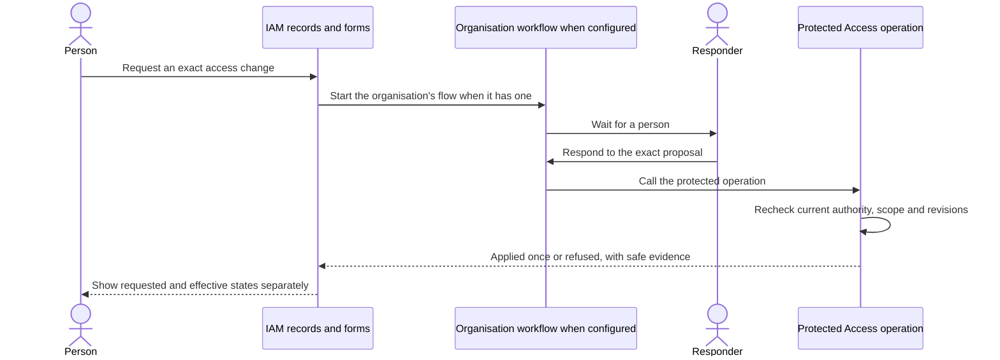
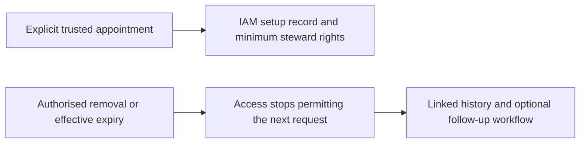

# IAM application: people, access requests and role grants

[Access rules](../04-access-and-permissions.md) · [Workflow rules](../09-workflows-and-pipelines.md) · [Application definitions #72](https://github.com/Abzum-NZ/Abzum-Vortex/issues/72) · [Complete governed journey #267](https://github.com/Abzum-NZ/Abzum-Vortex/issues/267)

## One application for managing access

Use **Roles and Groups** throughout IAM. [Privileged role activation](groups-and-privileged-access.md) adds separate eligible and active views, activation requests, policy-controlled authentication and immediate deactivation. Eligibility grants follow the normal governed assignment journey below. A later activation follows its current role policy preconditions (reason, maximum duration and recent authentication) through the published IAM action. An organisation that wants an approval step builds a Kestra flow with a wait-for-a-person task that then calls that action; neither path can bypass protected Access checks.

IAM is the Vortex application through which people request, review, grant and remove access. Roles remain owned by an organisation; IAM is their management application, not a new global owner. Each application contributes its permissions and role templates to that organisation's catalogue. People receive assignments through their exact organisation account or a Group in that organisation, never through a global identity shared across organisations.

IAM uses ordinary versioned modules, records, relationships, pages, forms, actions and workflows. It is a [system application](../07-applications-pages-and-themes.md#system-applications) with platform-owned protected-operation bindings and update lineage, like the other administration applications. The core runtime does not recognise its display name, module names or business request states. An authorised binding means a reviewed published binding to a protected operation, not a client-supplied application name or identifier.

Tenant-governance journeys run through an IAM instance in that tenant where the person has an explicitly granted active organisation account and the necessary IAM operating role, as well as the separate tenant capability for the requested action. Tenant-administrator status alone does not open IAM or its request records. No designated global management organisation or implicit first-organisation choice is required. Request and review history stays in the IAM instance's organisation; tenant authority does not expose another organisation's application records. Trusted initial setup explicitly appoints any required account and operating role.

## Records and ownership

| IAM module | Records or views | Authority |
| --- | --- | --- |
| People | Read-only system record type for organisation accounts and Group membership; requester and beneficiary links are ordinary links to it, and organisation-added fields reuse the system module's extension point | Existing [Identity](../02-people-organisations-and-sign-in.md) and [Access](../04-access-and-permissions.md) facts, not a copied user directory |
| Roles and Groups | Read-only system record types for available permissions, organisation roles, supplied templates, Groups and delegated management scope | Protected organisation catalogue through [#32](https://github.com/Abzum-NZ/Abzum-Vortex/issues/32), [#33](https://github.com/Abzum-NZ/Abzum-Vortex/issues/33) and [#40](https://github.com/Abzum-NZ/Abzum-Vortex/issues/40) |
| Access Requests | Request, proposed change items, reason, target account or Group, role and permission version, application context, start and expiry | Ordinary application records describing intent; they confer no access |
| Reviews | Human-input responses, comments and history for the exact proposal | Ordinary application records linked to generic published human-input execution evidence; editable display state is not authorisation |
| Assignments | Read-only system record type for current effective assignments, plus links to requests, reviews, workflow and operation outcomes | Protected live Access facts read through the one [query path](../10-queries-reports-search.md#one-read-path); historical application records cannot recreate or override an effective assignment |

The system record types above are read through the one [query path](../10-queries-reports-search.md#one-read-path) under the viewer's current authority; IAM never caches or copies them, and only the protected operations below change their protected facts. They are never shared across organisations or written as ordinary records. The records shown in IAM are connected to people by stable organisation-account references. A link to a person or a group is an ordinary link to the People or Group system record type, and an organisation may add its own extension fields to those system record types through the system module's extension points. A Group assignment also shows the currently affected members. Global identity is used only to relate the person's accounts, not to transfer grants between them. Exact live assignment facts retain their [protected Access contracts](data-contracts.md#permission-and-role-contracts); do not introduce an independently editable assignment copy merely to render a normal record page.

## Initial application setup

Phase 6 includes bounded initial application setup under [#72](https://github.com/Abzum-NZ/Abzum-Vortex/issues/72). App coordinates installation and Access owns the protected initial-operating-rights operation. Existing tenant provisioning nominates the first steward but does not already grant business-application roles.

The new operation accepts the original tenant/organisation provisioning receipt, nominated active organisation account, expected setup revision and one server-configured manifest containing the exact organisation, account, initial shipped application releases, operating roles and permission scope. Freeze the manifest identity and fingerprint against the receipt and revision before the first setup mutation. A retry returns or resumes the recorded outcome only for that same receipt, revision and manifest; changing its beneficiary, releases or permissions is not a retry. A dedicated configured application-setup capability authorizes this operation; a tenant operator or application display name is not general role-grant authority.

The Access composition resolves the exact protected role/assignment/management requirements, applies only that frozen scope and records its rights outcome atomically through the existing private coordinators and Activity writer. It rechecks current nomination, account, role/release facts and revisions and preserves a usable permanent management steward. Access imports neither App nor Page; it returns a typed rights outcome to App. Setup cannot be used for later permission expansion or arbitrary role administration.

The [#327](https://github.com/Abzum-NZ/Abzum-Vortex/issues/327) development setup command selects the fixed shipped manifest and calls App's protected setup composition. App installs/selects the exact releases through the existing Module lifecycle and invokes the narrow Access rights operation. Incomplete setup remains resumable against the fixed manifest and does not advertise usable access before installation and operating rights are effective. The command is not a browser endpoint and does not write Access tables directly. Normal page and record requests still resolve the signed-in person's current authority. Subsequent user-facing grants and expansions remain with the governed IAM journeys in [#267](https://github.com/Abzum-NZ/Abzum-Vortex/issues/267).

## Grant and approval workflow

The [engine/consumer ownership](../../build-plan/access-consumer-handoffs.md) places concrete activation and invitation-intent invocation in [#267](https://github.com/Abzum-NZ/Abzum-Vortex/issues/267), where genuine published-action, authentication and workflow-execution evidence exists. Reuse the existing private Access writers; do not add an earlier wrapper accepting unverifiable human input or an impersonated account. The protected invocation includes current authority rechecks and atomic Activity, not merely a form around a raw writer.

Every user-facing role grant goes through an IAM action and its governed workflow. This includes direct or Group assignment, Group membership that adds access, role edits that expand current assignments, application-template acceptance or reactivation, invitations with intended assignments and onward delegation. Tenant-administrator grants use the same IAM experience with separately checked tenant-governance authority; tenant authority never substitutes for an organisation role.

The protected operation checks only current authority and its declared preconditions (reason, maximum duration and recent authentication). It has no approval field, performs no approver check and consumes no approval evidence. An organisation that wants an approval step builds a Kestra flow with a wait-for-a-person task that then calls the operation. If approval must be unavoidable, the operation's policy names the published flow that is its only permitted caller; changing that required-caller policy is itself a protected access-administration operation. The operation checks the authority of the flow's run-as actor, never the responder's. Whatever the flow says, it refuses any role or role template containing a permission outside that actor's own delegated scope, because flows are editable definitions.

Use the generic [human-input step](../09-workflows-and-pipelines.md#asking-a-person), not a core role-approval node or a second approval engine. Core neither requires nor checks an approver, so the waiting response is ordinary published-flow evidence rather than core authority, and it never enlarges the responder's authority.

The operation binds the exact beneficiary, role or permission meaning, application context, start, expiry and proposal revision; changing those values refuses a stale application. Immediately before applying a change, Access rechecks current actor authority, delegated scope, account and Group state, active catalogue evidence and the last-permanent-steward safeguard. The operation rechecks its declared reason, maximum duration and recent-authentication preconditions. Losing authority during a wait prevents the later grant.

The protected operation consumes verified action/workflow execution context, not an editable status, a supplied responder identifier or an unverified workflow identifier. A copied request, import, direct URL, ordinary record update or MCP call cannot bypass this path. Private mutation helpers remain internal; other applications request changes through IAM's published interface instead of exposing parallel assignment endpoints. These restrictions are enforced through generic published-operation bindings and current Access rules, never an `IAM` name check.

Retries apply an accepted change once. A refused, cancelled, expired, changed or failed request gives no access. A grant is not shown as effective until the protected operation succeeds; an earlier human response never overrides current revocation or expiry. Workflow outages leave grants pending, not implicitly applied.

## Setup and removal

The first administrator's setup cannot depend on a workflow that needs an authorised responder who does not yet exist. IAM therefore includes a guided setup journey over the narrow [trusted appointment and adoption operation #30](https://github.com/Abzum-NZ/Abzum-Vortex/issues/30). It explicitly names the steward and records the setup outcome. The core appointment supplies the documented management snapshot and delegation. The complete IAM setup also explicitly accepts the minimum operating role from the exact governed IAM release, so the steward can enter IAM and use its necessary request/review and management views. This is a separate version-pinned application assignment, not a wildcard, a new hardcoded platform permission or access to unrelated applications. The trusted setup authority is limited to this appointment and exact reviewed operating-role handoff; it cannot select arbitrary beneficiaries or application grants.

This synchronous setup does not depend on a background workflow already being available. The trusted provisioning boundary supplies the reviewed setup definition and target; a generic rendered setup form cannot create its own authority. Do not present the organisation as ready for access administration until the account, required catalogue and both management and IAM operating assignments are effective. Partial setup remains unavailable and may be safely resumed through that same bounded setup operation. It is not a second general-purpose granting surface, and cannot infer the owner from first sign-in or tenant status.

Once the system applications are installed, the permanent-steward availability safeguard covers the core [platform management permissions](platform-permission-catalogue.md) that let a steward administer the organisation, together with the operating access and application availability needed to use a management journey, and guarantees the organisation always keeps a working way to manage access. Removing the last steward, or upgrading, customising or replacing a system application with a customised copy so that no steward can use a management journey, is refused until an authorised replacement is effective. Store the exact required published role/permission references through the generic protected management binding; never identify them by the IAM display name. [#33](https://github.com/Abzum-NZ/Abzum-Vortex/issues/33) and [#40](https://github.com/Abzum-NZ/Abzum-Vortex/issues/40) supply the assignment safeguard, while [#64](https://github.com/Abzum-NZ/Abzum-Vortex/issues/64) and [#267](https://github.com/Abzum-NZ/Abzum-Vortex/issues/267) activate and prove the application-level handoff. Early service-only stewardship does not claim this later application availability proof.

Authorised revocation runs immediately through IAM's protected action; it does not wait in a workflow queue. Expiry, suspension and loss of Group membership are enforced on the next protected request even if workflow execution is unavailable. History and notification workflows may follow removal but cannot delay it. The final permanent steward cannot be removed without an active replacement.

The initial membership journey uses one inactive state for removal/suspension, with an explicit authorised restore that advances its revision. Restore never resumes an old privileged activation. Revoked role assignments or delegation instead need a new grant, and retired Groups cannot be restored. IAM follows these [protected lifecycle rules](groups-and-privileged-access.md#current-state-checks-and-revocation); its request records must not invent additional access states.

Restore retains the original membership start and expiry: a future-start membership remains scheduled, and an expired membership cannot be restored by stretching its old window. Renewal after expiry closes the old membership and creates a fresh membership with the newly authorised window. Present restore and renewal as different actions, both requiring current authority; neither silently reactivates privileged access.

## Delivery

Complete the IAM application definitions and all references before dedicated IAM UI work. [#72](https://github.com/Abzum-NZ/Abzum-Vortex/issues/72) supplies definitions, initial operating-rights setup and available views using the generic page runtime. [#267](https://github.com/Abzum-NZ/Abzum-Vortex/issues/267) completes the durable-workflow and effective-grant journeys after [#76](https://github.com/Abzum-NZ/Abzum-Vortex/issues/76) and [#81](https://github.com/Abzum-NZ/Abzum-Vortex/issues/81). This split avoids making early Access foundations depend on the later workflow engine. Private helpers alone are not a finished IAM experience and must not become a temporary direct-grant UI or public endpoint.

Implement the complete journey with organisation-separated accounts, direct and Group grants, indirect expansion, stale-proposal refusal, current actor authority, retry handling, application withdrawal/reactivation, explicit first-steward setup and immediate removal. [MCP #200](https://github.com/Abzum-NZ/Abzum-Vortex/issues/200) exposes the same IAM actions and flows. Desktop and phone layouts support keyboard, screen-reader and reduced-motion use. Request and review data remain ordinary application functionality under the [core contract boundary](core-contract-boundary.md); development acceptance follows [code review](../20-quality-and-acceptance.md).
