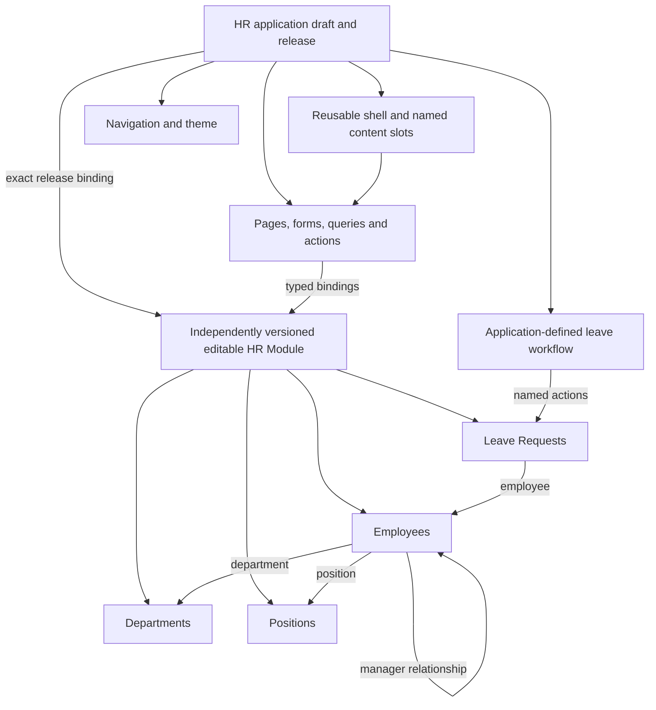
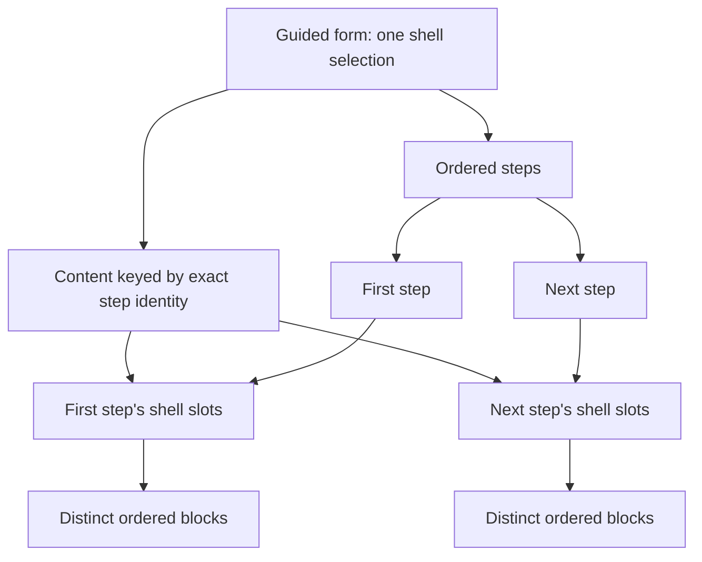
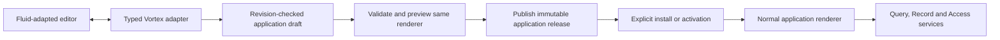
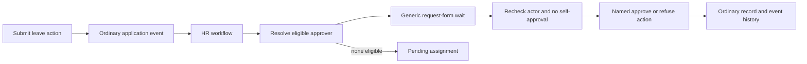

# Page builder contracts and Fluid adaptation

[Specification index](../README.md) · [Pages](../07-applications-pages-and-themes.md) · [Core boundary](core-contract-boundary.md) · [Delivery corrections](../../build-plan/architecture-review.md)

## Status and boundaries

This specifies the single Application contract consolidated under [#249](https://github.com/Abzum-NZ/Abzum-Vortex/issues/249) and the richer data and form bindings in [#250](https://github.com/Abzum-NZ/Abzum-Vortex/issues/250). The surviving Application contract pair (`sourceContractVersion: "2.0.0"`, `validationContractVersion: "2.0.0"`) is the sole format accepted across authoring, validation, compilation, storage, consumer reads, and page rendering.

Adapt the useful authoring experience inspected in Fluid, not its prototype persistence or authority model. Fluid is the local reference at `C:/Apps/fluid`, with [its running editor](http://localhost:3001/builder/edit/projects). Its Puck canvas, outline, palette, inspector, shell/outlet editing and viewport previews are useful. Its filesystem JSON store, seed-on-read-error fallback, label-derived identities, client-only shell locks, unauthorised server actions, global refreshes and static demonstration rows are not Vortex implementations.

The user approved a normal editable HR application as the example. There is no customer-uploaded executable module, HR engine, HR schema in core, or new independent publication kind.

## Composition

The editable HR data definition is an ordinary independently versioned Module with record types, fields and relationships. The Application binds an exact published Module release through the existing compilation, publication and installation contracts. The designer may present the bound Module as part of one authoring workspace, but saves and publishes its changes through that Module's own draft and release operations. Adopting a changed Module requires a new explicit Application binding and deliberate installation upgrade; publishing a Module alone changes no installed application.

Application-contained storage is a row-scope choice on a Module's record type: records carry their exact Application root as well as organisation scope. Organisation-shared storage uses the existing organisation scope. Neither choice makes the data definition owned by its Application, changes its independent Module version, or creates a new publication root. Moving stored records between scopes remains an explicit validated storage migration under the Module/Record installation contracts.

## One canonical page document

A page has its existing permanent identity, route key, type, optional subject, access rule and replacement relationship, with an explicit shell reference, ordered content for declared slots, typed data/form bindings and responsive layout values. Every page type can compose registered blocks; a list page's primary list is a registered block, not a separate hardcoded screen.

A shell is a reusable application-contained layout with its own permanent identity, registered layout blocks and uniquely named content slots. It publishes with the application, never independently. A page binds one shell in the same application or uses the default main-content slot without a custom shell. Navigation and theme are inherited by reference from the application; do not copy them into every page.

A guided form selects one shell for the whole page, but each step owns distinct content. Its ordered `steps` list is the sole navigation order. Canonical composition contains a `stepContent` map keyed by exact permanent step identities. Authored `step_content` instead uses source aliases, which compilation resolves through the existing permanent-identity mapping. With the default shell, each step maps to its main-content placement slot; with an application shell, each step maps to that shell's named content slots. The map must contain exactly the unique declared steps: no missing, extra or duplicate step identity is accepted. Required slots and permitted child categories are checked independently for every step. Step content is not copied into a common page tree or selected by display labels.

Validation, identity extraction, dependency discovery, fingerprints and the editor adapter traverse every step's content. Placement identities remain unique across the application, including shell content and different steps. Every step retains its own identity, blocks and authored order in declared shell slots. The flow/form contract in [#250](https://github.com/Abzum-NZ/Abzum-Vortex/issues/250) and [#58](https://github.com/Abzum-NZ/Abzum-Vortex/issues/58) supports the configured completion outcomes and sequential operations described in [forms and guided forms](../07-applications-pages-and-themes.md#forms-and-guided-forms).

A placement has a permanent identity, registered block and version, schema-validated settings, named child slots, optional binding context, visibility/use constraints and layout overrides. The ordered children of each declared slot are the one source of sibling order. Do not duplicate order in a second page-wide array and a third phone-order field.

Current placement behaviour is explicit: optional authored
`visibility_condition` and `query` compile to `visibilityCondition` and `queryId`.
They use the existing condition compiler and exact field/query reference checks,
including nested shell content and every guided step. Their absence stays absent;
reading or publishing does not inject new defaults into historical definitions.
Changing conditional visibility or query selection has major access/data meaning,
not a presentation-only change. These references preserve configuration; they do
not grant permission to read records or implement the richer runtime bindings in
[#250](https://github.com/Abzum-NZ/Abzum-Vortex/issues/250).

Validation rejects duplicate IDs, cycles, unreachable placements, undefined or multiply assigned slots, disallowed children, excessive depth/size and incompatible block versions. Slot declarations define required/optional content and allowed child categories. Unknown or orphan content produces a repairable error; it is never silently appended elsewhere or discarded. Shell locking is enforced on the server against the permitted draft editing scope.

## Registry and property values

The platform registry is the shared source for editor controls, server validation, runtime rendering and semantic capabilities. Each registration defines:

- Stable identifier and supported version; palette label, category and icon.
- A recursive property schema with labels/help, types, required/default values, constraints and allowed values.
- Declared child slots and their restrictions.
- Data, form and action binding contracts; readable output and accepted input types.
- Responsive capabilities, content sizing and optional safe resizing.
- Accessibility and permitted public-surface behavior.

The platform catalogue declares whether an accessible name is required, optional
or not applicable. Required and optional names identify an exact
`accessibleNamePropertyPath` through declared grouped settings to a text property;
lists, missing properties and non-text targets are invalid. Not-applicable blocks
do not declare that path. Compilation checks the materialised setting after
defaults: a required name must exist and contain non-whitespace text. No engine
accepts a supplied optional name containing only whitespace; optional absence is
allowed. No engine
guesses a setting from words such as “title” or from a block's palette label. This
capability and its path participate in the existing release/catalogue fingerprints.

Text controls accept text; reference pickers accept only typed references. Literal JSON is validated against the registered property schema, not accepted merely because it is JSON. Bounded lists and grouped properties support columns, links and repeated content without arbitrary executable objects. Rich text is structured and restricted to supported safe elements. URLs, assets and icon choices use approved validated forms.

Builders may use text, numbers, choices, safe rich text, token-based colors/typography/spacing and registered layout controls. They cannot supply scripts, JSX, arbitrary CSS, HTML event handlers, network destinations outside the connection policy or runtime component code. Avoid an artificial global limit of forty settings or a rule that every value must be a dropdown; bound document complexity at the validated schema boundary instead.

## Responsive layout and theme

Support desktop, tablet and phone previews using one document. Missing overrides inherit deterministically from the next wider declared layout; materialise defaults at draft creation/migration so compiler output is explicit and reproducible. Content-driven height is the default. A twelve-column grid is one layout choice alongside registered stack, row and shell layouts.

Retain explicit order overrides only where necessary; represent them in one responsive layout structure and validate that every child appears exactly once. Keyboard/focus order must match the meaningful visual reading order.

Theme contracts cover the approved color pairs, typography, spacing, corners, borders, elevation, focus, assets, density and light/dark behavior described in [section 7](../07-applications-pages-and-themes.md#themes). Resolve platform defaults, application tokens and explicitly allowed component overrides once. Do not maintain copied theme values across shell/page files.

Use the existing [motion standard](../07-applications-pages-and-themes.md#animation-implementation-standard), not per-application animation engines. No fixed four-live-block product limit is required: coalesce subscriptions and invalidate only affected data, with bounded requests and measured operational limits. Performance findings do not independently block a release.

## Data context and related records

A record page has a primary subject, but related panels may use other authorised record types. Every binding declares its context:

- Current page record.
- A declared relationship from that context.
- A named query with typed parameters, including permitted values from the current context.
- Current row/item inside a registered repeatable data block.

The query owns its target type and allowed projection. Fields resolve against the declared context, not automatically against the page subject. Validate field existence, type compatibility, relationship path and parameter requirements before publication. Recheck current row/field access during execution. A related panel does not inherit broader access from its parent.

The main form commit action must match its form subject. A related-record action targets an explicit authorised related context. Do not relax the stricter public-page allowlist or the first-release prohibition on cross-source shared-record joins.

## Forms, actions and semantic controls

A business-committing form binding identifies the field or action-input schema, defaults, editable projection, validation, exact commit operation, typed input mapping, expected record revision where applicable and duplicate protection. An input-only reusable form instead declares a response schema and validated output mappings; it needs no owning operation or subject record. Its answers return to the calling flow, which may finish without saving or later execute its configured protected operation nodes. Runtime state separately holds current draft values, dirty/touched state and safe validation results. It never becomes a published definition.

A shared application-definition draft and a private form draft are different things. The former belongs to Definition-service authoring with concurrent revision checks. The latter is scoped to person, organisation, application, form and subject and does not create records/events until submission.

Each configurable action button, menu/row command, record gesture and form submission binds to an application-owned [Frontend Flow](frontend-rule-designer.md#pages-compose-flows-define-actions) using a stable event identity and typed context/input map. The flow's registered nodes delegate to the small typed operation model: query/view control, navigation, form update/validate/submit, named application action, or a closed protected platform-service operation available to an authorised administration application. Define confirmation, input/output and result behaviour once. Pages contain bindings, not hidden saves or handwritten business handlers; no arbitrary RPC or second action runner is introduced.

The Action inspector offers quick one-node flows, Create flow and Use existing flow. Save form defaults require an explicit, unambiguous form and protected commit operation. Defaults are materialised in the application draft and remain editable in its Frontend Flows list. An unconfigured button can remain in a draft but cannot publish. Shared-flow edits show affected controls; replacing/copying bindings checks types and context. Form Enter, Submit and supported Save shortcuts use one default submit binding with duplicate protection. See the [full builder interaction contract](frontend-rule-designer.md#configure-a-component-without-leaving-the-app-builder).

Presentation-only flows may finish without any business commit or artificial record. A Save form node is a convenience over the exact protected commit operation, not a page-side writer. All current actions use explicit flow bindings. Remove obsolete direct-binding readers and conversions; rendering never manufactures default flows.

Tabs, dialogs, drawers, query controls and forms carry semantic IDs. The same operation meaning serves web, keyboard and [MCP](../12-connections-and-interfaces.md#governed-mcp-access). Geometry and animation do not become MCP actions.

### Forms inside a rule flow

The [Frontend Rule Designer Show form node](frontend-rule-designer.md#custom-forms-and-all-or-nothing-submission) selects this same published form representation and renderer, including forms that collect typed action inputs before any subject record exists. It declares defaults, response schema and output mappings to flow variables. There is no second form designer. Dialog/drawer/inline-step placement does not change validation or submission meaning.

Continue validates answers into the private journey draft. Save/Execute nodes determine when business operations commit. In the collect-first pattern all required forms precede one atomic operation; in a sequential flow Cancel or a failed later form preserves earlier confirmed commits. The server validates required answers/path, current authority and expected revisions instead of trusting a next-node claim. No request or transaction spans human input. Reuse the scoped draft revisions and operation outcomes planned in [#68](https://github.com/Abzum-NZ/Abzum-Vortex/issues/68) and [#47](https://github.com/Abzum-NZ/Abzum-Vortex/issues/47)/[#50](https://github.com/Abzum-NZ/Abzum-Vortex/issues/50) to resume safely; no separate durable frontend scheduler.

The typed draft scope includes person, organisation, installation, exact flow/form/node versions and optional subject. Stale installation versions require restart rather than silently combining answers with changed definitions. Invalid, duplicate, concurrent and revoked-access submissions have safe outcomes. Semantic controls expose Continue, Cancel, final Submit, current fields and validation to web and authorised MCP clients through the same contract. Durable workflow requests reuse this renderer and draft capability through [#81](https://github.com/Abzum-NZ/Abzum-Vortex/issues/81) and [#83](https://github.com/Abzum-NZ/Abzum-Vortex/issues/83), not an open database transaction.

## Draft, preview, publication and activation

Save updates the draft only. Preview renders that exact draft revision under current permissions and does not silently show an older live page. Preview does not bypass access or perform real business mutations by default; simulated interactions are labelled. Publication creates immutable content; activation deliberately selects the installed release. Neither save nor publication silently changes existing consumers.

Use the same registered React components for preview and live rendering. Puck is strictly an internal authoring adapter implemented in `studio/src/vortex-puck-adapter.ts`. It maps bidirectionally between native Vortex page structures (`ApplicationShellV2`, `PlacementSlotV2`, `PlacementV2`) and Puck editor data (`Data`, `Content`). Puck's private representation—including its root object, content array, dropzones, and library-specific data wrappers—is transient and internal to the authoring canvas. It is never stored in Definition drafts, recorded in published releases, returned by consumer reads, or exposed through public or MCP contracts. Vortex validates and persists solely the native Application contract. Follow [Puck slot guidance](https://puckeditor.com/docs/guides/migrations/dropzones-to-slots) and [Next.js layouts](https://nextjs.org/docs/app/getting-started/layouts-and-pages). Preserve server-side service boundaries and keep interactive canvas code in client components.

Before copying source, inventory Fluid-owned code, third-party licenses and assets. Copy only required generic authoring/components; do not import its demo applications, broad local MCP server or entire dependency tree. Local tabs/drafts must be scoped by current account, organisation, app and revision; do not persist sensitive HR labels in unscoped browser storage.

Follow the [inspected builder integration map](../../build-plan/fluid-integration-map.md) when adapting the canvas, palette, inspector, shell editing and preview controls. The map identifies which prototype connections must be replaced and the owning tasks for each. The implementation supplies revision handling, permissions, persistence, keyboard control and semantic operations.

## Current representation

Vortex is a new application. The complete shell, slot, nested placement, guided-step, typed setting and responsive layout model is the sole Application representation across the platform. There is no Application V1 format, no dual-format representation, no V1-to-V2 conversion path, and no legacy fallback reader. All contracts, the compiler, Definition storage, history, restore, consumer reads, Page capability projection, installation provisioning, and the Puck adapter operate exclusively on the surviving `2.0.0` contract pair (`sourceContractVersion: "2.0.0"`, `validationContractVersion: "2.0.0"`).

The current draft uses revision-checked Definition save with `applicationDraftV2Schema`. Shell and slot aliases resolve to permanent source identities. Duplicate identities, stale revisions and invalid mappings refuse the whole save. Saving modifies only the editable draft and does not publish or select an installed release.

Publication stores the exact authored source (`applicationSourceDocumentV2Schema`), canonical content (`applicationContentV2Schema`), canonical document (`applicationCanonicalDocumentV2Schema`), and declared current contract metadata (`publishedApplicationDefinitionSchema` / `publishedApplicationDefinitionV2Schema` with validation contract version `2.0.0`). The source and validation metadata must agree with the decoder; unknown formats, version mismatches, or legacy structures are refused with explicit errors (`UNKNOWN_APPLICATION_SOURCE_CONTRACT_VERSION`, `UNKNOWN_APPLICATION_VALIDATION_CONTRACT_VERSION`, or `APPLICATION_SOURCE_METADATA_MISMATCH`). Immutable release identity, dependency manifests, canonical fingerprints (content fingerprint and resolution-snapshot fingerprint) and explicit installation selection remain strict product behavior. They do not require a second platform format or an old-reader compatibility service.

History and restore operate exclusively on the surviving `2.0.0` representation. Release history is an immutable, append-only ledger of published versions. History listing reads immutable release metadata without returning raw source or content. Restore reads the exact release's stored authored source, verifies stored release integrity (`selectApplicationContractPair`), extracts identity requirements from the verified source, and creates an editable draft with complete restore provenance (`restoredFromReleaseRevision`, `restoredFromSourceFingerprint`, `restoredBy`, `restoredAt`, `restoreCorrelationId`). Restore never rewrites publication history, creates a release, advances the current discovery pointer, or retargets existing consumers pinned to a specific release revision.

Puck is strictly an internal authoring adapter in Studio. Its private representation is not the stored or public Vortex contract, and is never exposed in Definition drafts, published releases, or consumer read models.

Typed placement visibility and query selection remain first-class properties. Richer data/form/flow bindings belong to [#250](https://github.com/Abzum-NZ/Abzum-Vortex/issues/250). No setting bag or editor-specific JSON may replace these semantics.

Review the implementation against [code-review acceptance](../20-quality-and-acceptance.md). No compatibility conversion, database proof or hosted verification is required for development completion.

## HR example policy

The HR application in [#251](https://github.com/Abzum-NZ/Abzum-Vortex/issues/251) is an ordinary editable example, not a platform rule.

| Area             | Approved example behavior                                                                                                                                                                  |
| ---------------- | ------------------------------------------------------------------------------------------------------------------------------------------------------------------------------------------ |
| Records          | Employees, Departments, Positions and Leave Requests, with explicit relationships.                                                                                                         |
| Employee         | Own private employee details and own leave requests. Any broader directory projection must be explicitly allowed by the application definition.                                            |
| Manager          | Permitted direct-report details and their leave requests through the declared manager relationship.                                                                                        |
| HR administrator | Manage this HR application's records within the current organisation. No implicit platform administration.                                                                                 |
| Leave request    | Employee submits; current designated manager approves/refuses; an authorised HR administrator is the fallback when there is no eligible manager or reassignment is required.               |
| Self-approval    | A requester cannot approve their own request, even if they have a manager role; route to another authorised HR administrator. If none exists, leave pending with a clear assignment issue. |
| Limits           | No payroll, statutory policy, accrued balances, leave entitlement or country-specific calculation.                                                                                         |

The user approved the no-self-approval rule for this example; it is not a legal or platform requirement. All actor selection, statuses, access conditions and fallback behavior live in editable application definitions. A department move or manager change must affect subsequent authority checks; an already-open screen is not authority.

Write the full HR JSON fixture set first, including the future workflow definition. Phase 7 delivers the editable HR application; Phase 9 adds its workflow through the generic workflow owners.

### Approvals are workflows, not custom code

Leave submission emits an ordinary application event. The HR workflow resolves an eligible responder from declared relationships/roles, uses the generic `request_form` wait, branches on the validated response and invokes the named approve/refuse action. Request/response history and status are ordinary HR records. The generic action precondition repeats current responder eligibility and requester-versus-actor checks so a direct call cannot bypass them. No custom JavaScript, HR-specific route, approval node or privileged approval table is required.

[Access #34](https://github.com/Abzum-NZ/Abzum-Vortex/issues/34), [conditions #57](https://github.com/Abzum-NZ/Abzum-Vortex/issues/57) and [bindings #250](https://github.com/Abzum-NZ/Abzum-Vortex/issues/250) must supply the generic actor-relative relationship/condition support already promised by section 4. Trusted current-account parameters come from the server, never from a form value purporting to identify the approver.

## Literal data is not a reference

Acceptance by a JSON value contract does not authorize every registered control to accept every JSON shape. Existing scalar controls continue to reject object/array values that do not match their declared types. [#249](https://github.com/Abzum-NZ/Abzum-Vortex/issues/249) adds the richer setting declarations and publication validation; [#258](https://github.com/Abzum-NZ/Abzum-Vortex/issues/258) must not weaken current control validation to imitate that later feature. User-defined input-map keys are also data labels, not platform reference properties.

Reference traversal follows declared contract positions and discriminated value kinds. An explicitly literal value remains data even if it contains keys named `state`, `qualifiedKey`, `rootId` or `fieldId`. Do not infer platform authority or unresolved references from arbitrary object shape. Literal content still participates in schema validation, fingerprints and its owning component's version-impact policy. [#258](https://github.com/Abzum-NZ/Abzum-Vortex/issues/258) corrects the delivered shape-based scanner before [#249](https://github.com/Abzum-NZ/Abzum-Vortex/issues/249) expands the representation.

## Component data and managed-flow bindings

A data component binds a [configured data flow](frontend-rule-designer.md#component-data-flows), not a hidden fetch handler. Default Start → Query records → Return data can be extended with typed transforms, conditions and protected write nodes. Record identity, revisions, source/capability data and query pagination remain authoritative. The Data inspector exposes exact query/parameter/column maps and declared load/refresh/filter/sort/page events; rendering alone executes no writes.

[Managed-flow locks](frontend-rule-designer.md#managed-and-application-owned-flows) are enforced by server-owned definition permissions. Customer configuration is limited to declared public inputs and typed extension slots; private graph internals are absent from client/editor/MCP projections. Node Run as settings reference independently authorised [execution bindings](frontend-rule-designer.md#node-execution-identity), not a client-supplied identity or role label. Effects and partial outcomes are shown truthfully in preview and live states.
