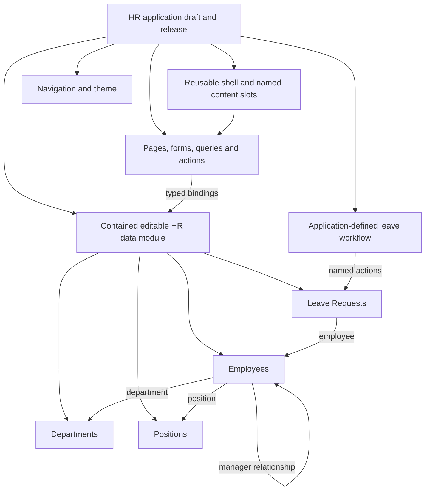
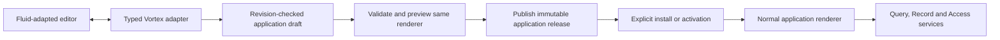
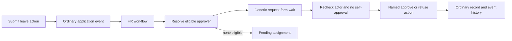

# Page builder contracts and Fluid adaptation

[Specification index](../README.md) · [Pages](../07-applications-pages-and-themes.md) · [Core boundary](core-contract-boundary.md) · [Delivery corrections](../../build-plan/architecture-review.md)

## Status and boundaries

This specifies the required contract completion in [#249](https://github.com/Abzum-NZ/Abzum-Vortex/issues/249) and [#250](https://github.com/Abzum-NZ/Abzum-Vortex/issues/250). The existing TypeScript page contracts are not yet sufficient to implement this design. Do not mistake this specification update for delivered engine code.

Adapt the useful authoring experience inspected in Fluid, not its prototype persistence or authority model. Fluid is the local reference at `C:/Apps/fluid`, with [its running editor](http://localhost:3001/builder/edit/projects). Its Puck canvas, outline, palette, inspector, shell/outlet editing and viewport previews are useful. Its filesystem JSON store, seed-on-read-error fallback, label-derived identities, client-only shell locks, unauthorised server actions, global refreshes and static demonstration rows are not Vortex implementations.

The user approved a normal editable HR application as the example. There is no customer-uploaded executable module, HR engine, HR schema in core, or new independent publication kind.

## Composition

An application-contained editable data module means the existing application-contained definition capability presented as a coherent authoring group. It does not introduce a third publication root. Its edits release with its owning application. An independently reusable module remains a separately versioned Module with an exact application binding. Moving between those ownership models is an explicit copy/extraction and migration operation, never a label change.

## One canonical page document

A page has its existing permanent identity, route key, type, optional subject, access rule and replacement relationship. Add a shell reference, ordered content for declared slots, typed data/form bindings and responsive layout values. Every page type can compose registered blocks; a list page's primary list is a registered block, not a separate hardcoded screen.

A shell is a reusable application-contained layout with its own permanent identity, registered layout blocks and uniquely named content slots. It publishes with the application, never independently. A page binds one shell in the same application or uses the default main-content slot without a custom shell. Navigation and theme are inherited by reference from the application; do not copy them into every page.

A placement has a permanent identity, registered block and version, schema-validated settings, named child slots, optional binding context, visibility/use constraints and layout overrides. The ordered children of each declared slot are the one source of sibling order. Do not duplicate order in a second page-wide array and a third phone-order field.

Validation rejects duplicate IDs, cycles, unreachable placements, undefined or multiply assigned slots, disallowed children, excessive depth/size and incompatible block versions. Slot declarations define required/optional content and allowed child categories. Unknown or orphan content produces a repairable error; it is never silently appended elsewhere or discarded. Shell locking is enforced on the server against the permitted draft editing scope.

## Registry and property values

The platform registry is the shared source for editor controls, server validation, runtime rendering and semantic capabilities. Each registration defines:

- Stable identifier and supported version; palette label, category and icon.
- A recursive property schema with labels/help, types, required/default values, constraints and allowed values.
- Declared child slots and their restrictions.
- Data, form and action binding contracts; readable output and accepted input types.
- Responsive capabilities, content sizing and optional safe resizing.
- Accessibility and permitted public-surface behavior.

Text controls accept text; reference pickers accept only typed references. Literal JSON is validated against the registered property schema, not accepted merely because it is JSON. Bounded lists and grouped properties support columns, links and repeated content without arbitrary executable objects. Rich text is structured and restricted to supported safe elements. URLs, assets and icon choices use approved validated forms.

Builders may use text, numbers, choices, safe rich text, token-based colors/typography/spacing and registered layout controls. They cannot supply scripts, JSX, arbitrary CSS, HTML event handlers, network destinations outside the connection policy or runtime component code. Avoid an artificial global limit of forty settings or a rule that every value must be a dropdown; bound document complexity at the validated schema boundary instead.

## Responsive layout and theme

Support desktop, tablet and phone previews using one document. Missing overrides inherit deterministically from the next wider declared layout; materialise defaults at draft creation/migration so compiler output is explicit and reproducible. Content-driven height is the default. A twelve-column grid is one layout choice alongside registered stack, row and shell layouts.

Retain explicit order overrides only where necessary; represent them in one responsive layout structure and validate that every child appears exactly once. Keyboard/focus order must match the meaningful visual reading order.

Theme contracts cover the approved color pairs, typography, spacing, corners, borders, elevation, focus, assets, density and light/dark behavior described in [section 7](../07-applications-pages-and-themes.md#themes). Resolve platform defaults, application tokens and explicitly allowed component overrides once. Do not maintain copied theme values across shell/page files.

Use the existing [motion standard](../07-applications-pages-and-themes.md#animation-implementation-standard), not per-application animation engines. No fixed four-live-block product limit is required: coalesce subscriptions and invalidate only affected data, with bounded requests and measured operational limits. Performance findings do not independently block a release.

## Data context and related records

A record page has a primary subject, but related panels may use other authorised record types. Every binding declares its context:

- Current page record.
- A declared relationship from that context.
- A named query with typed parameters, including permitted values from the current context.
- Current row/item inside a registered repeatable data block.

The query owns its target type and allowed projection. Fields resolve against the declared context, not automatically against the page subject. Validate field existence, type compatibility, relationship path and parameter requirements before publication. Recheck current row/field access during execution. A related panel does not inherit broader access from its parent.

The main form commit action must match its form subject. A related-record action targets an explicit authorised related context. Do not relax the stricter public-page allowlist or the first-release prohibition on cross-source shared-record joins.

## Forms, actions and semantic controls

A form binding identifies the field or action-input schema, defaults, editable projection, validation, commit operation, typed input mapping, expected record revision and duplicate protection. Runtime state separately holds current draft values, dirty/touched state and safe validation results. It never becomes a published definition.

A shared application-definition draft and a private form draft are different things. The former belongs to Definition-service authoring with concurrent revision checks. The latter is scoped to person, organisation, application, form and subject and does not create records/events until submission.

Buttons and controls bind to a small typed operation model: query/view control, navigation, form update/validate/submit, named application action, or a closed protected platform-service operation available to an authorised administration application. Define confirmation, input/output and result behavior once. There is no arbitrary RPC, second action runner or handwritten business-only click handler.

Tabs, dialogs, drawers, query controls and forms carry semantic IDs. The same operation meaning serves web, keyboard and [MCP](../12-connections-and-interfaces.md#governed-mcp-access). Geometry and animation do not become MCP actions.

## Draft, preview, publication and activation

Save updates the draft only. Preview renders that exact draft revision under current permissions and does not silently show an older live page. Preview does not bypass access or perform real business mutations by default; simulated interactions are labelled. Publication creates immutable content; activation deliberately selects the installed release. Neither save nor publication silently changes existing consumers.

Use the same registered React components for preview and live rendering. Puck is an internal authoring adapter; its private fields, slot conventions and library version are not public Vortex storage contracts. Follow [Puck slot guidance](https://puckeditor.com/docs/guides/migrations/dropzones-to-slots) and [Next.js layouts](https://nextjs.org/docs/app/getting-started/layouts-and-pages). Preserve server-side service boundaries and keep interactive canvas code in client components.

Before copying source, inventory Fluid-owned code, third-party licenses and assets. Copy only required generic authoring/components; do not import its demo applications, broad local MCP server or entire dependency tree. Local tabs/drafts must be scoped by current account, organisation, app and revision; do not persist sensitive HR labels in unscoped browser storage.

## Compatibility and proof

Version the new representation explicitly. Legacy flat pages migrate into the default main slot in a new draft through a deterministic documented conversion. Previously published releases remain immutable and retain a supported reader; never reinterpret them silently with new defaults.

Update source schemas, canonical schemas, registry, compiler/reference traversal, provenance, version comparison, catalogue snapshots, Definition-service reads/restores and fixtures together. Presentation-only layout changes are patch impact; access, operation or data-meaning changes follow the existing major/minor rules.

Required evidence includes positive and negative contract cases, lossless adapter round trips, old-release reads, two-organisation isolation, simultaneous draft edits, related panels, private form state, safe public pages, desktop/tablet/phone rendering, keyboard/focus behavior and web-independent semantic operation tests.

## HR example policy

The HR application in [#251](https://github.com/Abzum-NZ/Abzum-Vortex/issues/251) is an ordinary editable example, not a platform rule.

| Area | Approved example behavior |
|---|---|
| Records | Employees, Departments, Positions and Leave Requests, with explicit relationships. |
| Employee | Own private employee details and own leave requests. Any broader directory projection must be explicitly allowed by the application definition. |
| Manager | Permitted direct-report details and their leave requests through the declared manager relationship. |
| HR administrator | Manage this HR application's records within the current organisation. No implicit platform administration. |
| Leave request | Employee submits; current designated manager approves/refuses; an authorised HR administrator is the fallback when there is no eligible manager or reassignment is required. |
| Self-approval | A requester cannot approve their own request, even if they have a manager role; route to another authorised HR administrator. If none exists, leave pending with a clear assignment issue. |
| Limits | No payroll, statutory policy, accrued balances, leave entitlement or country-specific calculation. |

The user approved the no-self-approval rule for this example; it is not a legal or platform requirement. All actor selection, statuses, access conditions and fallback behavior live in editable application definitions. A department move or manager change must affect subsequent authority checks; an already-open screen is not authority.

Write the full HR JSON fixture set first, including the future workflow definition. Phase 6 proves data/form/editor behavior; [#254](https://github.com/Abzum-NZ/Abzum-Vortex/issues/254) proves the workflow and other later capabilities after their real dependencies exist.

### Approvals are workflows, not custom code

Leave submission emits an ordinary application event. The HR workflow resolves an eligible responder from declared relationships/roles, uses the generic `request_form` wait, branches on the validated response and invokes the named approve/refuse action. Request/response history and status are ordinary HR records. The generic action precondition repeats current responder eligibility and requester-versus-actor checks so a direct call cannot bypass them. No custom JavaScript, HR-specific route, approval node or privileged approval table is required.

[Access #34](https://github.com/Abzum-NZ/Abzum-Vortex/issues/34), [conditions #57](https://github.com/Abzum-NZ/Abzum-Vortex/issues/57) and [bindings #250](https://github.com/Abzum-NZ/Abzum-Vortex/issues/250) must supply the generic actor-relative relationship/condition support already promised by section 4. Trusted current-account parameters come from the server, never from a form value purporting to identify the approver.

