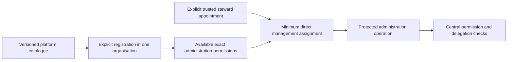

# Platform administration permission catalogue

[Access rules](../04-access-and-permissions.md) · [Permission contracts](data-contracts.md#permission-and-role-contracts) · [Registry implementation #32](https://github.com/Abzum-NZ/Abzum-Vortex/issues/32)

## Purpose and ownership

This initial closed catalogue contains only genuine platform administration permissions needed by [protected administration #30](https://github.com/Abzum-NZ/Abzum-Vortex/issues/30), [roles #33](https://github.com/Abzum-NZ/Abzum-Vortex/issues/33) and [access administration #40](https://github.com/Abzum-NZ/Abzum-Vortex/issues/40). The platform invariant is protecting organisation account, role and runtime administration before an application-specific catalogue exists. It contains no business-application permissions, customer roles or business-record grants.

Catalogue version: `1.0.0`. Permanent owner kind: `platform`. Permanent owner identifier: `cabe121e-0baf-4084-9471-cce915d460a8`. This identifies a permission-catalogue owner, not a customer Module/Application root or global administrator role. Registering it in one organisation creates availability there only and assigns no person or Group.

The UUIDs below are newly allocated permanent identities, not derived from labels. Do not regenerate them during deployment. All entries have `administrative: true`, no `recordTypeId` and no `namedAction`; `actionKind` is the final `read` or `manage` key segment. The exact initial labels and descriptions follow. Display metadata can change through a catalogue version without changing identity or silently expanding permission meaning.

## Initial catalogue

This is the immutable initial `1.0.0` metadata, including its historical terminology. The current user-facing concept is **Groups**. [Compatibility #283](https://github.com/Abzum-NZ/Abzum-Vortex/issues/283) publishes Group-facing display metadata in a forward catalogue revision while preserving the UUIDs, permanent internal keys and authority meaning below. Do not rewrite this historical snapshot or manufacture a permission-continuity break for a terminology-only change. [Privileged role policy](groups-and-privileged-access.md) is separately governed organisation role state, not a changed permission meaning.

| Permanent permission identifier | Key | Label | Description |
| --- | --- | --- | --- |
| `687d5649-62ee-43dd-b684-b8af3a5394c1` | `platform.organization.permissions.read` | View available permissions | View the selected organisation's registered permission catalogue without receiving use or assignment authority. |
| `ca5f56d4-5382-4bf8-9a91-fbfdc77642b2` | `platform.organization.roles.read` | View roles | View the selected organisation's live roles and registered application role templates. |
| `87c96495-c806-4692-9bc2-250ddb10613c` | `platform.organization.roles.manage` | Manage roles | Create, change or retire roles only within the actor's explicit delegated scope. |
| `290ae49f-4cab-4159-9c20-6e664f07d50b` | `platform.organization.teams.read` | View teams | View the selected organisation's Teams and membership administration data. |
| `6185dc64-464b-4776-97dc-c64a6f299550` | `platform.organization.teams.manage` | Manage teams | Manage Teams and memberships subject to delegated scope and permanent-steward safeguards. |
| `9901c0dc-8bac-45c7-be0b-3642cb839bb1` | `platform.organization.assignments.read` | View access assignments | View the selected organisation's role and delegation assignments and their effective scope. |
| `156d01f3-8f80-45fb-8fc8-b31c47dbb1df` | `platform.organization.assignments.manage` | Manage access assignments | Grant, change or revoke use and delegation assignments only within the actor's explicit delegated scope. |
| `02c772e5-2921-4300-ad90-4f5772a7fa46` | `platform.organization.accounts.read` | View organisation accounts | View the selected organisation's safe account-administration information. |
| `630a980c-0ff5-40b1-a329-7326a2122395` | `platform.organization.accounts.manage` | Manage organisation accounts | Change organisation-account lifecycle through the protected operation without changing global identity or removing the final permanent steward. |
| `9300e501-6d56-41b1-b203-3361dbace9bc` | `platform.organization.invitations.read` | View invitations | View safe invitation administration metadata without the raw invitation secret or its stored fingerprint. |
| `c2e03f58-debe-478e-b1e0-a4a8b8f1b9cb` | `platform.organization.invitations.manage` | Manage invitations | Create or revoke invitations through the protected operation; role assignment additionally requires the actor's assignment authority. |
| `6dffcb0b-ded8-4cd5-acc8-c50f7d4269a5` | `platform.organization.runtime_settings.read` | View organisation display settings | View the organisation's default language, time zone, currency, date and number display settings. |
| `c658c254-2884-414a-9012-512c0cfe4b34` | `platform.organization.runtime_settings.manage` | Manage organisation display settings | Change the organisation's validated default display settings through the protected revision-checked operation. |

## Registration is not assignment

The initial steward handoff explicitly assigns this management snapshot plus the separate organisation-wide delegation authority in [stewardship](../04-access-and-permissions.md#initial-organisation-stewardship). Delegation permits governing future registered permissions in the same organisation, but neither it nor these thirteen permissions permits reading business records. Later catalogue additions do not enter the steward's personal use-permission snapshot automatically.

The full [IAM setup](iam-application.md#setup-and-removal) separately accepts the exact application operating role needed to enter IAM and use its management journey. That permission declaration comes from the governed application release, not this core catalogue. It grants no rights to unrelated applications and must be included in the last-steward availability safeguard once IAM is active.

Tenant structural capabilities remain separately scoped by [#30](https://github.com/Abzum-NZ/Abzum-Vortex/issues/30) and cannot satisfy these organisation permissions. Later genuine platform operations add reviewed catalogue entries under their owning tasks. Ordinary applications declare their own permissions through normal Vortex definitions.
