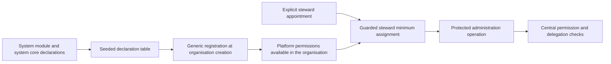

# Platform administration permission declarations

[Access rules](../04-access-and-permissions.md) · [Permission contracts](data-contracts.md#permission-and-role-contracts)

## Purpose and ownership

The current platform administration permission catalogue is version `1.4.0` and contains 22 permissions. Its permanent owner remains `ownerKind = platform` with owner ID `cabe121e-0baf-4084-9471-cce915d460a8`. Changing where a declaration is authored does not change its permission ID, key, authority meaning or stored meaning fingerprint. Registering a platform permission makes it available in one organisation; it does not assign that permission to a person or Group.

Organisation Administration owns the 14 permissions that protect its system record types and management operations. The system core declaration owns the eight platform permissions that have no corresponding system record type: connections, security, support and application building. The permission's owning source is declaration metadata. It does not replace the permanent platform permission owner.

## Owner decisions

These decisions were recorded on 27 September 2026 and define the declaration and registration design:

1. Keep `ownerKind = platform` and owner `cabe121e-0baf-4084-9471-cce915d460a8`. Move only the authoring location. Record the owning system module as metadata. Keep all permission identities and meaning fingerprints unchanged.
2. Add `pinnedPermissionId` for a declared permission's permanent identity. Accept it only in platform system-module declaration sources, including the declaration-only system core.
3. Keep permissions without a system record type in the platform system core declaration: connections, security, support and builder permissions.
4. Register platform permissions from declared data when an organisation is created, independently of module installation.
5. Seed a declaration table through a migration and have one generic registration function read it. Do not keep catalogue JSON in SQL function bodies.
6. Preserve `registration_kind = 'platform'`, the `platform_catalogue` source kind and registration revisions 1-6 as history. Registration revision 7 is the first table-driven revision.
7. Mark the steward minimum in declared data with `stewardMinimum`. Store it as `steward_minimum` in the seeded declaration data, and guard against silently removing the flag or a flagged permission.

## Declaration ownership and registration

The declaration sources and aggregate used by runtime packages are:

| Purpose | Source |
| --- | --- |
| Organisation Administration's 14 platform permissions | `modules/src/organisation-administration/module.ts` |
| The eight permissions without a system record type; declaration only, not an installable module | `modules/src/system-core/platform-permissions.ts` |
| Aggregate platform permission declarations consumed by runtime packages | `modules/src/platform-permissions.ts` in `@vortex/modules` |
| Permission declaration schema only | `contracts/src/permissions.ts` in `@vortex/contracts` |

`@vortex/contracts` keeps the permission declaration schema; it does not import `@vortex/modules`. The `pinnedPermissionId` field preserves an existing permanent ID in these platform declaration sources. `stewardMinimum` marks the 13 permissions required by the permanent-steward safeguard. The existing opaque meaning fingerprint for `platform.organization.connections.manage` stays stored data and is not recalculated or changed when its declaration moves:

`sha256:809b4b3ad29ff61ab5ea73c06504909540b8111a2b3c2e1310559a7e9dc2e31e`

At organisation creation, one generic registration function reads the seeded declaration table and registers the declared platform permissions. This path does not depend on installing Organisation Administration or another module. It preserves `registration_kind = 'platform'` and the `platform_catalogue` source kind. Revisions 1-6 remain immutable history; revision 7 is the first revision registered from the seeded declarations. The revision 7 registration function must not embed catalogue JSON.

### Steward minimum and guard

Exactly the 13 permissions marked `Yes` in the inventory below form the steward's guarded minimum. A migration is refused if it removes the `steward_minimum` field, clears the flag from a protected permission or deletes a flagged declaration. Changing the set requires an explicit, reviewed specification change. The flag describes the required minimum, not every permission a steward may also hold: `platform.organization.connections.manage` is separately added to the current steward setup, but is not part of the guarded 13-permission set.

## Permission inventory

Action kinds and permanent identifiers below match the shipped `1.4.0` catalogue. The owning source identifies the declaration location; every permission retains its platform owner.

| Permanent permission ID | Key | Action kind | Owning source | Steward minimum |
| --- | --- | --- | --- | --- |
| `687d5649-62ee-43dd-b684-b8af3a5394c1` | `platform.organization.permissions.read` | `read` | Organisation Administration | Yes |
| `ca5f56d4-5382-4bf8-9a91-fbfdc77642b2` | `platform.organization.roles.read` | `read` | Organisation Administration | Yes |
| `87c96495-c806-4692-9bc2-250ddb10613c` | `platform.organization.roles.manage` | `manage` | Organisation Administration | Yes |
| `290ae49f-4cab-4159-9c20-6e664f07d50b` | `platform.organization.groups.read` | `read` | Organisation Administration | Yes |
| `6185dc64-464b-4776-97dc-c64a6f299550` | `platform.organization.groups.manage` | `manage` | Organisation Administration | Yes |
| `9901c0dc-8bac-45c7-be0b-3642cb839bb1` | `platform.organization.assignments.read` | `read` | Organisation Administration | Yes |
| `156d01f3-8f80-45fb-8fc8-b31c47dbb1df` | `platform.organization.assignments.manage` | `manage` | Organisation Administration | Yes |
| `02c772e5-2921-4300-ad90-4f5772a7fa46` | `platform.organization.accounts.read` | `read` | Organisation Administration | Yes |
| `630a980c-0ff5-40b1-a329-7326a2122395` | `platform.organization.accounts.manage` | `manage` | Organisation Administration | Yes |
| `9300e501-6d56-41b1-b203-3361dbace9bc` | `platform.organization.invitations.read` | `read` | Organisation Administration | Yes |
| `c2e03f58-debe-478e-b1e0-a4a8b8f1b9cb` | `platform.organization.invitations.manage` | `manage` | Organisation Administration | Yes |
| `6dffcb0b-ded8-4cd5-acc8-c50f7d4269a5` | `platform.organization.runtime_settings.read` | `read` | Organisation Administration | Yes |
| `c658c254-2884-414a-9012-512c0cfe4b34` | `platform.organization.runtime_settings.manage` | `manage` | Organisation Administration | Yes |
| `7ecd3304-f16c-47d4-94db-0964980091ba` | `platform.organization.applications.manage` | `manage` | Organisation Administration | No |
| `ec2908a1-f3cd-4c4a-8bf7-91bffbf4cb3d` | `platform.organization.connections.manage` | `manage` | System core | No |
| `e85c2232-2ed7-4ce8-b1e5-7e2ad8e2b847` | `platform.security.identities.disable` | `manage` | System core | No |
| `014d2898-1969-4434-805c-eeb0f0e6f797` | `platform.support.access.request` | `manage` | System core | No |
| `07e4653c-d358-489f-8067-46e085d99478` | `platform.organization.support.approve` | `manage` | System core | No |
| `0548c061-b1a9-48e5-a04a-eb1d0dae0644` | `platform.organization.definition_drafts.manage` | `manage` | System core | No |
| `dfdd5aba-2b85-4169-b570-92be284e7b5c` | `platform.organization.definition_releases.manage` | `manage` | System core | No |
| `d1be247f-094d-47c1-a38d-762290868c91` | `platform.organization.custom_code.manage` | `manage` | System core | No |
| `eaade6fd-7390-44d2-a7ef-343324c7384a` | `platform.organization.system_applications.manage` | `manage` | System core | No |

## History

The shipped `1.4.0` catalogue currently mirrors platform registration revision 6. The current declarations preserve the permanent identities and meanings recorded by earlier revisions. Revisions 1-6 remain as history, and revision 7 registers the current declared set from the seeded table at organisation creation. This replaces the separate per-version adoption path; it does not change which permissions are available or assigned.

### Expected catalogue and exactness

The private `vortex_access.read_platform_permission_declaration_catalogue_internal(bigint)` producer returns the complete expected permission set for one supported platform registration revision. Passing `NULL` selects the current declared target, `greatest(7, max(first_revision))`, for the fixed platform owner. A non-null request supports historical revisions 1-6, revision 7, and revision 8 or later only when a declaration has that exact `first_revision`. Membership is the fixed-owner declarations whose `first_revision` is at most the requested revision. Unsupported, empty, duplicate, or unrepresentable sets return no rows; named actions are unrepresentable by the catalogue entry shape and refuse the whole set. Revision 7 keeps source version `1.4.0`; additive revision `r >= 7` uses `1.` followed by `r - 3` and `.0` (for example, revision 8 is `1.5.0`).

The producer is a `STABLE SECURITY DEFINER` owned by `vortex_access_owner`, with an empty `search_path`. Its explicit `EXECUTE` grant is limited to `postgres`; API and unrelated runtime roles are explicitly revoked. It reads only the existing guarded declaration table at the fixed platform owner scope. It adds no declaration-table grants, schema privileges, or role membership. This full-catalogue producer is distinct from the private guarded-steward-minimum reader.

Revisions 1-6 retain their shipped source version, fingerprint, and entry count: revision 1 is `1.0.0` / 13 entries; revision 2 is `1.0.1` / 13; revision 3 is `1.1.0` / 14; revision 4 is `1.2.0` / 15; revision 5 is `1.3.0` / 18; and revision 6 is `1.4.0` / 22. Their historical fingerprints remain fixed constants. Revision 1 also preserves the historical Teams labels and descriptions for the two Groups permissions. The table-driven revision 7 and later fingerprints use a separate SQL framing contract: the `vortex.platform-permission-catalogue/v1` domain plus LF, then length-framed UTF-8 text and explicit null frames for platform scope, fixed owner, version, count, and each expected catalogue entry. The 22 fields are ordered as application root, owner kind and ID, permission ID and key, label and description, record type, record scope, field policy, action kind and named action, administrative flag, source kind, source definition key and root, source version and revision, validation version, content and resolution fingerprints, and meaning fingerprint. Entries sort by permission key under the `C` collation and then permission ID. Declaration `source_module_key`, `steward_minimum`, and `first_revision` are not hash fields; `first_revision` controls membership. This framing is neither JSON nor a hash of mutable registration claims; the opaque meaning fingerprint remains stored data.

The generic `platform_permission_catalogue_revision_is_exact(uuid, bigint)` remains a read-only `STABLE SECURITY INVOKER` check with its existing signature, owner, and ACL. It requires one active current fixed-owner registration and matching immutable current history, attribution, source metadata, and fingerprints, then proves the complete scoped entry set in both directions against the private expected producer. For current revisions 4, 5, and 6 it also requires the retained predecessor snapshots 3/14 entries, 4/15, and 5/18 respectively. Each predecessor identity must have exactly one retained current row; every stored catalogue column must match with null-safe equality except `registration_revision`, `source_version`, and `source_catalogue_fingerprint`. Current 1-3 retain their pre-continuity validation phase. Current 4-6 and 7+ require the full available continuity set at the current revision. Direct-new revision 7 or later does not fabricate revisions 1-6; metadata progression preserves its existing immutable history.

## Registration is not assignment

```mermaid
flowchart LR
    DECL[System module and system core declarations] --> SEED[Seeded declaration table]
    SEED --> REGISTER[Generic registration at organisation creation]
    REGISTER --> AVAILABLE[Platform permissions available in the organisation]
    STEWARD[Explicit steward appointment] --> ASSIGN[Guarded steward minimum assignment]
    AVAILABLE --> ASSIGN
    ASSIGN --> USE[Protected administration operation]
    USE --> CHECK[Central permission and delegation checks]
```

Registration makes declared permissions available in one organisation. It does not assign them. The trusted organisation-creation path explicitly appoints the initial steward and grants the guarded minimum. Application permissions and business-record permissions continue to come from their own module and application declarations. Tenant structural capabilities remain separately scoped and do not satisfy organisation platform permissions.
